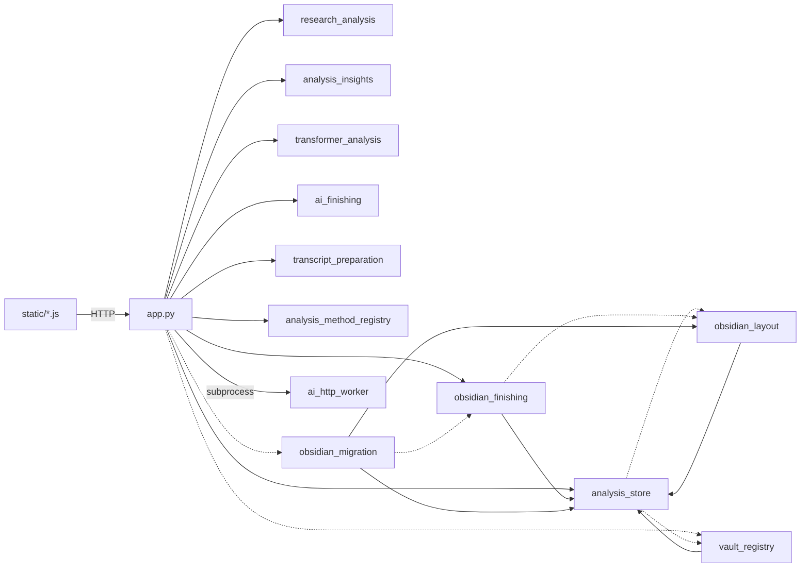

# システム全体構造・データフロー・設定の所在

- **確認元：** 2026-09-14の調査内容は、ブランチ`agent/expand-analysis-ai-workflows`のコミット`1b8fe41`に収録し、プッシュ済み。
- **調査条件：** 行数は初回調査時点の概数。2026-09-15に収録版の表記を更新した。優先修正による保存・UIの動作変更は[[40-Design/convergence-plan#優先修正の実装（2026-09-14）]]を参照する。
- **関連ノート：** 問題点は [[40-Design/known-issues]]、整理方針は [[40-Design/convergence-plan]] に分けて記録する。

## アプリの目的（コードから推定）

会議やグループインタビューの録音を、ローカルPCで文字起こし・話者分離する。研究者が確認・修正した逐語録を正本としてSQLiteに保存する。そこから、根拠となる発話にたどれる分析結果を作って固定保存し、Obsidianで読んで考察する。

中心となる価値は、「逐語録 → 分析 → 根拠発話」のつながりを失わずにたどれることにある。AI（校正・話者特定・アウトライン・見解）は下書きを作る補助で、確定するのは常に人である。

## 層と担当モジュール（現状）

| 層 | 担当 | 主なファイル（行数） |
| --- | --- | --- |
| UI | 画面・状態管理・API呼び出し | `templates/index.html`（外枠・ダイアログ、約270）と `templates/views/`（画面ごとの断片：`create`・`library`・`result`・`analysis`・`speakers`）、`static/app.js`（約7,200）、`static/analysis-content.js`（約900）、`static/analysis-storage.js`、`static/interview-comparison.js`、`static/ai-effort.js`、`static/style.css`（約1,600） |
| API | Flaskのルート（84件、`tests/fixtures/route_map.json`）、要求の検証・セキュリティ | `web/*_routes.py`、`web/security.py`。`app.py`（約1,900行）は `create_app()` で登録し、依存を組み立てる（2026-09-25、[[70-Changes/app-py-phase5]]） |
| Core／Service | ジョブ、文字起こしパイプライン、編集トランザクション、話者台帳、会話集計、議事録、出力、AI呼び出し | `handlers/`、`services/`、実行時状態は `runtime_state.py`。`app.py` には依存を渡す関数が残る |
| 分析サービス | 日本語解析・統計・Excel、見解・KWIC、Transformer、手法登録、逐語録の準備 | `research_analysis.py`、`analysis_insights.py`、`transformer_analysis.py`、`analysis_method_registry.py`、`transcript_preparation.py` |
| AIサービス | 分割・校正・アウトライン、エフォート、HTTP通信（別プロセス） | `ai_finishing.py`、`ai_effort.py`、`ai_http_worker.py` |
| Data | 固定成果物と台帳 | `analysis_store.py`（共通関数 `safe_path`・`write_atomic`・`markdown` もここにある） |
| External Integration（Obsidian） | ResearchVaultの構成・ナビ、仕上げ作業台、旧階層移行、4 Vault | `obsidian_layout.py`、`obsidian_finishing.py`、`obsidian_migration.py`、`vault_registry.py` |
| 互換 | `import app` などの旧importを受ける | `src/app.py` ほか5件。`gurumoji.*` へ付け替えるだけ。テストが使用している |

依存関係（実線は通常のimport、点線は関数内でのimport）：

次の組は、関数内でimportすることで循環依存を避けている。

- `analysis_store` ⇄ `obsidian_layout`／`vault_registry`
- `obsidian_finishing` ⇄ `obsidian_layout`

原因は、下位の共通関数（パス検証・原子的書き込み・Markdownエスケープ）が上位の `analysis_store` に置かれていることにある（[[40-Design/known-issues]] の ARCH-02）。

## 主要なデータフロー（操作から保存まで）

図で見るときは、同じフォルダーの `data-flow.html` をブラウザーで開く。流れを選ぶと、通るモジュールと書き込み先が強調される。

### 1. 新規文字起こし

1. 「新規作成」フォームを `POST /api/jobs` に送る。`create_job` が `JobOptions` を作り、スレッドで `run_transcription_job` を実行する。
2. 処理は FFmpeg前処理 → WhisperX → pyannote → 任意の感情分析 の順に進む。
3. 既定の `finish_in_obsidian=True` の場合、`ObsidianWorkbench.prepare` がResearchVaultへ保存原文・全文・操作ノート・状態ノートを書く。このときジョブ内のAI校正・話者特定・アウトラインは実行しない。無効の場合は、ジョブ内で `clean_segments_with_ai`・`detect_speaker_names_with_ai`・`create_outline_with_ai` を実行する。
4. `write_outputs` が `runtime/output` にTXT／JSON／SRTなどを書く。続いて `upsert_library_item` が SQLite の `library_items` に保存し、メディアを `<data>/media` へ移す。
5. `publish_input_vault` でInputVaultの台帳を更新する。会議の場合は `archive_meeting_minutes` を実行し、`analysis_store` と各Vaultに保存する。その後 `ObsidianWorkbench.activate` を呼び、会議なら `publish_meeting_minutes_to_obsidian` も呼ぶ。

### 2. 逐語録の編集保存

1. `PUT /api/library/<id>` → `update_library_from_payload` → `_update_library_from_payload_locked` の順に呼ぶ。ここでrevisionを確認し、編集トランザクション（出力ファイルの差し替えと回復）を実行する。学習イベントと `transcript_versions` への記録もここで行う。
2. `refresh_archive_index` を呼ぶ。保存済み分析をstaleにし、その状態をResearchVaultの索引と3 Vaultに反映する。
3. `publish_input_vault` を呼ぶ。

`PUT /api/jobs/<id>/transcript`（`save_transcript`）という別の保存APIもある。

### 3. 分析と固定保存

- **閲覧：** `GET /api/library/<id>/analysis` → `group_analysis_for_row` → `research_analysis`（キャッシュあり）。
- **条件・手動コードの保存：** `PUT /api/library/<id>/analysis` でDBの列へ保存する。
- **固定保存：** `POST /api/library/<id>/analysis/runs` → `archive_group_analysis` → `AnalysisStore.save` の順に呼ぶ。
  - `analysis_store` に `inputs/<snapshot>/input.json` と `runs/<run>/…` を書き、SQLite の `analysis_runs` と `analysis_artifacts` を確定する。
  - 次に `AnalysisStore.publish` を呼ぶ。`publish_vaults` で3 Vaultへ、続けてResearchVaultへ分析ノート・引用原文・グラフ用ノードを書き、`publish_index` で分析まとめを更新する。
- **AI見解・Transformer：** `POST …/insights` と `POST …/transformer` をスレッドで実行する。要求台帳はSQLiteに置く。成功すると固定保存する。

### 4. Obsidianでの仕上げ（双方向）

1. `POST /api/library/<id>/obsidian-finishing` で作業版を作る（`prepare`）。
2. 常駐スレッド `start_obsidian_watcher` が2秒ごとに `poll_once` を実行し、操作ノートのチェックと `provider` を読む。
3. チェックが変わると `execute` → `run_obsidian_finishing` の順にAIを呼び、結果を新しいパスのノートへ書く。
4. 「結果をアプリへ反映」を選ぶと、revisionと元ノートのfingerprintを再確認してから、`_update_library_from_payload_locked` → `publish_input_vault` → `archive_ai_finishing` の順に実行する。

### 5. テーマ同期（Obsidianからの読み込み）

同じ常駐スレッドが10秒ごとに `ObsidianLayout.sync_themes` を実行する。研究メモの `[[20-テーマ/…]]` を読み、`20-テーマ` のノートのプロパティと関連欄を書き換える。

### 6. 削除

1. `DELETE /api/library/<id>` → `_delete_library_item_locked` を呼ぶ。
2. メディアとサムネイルを隔離フォルダーへ移す。
3. SQLiteの行と準備履歴を削除し、tombstoneを記録する。
4. `retire_input_vault` を呼ぶ。
5. 隔離フォルダーを `rmtree` で恒久削除する。

出力ファイル、`analysis_store`、ResearchVault、`obsidian_workbench` は削除せずに残る。

### 7. 起動

1. `run.bat` → `scripts/run_launcher.ps1` → `python -m gurumoji.app` の `main` の順に起動する。
2. `initialize_application` が次の処理を行う。
   - 単一インスタンスのロック
   - DBの初期化
   - 編集トランザクションの回復
   - 出力取り込み来歴の修復
   - 削除隔離の回復
   - 学習データの修復
   - 孤立したアップロードの掃除
   - 既存の出力JSONの取り込み
3. `start_obsidian_watcher` を起動する。最初に `recover` と旧階層の `migrate` を実行し、その後Flaskを起動する。

## 保存先

| 場所 | 内容 | 決め方 |
| --- | --- | --- |
| `<data>` | `runtime/data`、または `MOJIOKOSI_DATA_DIR` | `app.py`: `DATA_DIRECTORY` |
| `<data>/library.sqlite3` | 会話・話者台帳・分析条件・AI要求・固定保存台帳・Obsidianノート台帳・逐語録の版と準備 | `DATABASE_FILE` |
| `<data>/media`, `thumbnails`, `kushinada_training`, `custom_vocabulary.json` | 元メディア、再生成物、学習データ、単語登録 | `app.py` の定数 |
| `<data>/analysis_store` | 不変の入力スナップショット・結果・表CSV・manifest | `AnalysisStore.root` |
| `<data>/obsidian/ResearchVault` | 研究者が読むノート・仕上げ作業台 | `ObsidianLayout`、`ObsidianWorkbench`、`AnalysisStore` の3か所で個別に算出 |
| `<data>/obsidian/{InputVault,VisualizationVault,OrchestratorVault}` | IDでつなぐ台帳型のVault。2026-09-14時点では実データで未生成 | `obsidian_layout/vaults.json` |
| `<data>/obsidian_layout` | `interviews.json`（インタビューコード・管理ノートのhash）、`vaults.json`、移行記録・バックアップ | `ObsidianLayout.registry`、`VaultRegistry.catalog_file` |
| `<data>/obsidian_workbench/<key>/` | 仕上げの `state.json`、過去の `state-*.json`、`source-*.json`、`result-*.json` | `ObsidianWorkbench.root` |
| `runtime/output` | 文字起こしの出力。`MOJIOKOSI_OUTPUT_DIR` で変更できる | `DEFAULT_OUTPUT_DIRECTORY` |
| `runtime/uploads`, `models`, `logs` | 一時アップロード・インスタンスロック、モデル、ログ | `app.py`、ランチャー |
| `config/tokens.json` | APIキーと各社の使用モデル（Git管理外） | `TOKEN_FILE` |
| `docs/program-vault` | このVault。アプリは書き込まない | `vault_registry.SOFTWARE_ROOT` と `app.vault_registry()` の2か所 |

## 外部サービス・外部ツール

| 対象 | 用途 | 経路 |
| --- | --- | --- |
| FFmpeg | 前処理、クリップ、字幕焼き込み、サムネイル | サブプロセス（タイムアウトは環境変数で指定） |
| Whisper／WhisperX、pyannote | 文字起こし、話者分離 | Python内。Hugging Faceトークンが必要（gatedモデル） |
| AIST感情モデル | 音声感情分析 | Hugging Faceから初回取得し、ローカルで実行 |
| OpenAI、Google Gemini、LM Studio | 校正、話者特定、アウトライン、見解 | `call_ai_json` → `ai_http_worker.py`（別プロセス、リダイレクト拒否）。HTTP 429・5xxは `services/ai/client.py:post_json` が最大2回再試行（`Retry-After` は30秒まで尊重、キャンセル可）。出力上限・安全判定・拒否による未完了応答は `ensure_complete_response` が理由付きのエラーにする |
| Transformerモデル | テーマ分析、意味検索 | `transformer_analysis.py`（`MOJIOKOSI_TRANSFORMER_MODEL`） |
| Obsidian | 閲覧、仕上げ・テーマの編集 | ファイルを直接読み書きする。Obsidian本体とは通信せず、`obsidian://open?path=` で開くだけ |

## 設定の所在（現状の正本）

| 設定 | 保存先 | 書き込む処理 |
| --- | --- | --- |
| 保存先・上限・ポート・リモート公開・モデル名など | 環境変数 `MOJIOKOSI_*`（約25種） | 起動前に利用者が設定する |
| APIキー・使用モデル・LM StudioのURL | `config/tokens.json` | 手作業。モデルは画面の選択ダイアログからも書き込まれる（`update_token_model`） |
| 単語登録 | `<data>/custom_vocabulary.json` | `PUT /api/custom-vocabulary` |
| 文字起こしの既定値 | 分散している（下の注を参照） | 各所 |
| AIエフォート | ブラウザーの `localStorage`（`gurumoji.ai-efforts`）と、会話ごとの `obsidian_workbench` の `state.json` | `ai-effort.js`、`prepare` |
| 仕上げで使うAIプロバイダー | 操作ノートの `provider` プロパティ（Obsidian側） | 研究者 |
| 分析条件・コードブック | `library_items.analysis_config_json`（会話ごと） | `PUT …/analysis` |
| Vault保存先 | 生成Vaultは `vaults.json` の `root`。ResearchVaultとSoftwareはコード内で算出 | 設定UIなし |

注：文字起こしの既定値は、`views/create.html` の初期値、`app.js` の会話モード設定（`conversationModePresets`）、`JobOptions` の既定、`parse_bool` の既定、`recommend_machine_settings` に分散している。

関連：[[10-Architecture/overview]]、[[20-Modules/feature-inventory]]、[[20-Modules/obsidian-integration]]、[[30-Data/current-storage]]、[[40-Design/storage-policy]]。
