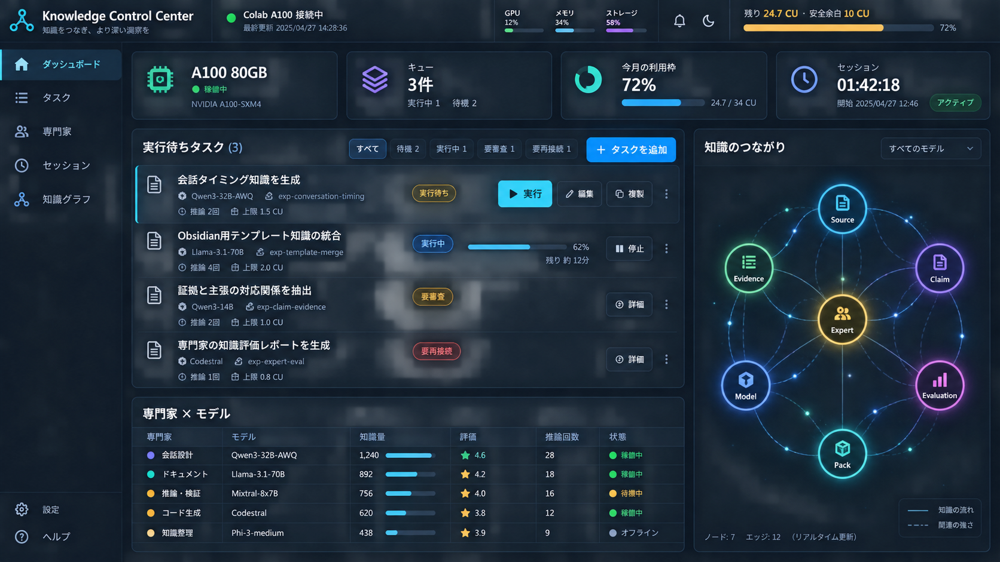
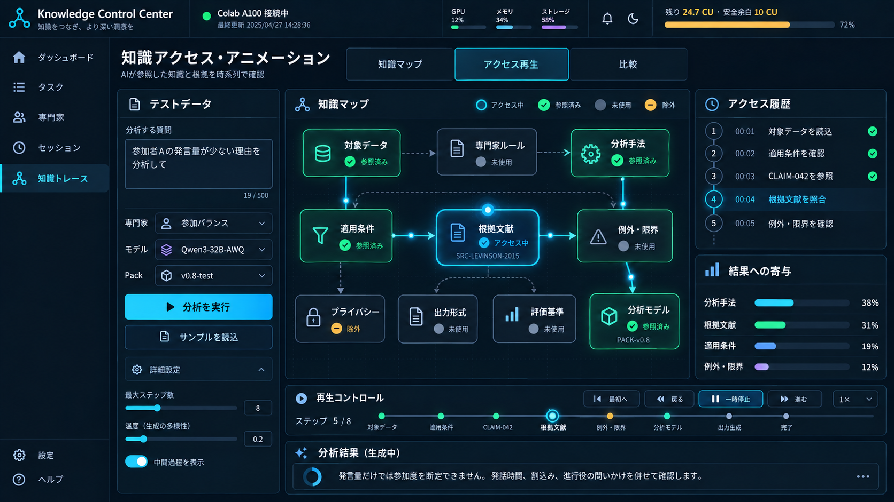
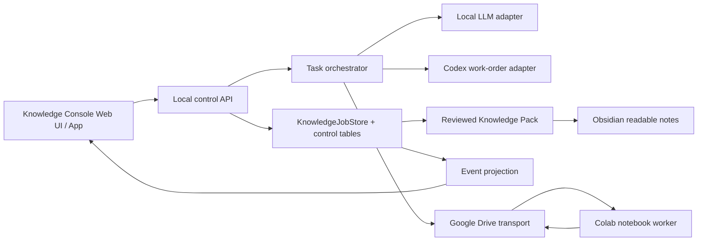

# A100知識推論コントロールプレーン計画

## 実装状況（2026-09-29）

MVPはGurumoji本体から分離した開発専用アプリとして実装済み。
`run_knowledge_console.bat` から別プロセス・別Python環境・別ポートで起動し、
既定では `runtime/knowledge-console-dev/knowledge_builder/state.sqlite3` に
task・trace・eventを保存する。17専門家のサンプル指標、タスク追加、
A100タスクの保存順投入と並列実行、別タブの知識ブロック再生を提供する。

A100実行は公開HTTPトンネルを使わず、PCからDrive APIで共有フォルダへHMAC署名済み
`KCC_Task_*.json`を投入する(Drive for desktopの同期待ちを避けるため。
同期フォルダ指定は後方互換のフォールバック)。PC側のOAuthトークンはデータディレクトリの
`google_drive_token.json`に保存し、初回認可には`google_oauth_client.json`
(デスクトップアプリ用OAuthクライアント)が必要である。どちらもWeb UIの「接続セットアップ」から設定する。
WorkerはセッションごとのフォルダIDとQueue Secretを、共有フォルダ外のマイドライブ直下の非共有ファイル
`KCC_Session.json`へ書き、ノートブック出力には表示しない。PCは自アカウント所有かつ非共有の同名ファイルだけを読み、
Secretはメモリにだけ保持する(手動貼り付けは同期フォルダ等の上級設定として残す)。専用Colab Drive WorkerはA100と固定モデルを確認し、
3秒間隔でタスクを確認して最大4件を並列推論(llama-serverの4スロット、PC側も最大4件)し、署名済み`KCC_Result_*.json`を同じフォルダへ返す。
heartbeatはColabのDrive認証直後から別スレッドで30秒ごとに更新し、起動フェーズ(準備・ビルド・ダウンロード%・検証・読込・ready・failed/stopped)を含める。
起動時はモデルのダウンロードとllama.cppのビルド(sm_80のみ)を並行させ、ビルド済みllama-serverを
同じフォルダに`KCC_Cache_llama-server_*.tar.gz`として保存する。キャッシュは実行アカウント自身が所有し最終更新したものだけを再利用する。
モデル(GGUF)も同じフォルダに`KCC_Cache_model_*`として保存し、次回はDrive API(drive.mountは大容量で不安定なため不使用)で取得する。Driveの`sha256Checksum`が固定値と一致すれば手元の再ハッシュを省き、無い場合は手元で検証、取得失敗時はHugging Face(`HF_XET_FIXED_DOWNLOAD_CONCURRENCY=4`)へ戻る。初回のDrive保存はWorker準備完了後に並行して行う。
Workerノートブックは段階ごとのセル(準備・llama.cpp・モデル・サーバー・Worker・状態表示)に分かれ、実行中はセル内の状態表示(進捗・速度・残り時間・GPU・PCへの送信)を約1秒ごとに更新する(PCとの交信間隔は変えない)。失敗したセルはheartbeatでfailedを報告し、状態を保ったままそのセルから再実行できる。
共有フォルダ内のKCCファイルは用途別サブフォルダに分ける: `KCC_出力データ`(KCC_Result_*)、`KCC_モデルデータ`(KCC_Cache_*)、`KCC_一時データ`(KCC_Task_*・heartbeat)。WorkerがサブフォルダIDをKCC_Session.jsonで公開し、起動時に直下の旧KCCファイルを移動する。Gurumoji_*など他のファイルは動かさない。
heartbeatには実行中ジョブ(タスク名・経過秒)、待ち・完了・失敗件数、直近の完了(所要時間・tok/s)、GPUメモリを含め、Web UIの「A100 アクティビティ」に表示する。PCの確認は通常5分ごと、A100実タスク実行中だけ30秒ごと。経過時間は画面側で1秒ごとに加算する。
UIは新しいheartbeatを確認できない場合に実送信を開始せず、擬似完了へ
フォールバックしない。Compute Unitの実測と自動停止は引き続き未接続である。

## UIイメージ

### 目標モード（2026-09-30）

専用Web UIの「目標モード」で、目標名・説明、成果物スコア（1〜100点）、目標知識量
（必要な対象ノート1〜500件）、整理率（0〜100%）、必要な深さ（1〜3）、検索到達率
（0〜100%）、タスクごとの最大反復回数（1〜10）、生成タスク上限（1〜5）を保存する。
全ノートを一律に整理するのではなく、利用者が目標に必要な対象を選ぶ。知識量は対象ノート数の
目安であり、意味的な知識量とは区別する。分割・リンク数の増加だけでは品質を加点しない。
旧設定は読み込み時に整理率80%、深さ2、検索到達率80%を補い、既存ノートを書き換えない。
トークン削減率の参考目標（0〜99%）は互換性のため保持するが、目標達成判定には含めない。
式は `(1 - 削減後tokens / 削減前tokens) * 100`。実測は未接続。

整理と深さは利用者の確認記録であり、自動的な正しさの判定ではない。
整理率は「重複・矛盾・出典の3項目を確認済みの対象ノート数 / 対象ノート数」。深さは
0=未整理、1=説明、2=根拠と具体例、3=適用条件と限界。確認した根拠・不足を必須入力とし、
ノートIDと内容hashに結び付ける。画面には確認済み件数・深さの平均を併記する。
未確認の深さは未評価。編集・削除したノートの古い確認記録は加算しない。

検索テストは想定質問、検索語（1〜8個）、到達したい対象ノート（1〜5件）を最大20ケース保存する。
対象のタイトルと本文を大文字小文字を区別しないAND条件で検索し、タイトル一致を優先、同点はID順。
必要なノートがすべて上位5件に入れば成功とする。正解IDを順位計算に使わない。
到達率は成功ケース数 / 全ケース数で、ケース未登録は未測定。Obsidian本体や意味検索の評価ではない。

5つの目標値（知識量、整理率、深さ、検索到達率、成果物スコア）は個別のスライダーで設定する。
「現在のスコアを測定」は保存済みの対象・確認記録・検索ケースを再計測し、未設定の項目は未評価と表示する。
「目標タスクを自動生成・実行」は現在値との差をローカルLLMへ渡し、知識の収集、整理、深化、
インデックス改善、成果物改善の順で不足を優先してタスク化する。生成した今回の目標タスクだけを
A100へ送り、各タスクでは既存の採点・反復処理を目標点または最大回数まで続ける。
整理、深さ、検索条件はモデルの自己申告で達成扱いにせず、利用者が結果を確認して再計測する。

目標ごとに `<KNOWLEDGE_CONSOLE_DATA_DIR>/goal_workspaces/<goal_id>/Vault` を作り、
Obsidianで開く。既存の4+1 Vaultとは独立した開発用作業領域で、自動削除・既存Vaultからの
自動コピー・既存ノートの上書きは行わない。画面からのノート追加は新しいstable IDのファイルを
作り、`vault_note_policy.write_generated_note` で初版履歴を保持する。
利用者は `10-Knowledge/*.md` を直接編集・追加できる。サブフォルダーと履歴はAI検索対象外。

設定とgoal/task/planの関連は既存 `knowledge_builder/state.sqlite3` 内の
`knowledge_console_goals`、`knowledge_console_goal_plans`、`knowledge_console_goal_tasks` が正本。
確認記録は `knowledge_console_goal_assessments`、追記型の計測・成果物評価履歴は
`knowledge_console_goal_measurements` に保存する。これらも同じSQLite内に置き、Vault本文を変更しない。
スキーマは既存テーブルへの破壊的変更を伴わない追加。設定はrevisionで競合検出する。
計画の入力スナップショットはVault外の `goal_workspaces/<goal_id>/plans/<plan_id>.json` に保存する。
以前のアプリに戻しても既存タスクは読めるが、目標タスクの実行にはこの版が必要。
ロールバック時は目標由来のタスクを旧版で実行せず、作業Vaultと追加テーブルを保持する。

「LLMでタスクを生成」は明示的に選んだ1〜3ノート（合計最大6000文字の抜粋）、目標値、
現在の計測値、選んだノートの確認記録、最新の有効な成果物評価の改善点を
ローカルLLMに渡す。frontmatter、リンク先、資格情報らしい文字列は入力から除外し、
ノートID・内容hash・省略の有無を記録する。未知の専門家・参照ID・改善対象、過剰件数、
重複タスクを拒否し、全案を検証してから既存タスク台帳へまとめて下書き登録する。
同じ設定・参照ノートからの重複登録は行わない。LLM未接続時は理由を表示し、架空の案へ代替しない。
評価結果・確認記録の変更も入力の変更として扱う。改善対象は `score/knowledge/organization/depth/index`。
必要な知識の不足を優先し、focusに改善前の不足・作業内容・改善を確認する方法を含める。
旧 `compression` タスクは履歴に残し、新規提案には採用しない。

生成されたタスクは「A100タスクで実行」から既存の個別／一括実行へ進む。目標とノートの変更を
実行前に確認し、変更されていれば再生成を要求する。Workerには署名済み要求の既存
`analysis_focus` に目標・作業方針・参照抜粋を渡すため、ノート内容を知らずに実行することはない。
タスクごとの採点・反復は既存処理を使う。成果物の総合評価は、利用者が実際に使ったプロンプト
（6000文字以内）・実際の成果物（12000文字以内）・対象内の根拠ノート1〜3件を指定して実行する。
ローカルLLMは `goal-artifact-v1` の固定基準（目標の充足・根拠・一貫性・再利用性、各25点）で採点。
架空の結果への代替や、タスク得点の平均による総合点の算出はしない。評価入力は既存の抜粋・秘匿処理を
通し、SQLite履歴に実際の評価入力、hash、参照ID、評価モデル、評価理由を保存する。
目標・対象ノート・確認記録が評価中に変わった場合は保存せず、保存後の変更は再評価が必要と表示する。

実行時の根拠検査（2026-09-30）: 新規の実モデル実行には目標モードから生成した根拠ノート付き
タスクが必要。メタデータだけの旧タスクは実行APIが400で止め、資料を加えた再生成を案内する。
Workerへの指示は `evidence-v1` のJSON（`status`, `findings`, `citations`, `missing_inputs`）を要求する。
`needs_input`、不足入力あり、形式不正、参照ID不明、提供抜粋に存在しない引用の場合は、応答を保持して
タスクをfailedにし、採点・自動反復を停止する。正常時も引用の照合を確認できた段階であり、意味の正しさの
保証や人による承認ではない。既存の`succeeded`は書き換えず「応答受信・未評価」として表示する。
新規応答の照合状態と参照hashは結果の`quality`に保存し、成果物の採点・整理・深さの確認とは分ける。

保存と反復停止（2026-09-30）: タスク結果の保存上限は2MiB。最大512KiBのWorker応答を受け取る
搬送上限に対し、停止時の応答・最良成果物・引用照合結果・反復履歴を全文保持できる容量とする。
旧32KiB上限での例外や空オブジェクトへの置換は行わない。上限外のデータは保存前に明示的に拒否し、
既存の保存結果は保持する。DB形式・保存先は変えず、過去の結果の移行も不要。
反復途中の入力不足・形式不正・採点失敗・通信失敗では、`best_attempt`に最良の採点済み成果物を残し、
直近応答と区別する。`interrupted`と`stopped_iteration`を記録し、画面に最良成果物の本文を表示する。
停止した試行には以前の点数を付けず、以前の採点履歴は保持する。
`needs_input`で失敗したタスクは一括計画で保留し、ローカルLLMへの実行判断依頼からも除外する。
不足資料を追加した後は目標モードでタスクを再生成する。個別の明示的な再実行操作は残す。

エラー履歴: 既存の`knowledge_console_events`を追記専用の履歴として使い、自動削除しない。
タスク失敗は受信したエラー本文（資格情報は除外）、日時、実行回、反復回、発生時フェーズ、品質状態を保存する。
現在の`error_message`表示は500文字の要約で、再実行・成功でクリアしても履歴は残る。
接続エラーは状態・メッセージが変わったときに記録し、同一状態のポーリングを重複保存しない。
復旧してから同じエラーが再発した場合は別の発生として記録する。APIの400以上の応答も記録する。
`GET /events?errors_only=1&limit=50&before=<sequence>`で古い履歴まで取得でき、応答の`next_before`で
次のページへ進める。A100画面の「保存されたエラー履歴」から本文を開き、以前の記録を追加表示する。
元から残っている失敗イベントも表示する。過去に短縮済みの本文やPCが受信していないColab内部ログを
復元する機能ではない。新たな保存先・削除操作は追加しない。

量と整理済み量、深さ、検索到達率、成果物スコアを別グラフと履歴表で表示する（最新200記録）。
進捗は設定フォームより上に置き、5条件の達成状況、現在値・目標マーカー・残り、次の確認欄への
導線を表示する。深さの達成カードとグラフは「必要な深さに到達した対象ノート数／全対象」で示し、
平均値は履歴表に残す。未評価と再確認を区別し、内容変更前の記録は現在値として表示しない。
グラフは直近12記録／取得済み最大200記録を切り替え、日時・目標線の値・表示範囲の初回比を表示する。
点の選択はポインター・タッチ・キーボードで行え、記録時点の数値を確認できる。
目標revision・対象ID・検索ケース・評価基準が異なる履歴は比較から除外する。成果物は評価モデルと
根拠ノートIDの組み合わせも揃える。スコア到達予想は同条件の異なるプロンプト／成果物の直近3評価が
連続して改善した場合だけ、平均改善量から残り評価回数を線形推定する。保証ではなく、他はデータ不足と表示。
目標達成は、必要件数・整理率・全対象の必要な深さ・検索到達率・有効な成果物スコアがすべて目標を
満たしたときだけ表示する。生成物の知識ノートへの自動採用、最終成果物の自動生成・自動再評価は行わない。
自動モードはタスクの生成・投入・タスク内の採点反復を自動化するが、生成結果を確認済み知識として扱わない。

API: `GET/POST /api/knowledge-console/goals`、`GET/PATCH /goals/<goal_id>`、
`POST /goals/<goal_id>/notes`、`POST /goals/<goal_id>/generate`、
`POST /goals/<goal_id>/assessment`（対象と確認記録の保存）、`POST /goals/<goal_id>/measure`（再計測）、
`POST /goals/<goal_id>/evaluate`（成果物評価）。すべて同じAPI接頭辞。
後3つは `goal_revision` と確認記録の `revision` によって競合検出する。
リクエストは原則64KB、最大500ノートの確認記録を扱うassessmentだけ2MBまで。
書き込みは既存のlocalhost/Origin/専用ヘッダー制約を継承する。



この画像は画面構成の方向性を確認するためのモックアップであり、表示値は例示である。実装時は本計画の状態名、予算判定、アクセシビリティ要件を正本とする。

### 知識トレース専用タブ



ダッシュボードの小さい関係図とは分離し、テストデータを入力して知識アクセスを確認する操作は専用の「知識トレース」タブで行う。

## 1. 決定

専用Web UIのソースは、開発中は `feature/knowledge-control-plane` ブランチでGit管理する。Gurumoji本体の画面・ルートへ統合せず、独立した開発ツールとして管理する。長期運用するソースをGit管理外にはしない。

Gitへ入れないものは、実行時DB、取得した論文、モデル、ジョブZIP、推論結果、Google OAuth資格情報、APIキー、ログ、利用量の生データである。開発アプリのデータは `KNOWLEDGE_CONSOLE_DATA_DIR` から解決し、未指定時は `runtime/knowledge-console-dev/` を使う。現在の `output/knowledge-*` は、内容と権利を確認してから実行時データ領域へ移し、今後の誤追加を `.gitignore` で防ぐ。

専用Web UIと専用アプリは別実装にしない。同じ独立ローカルWeb UIを次の2形態で使う。

1. ブラウザーから開く管理画面。
2. 同じ画面をPWAまたは軽量デスクトップシェルから開くインストール可能なアプリ。

Flask、HTML、JavaScriptを使うが、GurumojiのFlaskアプリには登録しない。専用プロセスは `127.0.0.1:7861`、専用仮想環境は `.venv-knowledge-console` を既定とする。ネイティブ通知や常駐トレイが必要になった段階でだけデスクトップシェルを追加する。

## 2. 目的と完成条件

この管理機能を、既存の `knowledge_builder`、`KnowledgeJobStore`、Colab ZIP transport、Qwen3 worker、評価契約の上に構築する。別の知識DBや別のジョブ正本は作らない。

完成条件は次のとおり。

1. 17専門家 × 使用モデルごとに、知識量、評価点、最終推論状態、推論回数、採用数、失敗数を確認できる。
2. A100、ローカルLLM、Codexに割り当てる作業を手動で選び、モデル、回数、同時実行数、token上限、時間上限、Compute Unit予算を設定できる。
3. 画面からタスクを追加し、タスクカードの「実行」ボタンで検証・キュー投入・開始まで進められる。
4. Colabが停止しても、受理済みCommitやチェックポイントを失わず、同じgenerationを重複採用しない。
5. Colabとの自動処理はGoogle Drive上の要求・結果・heartbeatの取得に限定し、通常版ColabのUIや利用制限を迂回しない。
6. 推論結果を直接Obsidianへ上書きせず、候補、審査済み、採用済み、Pack収録済みを区別する。
7. Source → Claim → Expert → Model run → Evaluation → Packのつながりを、状態変化とともにアニメーション表示できる。
8. 資格情報、private Source、評価問題と答え、ローカルパスを画面API、Colab bundle、ログへ漏らさない。

## 3. 実装境界



### ローカル側

- `KnowledgeJobStore`をジョブ、generation、Commit、Packの正本として継続利用する。
- 新しい管理用テーブルは同じSQLite内へversion付きmigrationで追加する。
- 管理APIは `127.0.0.1` のみにbindし、既存のcross-site/CSRF防御を再利用する。
- UIは正本を直接編集せず、API経由で状態遷移と監査イベントを残す。
- 推論結果はcandidateのまま受け取り、独立した審査を通るまでapprovedにしない。

### Colab側

- Colabは要求ZIPをpullし、固定されたworker/model/promptで1件ずつ処理し、結果ZIP、checkpoint、heartbeatをDriveへpushする。
- Drive上のSQLiteを直接共有しない。
- Colab workerにはSourceの採用権限、Claimの承認権限、Pack公開権限を与えない。
- 同じjob/generation/attemptの完全一致結果だけを冪等に取り込む。
- キューが空ならGPU health probeを続けず、worker loopを終了する。A100を待機のためだけに保持しない。

### Obsidian側

- 人が読む専門家定義と説明はSoftware Vaultを正本とする。
- アプリはSoftware Vaultへ書かない。専門家定義の変更は人がレビューしたGit変更だけで行う。
- 大きなSource、実行状態、評価明細、関係グラフはSQLite/JSON/JSONLを正本とする。
- OrchestratorVaultへは、採用済みの知識概要、評価結果、provenance、Pack版だけを生成ノートとして公開する。
- stable IDで関連付け、VaultをまたぐWikilinkや表示名一致に依存しない。
- 同期はA100再実行や重い再評価を暗黙に起動しない。入力変更時は派生物をstaleにする。

## 4. 管理する指標

「知識量」を1つの曖昧な数字にはしない。専門家・モデル・Pack版ごとに次を表示する。

| 区分 | 指標 | 意味 |
| --- | --- | --- |
| 知識量 | approved claims / candidate claims | 採用済み主張数と未審査候補数 |
| 知識量 | sources / evidence anchors | 出典数と原文へ戻れる根拠箇所数 |
| 知識量 | mandatory coverage | 必須項目の充足数と総数 |
| 知識量 | context tokens / pack bytes | 実際にモデルへ渡せる量と配布物の大きさ |
| 品質 | evaluation categories | knowledge coverage、mandatory items、evidence support、knowledge organization、content understanding、applicability、abstention、citation integrity、privacy leakage、structure integrity |
| 品質 | verdict / repeat | 2回の独立評価ごとのpass/fail。平均で失敗を隠さない |
| 推論 | attempts / succeeded / accepted | 試行回数、モデル処理成功数、ローカル受理数 |
| 推論 | approved / packed | 人の承認数、Pack収録数 |
| 利用量 | input/output tokens、wall time、GPU time、CU delta | 取得できた実測値だけ。未取得値を0にしない |

一覧用の「総合スコア」は参考表示に留める。合否は既存の決定的gateを使用し、critical failure、blocking violation、必須カテゴリ未達を平均点で相殺しない。

## 5. 状態モデル

画面上の「推論済み」と「推論終了」を別概念として扱う。

- `has_inference`: 試行が1回以上ある派生値。
- `latest_run_state`: 最新試行の実行状態。
- `review_state`: 結果の審査状態。
- `publication_state`: PackとObsidianへの公開状態。

推論runの状態は次に固定する。

```text
draft -> queued -> claimed -> running -> checkpointed
                                  |          |
                                  +------> succeeded -> importing -> accepted
                                  |                         |
                                  +------> failed           +-> rejected

queued/running/checkpointed -> expired | cancelled | interrupted
accepted -> reviewed_approved | reviewed_rejected
reviewed_approved -> packed -> published
```

`succeeded`はColab上で結果ZIPを生成できた状態、`accepted`はローカルでhash・schema・権利・generationを検証して受理した状態、`reviewed_approved`は独立審査済みの状態とする。この3つを同じ「完了」にまとめない。

## 6. 追加データモデル

既存の `knowledge_jobs`、`knowledge_commits`、`knowledge_packs` は維持し、次の投影・運用テーブルを追加する。

| テーブル | 主な項目 |
| --- | --- |
| `knowledge_model_profiles` | route、model_id、revision、context上限、既定token上限、同時実行数、active |
| `knowledge_work_orders` | task_type、expert_id、actor、model_profile_id、priority、approval_state、allowed_actions、input hash |
| `knowledge_run_attempts` | job/generation/attempt、state、開始/終了、checkpoint、token、wall/GPU時間、エラー分類 |
| `knowledge_runtime_sessions` | runtime kind、GPU、接続状態、started/last heartbeat/ended、stop reason |
| `knowledge_usage_ledger` | session/run、metric名、値、単位、source、measured/estimated/unknown |
| `knowledge_budget_policies` | 月次CU上限、1 session上限、reserve、deadline、idle終了時間、Pay As You Go許可 |
| `knowledge_evaluation_index` | expert/model/pack、repeat、カテゴリ得点、verdict、evaluation hash |
| `knowledge_events` | 連番、時刻、entity type/ID、event type、前後状態、actor、correlation ID |

生のSource本文、秘密情報、評価問題、答えはこれらの運用テーブルへ入れない。UI用集計はviewまたは再構築可能なprojectionにし、二重の正本を作らない。

## 7. 画面構成

### ダッシュボード

- A100 runtime: `未接続 / 接続待ち / 実行中 / heartbeat遅延 / 終了 / 要手動再接続`
- 現在のGPU、worker/model revision、キュー長、現在のjob、経過時間、最終heartbeat
- 今月のCU予算、観測済み使用量、予約量、安全余白、状態がunknownの項目
- 17専門家の完成度、評価pass数、候補数、要審査数
- 「キューが空なので終了推奨」「予算停止」「Source権利不足」等の行動可能な警告

### AI・専門家マトリクス

行を17専門家、列をモデルにし、各セルに以下を表示する。

- approved/candidate Claim数
- 必須知識の充足率
- 最新評価点とpass/fail
- 推論回数、成功、受理、採用、失敗
- 最新状態、最終実行日時、使用token、GPU時間
- 使用したPack、prompt、model revisionのhash

### ジョブキュー

- 並べ替え、保留、取消、再試行、別モデルへの新generation発行
- Source route、期限、想定token、予算予約、依存jobを実行前に表示
- 同じ成果の重複投入をinput hashで警告
- retryは同じ試行の上書きではなく、新generationまたは新attemptとして記録

### Colabセッション

- Notebookを開く、接続手順、Run all確認、Drive認可確認
- heartbeatと結果ファイルの最終確認
- runtime消失時の「再接続して再開」手順
- checkpointから再開可能なjobと、最初から再実行が必要なjobの区別
- 終了条件と、利用者がColab側でruntimeを切断するための案内

### 作業指示

- ローカルLLM、Codex、A100へ出すwork orderを同じ形式で管理
- 目的、対象expert、入力ID、許可操作、禁止操作、成果物schema、予算、完了条件を表示
- LLM出力から任意shellを実行しない。許可済み操作のJSONだけを受け付ける
- Codex作業は自動連投せず、利用者が承認したwork orderだけを開始する

### タスク追加と実行

画面上部に「タスクを追加」ボタンを置く。押すと次の項目を持つ入力パネルを開く。

- タスク名と作業指示
- 対象の専門家。複数選択時は専門家ごとに独立jobを作る
- 実行先: `ローカルLLM / Colab A100 / Codex`
- モデルprofileとmodel revision
- 使用するSource、Claim、Pack、入力revision
- 実行回数と目的: `通常 / 独立評価 / 比較 / 失敗再試行`
- 優先度、期限、最大input/output tokens、最大時間、最大CU
- 完了条件と期待する成果物schema

「追加」はdraftを保存するだけで、AI実行や外部送信を開始しない。保存後は一覧にタスクカードを表示し、カードに次の操作を置く。

- `実行`: preflightを通して一度だけキューへ投入する
- `停止`: 実行中処理へcancelを伝え、次の安全点で停止する
- `再実行`: 元の記録を残したまま新generationを作る
- `複製`: 同じ条件をdraftとして複製し、モデルや予算を変更できる
- `結果を見る`: Claim、根拠、評価、ログ、利用量へ移動する

`実行`ボタンを押したときは、権利route、Source hash、model revision、重複input、予算、retry上限、runtime状態をサーバー側で再検証する。成功したらボタンを即座に無効化して`queued`または`running`へ切り替え、二重クリックや通信再送で同じjobを二重作成しない。

ローカルLLMは利用可能なら直ちに開始する。A100はheartbeatが生きていればDrive queueへ送り、未接続なら`waiting_for_runtime`として保存して「Colabを開く」ボタンを表示する。Codexはwork orderの内容確認を表示し、利用者の実行確認後に開始する。通常の実行は1回のボタン操作で進め、外部送信、追加費用の可能性、private Sourceを含む場合だけ短い確認画面を挟む。

一覧には `下書き / 実行待ち / 実行中 / 要再接続 / 要審査 / 完了 / 失敗 / 停止` のタブを用意する。タスク追加後や再起動後もSQLiteから同じ状態を復元する。

### 知識トレース（別タブ）

- ダッシュボードには現在状態の小さい概要だけを置き、アニメーション操作は独立した「知識トレース」タブへ分ける
- 利用者がテスト用の質問・会話断片を入力し、専門家、モデル、Pack、最大ステップ数を選んで分析を開始する
- テスト入力は既定で一時データとし、利用者が保存を選ばない限りSourceやClaimの正本へ採用しない
- 知識を「対象データ」「専門家ルール」「分析手法」「適用条件」「根拠文献」「例外・限界」「プライバシー」「出力形式」「評価基準」「分析モデル」の大きなブロックに分ける
- 各ブロックには実際に選択したstable ID、revision、hashを紐付ける。表示用の大分類だけからアクセスを推測しない
- モデルへcontext packetを渡した時点、Claimを選択した時点、根拠を照合した時点をeventとして記録し、実際に起きたアクセスだけを再生する
- 現在アクセス中はcyanの発光、参照済みはgreen、未使用はgray、権利・privacy gateで除外した知識はamberで表示する
- Source、Evidence anchor、Claim、Expert、Job、Model、Evaluation、Packをstable IDでdrill-downできる
- 再生、一時停止、前後ステップ、速度、scrubber、アクセス履歴、知識ブロック別の結果寄与を表示する
- 「結果への寄与」はattention値と偽らず、採用Claim数、引用根拠数、ルール適用数など説明可能な集計根拠を併記する
- job開始、Claim選択、根拠照合、保留判断、評価、Pack収録をevent順に再生する
- `prefers-reduced-motion`に従い、停止ボタンと静止表示を用意する
- アニメーション座標やフレームを正本にせず、`knowledge_events`とcontext packet記録から再現する

可視化はローカルに同梱したCytoscape.jsまたは同等の小さなライブラリを使用し、CDNを必須にしない。最初は2Dグラフと時系列再生に限定し、3D表示は行わない。

## 8. Colab接続・再接続・利用時間の方針

通常版Colabには、外部アプリからmanaged runtimeを起動・A100指定・再接続するための公開された管理APIがない。したがって「自動接続」は次の範囲に限定する。

### 自動化する

- Drive APIによる要求ZIPのupload、結果ZIP・heartbeat・checkpointのpollとdownload
- job/generation/hash/deadlineの照合
- heartbeat遅延、runtime消失、期限切れの検出
- 再実行後のcheckpoint検出と安全な再開
- キューが空、予算到達、deadline到達時のworker loop終了

### 手動に残す

- Colab Notebookを開く
- Googleアカウントでの認証とDrive許可
- runtime種別とGPUの選択
- 初回Run all、停止後の再接続、runtimeの明示的な切断

ブラウザー自動操作、疑似クリック、無意味な計算による接続維持、複数アカウントによる制限回避は実装しない。将来、完全なAPI制御が必要になった場合は通常版Colabを自動操作せず、Colab Enterpriseまたは専用GCP VM用の別adapterを追加する。

## 9. Pro利用枠を守る予算制御

ColabのGPU availability、idle timeout、最大VM寿命、消費率は固定値として公開されず、変動する。アプリだけで「Pro料金以外の請求が絶対に発生しない」と保証はできない。保証に近づけるため、Google側で追加Compute Unit購入またはPay As You Goを無効にし、アプリ側で保守的に停止する二重管理にする。

予算制御は次の順で実装する。

1. 利用者が月初残高、今回使えるCU、最低残高reserveを入力する。
2. 実行前に、同じGPU/model/contextの過去実測からCU、時間、tokenを予測する。
3. 予測上限が残予算を超えるjobはqueuedへ入れない。
4. 1 jobごとに結果と観測残高差を記録し、予測係数を更新する。
5. soft limitで新規claimを止めて進行中jobだけ完了し、hard limitで次の推論を開始しない。
6. 利用量を取得できない場合は`unknown`とし、設定した安全枠を超える新規A100 jobを止める。
7. キューが空ならGPU sessionを維持しない。CPUでのローカル監視も必要最小限にする。

既存の「キューが空でも毎時GPU health probeを行う」運用は、今回の予算優先要件と両立しないため廃止対象とする。health probeはsession開始時、model load後、異常復旧後だけにする。

## 10. モデルと作業配分

| 作業 | 既定実行先 | 理由 |
| --- | --- | --- |
| ファイル選択、hash、schema、重複、権利route判定 | Pythonコード | 決定的で安価 |
| キュー整理、失敗分類、次の候補提案 | ローカルLLM | private情報を端末外へ出さず常時利用可能 |
| Claim候補生成、比較、難しい意味審査 | A100 | 大きいモデルを必要なときだけ使用 |
| 実装変更、テスト修正、契約レビュー | Codex | コード作業としてwork order単位で実施 |
| 最終承認、権利判断、公開判断 | 人 | AIから分離する |

モデルprofileには、対象task、許可route、revision、量子化、context、max input/output tokens、parallelism、最大試行回数、日次/月次予算を設定する。画面で「モデルを何回使うか」を手動指定できるが、同じ出力を無条件に繰り返さず、repeatの目的を `品質確認 / 独立評価 / 失敗再試行 / 比較` から選ばせる。

## 11. API案

| Method / path | 用途 |
| --- | --- |
| `GET /api/knowledge-console/summary` | ダッシュボード集計 |
| `GET /api/knowledge-console/experts` | 専門家×モデル指標 |
| `GET/POST /api/knowledge-console/tasks` | タスクの一覧・draft作成 |
| `GET/PUT /api/knowledge-console/tasks/<id>` | draftの取得・revision付き編集 |
| `POST /api/knowledge-console/tasks/<id>/execute` | preflight後に一度だけキュー投入・開始 |
| `POST /api/knowledge-console/tasks/<id>/duplicate` | draftとして複製 |
| `POST /api/knowledge-console/jobs/<id>/cancel` | 次の安全点で取消 |
| `POST /api/knowledge-console/jobs/<id>/retry` | 新generationの作成 |
| `GET /api/knowledge-console/sessions` | Colab/local session状態 |
| `POST /api/knowledge-console/drive/sync` | Drive差分同期。runtime起動はしない |
| `GET/PUT /api/knowledge-console/budget` | 予算方針と残高観測 |
| `GET /api/knowledge-console/graph` | stable IDのnodes/edges |
| `GET /api/knowledge-console/events` | SSEによる状態イベント |
| `POST /api/knowledge-console/traces` | 一時テストデータから分析traceを開始 |
| `GET /api/knowledge-console/traces/<id>` | 使用した知識ブロック、stable ID、結果を取得 |
| `GET /api/knowledge-console/traces/<id>/events` | 再生用の順序付きアクセスeventを取得 |

APIは秘密値、Source本文、評価問題、ローカル絶対パスを返さない。変更APIはCSRF、Origin、Content-Type、revisionを検証し、監査イベントを必須にする。

## 12. 実装フェーズ

### P0: 保全と棚卸し

- 現在の未コミット `knowledge_builder`、テスト、`output/knowledge-*` を内容別に棚卸しする。
- ソース、再現用の小さい匿名fixture、runtime/private成果物を分離する。
- runtime成果物を `<data>/knowledge_builder/` に統一し、Git除外規則を追加する。
- 現在のJobStoreを読み取り専用監査し、accepted Commit、17専門家、Claim/Source数、孤立stageを確認する。

受入条件: 既存DB・成果物を失わず、秘密・論文・モデル・実結果がGit候補に現れない。

### P1: 読み取り専用Console

- 独立したFlask開発アプリ、summary API、expert/model matrix、job/session一覧を実装する。
- 既存DBからのprojectionだけで表示し、状態変更ボタンはまだ置かない。
- unknownと0を区別し、hashと版を表示する。

受入条件: CLI監査結果と画面集計が一致し、Source本文をAPIへ出さない。

### P2: イベントとアニメーショングラフ

- `knowledge_events`と既存状態からのbackfillを実装する。
- 独立した「知識トレース」タブに、テストデータ入力、知識ブロック、filter、drill-down、SSE更新を追加する。
- context packetと選択Claimに基づくSource→Claim→Expert→Evaluation→Packのアクセスevent replayとreduced-motionを追加する。

受入条件: 同じテスト入力・固定版・event列から同じアクセス表示を再構築できる。アクセスしていない知識を参照済みと表示せず、アニメーション停止時も全情報を読める。

### P3: 手動キューとモデル管理

- model profile、work order、予算policy、タスク追加フォーム、実行ボタン、retry/cancelを追加する。
- ローカルLLMのschema限定plannerを接続する。
- Codex用work orderはコピー可能な指示と成果物受入条件まで生成し、実行開始は人が承認する。

受入条件: タスク追加後に再起動してもdraftが残る。実行ボタンの二重クリック・HTTP再送でもjobは1件だけ作られる。許可外route、予算超過、重複input、retry上限超過を実行前に拒否する。

### P4: Drive自動搬送と再開

- ローカルDrive adapter、heartbeat、checkpoint、結果importを実装する。
- 既存ZIP transportのclosed envelope、hash、generation lockをそのまま使用する。
- 切断、古いheartbeat、部分upload、重複結果、期限切れ、再接続後再開を一時Driveで検証する。

受入条件: runtimeを意図的に止めても、受理済み結果を重複採用せず、未完了jobだけを再開できる。

### P5: 予算停止とセッション管理

- CU観測、予測、reserve、soft/hard limit、idle終了を実装する。
- session開始時のpreflightでGPU、VRAM、model revision、空きディスクを検証する。
- 空キュー時の定期GPU probeを削除する。

受入条件: unknown利用量ではfail-openせず、予算超過jobを開始せず、終了理由を監査できる。

### P6: インストール可能アプリ

- PWA manifest、ローカルlauncher、更新手順を追加する。
- 必要性が確認できた場合だけデスクトップ通知とsystem trayを追加する。

受入条件: ブラウザー版とアプリ版が同じAPI・権限・画面を使い、別の状態を持たない。

### P7: Obsidian公開と運用受入

- approved/packed状態だけからOrchestratorVault用の小さい管理ノートを生成する。
- `VaultRegistry`を知識ノート種別へ拡張し、共通の生成ノート競合規則を通す。Software Vaultへは書かない。
- 一時Vaultで公開、stale、欠落、競合、復旧を検証する。

受入条件: 同期が推論を起動せず、private Sourceと実行秘密をノートへ出さず、stable IDで根拠まで追える。

## 13. テスト計画

- unit: 状態遷移、集計、score gate、予算計算、unknown処理、event projection。
- API: loopback制限、CSRF/Origin、revision競合、秘密値除外、Source本文除外。
- transport: 部分ZIP、hash不一致、stale generation、重複import、期限切れ、checkpoint再開。
- integration: 一時SQLite＋一時Drive相当＋mock workerでjob作成からacceptedまで。
- Colab実機: 1件だけで接続、A100 preflight、推論、切断、再接続、結果受理を確認する。
- Vault: 実Vaultを使わず一時Vaultで生成ノート、stale、競合を確認する。
- UI: 17×複数モデルの表、0/unknown、長いID、失敗、タスク追加・編集・実行・停止、実行ボタン二重押下、reduced-motion、キーボード操作。

全体suiteはP4、P5、P7の境界変更時に実行し、通常は対象モジュールのfocused testsを先に実行する。

## 14. リスクと抑止策

| リスク | 抑止策 |
| --- | --- |
| A100が割り当たらない | GPUを前提にqueueをclaimせず、手動選択を待つ。別profileへ明示的に再発行 |
| Colab停止・最大寿命 | 短いjob、1件ごとの結果確定、checkpoint、Drive上のheartbeat、再実行可能設計 |
| Pro利用枠超過 | Google側の追加購入無効化、reserve、実測予測、空キュー即終了、unknown時停止 |
| Web UI経由の制限回避と判定される | Notebook操作の自動化をせず、Driveのデータ搬送だけを自動化 |
| AIが不正な作業を指示 | work order schema、allowed action allowlist、人の承認、任意shell禁止 |
| 知識量の水増し | Claim数だけでなく必須coverage、根拠数、重複、評価gateを併記 |
| candidateを完成扱い | succeeded、accepted、approved、packed、publishedを分離 |
| Gitへのprivate成果物流入 | runtime配下へ統一、ignore、pre-commit secret/large-file検査 |
| 既存の未コミット作業との衝突 | P0で保全し、専用ブランチ開始前に変更の所有と保存先を確定 |

## 15. 着手順

最初の実装単位はP0とP1に限定する。ここではColabを動かさず、既存のJobStoreと成果物を読み取って、正しい集計を表示するところまでにする。その結果を確認してからP2のグラフ、P3の変更操作、P4のDrive自動搬送へ進む。

この順序により、現在すでに存在する17専門家分の候補、accepted Commit、A100実測、評価契約を失わず、管理画面を新しい正本にしてしまう事故を避けられる。

## 16. 外部仕様上の前提

- Google Colab FAQ: managed runtimeの利用制限、変動するusage limits、通常最大12時間、十分なCompute UnitがあるPro+の最大24時間、free-of-charge tierでのWeb UI中心利用やremote controlの制限。<https://research.google.com/colaboratory/faq.html>
- Colab Enterprise runtime管理: Enterpriseではruntimeのstart/delete/reconnectに公式の管理経路がある。通常版Colabとは別adapterとして扱う。<https://cloud.google.com/colab/docs/manage-runtimes>
