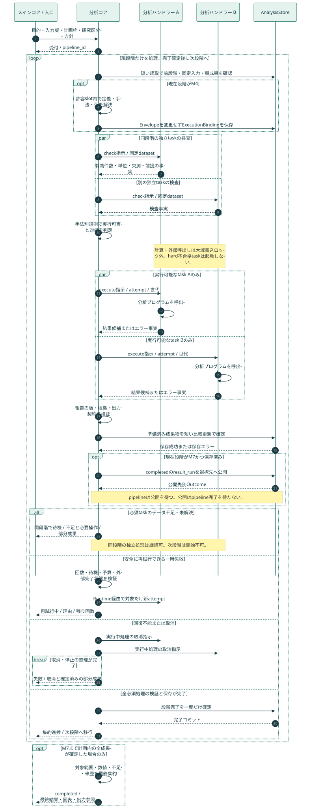
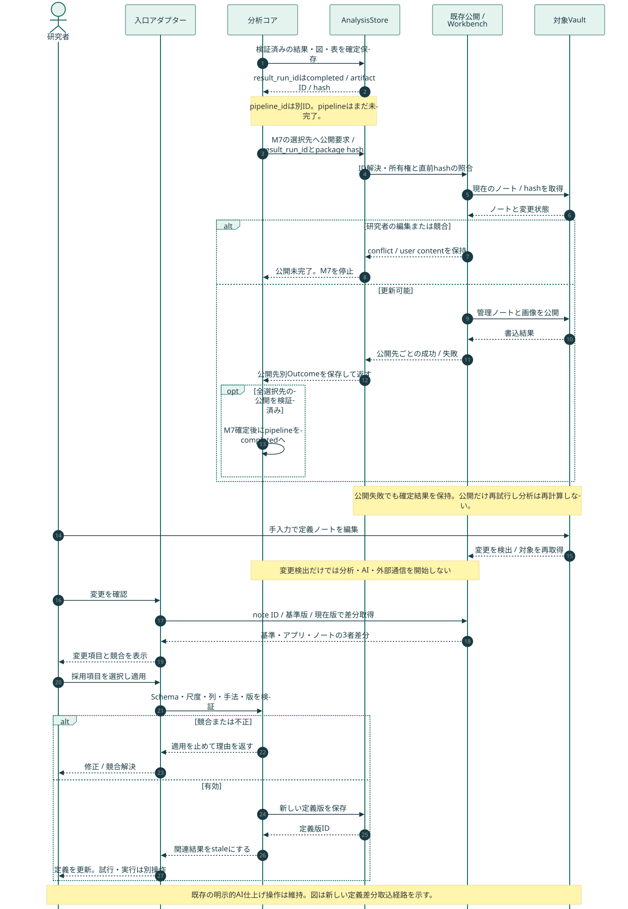

# 分析マイルストーン・可視化プログラム・UI統合設計

## 1. この文書の位置づけと閲覧入口

第18.7節の初回導入範囲（既存の記述集計2手法、手動測定、M0〜M7、JSON/CSV/ZIP、3生成Vault公開）まで実装済み。47成果物、LLM 7役割、推測統計、静止画像、SAV/jamovi/XLSXは能力一覧で未提供として返し、成功扱いしない。画像とUI試作の数値・発話は架空データであり、実装試験も一時DB・一時Vaultだけを使う。

- [UI設計プレビュー](analysis-design/ui-blueprint.html)：外部通信なしで開く画面試作。結果、手動設計、実行状況、比較、出力、根拠を確認できる。
- [画像生成によるUI案](analysis-design/ui-concept-v2.png)：4画面の視覚的な方向性。文字・状態・操作の正本は下記構造定義。
- [構造化したUI・成果物定義](analysis-design/design-spec.json)：画面ID、領域、操作、状態、データ連携、47成果物の対応。
- [図の一覧](analysis-design/diagrams.html)：分析・Obsidianのシーケンス、マイルストーン、UI、データ、システム構成、実装テスト工程の7図。
- [画像生成プロンプト](analysis-design/image-prompt.md)：生成方法と原文。
- [分析コア・LLM・Obsidianの構成図](analysis-design/analysis-architecture.svg) / [連携シーケンス](analysis-design/obsidian-sequence.svg)：メインコアとの分離と往復連携。
- [システム構成の構造JSON](analysis-design/analysis-architecture.json) / [LLM共通契約Schema](analysis-design/llm-contract.schema.json) / [要求・応答例](analysis-design/llm-contract.examples.json)：第13〜16節の機械可読定義。
- [分析コアの制御契約](analysis-design/core-control-contract.json)：第17節の要求・指示・報告・判断・集約応答とデータ不足の例。
- [確定計画・分析コアのSchema](analysis-design/core-control.schema.json)：第18節の二段階確定、停止・警告、公開状態の構造検証。状態遷移表と正常例は制御契約に収録。

関連：[[analysis-execution-ux-plan]]、[[quantification-statistics-plan]]、[[conversation-analysis-extension-plan]]、[[core-handler-routing-reorganization-plan]]、[[30-Data/analysis-storage-v1]]、[[20-Modules/ui-screens]]。

今回の利用者指定は、従来計画の「既存手法のチェック選択としての手動」「段階内は逐次でもよい」を更新する。**手動＝ラベル・測定・尺度を手入力し、カラムと分析手法を選択すること。独立した分析は段階内で並列実行し、全必須処理が完了するまで次段階は開始しない。** 現行実装の説明は書き換えず、新規開発時の要件として扱う。

## 2. 維持・改修・統合・廃止

| 現行責務 | 判断 | 移行先・保持する利点 |
| --- | --- | --- |
| 発話ID・原文版・時刻・根拠リンク | 維持 | すべての結果の根拠。発話分割・修正でも参照した旧版を保存 |
| 手動コード・重要引用・メモ | 維持 | 研究者所有。予測ラベルで上書きしない |
| research_analysis.py の言語解析・統計・Excel | 拡張 | 共通Datasetを入力するアダプターで再利用。新しい集計器を重複作成しない |
| transformer_analysis.py のE5テーマ・検索・相づち | 拡張 | アウトラインへの対応、未整理テーマ、文脈探索。埋め込みの近さを賛否へ変換しない |
| analysis_insights.py の根拠付き見解 | 拡張 | 一次の論点集約と最終の総合見解。共通意見は複数話者の根拠を要する |
| segment_classification.py の規則・JEV候補 | 統合 | 手動定義による新変数へ接続。各出所・確率・人手確認状態を分離 |
| jev_review.py の転記レビュー | 維持 | 入力品質の確認。インタビュー成功度と別の変数・実行種別 |
| 話者別特徴語・参加・会話時間構造 | 統合 | 共通の話者×論点×時間フィルターと可視化部品を利用 |
| 比較・保存履歴・成果物配信 | 維持・拡張 | AnalysisQueries/AnalysisStoreを利用し、会話をまたぐ比較は独立runのまま保持 |
| ブラウザーの逐次実行ループ | 段階的置換 | サーバー側で永続化した計画と段階ゲート。UIは表示・操作担当 |
| カードから直接始まる重複実行経路 | 統合後に廃止 | 共通の計画画面へ移動。検索・閲覧・ダウンロードは各カードに残す |
| 同じ集計の重複計算 | 統合 | 同じ入力版・条件・定義版の確定結果を共有 |

旧JSON/CSV、旧URL、旧run、手動注釈の読み取りを継続する。新形式を過去結果へ一括適用しない。

## 3. 分析段階 M0〜M7

| 段階 | 入力と処理 | 段階内の依存と並列 | 完了条件 |
| --- | --- | --- | --- |
| M0 入力・計画枠 | 原文、話者、目的、基本ラベル・JEV8軸、M1〜M3の定義、研究区分、段階・予算・出力とM4で選べる範囲を固定 | 入力検証、環境確認、再利用検証を並列 | 不変のPlanEnvelopeを保存。後段の未確定項目は許容範囲付きbinding slotとして明示 |
| M1 アウトライン | 区間別論点候補、予定質問対応、発話と論点の対応 | 区間抽出を並列→全区間を待って統合・ID確定 | 全対象発話を所属または未分類として記録。参照・重複規則の検証完了 |
| M2 一次分析 | 語彙、時間・参加、発話分類、立場、関心候補、論点別意見 | 言語解析と時間集計を並列。特徴語は語彙、意見集約は主張・立場の結果を待つ | 選択した全処理と全対象分割の結果を検証・保存 |
| M3 評価・全体の流れ | JEV8軸、質問回答・補足反論、話題と立場の推移、一次図 | 評価と関係推定を並列。グラフは対応結果を待つ | 全評価・関係・選択図の保存、根拠検証完了 |
| M4 実行定義の確定 | 手入力またはLLM案を試行し、M0の許容範囲内でM5以降の尺度・手法・列を具体化 | 独立した変数の試行を並列→尺度・単位・研究区分を検証 | PlanEnvelopeを変更せずExecutionBindingを別成果物として保存。全必須slot解決後のみM5へ |
| M5 本分析 | 全件の分類・評定、量的・統計・質的分析 | 分割評定を並列→対象dataset確定→独立した手法を並列 | 各手法の前提・対象数・根拠・結果を保存。途中結果による検定は禁止 |
| M6 二次分析 | 論点・話者・会話間比較、量的質的照合、反例、追加調査候補 | 条件が揃った比較を並列→総合解釈 | 比較の互換性、親結果の版、対象集合、終了条件を満たす |
| M7 成果物 | 図表・総合見解・SPSS/jamovi/Excel・画像・ZIP | 各書き出しを並列→全出力検証→公開確定 | 計画で選択した成果物がすべて保存され、値・定義・manifestが整合 |

M0〜M7は毎回の承認ダイアログではない。定義済み検証に合格すれば自動通過し、研究者が判断すべき未解決事項だけ `awaiting_input` とする。確認待ちの間も同じ段階の独立処理は進めてよい。

M3以降に存在する図のプレビューは、その時点の確定済み結果から生成する。最終出力セットはM7で固定する。M4の追加尺度をM2/M3に適用し直すときは、新計画を作り影響する段階から再実行する。段階を逆向きに実行しない。

M0の固定は「後段の値がすべて既知」という意味ではない。PlanEnvelopeとExecutionBindingの二段階確定、範囲外変更と旧結果の再利用は第18.2節に従う。M0とM4の両方で同じ可変Planを書き換える設計にはしない。

JEV8軸は目的充足、具体性、深掘り、視点の広がり、参加機会、中立性、相互作用、曖昧さ確認。軸ごとの0〜4の採点例を固定し、判定不能・対象外を別状態とする。初期は総合の合否や平均点を自動確定しない。研究用評価尺度としての妥当性は人手評価との照合で検証する。

## 4. 実行管理プログラム



[PNG画像](analysis-design/analysis-sequence.png) / [編集可能なMermaid原本](analysis-design/analysis-sequence.mmd)。並列分岐・失敗・取消・保存確定を含む。

### 4.1 責務分担（以下の新規名は実装案）

| 責務 | 既存の接続点 | 実装するプログラムと入出力 | 対応UI |
| --- | --- | --- | --- |
| 分析全体の統括 | メインコア・既存AnalysisCommands/Queries | AnalysisCoordinator：要求受付→実行可否判断→ハンドラー指示→結果集約→メインへ応答。純粋な判定規則とRuntimeを内包 | S02/S03 |
| 計画生成・検証 | handlers/analysis_commands.py | AnalysisPlanService：手入力/AI案＋入力snapshot→版付きPlan、steps、依存、資源要件 | S02 |
| 永続実行・ゲート | 既存要求台帳、static/analysis-execution.js | MilestoneCoordinator：Plan→attempt、ready queue、ゲート確定。UIから計算順を決定しない | S03 |
| 既存手法の実行 | research_analysis / transformer_analysis / segment_classification / analysis_insights | MethodRunner adapter：固定入力参照＋定義→ResultBundle | S01/S03 |
| 新しい意味分析 | method_experts、既存AI呼び出し | OutlineRunner、StanceRunner、InterviewEvaluationRunner、InteractionRunner：根拠付き構造結果 | S01/S05/S06 |
| 定義・生成変数 | 手動コード・分析条件 | DefinitionService / MeasurementRunner：定義→試行→採用版→値。式は許可演算の宣言形式のみ | S02 |
| データセット構築 | research_analysis._segment_dataset | DatasetBuilder：粒度、親表、列、集約、欠測→型付き固定表 | S02/S04/S05 |
| 統計・質的分析 | 既存SciPy統計、専門家定義 | StatisticsRunner / QualitativeRunner：適用条件付き結果。手法未対応は開始前に明示 | S01/S05 |
| 可視化 | static/app.js、analysis-content.js の既存図表 | VisualizationService：結果表＋ChartSpec→ブラウザー用図・代替表・画像 | S01/S04/S05 |
| 出力 | research_analysis.build_analysis_workbook | ExportService：固定dataset/ChartSpec→SAV/SPS/CSV/XLSX/画像/ZIP | S04 |
| 保存・検索・配信 | AnalysisStore / AnalysisQueries / web/analysis_routes.py | 既存storeを版付き拡張。artifact一覧・取得・再公開経路を再利用 | 全画面 |

1手法1画面にはしない。共通の結果カード・図表・根拠ドロワーに、手法別の設定と結果schemaを接続する。

### 4.2 ゲートと状態

Step状態：`planned → checking → ready → running → validating → persisting → committed`。再利用は検証を通して `reused`。別状態は `waiting_resource / awaiting_input / retry_wait / blocked / failed / cancelling / cancelled / interrupted / not_applicable`。データ不足・前提不成立・回復不能等はreason_codeで区別し、分析コアが状態と対処を決める。遷移の正本は第18.1節の状態遷移表とする。

Milestoneは所属する全stepが `committed / reused`、または確定計画で明示的に許容された `not_applicable` のいずれかで、全必須artifactが検証・登録済みのときだけ完了。`not_applicable` は適用性の判定記録であり、分析の成功ではない。判定理由・規則版・検証者を保存する。必須分析のデータ不足やエラーを適用外へ置換して段階を通過させない。判定不能の値を含んでも当該手法の網羅性・完了条件が満たされれば結果は確定できる。

必須不変条件：`start(M[k+1]) > commit(M[k])`。M[k+1]がM[k]に依存しない処理でも先行開始しない。段階内は同段階の親stepと前段階までの確定結果を参照できる。親の完了前には起動しない。

実行可否の骨格：

```text
current = 最初の未完了milestone
ready = current.steps のうち、親成果が確定し適用性検査が実行を許可した未開始step
ready を CPU / GPU / provider 別上限内で起動
全結果の検証と保存後、比較更新でcurrentを一度だけ完了にする
失敗・確認待ち・取消があれば後続milestoneを起動しない
```

CPUプロセス数、GPU同時実行数、provider別の同時要求数・レート制限を分離する。初期GPU枠は1を候補とし、実測で調整。外部APIは上限・バックオフ・取消を扱う。段階内並列は必須だが、依存または資源制約による待機は許す。高速化率を事前に保証しない。

### 4.3 保存、二重実行、回復

- 既存計画案の `analysis_pipeline_requests` / `analysis_step_attempts` を拡張候補とし、類似の第三台帳を作らない。計画版、milestone、step、attempt、親artifact、開始・終了、lease、取消要求、エラーを記録。
- fingerprintに本文版、定義版、手法版、実パラメーター、モデルの解決済み版、親artifact hash、scopeを含める。`latest` の文字列だけで同一性判定しない。
- ワーカーはattemptごとに固有の一時出力を書き、検証後に固定artifactへ昇格。既存AnalysisStoreの登録経路を使い、短いSQLiteトランザクションでmanifest参照と状態を確定する。
- ファイルとSQLiteは同一トランザクションではない。登録済みartifactだけを公開し、再起動時に孤立ファイル・欠損ファイル・中断attemptを照合する。`writing` を成功扱いしない。
- 二重POSTはrequest_idで再利用。再試行はattemptを増やし、成功済み兄弟stepを再実行しない。外部AI要求の不明な完了状態を自動再送せず、重複課金を避ける。
- 取消後に到着した応答はattemptの世代と取消状態を確認し、後続起動に使わない。完了済み成果物は保持する。
- 実行中の編集は現行snapshotを変えない。新版の実行は別Planとし、影響する結果と子孫をstaleにする。
- Vault公開の失敗は分析計算から分離。選択した出力にVault公開を含む場合、出力段階の完了だけを止め、再公開でAIを呼ばない。

## 5. 分析データの契約

### 5.1 形式と正本

既存の原文・編集・実行台帳の正本はSQLite/既存snapshot契約を維持。新しい大きな分析表はParquetを候補とし、まず同値性・性能を評価する。定義、主張の構造、ChartSpec、manifestはJSON。CSV/Excel/SAVは交換用の派生物である。Arrowはメモリー内交換の候補、DuckDBは表の検索・結合が必要になった場合の候補とし、両方の導入を前提にしない。

旧result.jsonが正本のrunはそのまま読む。新runではmanifestが各datasetの正本artifactを1つ指定する。JSONとParquetを独立編集する二重正本を作らない。保存先は既存の設定解決済みdata/AnalysisStore配下。Vaultに大量の表を埋め込まない。

| 論理データ | 粒度とキー | 必須の意味 |
| --- | --- | --- |
| segments | snapshot_id × segment_id | 本文版、話者、時刻、順序、除外。引用範囲は原文offsetの規約を固定 |
| outlines | outline_version × outline_id | 親論点、名称、予定質問対応 |
| outline_segments | outline_id × segment_id × snapshot_id | 多対多対応、未分類、対応方法。重複を人数として数えない |
| claims | claim_id | 対象論点、主張、理由、条件、生成元、確認状態 |
| stances | stance_id | 話者、claim/target_id、論点、時間範囲、立場、条件付き/混合、出所 |
| measurements | measurement_id | 対象の型とID、variable_id、定義版、型付き値、欠測理由、run_id |
| evidence | result_id × evidence_id | snapshot、発話、引用範囲、supports/contradicts/context |
| interactions | relation_id | source＝応答側、target＝参照先、関係、方向、推定/確認、根拠 |
| datasets | dataset_id × row_id | 1行の観測単位、主キー、採用列、親artifact、集約・除外・重複規則 |
| charts | chart_id × chart_version | dataset、列、単位、順序、色、条件、根拠、layout、出力寸法 |

話者IDは会話内、参加者IDは会話をまたぐ識別とする。表示名でJOINしない。measurementは縦持ちで保存し、統計入力は粒度・集約を指定して横持ちにする。1セルに複数の観測値が生じる場合、集約規則なしのpivotを拒否する。

立場は賛成/反対/中立/第三案。表明なし、対象不明、根拠不足を別状態とする。中立と沈黙を混同しない。第三案は案IDで分ける。名義コード1〜4に数値上の大小を与えない。関心は本人の明示/自発言及/質問への回答を区別する。

### 5.2 定義と尺度

VariableDefinitionにはID、名称、description、unit_of_analysis、source_columns、出力列、data_type、measurement_level、levelsと順序、値域、採用/除外例、測定規則、欠測規則、分母、集約、provenance、定義版、試行結果、採用状態を持つ。任意のPython/JavaScriptを入力・実行する欄は設けない。

名義・順序・間隔・比率と物理型を分ける。nullに欠測理由を併記。JEVの選択値・確率分布・confidence・人手確認は別列。ordinalの0〜4を自動的に連続変数へ変換しない。尺度の適合性はJSON Schemaだけでは保証できないため意味検証も行う。

## 6. 可視化プログラムと表示の共通契約

### 6.1 ResultBundle → ChartSpec → 表示・出力

各MethodRunnerはResultBundle（dataset/artifact参照、対象数、欠測、前提、根拠）を返す。VisualizationServiceは成果物カタログの定義からChartSpecを作り、同じChartSpecをブラウザー表示と画像出力へ渡す。

ChartSpecは `chart_id, visual_id, dataset_ref, source_hash, grain, filters, encodings, category_order, palette, value_format, denominator, missing_policy, evidence_ref, layout_ref, title, captions, size, font` を必須または条件付き必須とする。特にネットワークはノード座標とlayoutのseedを固定し、画像と画面の関係配置を一致させる。

表示部品は `MetricCards / DataTable / BarChart / Heatmap / Timeline / RelationGraph / DistributionPlot / EffectPlot / QuotePanel / OutlineTree` に集約。現行のSVG・HTML表・発話への移動を再利用する。全図に代替表、単位、N、欠測、選択条件、根拠操作を付ける。数値表示と原表は同じ丸め規則を共有する。

現行の分析画面では `automatic.time_bins` と `session_outline.result.rows` を組み合わせ、経過時間×会話活発度のSVGにアウトライン・Transformer話題の時間帯を重ねる。会話活発度は各時間帯の発話時間割合65%と発話開始回数35%を合成した0〜100の表示用指標で、声量・感情・話題の重要性は測らない。分析APIの `session_outline` は保存済みアウトラインとテーマから作る表示用の結合結果であり、古いTransformer話題は画面で隠す。これは上記のChartSpec/画像出力とは別の現行UI機能である。

画像は統計値から決定的に描画する。UIコンセプトの画像生成を、研究用グラフの数値描画には使わない。静的出力はMatplotlib Figure/Aggを候補として手法別rendererを持つ。PNG/SVG/PDFに加え、JPEG/TIFFは対応バックエンドを検証して提供する。ブラウザーSVGと静的rendererが共有するのはChartSpec/数値/配置であり、ピクセル単位の完全一致は保証しない。

### 6.2 成果物カタログ

47成果物の **ID → 処理担当 → 入力 → 表示部品 → 画面 → 到達段階 → 条件** は [design-spec.json](analysis-design/design-spec.json) と [UIプレビューの成果物一覧](analysis-design/ui-blueprint.html#catalog) に記載する。最小表示段階と最終書き出し段階M7を区別する。IDは後続実装・テスト・出力ファイルで共通利用する。

全候補を無条件に実行しない。手動で選んだ手法、入力の有無、対象数、尺度、ライセンスと実行環境の適合性を計画時に検査する。結果としての空集合と、未実装・失敗を別状態で表示する。

## 7. UI構造と操作



[画像生成による4画面案](analysis-design/ui-concept-v2.png) / [手動入力の画面図](analysis-design/ui-plan.png) / [実行状況の画面図](analysis-design/ui-run.png) / [スマートフォン幅の画面図](analysis-design/ui-mobile.png)。画面図はオフライン試作のキャプチャであり、アプリ本体の実装結果ではない。

既存の上位ナビ「新規作成／処理済みデータ／話者管理」を維持。「分析・可視化」の作業単位を「結果を見る／比較する／分析を組む／データ・出力」に整理し、実行状況は常時チップから開く。

| ID | 画面/領域 | 主な部品 | 操作と到達結果 |
| --- | --- | --- | --- |
| S01 | 結果を見る | 対象選択、論点リスト、結果カード、図/表、条件バー | 論点や話者で絞る。クリックしたセルの根拠をS06へ。追加分析はS02へ選択を引継ぐ |
| S02 | 分析を組む | 自動/手動、定義エディター、列選択、手法選択、試行結果、計画プレビュー | 手入力→保存→少数試行→定義固定→手法/カラム確定→実行。条件不適合は項目単位で表示 |
| S03 | 実行状況 | M0〜M7、段階内task一覧、資源待ち、失敗理由、使用量 | 完了済み結果を見る、中止、失敗のみ再試行。次段階へ強制移動するボタンは設けない |
| S04 | データ・出力 | dataset粒度/列、変数辞書、形式選択、図プレビュー、寸法/背景、出力進捗 | 個別保存、ZIP、失敗形式のみ再試行。選択条件を出力版に固定 |
| S05 | 比較する | 2結果の選択、入力版・尺度・単位、比較マトリクス、根拠 | 互換性があれば差分算出。不適合は並べて閲覧のみ、理由を表示 |
| S06 | 根拠ドロワー | 引用、前後文脈、話者、時刻、原文版、推定/人手 | 音声/編集画面へ。閉じたら元セルとスクロール位置へ戻る |

### 7.1 手動の必須入力と検証

ラベル名だけでなく「測定方法」と「尺度」の自由入力/構造入力が必要。選択済み既存変数を使う場合はその採用版を参照できる。入力列、生成する列、分析対象列を別欄にする。複数ラベルは複数の真偽列または対応表へ展開し、観測数を水増ししない。

例：ラベル「導入への賛否」／測定「話者×論点ごとに対象提案への立場を分類」／尺度「名義：賛成・反対・中立・第三案」／対象列「立場・所属」／手法「クロス集計」。質問されて話した頻度を、興味の尺度へ黙って置換しない。

手動定義はLLM生成を必須にしない。定義に従う全件評定の実行元は人手/規則/LLM/JEVから対応可能なものを選ぶ。推定値を研究者確定値へ自動採用しない。名義の立場にPearson相関を選んだ場合は理由付きで拒否し、利用者が変更するまで待つ。

### 7.2 状態とレスポンシブ

`empty / draft / validating / awaiting_input / running / completed / failed / cancelled / interrupted / stale / unavailable` を文字とアイコンで示す。色だけで状態や賛否を識別させない。100%表示は検証・保存完了後。件数表示と進捗率を区別し、重み不明な処理の残り時間を断定しない。

1280px以上：論点240px＋結果可変＋根拠360px。960〜1279px：根拠は重ねるドロワー。959px以下：論点をセレクター、段階を縦並び、根拠を全画面にする。390pxでページ全体の横スクロールを避け、表の内部だけ横スクロール可能。入力ラベル、キーボード操作、Escapeで閉じる、フォーカス復帰、未保存離脱確認を必須とする。

UI画像からの構造化はS01〜S04の見た目を上表とJSONへ対応付けたもの。画像に省略されたS05/S06の詳細、失敗/欠測/モバイル状態はJSONとHTML試作で補完する。実装時は画像中の文字をOCRして仕様へ逆輸入しない。

## 8. 出力設計

| 形式 | プログラム候補 | 内容・検証 |
| --- | --- | --- |
| SPSS .sav | pyreadstat.write_sav（導入前に依存・ライセンス確認） | ASCII列名、日本語ラベル、値ラベル、尺度、欠測。再読み込みで型・値・ラベルを照合 |
| SPSS .sps | 対応手法の構文テンプレート | 再現対象の手法とパラメーターのみ出力。未対応手法を再現可能と表示しない |
| jamovi | 同じ.savと.csv、変数辞書、手順、対応するR/jmv構文 | nominal/ordinal/continuous/IDを対応付ける。CSVの推定だけに依存しない。初期は.omvを自作せずjamovi側で保存 |
| Excel .xlsx | 既存openpyxl出力を拡張 | 分析単位別データ、集計、統計、変数定義、根拠一覧、分析条件。各データシートは1行1観測 |
| CSV/JSON/Parquet | 共通dataset serializer | 同じ固定datasetから生成。CSVから正本へ逆変換しない |
| PNG/JPEG/SVG/PDF/TIFF | 共通ChartSpec＋renderer | 寸法、フォント、背景、解像度。JPEGは白背景、SVG/PDFはベクトル。対応形式を実環境で検証 |
| ZIP | 標準アーカイブ | 選択成果物、data dictionary、manifest、図に使った表、再現条件を格納 |

画像は幅/高さpxか印刷寸法mm＋dpiを選び、一方から他方を計算する。dpiメタデータだけ変更して画素数が増えたように見せない。PNG透過は任意、JPEG選択時は透過を無効化して理由を表示する。日本語フォントの存在を確認し、利用フォントを記録。凡例・数値・注記の切れを検査する。

観測単位（発話、話者、論点、話者×論点、会話）ごとに別datasetを出力。複数選択時はファイルを分ける。長い原文、ID、日付、欠測の意味が形式制限で失われる場合は変換規則と補助ファイルを明示。元値を黙って切り詰めない。

SPSS/jamoviで開けるデータの提供と、各ソフトの分析結果ウィンドウを丸ごと再現することは別。対応する検定のみ構文/手順で再現し、アプリ内の質的見解はExcel/JSON/引用表として提供する。

## 9. API案と既存境界

初回導入範囲では計画、定義、試行、pipeline状態・取消・再試行とZIP取得を実装済み。図の単独取得と任意形式のexport要求は後続候補である。既存 `web/analysis_routes.py` → `handlers/analysis_commands.py` / `analysis_queries.py` の境界を使い、参照・ダウンロードは既存artifact APIを再利用する。

| 操作 | 候補API | 要点 |
| --- | --- | --- |
| 定義検証・計画プレビュー | POST /api/library/{id}/analysis/plans/preview | 副作用なし。入力版、定義、列、手法→steps、ゲート、エラー、利用不可理由 |
| 定義下書き保存 | PUT /api/library/{id}/analysis/definitions/{definition_id} | revisionを検証、既存コードを上書きしない |
| 定義の少数試行 | POST /api/library/{id}/analysis/definitions/{definition_id}/trials | 明示実行。対象ID、provider、上限を固定、全件実行と別request |
| 計画確定・開始 | POST /api/library/{id}/analysis/pipelines | plan_hash、source_revision、request_idを検証。応答はpipeline_idと状態。保存runのIDと区別 |
| 状態取得 | GET /api/library/{id}/analysis/pipelines/{pipeline_id} | milestones、steps、events、usage、失敗理由。表示範囲と実行対象を混同しない |
| 中止・再試行 | POST .../{pipeline_id}/cancel または /retry | 冪等。retryは対象step、親hash、attemptを照合 |
| 図の仕様取得 | GET /api/library/{id}/analysis/charts/{chart_id} | 確定結果とChartSpecの参照。読み取りでAIを起動しない |
| 出力要求 | POST /api/library/{id}/analysis/exports | 固定dataset/ChartSpec、形式、寸法を指定。M7 taskまたは完了runへの独立export attempt |

エラー区分は入力不正、版競合、利用不可、適用条件不足、provider失敗、保存失敗を分ける。APIが選択手法を黙って置換しない。画面更新は初期はpollingを再利用し、イベント配信方式の変更を必須にしない。

## 10. 導入順と受入条件

| 開発段階 | 作業 | 完了条件 |
| --- | --- | --- |
| P1 共通契約 | 初回対象の入力粒度・定義・ChartSpec・既存責務を確定。47成果物は段階拡張のカタログ | 初回対象の処理/画面/根拠/出力/試験が実装可能な契約に紐付く。残りは未提供と明示 |
| P2 永続実行 | 段階ゲート、資源枠、依存、再試行、取消、回復 | ゲート越え・二重確定がなく、独立taskの並列実行を観測できる |
| P3 既存接続 | 既存分析とUIをadapterで移行 | 同一入力・条件で既存値と根拠が一致。旧run閲覧を維持 |
| P4 新分析 | アウトライン、立場・関心、JEV8軸、会話関係 | 架空の日本語会話で条件付き・否定・未判定・少数意見を評価 |
| P5 定義→分析 | 手動エディター、LLM案、試行、全件評定、統計・二次分析 | 任意の型適合列を選択でき、不適合手法を理由付き拒否 |
| P6 表示・出力 | 47成果物の対象機能、画像、SAV/jamovi/XLSX、ZIP | 実機読込、数値一致、文字化け・欠測・画像切れなし |
| P7 整理 | 旧経路廃止、性能測定、互換性検証 | 旧資産を保持し、逐次対並列の時間・メモリー・失敗率を報告 |

### 必須検証ケース

- T01：段階内の複数taskを遅延させ、最後の保存前に次段階の開始が0件である。
- T02：順不同の完了、二重通知、二重POSTでもゲート確定・外部呼出しが重複しない。
- T03：一部失敗・再起動・取消・遅延応答で完了済み兄弟結果を保持し、後続を止める。
- T04：原文/定義/列/親hashを変更すると必要な子孫だけ再計算。表示変更でAIを呼ばない。
- T05：手動でラベル・測定・尺度を入力、列と手法を選択、試行、固定、分析、出力まで到達。
- T06：名義尺度×Pearson、粒度不一致、未定義集約、同名異版の尺度を検出し、自動置換しない。
- T07：架空の未回答・沈黙・条件付き賛成・第三案・混合意見・反例を失わない。
- T08：図→表→根拠→音声確認→元セルへ戻る。キーボード/390px/1280pxを確認。
- T09：SAV/CSV/XLSXを再読み込みし型・値・ラベル・欠測を確認。jamovi/SPSS実機で設定と対応検定を照合。
- T10：全選択画像形式の日本語、軸、凡例、透明背景、px/mm/dpi、静的/画面の数値を検証。
- T11：ローカル限定計画の外部呼出し0件、保存・再公開・出力のAI呼出し0件。
- T12：Parquet候補の往復同値性と速度・容量を架空データで測定。性能未達ならJSON/既存表経路を保持。

テストは一時ディレクトリと架空データで行い、実Vaultを使わない。マイグレーション導入時は旧run読み取り、バックアップ、dry-run、ロールバックを別途実装条件にする。

## 11. 参照した公式仕様

- [Apache Parquet](https://parquet.apache.org/docs/overview/)：列指向の保存形式。大きな表への採用判断は実測する。
- [Apache Arrow](https://arrow.apache.org/docs/format/Intro.html)：メモリー内の列指向データ交換。
- [SQLite WAL](https://www.sqlite.org/wal.html)：読み取りと書き込みの並行、単一writerの制約。
- [JSON Schema](https://json-schema.org/understanding-json-schema/reference/type)：型・必須項目・値域の検証。
- [pyreadstat](https://github.com/Roche/pyreadstat/blob/master/README.md)：SAVと変数・値ラベル・欠測の読み書き。
- [jamovi FAQ](https://www.jamovi.org/faq.html)、[変数仕様](https://docs.jamovi.org/usermanual/um_4_spreadsheet.html)：SAV/CSV読込と尺度設定。
- [Matplotlib savefig](https://matplotlib.org/stable/api/_as_gen/matplotlib.pyplot.savefig.html)：静的図の保存、サイズ・dpi・背景の指定。
- [Mermaid sequence](https://mermaid.js.org/syntax/sequenceDiagram)：par/altを使った分析シーケンスの原本。

外部仕様からの採用案と、Gurumojiで実装済みの機能を区別する。対応モデル、変換ライブラリーの版、ソフトウェア実機互換性は実装時に固定・検証する。

## 12. 成果物とプログラム・表示の対応一覧

詳細条件は構造JSON、試作の「47成果物の対応表」から検索できる。下表の担当名は責務名であり、同名の実装ファイルが存在することを意味しない。

| ID | 成果物 | 初回段階 | 作成プログラムの責務 | 表示部品 | 画面 |
| --- | --- | --- | --- | --- | --- |
| V01 | 分析サマリー | M2 | 基礎集計Adapter | MetricCards | S01 |
| V02 | 予定質問と実際の論点 | M1 | OutlineRunner | DataTable | S01 |
| V03 | インタビュー評価8軸 | M3 | InterviewEvaluationRunner | BarChart | S01 |
| V04 | 論点別の評価 | M3 | InterviewEvaluationRunner | Heatmap | S01 |
| V05 | 評価の根拠一覧 | M3 | EvidenceResolver | QuotePanel | S01 |
| V06 | 階層アウトライン | M1 | OutlineRunner | OutlineTree | S01 |
| V07 | 論点別の議論量 | M2 | 参加集計Adapter | BarChart | S01 |
| V08 | 論点別の立場分布 | M2 | StanceRunner＋集計 | BarChart | S01 |
| V09 | 共通意見・対立点・代替案 | M2 | 論点集約Adapter | DataTable | S01 |
| V10 | 主張と理由・条件 | M2 | 論点集約Adapter | RelationGraph | S01 |
| V11 | 未解決点・未回答質問 | M3 | InteractionRunner | DataTable | S01 |
| V12 | 論点別キーワード | M2 | 語彙Adapter | Heatmap | S01 |
| V13 | 話者プロフィール | M2 | 話者集計Adapter | MetricCards | S01 |
| V14 | 話者×論点の立場 | M2 | StanceRunner | Heatmap | S01 |
| V15 | 話者×論点の参加 | M2 | 参加集計Adapter | Heatmap | S01 |
| V16 | 話者別キーワード | M2 | 語彙Adapter | BarChart | S01 |
| V17 | 話者別の関心候補 | M2 | 関心分析Runner | Heatmap | S01 |
| V18 | 立場の変化 | M3 | StanceRunner＋時系列集計 | Timeline | S01 |
| V19 | 話者間の共通点・相違点 | M2 | 論点集約Adapter | DataTable | S01 |
| V20 | 会話タイムライン | M3 | 時間集計Adapter | Timeline | S01 |
| V21 | 話題の遷移 | M3 | 時間集計Adapter | RelationGraph | S01 |
| V22 | 質問→回答→深掘り | M3 | InteractionRunner | RelationGraph | S01 |
| V23 | 同意・反論・補足の関係 | M3 | InteractionRunner | RelationGraph | S01 |
| V24 | 話者交代 | M3 | 時間集計Adapter | Heatmap | S01 |
| V25 | 参加バランスの推移 | M3 | 参加集計Adapter | Timeline | S01 |
| V26 | 相づち・応答状況 | M3 | Transformer相づちAdapter | BarChart | S01 |
| V27 | 無音・重なり候補 | M3 | 時間集計Adapter | Timeline | S01 |
| V28 | 変数・尺度一覧 | M4 | DefinitionService | DataTable | S01 |
| V29 | ラベルの付与状況 | M5 | MeasurementRunner＋集計 | BarChart | S01 |
| V30 | 評定値の分布 | M5 | StatisticsRunner | DistributionPlot | S01 |
| V31 | 欠測・未判定の状況 | M5 | DatasetBuilder | Heatmap | S01 |
| V32 | 判定元の比較 | M5 | 判定比較Adapter | DataTable | S05 |
| V33 | 定義変更前後の比較 | M6 | 比較Adapter | DataTable | S05 |
| V34 | 記述統計 | M5 | StatisticsRunner | DataTable | S01 |
| V35 | 群別の分布 | M5 | StatisticsRunner | DistributionPlot | S01 |
| V36 | クロス集計 | M5 | StatisticsRunner | Heatmap | S01 |
| V37 | 相関 | M5 | StatisticsRunner | Heatmap | S01 |
| V38 | 群間比較 | M5 | StatisticsRunner | EffectPlot | S05 |
| V39 | 対応のある比較 | M5 | StatisticsRunner | DistributionPlot | S05 |
| V40 | 語の共起 | M5 | 語彙Adapter | RelationGraph | S01 |
| V41 | テーマとコードの構造 | M5 | QualitativeRunner | OutlineTree | S05 |
| V42 | ケース×テーマ | M5 | QualitativeRunner | Heatmap | S05 |
| V43 | 重要引用・反例・少数意見 | M5 | QualitativeRunner | QuotePanel | S05 |
| V44 | 量的結果と質的解釈 | M6 | 統合分析Runner | DataTable | S05 |
| V45 | 複数インタビュー比較 | M6 | 既存interview_comparison拡張 | Heatmap | S05 |
| V46 | 分析結果の統合 | M6 | 統合分析Runner | RelationGraph | S05 |
| V47 | 追加調査の候補 | M6 | 統合分析Runner | DataTable | S05 |

## 13. メインコアから独立した分析サブシステム

### 13.1 今回の設計判断

利用者の「様々なLLMが共通形式で使える」を要件として採用する。**メインコア、分析ハンドラー、分析コア、分析実行管理、分析プログラム、役割別オーケストレーター、LLM接続アダプター**を責務で分ける。初期は同一アプリ内のモジュール分離とし、重い計算だけワーカーへ出す。独立サーバー・別DB・マイクロサービス化を必須にしない。

**分析コアを分析サブシステムの統括窓口とする。** メインコアとの要求・進捗・結果の応答、データ不足・エラー時の判断、分析ハンドラーへの指示、結果の集約、段階完了の決定を担う。内部をAnalysisCoordinator（統括）、純粋な判定規則、Runtime（実行機構）へ分ける。純粋規則はI/Oを持たず、統括は注入されたポートを通じて指示・保存する。従来の「Core＝純粋ルールだけ」という呼称は、この利用者要件に合わせて「分析コア内部の純粋規則」に限定する。



### 13.2 各層の責任と禁止する依存

| 層 | 持つ責任 | 持たない責任・参照しないもの |
| --- | --- | --- |
| メインコア / composition root | アプリ起動、設定解決、文字起こし・話者・入力の管理、共通資源の割当、依存の組立て | 分析手法の中身、M0〜M7の完了判断、分析用プロンプト |
| 入口アダプター（既存AnalysisCommands/Queries） | UI/HTTP/Obsidian/任意MCPの要求を正規化し、分析コアに渡す。要求ID・権限・送信条件の照合 | 分析の実行順・データ不足への最終判断 |
| 分析コアの統括（AnalysisCoordinator） | メインとの応答、適用性・回復方針の判断、ハンドラー指示、結果のまとめ、段階ゲートの確定 | 個別手法の計算、具象provider SDK・app.pyへの逆import |
| 分析コア内部の純粋規則 | 型・尺度・単位・データ充足性、計画の依存、エラー分類と対処規則、ゲート、再利用・古さ、結果検証 | SQL、ファイル、環境変数、HTTP、provider SDK |
| 分析コア内部のRuntime | コアの指示に基づく永続要求、ワーカー起動、資源枠、取消・再試行・回復の実行機構 | 対処方針の独自変更、二重台帳、次段階の先行実行 |
| 分析ハンドラー（実行側） | コアの版付き指示を受け、入力取得・事前検査・分析プログラム呼出し・報告を実施。複数ハンドラーを段階内で並列実行 | 次の分析選択、独自再試行・手法変更、ゲート解除、メインへの直接結果通知 |
| 各種分析プログラム / MethodRunner | 固定入力と定義による1手法の処理。ResultBundleを返す | 次手法の起動、他runの状態更新、Vaultの直接編集 |
| 各種オーケストレーター | 目的から計画・定義・分析契約・確認事項・図の仕様の候補を作る | ゲート解除、任意コードの実行、勝手なモデル変更、結果の直接確定 |
| LLM Gateway / provider adapter | 能力確認、共通要求の変換、認証、呼出し、使用量、タイムアウト・取消の正規化 | 研究上の意味検証、手法の自動置換、設定外providerへの送信 |
| 保存・Obsidian連携 | 既存AnalysisStoreの固定保存・再公開、既存Registry/Workbenchの所有権・競合処理 | 新しい正本の二重作成、同期からの暗黙の分析開始 |

指揮系統は「メインコア → 分析コア → 分析ハンドラー → 分析プログラム」。戻りは「分析プログラム → ハンドラー報告 → 分析コアで検証・集約 → メインコアへ応答」。UI等の入口アダプターも同じ分析コアへ要求を渡す。メインは構成を組み立てるが、ハンドラーへ直接の分析指示を出さない。LLMオーケストレーターの候補も分析コアで検証する。

従来文書の「ハンドラー」は入口も含む広い呼称だったため、入口アダプターと実行ハンドラーの役割を区別する。既存AnalysisCommands/Queriesの外部契約を維持し、実行側は既存runnerを包むTaskHandlerポートへ段階的に移す。コアから入口のAnalysisCommandsを再帰呼出しする構造や、別の分析台帳は作らない。

GPU等は文字起こしと分析で競合するため、資源管理は注入された共通ポートで連携する。メイン側の資源貸出が遅くても分析の意味・順番をメインコアへ戻さない。

### 13.3 ファイル構成案と既存機能の再利用

以下は全体拡張時の配置案。初回導入では純粋契約を `analysis_core.py`、永続schedulerを `analysis_pipeline.py` に置き、既存の `app.py`、`web/analysis_routes.py`、`handlers/analysis_commands.py`、`handlers/analysis_queries.py` へ接続した。未選択の役割別runnerはまだ分割していない。

```text
src/gurumoji/
  app.py                         # 起動・既存処理・依存の組立て
  web/analysis_routes.py         # 既存HTTP入口を維持
  handlers/
    analysis_commands.py         # 既存を拡張：計画/試行/実行/取消/出力/公開
    analysis_queries.py          # 既存を拡張：状態/結果/根拠/履歴
    analysis_tasks.py            # 実行側：コア指示→既存runner→観測事実・結果の報告
  analysis/
    coordinator.py               # 分析コアの統括：対処判断・指示・集約・メイン応答
    contracts/                   # Plan / ControlRequest / Directive / Report / Response
    core/                        # 純粋な計画・充足性・エラー対処・ゲート・結果検証
    runtime/                     # コア方針に従う永続要求・実行・資源枠・回復機構
    orchestrators/               # 役割別の候補生成・相談上限・prompt組立て
    methods/                     # 既存手法adapter、新規手法runner
    adapters/
      inputs.py                  # 原文・話者の固定snapshot取得
      llm_gateway.py             # 既存call_ai_json/JEV経路へのbridge
      knowledge.py               # ExpertCatalog＋対象ノートの取得
      obsidian.py                # 既存公開/差分取込みへのbridge
  research_analysis.py           # 既存の計算を当面そのまま再利用
  transformer_analysis.py
  segment_classification.py
  analysis_insights.py
  analysis_store.py              # 保存・公開の所有者を維持
  vault_registry.py
  obsidian_finishing.py
```

新設フォルダーを先に空で量産しない。1つのユースケースを縦に移し、差し替え・試験が必要な境界だけProtocol化する。既存のAnalysisCommands/Queriesに新しい同名ハンドラーを並立させない。既存の計算関数も移動そのものを目的にしない。

入力ポートはsnapshotを返し、保存ポートはAnalysisStoreを呼ぶ。手法は型付き値を返す。importは契約・純粋ルールへ向け、実行時に具象を注入する。すべての移行済み層からapp.pyへの逆importを禁止する。

## 14. 様々なLLMに対応するオーケストレーター

### 14.1 役割の分離

| ID | オーケストレーター | 担当段階 | 返すもの |
| --- | --- | --- | --- |
| O01 | 計画担当 | M0 | 利用可能な手法・対象・依存・必要能力を示すPlanProposal |
| O02 | アウトライン担当 | M1 | 論点候補、予定質問対応、発話との対応候補 |
| O03 | 意味分析担当 | M2/M3 | 主張・立場・関心・相互作用の手法別契約と根拠付き候補 |
| O04 | ラベル・測定・尺度担当 | M4 | VariableDefinition案、例・反例、試行条件 |
| O05 | 手法・結果確認担当 | M0/M3/M4/M5 | 前提・尺度・根拠の指摘、反例、解決が必要な事項 |
| O06 | 統合・二次分析担当 | M6 | 共通点、食い違い、追加分析案、終了条件 |
| O07 | 可視化・説明担当 | M3/M7 | 許可された図種・列・説明のChartSpec案。数値は確定dataset参照 |

オーケストレーターは役割であり、常駐する別モデルではない。同じモデルが複数役割を担当してよい。役割数と同数のエージェント/プロセスを常時起動しない。計画担当と実際の文章分析担当のcall ID、プロンプト版、入力、使用量、結果は別管理とする。

現行のO01接続は、基礎分析の実行設定で計画候補を明示生成する範囲に限る。ローカルTransformerは分析目的と実行可能な2手法のカードを意味ベクトルで比較する。指定LLMはLM Studioを既定とし、OpenAI／Googleを選んだ場合だけ分析目的・集計件数・手法カードを送る。候補の手法IDと入力版を分析コアが検証し、基礎分析の実行時には候補を結果のparameterへ固定する。候補は既存の必須step・ゲートを変更しない。O02〜O07、動的な手法追加、モデル呼出しの永続attempt管理は未実装。

処理経路表示は、O01のAPI要求中だけ選択モデルへの線を動かし、完了後は停止する。pipeline状態APIの `planning` は採用済み候補の `objective, provider, model, primary_method` を返し、処理画面ではO01を完了済み、M0〜M7を実際の段階状態に連動して表示する。単独のTransformerテーマ分析は既存の進捗値（準備・意味ベクトル・テーマ形成・根拠整理）に連動する。線はAPI/処理段階の状態を示し、モデル内部のattentionや単語間計算の観測値ではない。

処理内容を固定できる場合はコードの既定計画を使い、手動定義にLLMの提案や相談を強制しない。各役割の知識は既存ExpertCatalogと手法登録票から読む。既存の人手コードや専門家定義をモデルが直接改訂しない。

候補の相談は論点・指摘・修正・未解決事項だけを記録する。内部の非公開思考過程を要求・保存しない。初期の相談上限案は2巡、構造修復1回、再帰的な相談なし。実行前に上限・予算・providerを固定し、上限到達で無制限に続けない。採用はschema・実装能力・試行・意味検証で決め、LLM同士の合意だけでは有効化しない。

### 14.2 LLM共通形式

**UTF-8 JSON＋版付きJSON Schemaを共通契約**にする。人が読む手法・役割の説明はMarkdown、実行に必要なID・入出力・制約はJSONへ整理する。既存ExpertCatalogのYAML実行定義をコンパイルして利用し、同じ定義の別正本を手で管理しない。

| 契約 | 主な項目 |
| --- | --- |
| ContextPacket | 目的、選択した根拠抜粋、source ID/revision/hash、省略範囲、送信方針、利用可能な手法 |
| MethodCard | method ID/版、入力・出力schema、適用条件、観測単位、必要能力、許可された分析部品 |
| RoleDefinition | role ID/版、担当段階、許可task、知識参照、入力/出力契約、禁止操作、終了条件 |
| PlanProposal | step ID、milestone、method ID/版、binding、親step、パラメーター、選択理由、未解決事項 |
| TaskRequest | request ID、role、固定Context、定義参照、期待する結果契約、許可ラベル/根拠ID |
| TaskResult | request ID、schema版、状態、構造化候補、根拠ID、未判定理由、警告。正規化後に実provider・model・usageを付与 |

共通契約は [llm-contract.schema.json](analysis-design/llm-contract.schema.json)、正常な要求・応答例は [llm-contract.examples.json](analysis-design/llm-contract.examples.json)。このschemaはTaskRequest/TaskResult/PlanProposalの骨格を示す設計用schemaであり、分析手法ごとのpayload schemaを別に指定する。schemaに合格しても、手法の存在、根拠の存在、DAG、尺度・単位・方針は別に検証する。

ローカルLLMに全文書やVaultのフォルダー構造を理解させることを前提にしない。ContextPacketを用い、systemの役割・制約と、引用された分析対象テキストを分ける。原文中の命令文は分析対象のデータとして扱う。

### 14.3 Providerを替える方法

1. UIで役割ごとのprovider/modelを設定し、計画へ固定する。
2. Gatewayが必要能力（JSON、生成、Choice、入力長、ツール呼出し等）との適合を確認する。
3. provider adapterが共通要求を各APIへ変換する。
4. 応答を共通形式へ戻し、コアでschemaと意味を検証する。
5. 不正応答・拒否・途中終了・切断・不明な成功状態は状態として残す。成功したふりをしない。

各providerがJSON Schemaの全機能や同じtool calling形式を受け付けるとは仮定しない。内部schemaはDraft 2020-12で固定し、native構造化出力には対応するsubsetへ変換する。JSON文字列しか返せないモデルでは厳密parseと同じサーバー側検証を実施。結果契約を満たせないモデルは利用不可とする。

既存のOpenAI/Google/LM Studio呼出しとTokenConfig、ai_http_worker、取消を再利用する。Ollama等は同じGatewayの追加adapter候補。API互換を名乗るサーバーでも実際の能力を確認する。認証情報・接続URLはホストが解決し、モデルの返した値を接続先にしない。

**JEVはChoice判定系adapter**として扱い、文章生成や計画作成能力を仮定しない。ローカルLLMの判定で代替した場合は別engine・別method版として表示し、JEV実行済みにはしない。local_onlyでJEVを選択した計画は開始前に矛盾として返す。

モデル変更は同じ入出力の「形式」を共有できるという意味であり、判定品質や数値の同一性を保証しない。モデルごとの評価サンプル、根拠精度、未判定率、再試行率を記録し、実モデル版とプロンプト/知識hashを再利用キーへ含める。

### 14.4 LLMから利用するツール形式

ツールの中立カタログは `name / description / input_schema / output_schema / operation_kind / allowed_roles` を持つ。初期は関数呼出しとJSON要求のadapterを作り、MCPは必要になった場合に同じ分析ハンドラーへ接続する外部入口として追加できる。MCPをモデルそのものの能力と同一視しない。

公開候補は `list_methods / get_method / get_context / preview_plan / propose_definition / inspect_result / request_run / get_run / cancel_run / request_export`。read系と副作用のある操作を分ける。LLMがrequest_runを提案しても、既に固定された実行範囲・利用者設定・ゲート・予算に一致する場合だけホストが受付する。ツールを実行するかをモデルだけで決めない。

任意SQL、shell、Python eval、Vaultの任意パス読み書きは共通ツールにしない。統計は登録済み計算器、図は許可部品、保存は既存経路へ渡す。外部LLMクライアントからのMCP利用は別の接続設定・認証境界を要し、ローカルUIの権限を自動付与しない。

参照仕様：[JSON Schema Draft 2020-12](https://json-schema.org/draft/2020-12)、[MCP Tools仕様 2025-06-18](https://modelcontextprotocol.io/specification/2025-06-18/server/tools)。採用時にMCPの対応版を交渉・固定し、最新版であるとは仮定しない。

## 15. Obsidianとの連携設計

### 15.1 接続方式と現行との差分

現行はPythonからVault内のMarkdownを直接読み書きし、Obsidian本体のAPIや専用プラグインを必須にしていない。この方式を維持する。Obsidianを閉じていても分析は実行できる。

現行の操作ノートにはAI仕上げの実行チェックがある。これは既存の明示実行経路として維持する。一方、今回追加する分析定義・考察の差分同期では、編集検出だけでAI・重い再分析・外部送信を開始しない。汎用の研究メモ・コード案取り込みは現時点で未実装である。



| Vault | 維持する役割 | 今回追加する読み方・表示 |
| --- | --- | --- |
| Software Vault | Git管理の仕様・手法・専門家定義。アプリは書かない | RoleDefinition/MethodCardを既存知識からコンパイルする根拠 |
| InputVault | 入力台帳・snapshot概要 | source ID、版、分析対象範囲。原文を重複配置しない |
| OrchestratorVault | 手法カード・run記録 | 採用計画、役割、モデル、M0〜M7、公開状態、未解決事項 |
| VisualizationVault | 図表の問い・表示条件・来歴 | 47成果物のノート、同じVault内の画像添付、表・根拠のartifact参照 |
| ResearchVault | 研究者の原文確認・メモ・解釈・AI仕上げ | 手入力定義と研究メモを編集できるノート、差分取り込みの入口 |

「4 Vault」は既存の4役割であり、ResearchVaultを含めると5つの保管庫を併用する。今回追加のOrchestratorVaultを別名で作らない。Persona関連の既存設計は役割定義の任意参照として扱い、この変更で新Vaultを増設しない。

### 15.2 アプリからObsidianへ

1. 分析結果・根拠・図・表をAnalysisStoreで先に確定する。
2. runに紐づく公開要求を既存の保存/公開経路へ渡す。
3. ResearchVaultはAnalysisStore/ObsidianLayout/ObsidianFinishing、生成3VaultはVaultRegistryの既存の所有権検証を通す。
4. 管理対象のID/hashを照合し、生成ノートと必要な画像を公開する。
5. ノートごとの公開成否と競合を記録し、索引を回復可能な順序で更新する。

公開ノートには `note_id, run_id, source_revision, definition_version, artifact_ids, source_hash, run_status, publication_status, review_status` と短い要約を置く。大量の発話ID、表、モデル入出力はartifactを参照する。

研究者の本文、タグ、別名、YAMLの未知キー、コメントは保持する。研究者が変更した生成ノートは競合表示し、黙って上書きしない。既存のhash確認と書込の間の競合リスクを、コア分離だけで解消したとは扱わない。ノート単位の書込制御、直前再照合、競合保存と再公開試験を追加要件とする。

### 15.3 Obsidian内で画像・グラフを見る

図の正本はAnalysisStoreのartifact。VisualizationVault内に表示用のPNGまたはSVGを、artifact ID/hash付きの管理添付として配置する。ノートは `![[同じVault内の添付画像]]` で埋め込む。これは表示用コピーであり、編集可能な第二正本にしない。新しい添付公開は現行の経路に追加する機能で、実装済みとはみなさない。

画像の下に対象数・観測単位・尺度・欠測・条件・根拠の説明を付ける。再分析で図が変わったら新しいartifactを発行し、旧runの図は保持する。インタラクティブな絞り込み・音声確認はアプリで開く。複雑なHTMLをObsidian内で自動実行する方式を前提にしない。

同じVault内のノートリンクはWikilinkを使う。Vault間はnote/run/artifact IDをresolverで解決し、必要に応じてObsidian URIまたはアプリの参照URLを出す。Vaultをまたぐ相対Wikilinkを必須の根拠にしない。Obsidianのノート関係グラフと、統計上の共起・応答ネットワークは別物として表示する。

### 15.4 Obsidianから分析へ戻す

研究者は専用の定義ノートで、ラベル、測定、尺度、対象列、手法を編集できる案とする。UIのS02と同じDefinitionDraftへ変換し、別の分析経路を作らない。人が読む説明は本文、ID/型/値域/列/手法は限定したYAML/JSON定義ブロックで編集する。

`note_id + base_revision + base_hash` を必須にし、「最後に公開した基準版」「現在のアプリ版」「編集されたノート」を比較する。通常の本文メモは注釈として扱い、LLMで勝手に定義へ変換しない。

取り込み順序：**編集検出 → ID解決 → 差分プレビュー → 利用者が採用する項目を選択 → schema/尺度/列の検証 → 競合がなければ新版を保存 → 関連結果をstaleにする**。その後の試行・分析開始は別の明示操作とする。

- ノートとアプリの両方が同じ項目を変更：競合として止め、選択した解決を新版に保存。
- 名称だけ変更：stable IDを維持。パスやタイトルから別の変数を作らない。
- ノート移動/欠損：既存経路のID解決・missing/conflictを尊重し、黙って再作成しない。
- 原文編集：既存Workbenchの反映経路を使い、研究メモ取り込みで原文を書き換えない。
- 尺度変更：定義版を増やし、旧値と混在集計しない。
- ノート削除：分析runや原文の削除へ連動しない。

研究者所有ノートを自由に全体再整形する同期は行わない。差分採用はユーザーの編集をアプリへ反映するための操作であり、単なるノート閲覧に承認操作を要求しない。

### 15.5 LLMがObsidianの知識を利用する

入口のID・目的から、索引→メタデータ/要約→必要な節・根拠範囲の順で取得する。既存のExpertCatalogを使い、読む候補を限定してContextPacketへ変換する。全文Vaultや全CSVを一括投入しない。

packetには各source ID/revision/hash、選択理由、抜粋、除外した範囲を含める。個人識別情報・ローカルパス・認証情報・不要な原文を含めない。研究本文が必要な分析では、その操作に許された範囲だけを明示して含める。キャッシュキーは目的・選択ID・版/hash・レンダリング版で固定する。

ObsidianはLLMが読める知識を作る編集窓口であり、LLMにファイルを直接実行させる環境ではない。チェックボックス、引用中の命令、Markdownリンクをsystem指示へ昇格させない。

### 15.6 M7と公開の完了条件

計算完了、出力完了、Vault公開、研究者確認、入力の古さを別軸にする。M7でObsidian公開を選択した場合、指定された公開先すべての検証・保存までM7を完了にしない。未選択の公開先は計画外と記録する。公開失敗時も分析結果は保持し、公開だけ再試行する。

現行AnalysisStore.publish_vaultsは生成Vault公開の例外を内部で扱う経路を持つため、戻り値だけで全Vault公開成功を判定できると仮定しない。まず既存の公開状態・例外通知を観測可能にする局所改修を行い、その記録を新ゲートへ接続する。新しい共通Publisherへの全面置換を前提にしない。

## 16. UIへの反映と導入順

### 16.1 既存画面へ加えるもの

| 画面 | 追加する表示・操作 |
| --- | --- |
| S02 分析を組む | 詳細設定に「役割と実行モデル」。O01〜O07の使用/不使用、provider/model、必要能力、local_only/cloud_allowed、上限。手動では不要な役割を実行しない |
| S02 手動定義 | 「Obsidianで編集」「変更を確認」。note ID/基準版を保持し、差分を同じ定義エディターへ戻す |
| S03 実行状況 | taskの担当手法、担当役割、実モデル、資源待ちと親待ち。提案・検証・計算・保存・公開を区別 |
| S04 データ・出力 | 「Obsidian連携」。公開先、図の添付、状態、ノートを開く、公開のみ再試行。計算成功と公開失敗を併記 |
| S06 根拠 | 参照した原文版、ノートID、artifact ID、アプリ/Obsidianで開く、旧版の表示 |

新しい管理画面を量産せず、S02/S04の詳細領域に配置する。画面と機械構造は [design-spec.json](analysis-design/design-spec.json) のsystem_extensionsに追記する。今回の追加UIは構造設計であり、既存の4画面生成画像を改変して実装済みと見せない。

### 16.2 実装する場合の順序

1. **境界を固定**：Main→Handlers→Core/Runtimeの参照とポートを1ユースケースで確認。既存計算・保存を再利用。
2. **共通LLM契約**：既存のクラウド1系統とローカル1系統を同じ要求/応答schemaへ接続。手動定義・既定計画も同じ経路へ。
3. **分析コアへ実行を移す**：M0〜M7、段階内並列、再試行・取消・回復。メインと分析で資源枠を共有。
4. **役割別オーケストレーター**：O01/O04から始め、契約・評価済み手法に対してO02/O03/O05/O06/O07を追加。
5. **公開の観測と画像添付**：既存AnalysisStore/Registryの公開失敗をUIへ返し、図を同じVault内で表示。
6. **差分取り込み**：定義ノートから試行・採用・新版保存。研究メモは人所有を保持。同期から自動分析を起動しない。
7. **外部入口の追加判断**：必要ならMCP adapterを同じHandlersへ接続。内部MCPサーバー化を全作業の前提にしない。

### 16.3 追加受入条件

- A01：分析CoreをFlask/app.py/provider SDK/SQLなしで読み込み、計画・尺度・ゲート検証を試験できる。
- A02：同じschemaでクラウド/ローカルのモック応答を検証。未知の手法、架空根拠、循環、異版JOIN、越境送信を拒否。
- A03：手動定義の試行・確定・実行に、LLMによる定義生成が必須でない。
- A04：役割ごとにrequest/usage/modelを追跡。形式エラー・拒否・timeout・部分出力・取消の状態が混ざらない。
- A05：相談上限、資源枠、マイルストーン全件待ちを同時に守る。同じモデルの複数役割でも成立する。
- A06：Vault公開失敗・競合・ノート欠損でも原文と確定結果を保持。公開のみの再試行でAI呼出し0件。
- A07：人の本文、タグ、未知のYAML項目、改行を保持し、両側編集の競合を差分で解決できる。
- A08：図の正本hashと管理添付が一致し、Obsidian内の画像・同一Vaultリンク・ID resolverが解決する。
- A09：Obsidian変更検出だけでは分析/AI/外部送信を開始しない。既存の明示AI仕上げ操作は回帰確認する。
- A10：既存のDB/ノート/旧runを一時環境で移行、dry-run、バックアップ、旧経路への切戻しを確認。移行でAIを再実行しない。

### 16.4 設計成果物の確認範囲

2026-09-21に、共通Schemaの構造検証、要求・応答・計画の正常例4件、不正な役割・hash・状態・確定要求などの拒否例8件を確認した。7役割の担当段階、5つのUI拡張の画面参照、JSONと画面試作の埋め込み定義の一致、文書リンク、6図のSVG/PNG表示を確認した。画面試作は手動定義・段階待ち・再試行表示・画像形式の制約・モバイル幅を確認済み。

これは設計成果物の確認である。実際のLLM接続、手法別payloadの検証、分析の妥当性、Vaultの同期・競合処理は未実装であり、A01〜A10は今後の実装時の受入条件である。アプリコード、DB、実行用Vaultはこの設計作業で変更していない。

## 17. 分析コアによる判断・指示・集約・応答

### 17.1 判断の所有者

分析コアは「何を、どの順に実行できるか」「失敗後にどうするか」「どこまで結果として返せるか」を決定する。分析ハンドラーは指示を実行し、観測したデータと結果・エラーを返す。メインコアは利用目的・対象・許容範囲を要求として渡し、分析コアからの進捗・必要な利用者入力・集約結果を受け取る。個々の失敗をメイン側で再判断して実行順を組み直さない。

分析コアをLLMそのものにはしない。判定の根拠は、版付きMethodCard、固定データに対する検査結果、エラー分類、確定した計画・回復方針。LLMは解釈・代替候補・説明文を提案できるが、件数の捏造、閾値の緩和、勝手な欠測補完や手法変更はできない。

### 17.2 データ不足と実行可能性

検査はM0の粗い事前検査と、各taskの固定dataset確定後に行う。M0時点で得られない列・集計値は「未検査」であり、合格済みにしない。ハンドラーが検査事実を返し、コアが手法別規則と照合する。検査と計算は同じsnapshot・定義版を使い、値が変われば再検査する。

| 検査対象 | コアが判断に使う事実 | 不足時の応答例 |
| --- | --- | --- |
| 入力・対象列 | 原文や列の存在、型、対象範囲、必須時刻・話者ID | 列の選択修正、入力の追加、対応表の修正が必要 |
| 有効観測 | フィルター後・欠測除外後の件数、独立単位数、群ごとの有効件数、対応ペア数 | 「発話は多いが独立した参加者が不足」など、数えた単位を明示 |
| 手法の成立条件 | 値の変動、カテゴリ・群の存在、行列の推定可能性、手法固有の前提条件 | 対象手法を実行不可にし、どの条件が満たされないかを返す |
| 推測と精度 | 研究計画の精度・検出力条件、指定モデルに必要な情報 | 計算可能と、研究目的に十分な精度があることを別判定 |
| 質的・意味分析 | 対象論点の引用範囲、文脈、話者の区別、反例を確認できる範囲 | 根拠不足の論点を明示。単一の件数だけで分析の十分性を断定しない |

すべての分析に一律の「最低N」を当てはめない。MethodCardの`eligibility_rules`に、規則ID/版、観測単位、必要統計量、演算子・基準値、適用範囲、根拠、判定次元とhard/warning区分を登録する。基準値は手法・設定・研究計画に従い、LLMが実行中に変更しない。hardの失敗・未判定は対象taskを止める。warningの失敗・未判定はその状態を保持し、計画の許容範囲内で実行できる。精度不明を計算不能と一律に扱わない（第18.6節）。

`EligibilityAssessment`は `eligible / eligible_with_warnings / insufficient_data / assumptions_not_met / unsupported / unknown` と、観測値・基準・不足内容・根拠artifact・次に必要な操作を返す。「必要な追加件数」は固定された件数規則から計算できる場合のみ提示する。

### 17.3 エラー・不足に対する対処表

| 状況 | 分析コアの判断 | ハンドラーへの指示と停止範囲 |
| --- | --- | --- |
| データ不足・必須列欠損 | `awaiting_input`。修正内容と影響taskを返す | 対象と依存子を停止。同段階の独立taskは継続可。次段階は開始不可 |
| 前提不成立・未対応手法 | `blocked`。理由と代替案を提示 | 事前に許可済みの代替のみ、契約・出力互換性を確認して選択。未許可は計画変更待ち |
| 一時的通信失敗・レート制限 | 確定した回数・時間・予算内で`retry_wait` | Runtimeが待機時間を守って新attemptを起動。ハンドラー独自の再試行は禁止 |
| 外部要求が完了したか不明 | `blocked`、外部状態を照会 | 同じ要求を無条件再送しない。照会不能なら不明のまま理由を返す |
| 出力形式不正・根拠ID不正 | 結果を未採用にし、許可された修復上限内だけ再要求 | 不正結果を保存確定・集約・後続入力に使わない |
| 認証・送信方針不一致・資源不足 | 設定修正待ち、または許容時間内の資源待ち | 設定外providerへの切替禁止。GPU等の不足を統計上のデータ不足と混同しない |
| 永続保存失敗 | `blocked`。計算済みと保存済みを分ける | 安全に残ったattempt出力から保存を再試行。確定前のゲート通過は禁止 |
| Vault公開だけ失敗 | M7の公開処理を停止 | 公開だけ再試行し、分析やAI呼出しを繰り返さない |
| 回復不能・再試行上限到達 | `failed`。部分成果と未完了項目を返す | 新しいtask発行を停止し、実行中taskを計画の取消規則で整理 |
| 利用者の取消 | `cancelling → cancelled` | 取消命令を配布し、遅延応答を世代番号で除外。確定済み成果は保持 |

再試行条件には`max_attempts / max_elapsed / backoff / retryable_codes / outcome_known / budget_remaining`を持たせる。Gateway内部の通信再試行も同じ予算に算入し、多層の再試行で回数が増えないようにする。LLMの不適切な応答を「データが少ない」に言い換えない。

### 17.4 マイルストーンと適用外・代替の扱い

必須分析が実行できない場合は、その段階で止める。完了済みの図や表は閲覧できるが、全体を成功表示しない。適用外で終えてよいtaskは、確定計画で`allow_not_applicable`と条件を明示したものだけとし、判定artifactを保存する。省略数・理由は最終集約にも残す。適用外にした親の出力を必要とする子を起動しない。

事前に代替分岐が定義されていれば、コアが適用性・同じ段階・出力契約を検証して分岐を選ぶ。例えば検定を記述統計に変える場合、研究上の問いと成果物が変わるため、単なる再試行ではない。許可がなければ新しい計画版として確定し、必須出力・子依存・該当段階からの再実行範囲を再検証する。少ないデータを重複させる、推定値を実測数に加える、閾値を緩めることで完了条件を満たさない。

### 17.5 指示とメインコアへの応答の契約

構造例・状態遷移表は [分析コア制御契約](analysis-design/core-control-contract.json)、構造検証は [core-control.schema.json](analysis-design/core-control.schema.json)。LLMの提案契約とは別に、アプリ内の命令・報告として管理する。全体の実行識別子はpipeline_id、既存AnalysisStoreの保存runはresult_run_idと呼び分ける。

| 契約 | 方向 | 内容 |
| --- | --- | --- |
| AnalysisRequest | メイン/入口 → コア | request ID、目的、固定入力参照、計画版、手動定義、出力、予算・送信・代替方針 |
| HandlerDirective | コア → ハンドラー | directive ID、pipeline/step/attempt、世代、段階、操作、手法版、入力・定義参照、期限、制約、期待出力契約 |
| HandlerReport | ハンドラー → コア | 指示との対応ID、実行状態、検査事実、候補artifact、エラー種別・外部完了状態・使用量。ゲート完了を宣言しない |
| CoreDecision | コアの判定記録 | 適用規則版、判断事実、原因、採用対処、影響範囲、次回条件、計画版。再判断と監査に利用 |
| AnalysisResponse / Event | コア → メイン/入口 | pipeline状態、段階、event連番、完了/不足/失敗/適用外件数、理由、可能な操作、必要入力、result_run参照と部分/最終区分 |

長時間分析の受付はpipeline_idを即時返し、その後は版付きイベントまたは状態照会で返す。重複要求には同じ受付結果を返す。メインは表示と利用者入力の伝達を担当し、`allowed_actions`を見て勝手に次段階を実行しない。ハンドラー報告はrequest・pipeline・計画参照・attempt・世代・元の入力hashが一致する場合だけ採用する。

結果の「まとめ」は、まず件数・対象範囲・来歴・成立条件・欠測・完了状態をコアが確定集約する。研究上の文章解釈は必要に応じてO06等へ依頼し、根拠と対応するか検証して添付する。部分成功を全体成功と表現せず、`completed`は全選択段階の確定後だけ返す。待機や失敗時には、完了済み結果、できなかったこと、必要なデータ/操作、再開範囲を一緒に返す。

### 17.6 UI・導入・受入条件

S03に「分析コアの判断」を追加し、状態、対象手法、観測単位、有効件数、規則、停止理由、対処、再試行残数、影響範囲を表示する。S02では入力・列・定義の修正や代替計画の選択、S01では不足範囲付きの部分結果を確認できる。自動回復が可能なら進捗として表示し、不要な確認操作を増やさない。S04の公開状態は計算状態と分ける。

導入順は、①コア窓口と要求/指示/報告契約、②既存手法1つのハンドラー化、③適用性とエラー対処、④既存ゲートへの接続、⑤集約応答・UIとする。すべての判断経路がコアを通ったことを確認してから手法を増やす。

- C01：メインからハンドラーへ直接の分析指示がなく、結果はコアで集約して返る。
- C02：フィルター・欠測・群・対応ペア・独立単位を反映した検査結果で可否が変わる。同じ入力版で検査と計算を行う。
- C03：必須taskのデータ不足で次段階が開始されず、同段階の独立taskだけが継続する。
- C04：事前許可のない適用外・手法変更・閾値変更でゲートを通過しない。
- C05：一時失敗、完了不明、永続失敗、保存失敗、公開失敗で対処が異なる。再試行上限を複数層で共有する。
- C06：重複・遅延・旧世代の報告を無視し、取消と再起動後にも一度だけ結果を確定する。
- C07：途中結果・未実行・適用外の件数を集約応答とUIで一致させる。未検査や精度不明はunknownとして残し、hardとwarningに応じた停止・制約付き実行を確認する。

この追加も設計のみ。C01〜C07は実装時に行う試験であり、現行アプリが対応済みであるとは示さない。

## 18. 全体レビューを反映した確定方針

本節は前節までの基本構成を維持し、実装前の契約不足を補う。第18節と旧図・旧表現に差異がある場合は本節を新規実装の基準とする。現行コード・保存契約の説明を実装済みに書き換えない。

### 18.1 機械可読契約と状態遷移

LLM共通Schemaはあくまで提案の入口であり、実行権限や確定計画ではない。ホストが提案を検証し、`PlanEnvelope / ExecutionBinding / AnalysisRequest / HandlerDirective / HandlerReport / EligibilityAssessment / CoreDecision / AnalysisResponse`へ変換する。これら8契約を [core-control.schema.json](analysis-design/core-control.schema.json) で構造検証する。

`core-control-contract.json`の`state_machines`を状態遷移表とする。遷移にはfrom/toに加えてguard IDを必須にし、コアの純粋規則がguardを評価、Runtimeが永続状態を比較更新する。表にない遷移は拒否する。Schema合格だけで遷移を許可しない。

- step：検査、資源待ち、計算、検証、保存待ち、確定を分ける。`validating → committed`の途中で保存できない場合は`persisting / blocked`に残す。取消中も明示する。
- pipeline：`accepted / running / waiting / cancelling / completed / failed / cancelled`を用い、待機理由は`data / definition / retry / resource / remote_unknown / storage / publication`で区別する。複数taskの待機理由は一覧で返す。
- milestone：`pending / active / waiting / committed / failed / cancelled`。同じ段階内に実行中の独立taskがあればactiveを維持し、待ちだけになればwaitingとする。
- publication：選択先ごとに`pending / publishing / published / failed / conflict / unknown`。未選択は`not_selected`。
- 終端状態から同じattemptをrunningへ戻さない。再試行は新attempt、確定計画外の変更は新pipeline。取消のない一時待機からの再開は、元の版・判断・許容予算を再検証する。

意味検証には、IDの実在と一意性、入力hash、要求と報告の対応、DAG、段階・bindingの整合、列・尺度・単位、許可provider、予算、代替の互換性、独立単位、研究区分を含める。決定記録は既存の要求・attempt台帳拡張に紐付け、別の実行台帳を増設しない。

### 18.2 M0とM4の二段階確定

| 確定物 | 固定する内容 | 固定後にできること |
| --- | --- | --- |
| M0：PlanEnvelope | snapshot、目的、M1〜M3の定義、M0〜M7の段階、依存、手法候補、後段binding slot、対象列候補、出力契約、適用外条件、代替候補、予算、送信方針、研究区分 | 値未確定のslotを許容範囲内で埋める。既存値は変更しない |
| M4：ExecutionBinding | PlanEnvelope参照、slot→採用手法/定義版/列/観測単位、試行根拠、研究区分の検証記録 | M5〜M7の実行入力を解決し、確定した組合せを使う |

M4以前に実行するstepはslotに依存してはならない。M5以降のslotには選択可能な手法と入力列契約、出力schemaをM0で記録する。未来の生成列は実データの列名ではなく、上流の出力契約・出力キーで予約する。M4はその実在・型を確認して結び付ける。slotが不要な計画でもM4の整合検査と空のBinding確定は行う。

M4で許容範囲にない手法・尺度・出力・予算が必要になった場合、元のEnvelopeを編集せず、新Envelopeと新pipelineを作る。親pipeline/親計画版を残す。新pipelineはM0から順に検証し、同一の入力・定義・手法・親hashを満たす完了成果だけを再利用して段階を確定する。影響しない分析の再計算は不要だが、段階ゲートの検証は省略しない。

「定義を修正して継続」のUIは、許容slotの未確定値を埋める操作なのか、新pipelineを作る操作なのかを差分付きで示す。研究上の目的や確認的仮説を事後変更して、旧計画の検証結果に見せない。

### 18.3 探索・検証と評価尺度の信頼性

各計画に`ResearchProtocol`を含め、目的、`exploratory / confirmatory`、仮説・分析対象の事前定義、データ閲覧履歴、推論の範囲、検定群と多重比較方針、評価データの参照を固定する。効果量・区間推定・対象数・欠測・前提を結果に保持する。有意なものだけ残さず、実施した分析、除外、変更、失敗も履歴へ残す。透明な報告とp値だけによらない解釈は [ASAの声明](https://www.amstat.org/asa/files/pdfs/p-valuestatement.pdf) を根拠に採用する。

M1〜M4で同じデータを閲覧して作った尺度・仮説の分析は、原則として探索的と表示する。検証的とする場合は、分析選択前に固定された仮説と規則を使うか、選択に未使用の独立データを用いる条件を記録し、コアが根拠を確認する。M0で名前だけconfirmatoryにしても有効化しない。条件が崩れた場合は検証的出力を停止し、探索への変更は明示的な新計画とする。

LLMのラベル・JEV8軸・尺度については、開発用と最終評価用のデータを分け、同じ話者・会話の情報が評価側へ流れるかを確認する。分割単位とIDを保存し、LLMのプロンプトや例示に最終評価データを使わない。これは学習・選択に使ったデータだけで性能を評価する問題への対策である。[scikit-learnの評価データ分離とグループ分割の説明](https://scikit-learn.org/stable/modules/cross_validation.html)

JEV8軸の運用条件は次とする。

1. 各軸の意味、0〜4の採点例、対象外と判定不能、必要文脈を版付きで固定する。
2. 複数の人手評定を独立に収集し、人同士の一致と、人とモデルの一致を分けて確認する。不一致の扱い・裁定記録も残す。
3. 軸別の一致率、混同行列、判定可能範囲、誤り例を確認する。順序評定では重み付きκを候補とし、尺度・対象数・分布に適合するかを確認する。[重み付きκの公式仕様](https://scikit-learn.org/stable/modules/generated/sklearn.metrics.cohen_kappa_score.html)
4. 合格基準は指標・評価対象・許容誤差・必要な評価範囲を含めて最終評価前に固定する。根拠のない共通閾値は置かない。基準・評価データが未確定なら`unvalidated`と表示し、研究上の成功/失敗を自動確定しない。
5. model/prompt/rubric/分類規則が変われば評価状態を`revalidation_required`へ移す。過去版の評価を新モデルへ流用しない。人手との一致は尺度の内容妥当性そのものの証明ではない。

多重比較の方針は検定群ID、対象仮説、補正手法と設定を計画へ記録する。追加探索は元の検定群へ黙って継ぎ足さず、新しい分析として履歴・出力に区別する。記述集計のみの場合は検定群を不要と明示できる。

### 18.4 並列計算と短い保存ロック

現行`AnalysisCommands.save`は`_write_lock`内で`_build_analysis`等を呼ぶ。`AnalysisStore.save`も`STORE_LOCK`内の保存と公開経路を持つため、単にワーカー数を増やすだけでは並列化が成立しない。新pipelineでは次の境界へ段階的に移す。

| 区間 | 処理 | ロック・トランザクション |
| --- | --- | --- |
| 入力取得 | 原文/条件の版を一貫した読取で取得し、不変snapshot参照を確保 | 短い読取トランザクション。必要な版確認だけ既存ロック内 |
| 検査・計算 | 同じsnapshotで適用性検査、CPU/GPU処理、外部LLM呼出し | library/Storeの大域書込ロック外。資源枠は別に取得 |
| 出力準備 | attempt固有パスへ成果物を書き、hash・行数・schemaを検証 | 固有パス単位。SQLiteの書込トランザクション外 |
| 確定 | 取消世代・attempt・入力hash・期待状態を照合し、artifact参照と状態を一度だけ登録 | 短いトランザクションと比較更新。一意制約で重複を拒否 |
| 公開 | 確定成果物から選択したVaultへ公開 | 計算用大域ロック外。既存のノート所有権・公開先単位の競合制御 |

原文が並行編集された場合、実行中のsnapshotは変えない。旧snapshotの結果として保存し、現在入力との差をstaleとして表示する。現在版のキャッシュや手動定義へは上書きしない。取消と確定が競合した場合は永続状態の比較更新で勝った側を採用し、旧世代の応答は後続へ渡さない。

ファイルとSQLiteの同時確定は保証しない。登録前のファイルはattemptの仮成果物であり、再起動時に照合する。公開要求は確定結果と対応するattemptへ永続記録し、停止後に同じIDで回復する。旧APIの既存ロックを先に外すのではなく、固定snapshotと短い確定経路を新アダプターで成立させてから置換する。

性能評価では、同じ固定入力・手法・モデル条件の逐次/並列を比較し、総時間、計算時間、ロック待ち、保存時間、最大メモリー、provider使用量、失敗率を記録する。独立taskの実行区間の重なりと、次段階の先行開始0件を別々に確認する。

### 18.5 計算・保存・公開・pipeline完了の分離

| 識別子・状態 | 正本と意味 | 完了条件 |
| --- | --- | --- |
| pipeline_id / pipeline_status | 計画全体の要求台帳。analysis_pipeline_requests等の既存計画を拡張 | M0〜M7の全選択成果・ゲートが確定 |
| step_id / attempt_id | 一処理の実行と再試行。analysis_step_attemptsの計画を拡張 | 結果検証・保存確定、または計画で許容した適用外判定の確定 |
| result_run_id / result_status | 既存AnalysisStoreのanalysis_runs.id/status | その保存パッケージが不変artifactとして確定。従来のcompletedの意味を変更しない |
| publication target / status | pipelineのM7公開stepに紐づく公開先別結果 | 指定package/artifact hashに対応するノート・添付を公開し、書込結果を検証 |
| calculation_status / export_status | pipeline内の該当stepから導出する表示軸 | 計算対象/出力対象それぞれの確定。独立した別台帳を作らない |

公開先の識別は`result_run_id + target_role + package_hash`、試行はattempt IDで区別する。既存ResearchVaultの`vault_status`を全Vaultの合成状態へ読み替えない。Input/Orchestrator/Visualizationの成否は各対象から記録し、Software Vaultへは公開しない。未選択先はnot_selectedと記録し、ゲートには含めない。

順序は **結果パッケージ確定（result_run completed）→ 選択先公開 → 公開先別状態確定 → M7確定 → pipeline completed** とする。公開はresult_runの確定だけを前提にし、pipeline completedを待たない。これにより計算完了と公開完了の循環待ちを作らない。UIは「計算済み・公開失敗・全体未完了」を同時に表示できる。

現行`AnalysisStore.save`の自動公開を新pipelineへ無条件に持ち込まない。既存APIは従来の自動公開を維持し、新pipeline用アダプターでは保存と公開を分離できる明示モードを設ける設計とする。未対応のadapterで新pipelineを開始しない。`publish_vaults`内部の例外処理は公開先別のOutcomeを返すか永続記録する局所改修に限定し、汎用Publisherへの全面置換は行わない。

既存履歴にはpipeline_idを捏造しない。新pipelineが既存結果を再利用する場合のみ明示的に関連付ける。旧公開状態で個別成否が分からないものはunknownとし、全公開済みへ補完しない。公開再試行は同じ保存パッケージから行い、AI・統計計算を呼ばない。移行は一時DB/Vault、dry-run、旧APIの互換、切戻しを条件とする。

### 18.6 計算可否と結論の制約を分ける

| 判定次元 | hardの例 | warningの例 | unknown時の扱い |
| --- | --- | --- | --- |
| computability | 必須列不存在、値域違反、有効入力なし | 任意列の欠損 | 必須条件なら対象task停止 |
| inference_validity | 指定推測手法の成立条件・独立単位・検証的計画条件を満たさない | 許容済みの推測上の制約 | 当該推測を止める。記述統計は別の許可taskとして継続可 |
| precision | 計画で必須とした精度基準を満たさない | 精度不明・区間が広いなど、記述結果の提示を妨げない制約 | warningならunknownを保持して実行。必須目標なら停止 |
| qualitative_coverage | 指定論点に根拠がなく、要求された解釈を生成できない | 視点や文脈の限定、未確認の反例 | 許容範囲だけを分析し、不足範囲を表示。網羅性や飽和を自動宣言しない |

severityは結果を見て変更せず、MethodCardと研究計画で固定する。Assessmentには`execution = allowed / blocked`と`inference_scope = none / descriptive / exploratory / confirmatory`を別に持たせる。hardにfail/unknownがあればexecutionはblocked。warningだけならeligible_with_warningsで実行できるが、警告をpassへ変更しない。

例えば記述統計の計算条件が満たされ、精度の評価が未設定なら「記述統計は実行可能、精度は未評価」と返す。検定に必要な条件が未確認なら「当該検定は停止」と返す。停止した検定を、実施済みの記述統計で置換して成功扱いにはしない。

### 18.7 導入範囲と修正の受入条件

初回の実装対象は、既存の記述集計を核にした一本の経路と、同段階で並列に動くもう一つの独立した既存処理とする。必要なM0〜M7を計画に残し、選択外の分析はM0で明示する。既存の確定アウトライン等を入力として再利用できる場合はID/hashを検証し、ない場合は未実装機能を成功扱いせず開始前に不足を返す。LLM7役割・47成果物の全実装を初回の完了条件にしない。

最初に契約・検査・指示・部分結果・保存まで成立させ、次にM7出力/公開、最後に追加手法とUIを増やす。第10節のP1〜P7は全体ロードマップであり、P1は初回対象の契約を実装可能に確定する段階、残りのカタログは設計上の予約とする。

- R01：Schemaで未定義状態、必須stepの適用外許可、失敗報告のエラー欠落、hard不合格なのにallowed、公開未完了なのにpipeline completedを拒否する。
- R02：M0のEnvelope不変、M4での全slot解決、範囲外変更の新pipeline化を確認。旧成果再利用でも全ゲートを順に検証する。
- R03：探索データの事後仮説を検証的と表示しない。仮説・検定群・多重比較・閲覧履歴を出力にも含める。
- R04：JEV8軸の人手評定・採点規則・評価データ・事前基準を版付きで固定。モデル変更で再評価状態となる。
- R05：遅い計算中に独立taskと通常の読取が進み、書込ロックに計算・LLM待機を含めない。取消・並行編集・重複確定も確認する。
- R06：result_run completedかつ公開失敗でも結果を保持し、pipelineは未完了。公開のみの再試行でM7まで回復する。
- R07：必須検査unknownは停止、精度warning unknownは記述処理を許可。両者が同じ「分析不可」表示にならない。

初回導入範囲についてR01、R02、R05、R06、R07を専用試験で確認した。R03は探索／検証区分と検証的計画の事前固定まで、R04は未選択機能として能力一覧で利用不可に固定した。未選択の推測統計、JEV評価、外部provider接続を検証済みとは扱わない。

## 19. Terra / Lunaで検証してから進む実装工程

### 19.1 実行時のMと開発時のDを分ける

M0〜M7はアプリ内で実行する分析の段階。以下のD0〜D7は、開発者が実装を進める順序とテストのゲートである。**D[n]に定めた必須テストがすべて合格し、変更範囲に対する受入条件を確認するまで、D[n+1]の実装を開始しない。** 設計を読むことはできるが、後段の実装を先に書いて積み上げない。

図は [実装とテストの進行図](analysis-design/implementation-gates.svg)、機械可読の指示と受入記録は [implementation-gates.json](analysis-design/implementation-gates.json)。第18.7節の初回導入範囲はD0〜D7を順に通過した。利用可能な実行環境の制約によりTerra/Lunaへの委任は行わず、主担当が実装・試験・受入を行ったことを記録する。

### 19.2 担当と引継ぎ

利用者指定のモデル名に従い、**Terra（gpt-5.6-terra）を実装・原因調査・受入確認、Luna（gpt-5.6-luna）を範囲の明確なテスト実行と事実報告**へ割り当てる。これは役割分担であり、料金やモデル精度の保証ではない。実装セッションで利用可否を確認し、使えない場合はその事実を示す。別モデルで実行した結果をTerra/Lunaの結果と表記しない。

- Terraは一つのD工程の指定ファイルと契約だけを変更する。新しい意味検証・故障注入・期待値の設計はTerraが担当する。
- Lunaは渡されたコマンド・テスト対象を実行し、終了コード、件数、失敗名、ログ参照を返す。テストを通すための実装変更・assert削除・skip追加はしない。
- 失敗時はTerraへ最小の再現情報を返し、修正後に影響したテストを再実行する。曖昧な期待値、競合・再開、統計解釈の判断はTerraが確認する。
- テスト結果が揃ったらTerraまたは主担当が契約との対応を確認し、同じ差分に対するGateResultをacceptedにする。毎回利用者に形式的な承認を求めない。
- テスト中に検査対象ファイルを変更しない。同工程内の独立テストは隔離したDB・出力先で並列実行できるが、同じファイルを複数エージェントが同時編集しない。

### 19.3 工程別の必須テスト

| 工程 | 今回の工程で実装する範囲 | 次へ進む前に確認すること | 担当・既存テストの接続点 |
| --- | --- | --- | --- |
| D0 基準と契約 | 選択した初回機能、8契約、状態・規則、対象ファイルを固定 | Schema正常/異常例、既存対象テストの基準、テスト収集0件でないこと | Terraが期待値を確認、Lunaが実行。analysis_queries / analysis_storageの対象ケース |
| D1 コア窓口と計画 | メイン→コア→実行ハンドラー→報告、M0/M4、純粋な可否・対処規則 | 逆importなし、手動定義でLLM生成不要、未解決slotでM5開始不可、範囲外は新計画、hard/warningの差 | Terra＋Luna。新規test_analysis_core_contracts / test_analysis_plan_binding / test_analysis_eligibility、既存analysis_queries |
| D2 固定入力と保存 | snapshot、attempt成果物、短い確定ロック、保存runとpipeline IDの関連 | 同一版で検査・計算、計算中の別処理進行、取消と保存競合、二重保存、旧run互換、孤立成果物の回復 | Terraが競合を確認、Lunaが実行。既存analysis_storage、追加test_analysis_snapshot_commit |
| D3 段階・並列・回復 | 同段階並列、永続指示、ゲート、再試行、取消、再起動 | 次段階の先行0件、親待ち、順不同・重複・旧世代応答、上限、外部完了不明、再起動後の回復 | Terraが故障注入を設計、Lunaが実行。新規test_analysis_milestones / test_analysis_recovery。既存pipeline_regressionsは隣接回帰のみ |
| D4 手法と研究規則 | 選択した既存手法2つのadapter、尺度・列・単位、研究区分 | 既存数値一致、欠測後N、独立単位、適用不可、未知条件、探索/検証の誤表示なし、全分析履歴 | Terraが分析上の期待値を確認、Lunaが実行。research_analysis / content_analysis、追加test_analysis_research_protocol |
| D5 LLM境界 | 既存provider adapterへの接続と、選択した役割だけ。手動経路も維持 | 同じ契約でクラウド/ローカルのモック応答、拒否・不正JSON・根拠不正・timeout・取消、予算、local_only外部通信0件 | Terra＋Luna。ai_http_worker / ai_model_settings / method_experts、追加test_analysis_llm_contracts |
| D6 出力と公開 | 選択した形式、ChartSpec、既存Store/Registryの公開Outcome | 再読込値・尺度・欠測一致、日本語画像、公開先別失敗、計算済みでも全体未完了、公開再試行でAI呼出し0件 | Terra＋Luna。analysis_storage / four_vaults / obsidian_layout / vault_coverage、追加test_analysis_exports / test_analysis_publication |
| D7 UIと統合 | 選択機能をS01〜S06へ接続、履歴、部分結果、互換経路 | 手入力→試行→段階実行→不足/再開→出力、状態整合、キーボード・画面幅、旧URL、対象範囲の最終回帰 | Lunaがブラウザー/回帰を実行、Terraが結果確認。content_browser / browser_e2e / analysis_method_view、追加の操作ケース |

表の`test_analysis_core_contracts`等は初回導入で追加済み。既存`test_pipeline_regressions.py`は新しい分析schedulerの試験そのものではないため、schedulerの不変条件は専用試験で確認する。

初回に選択しないLLM役割・画像形式・47成果物の機能は、D0で能力一覧に未提供として固定する。D5等でも、未提供であることと既存機能の互換・手動経路を確認して通過する。選択済みの必須機能を後から未提供に変更してテストを省略しない。拡張時は該当D工程から同じゲートを適用し、依存境界が変わる後続工程を再検証する。

JEV8軸の妥当性は通常のモックテストとは別のEVALゲートを設ける。人手評定、評価データ分離、事前基準の達成を確認するまでは未検証として表示し、自動の成功/失敗判定を有効化しない。Terra/Lunaがテストに合格したことを人手との評価一致の代用にしない。

### 19.4 合格判定とテスト記録

工程状態は`planned → implementing → testing → accepted`。失敗・実行不能は`fix_required / blocked`とし、次工程を開始しない。必須ケースの未収集、unexpected skip、timeout、環境不備、未解決の既存失敗は合格ではない。既存の無関係な失敗を除外する場合は、再現・非関連の根拠と対象範囲を主担当が記録する。関連する失敗は修正してから進む。

GateResultには `gate_id, scope_id, code_fingerprint, test_fingerprint, environment_ref, commands, required_cases, executed_cases, failures, unexpected_skips, exit_codes, log_refs, reviewer, decision` を残す。未コミット変更を含む対象ファイル・テスト・依存設定のhashを使い、commit IDだけで同じ状態とみなさない。記録は一つの小さな進捗JSONとログ参照に集約し、工程ごとに長い報告書を作らない。

工程途中で対象ファイルや依存契約を変更したら、その影響を受ける合格証跡を無効にする。最後の差分に対して必要なテストが通っていることを確認し、古い合格結果で次へ進まない。

既存の実行形式はunittestを利用する。Windowsでは既存READMEに従い`PYTHONPATH`へsrcを設定し、`.venv/Scripts/python.exe -m unittest discover -s tests -p test_analysis_storage.py`のように対象を絞る。コマンドは実装時の環境で検証し、新規テストがない状態で「0件成功」を合格にしない。

### 19.5 トークン節約の実装指示

1. 各担当へ渡すのは「工程ID・目的・必読ファイル/節・編集可ファイル・不変条件・コマンド・合格条件・直前の失敗」のTaskPacketだけ。会話全文、設計書全文、Vault全文は渡さない。
2. 初回読取は対象の関数・契約・テストに限定する。読み取り済みの内容は短い版付き要約と参照で引き継ぎ、変更のない大きなファイルを毎回再読しない。
3. Lunaの通常報告は`PASS/FAIL/BLOCKED、対象hash、件数、失敗名、最小ログ、次の担当`に限定する。全ログは一時ファイルへ保存し、正常ログを会話へ大量出力しない。
4. 修正後は失敗したテストと影響する境界から確認する。無関係な全テストの反復を避け、D7または広範な契約変更時に全体回帰をまとめる。
5. 独立テストの並列実行は一時DB・ポート・保存先を分離できる場合だけ。同じ原因の失敗を複数担当に重複調査させない。
6. 1工程1担当を基本とし、短い単純テストのために大量のエージェントを起動しない。委任が使える環境では新規担当へ会話全文を継承せず、TaskPacketを明示して開始する。
7. 手法別の共通fixture・境界試験を再利用する。実装をそのまま写すテストや、表示名だけの大量テストを作らず、値・依存・故障回復・利用者操作を確認する。
8. 節約するのは重複した文脈・出力・作業であり、必須テストや失敗情報ではない。合格証跡を省略して次へ進まない。

この指示は設計図と構造JSONにも同じ工程IDで反映する。初回導入範囲のD0〜D7はaccepted、JEVの妥当性を扱うEVALは未実施である。設計Schema検証だけを開発ゲートの合格とはみなしていない。

### 19.6 今回確認した実装成果物

初回導入範囲では、純粋な制御契約、M0の不変計画、M4の実行binding、固定snapshot、attempt台帳、段階ゲート、同段階並列、取消・再試行・起動回復、手動定義の少数試行、固定結果、JSON/CSV/ZIP、公開先別Outcomeを実装した。結果保存とVault公開は分離し、公開失敗時も計算済みrunを保持して公開だけを再試行する。

D0〜D7の対象試験、手入力からM0〜M7完了までの実ブラウザ操作、既存画面のブラウザ回帰を一時DB・一時Vaultとモック外部通信で確認した。正確な件数・対象は `implementation-gates.json` に記録する。JEV評価、LLM役割、推測統計、画像、SAV/jamovi/XLSX、47成果物の全展開は今回の合格範囲に含めない。
