# コア・ハンドラー・ルーティング再編案

## 作業の進め方：実装を依頼されたときの入口

追加分析コアの新規実装では [統合設計の第18〜19節](analysis-milestone-visualization-design.md) と [実装テストゲート](analysis-design/implementation-gates.json) を優先する。D0〜D7の各工程はTerraの実装・確認とLunaの限定テストを基本とし、当該差分の必須テストが合格するまで次工程を実装しない。M0〜M7はアプリ内分析の段階であり、この開発ゲートとは別。完了済みの旧Phase 0〜4を初めからやり直さない。

**最初の実装単位はPhase 0〜1の読み取り3ルートとする。** 本書には構造再編、AI管理、追加分析、UIの長期計画を含むが、一度の変更で全部を実装しない。利用者が段階・機能を指定した場合はその指定を優先し、以下で対象・依存・完了条件を固定する。計画の文書修正だけを依頼された場合は、構造再編の開始とは扱わない。

### 1回の作業で行うこと

1. **現在の基準を確認する。** `AGENTS.md`と[[00-AI-Entry]]を入口に、対象コード・隣接テスト・契約だけを読む。未コミット変更を含む対象差分と既存テスト結果を確認し、今回の修正と区別する。日付・行数・手法数を固定の合否条件にしない。
2. **実装単位を宣言する。** 対象段階、変更する入口、維持する契約、必要な検証、終了条件を作業開始時に示す。初回は`GET /api/analysis/methods`、`GET /api/library/<item_id>/analysis/runs`、`GET /api/analysis/artifacts/<artifact_id>`に限定する。
3. **その操作を通して完成させる。** 既存責務を再利用してRouting・Handler・必要な依存を一緒に変更する。初回の新規機能ファイルは`web/analysis_routes.py`と`handlers/analysis_queries.py`を基本とする。後続段階の空パッケージ・汎用基盤を先に作らない。
4. **互換性と失敗経路を確認する。** 対象の既存テストと不足する境界検証を行う。初回は3ルートのHTTP契約、成果物hash、ローカル／リモートの公開情報、設定差し替え、FlaskなしのHandler検証を完了する。fixtureは一時DB・架空データとし、実Vault・実APIを使わない。
5. **結果を残し、指示された範囲まで進める。** 変更点、検証結果、未解決点を報告し、実装した段階に関係する既存資料の状態を更新する。後続まで依頼されている場合は受け入れ条件を満たして次へ進む。段階ごとの形式的な再承認は求めず、破壊的・不可逆・重大な非互換変更が必要な場合だけ対象を具体化して確認する。

### 段階の選び方と終了条件

| 作業系列 | 着手条件・順序 | その変更での終了条件 |
| --- | --- | --- |
| 初回の構造再編 | Phase 0 → Phase 1 | 読み取り3ルートが互換、実用的なHandlerをFlaskなしで検証、逆import・二重登録なし |
| 保存と後続機能の分離 | Phase 1の効果確認 → Phase 2 → 必要なPhase 3 → Phase 4 | 移行対象の保存・取消・回復が維持され、未移行機能を完成条件に含めない |
| AI管理 | Phase 1後にAI-0 → AI-1、Phase 2後にAI-2 | 接続抽出と送信方針・来歴拡張を別変更にし、各AI段階の条件を満たす |
| 追加分析 | Phase 2＋AI-2 → FLOW-0 → FLOW-1 → FLOW-2 → FLOW-3 | 最初は手動で親結果から1つの追加分析を実行・保存・再表示できる |
| 統計・型・相談 | FLOW-4／5a／5bの個別依存と統計計画を確認 | 公開する手法ごとに処理・保存・設定／結果UI・一連の操作を完成させる |
| UI | UI-0から独立着手可。実行機能は対応するFLOW段階へ接続 | 選択した保存runの結果を表示し、旧リンク・未保存確認・戻る操作を維持する |

初回を依頼された場合はPhase 1までを完了単位にする。保存契約・新しいAI機能・全UIの変更は別の実装単位に分ける。既存不具合は再編に先行する独立修正にできるが、修正後の挙動を後続の比較基準にする。

FLOW-1以降を始める前に、本書の「計画案から確定入力への変換」「再送・再利用・新規実行の識別」「段階実行の状態と再開」、図4の型付き正本、AI-2の指示固定を確認する。新しい保存形式は版付き拡張として実装し、旧runの読取と旧形式の扱いを同じ変更で検証する。

## 結論

**段階的な分離は採用する。ただし、7層の一括整備ではなく、分析履歴・成果物取得の小さな縦切りを先に完成させ、効果を確認して対象を広げる。** 2026-09-20にPhase 0〜4の構造再編を完了した。後述のAI管理・追加分析・統計・UIは、それぞれの導入条件に従う別の機能拡張である。

次の7項目は責務を見分ける観点であり、7つのパッケージや基盤を最初から作る要求ではない。

1. **Core**：会話、発話、版、分析実行、根拠、stale判定などの業務ルール
2. **Handlers**：1操作を完了させるユースケースの調整役
3. **Routing**：HTTPとHandlerの変換だけを行うFlask Blueprint
4. **Input**：アップロード、既存JSON取り込み、Obsidianからの操作、検証と正規化
5. **Output**：SQLite、成果物、エクスポート、Vault公開、外部AI・FFmpegへの接続
6. **Runtime State**：実行中ジョブ、キャンセル、一時作業領域、再開可能な保留パッケージ
7. **Analysis**：既存レジストリ・保存用結果契約を利用する分析プログラム群

挙動を維持する構造再編では、DB、`analysis_store`、Vault配置、stable ID、Markdownの競合処理を維持する。Obsidianの物理構成はSoftware、Input、Visualization、Orchestrator、Researchの5 Vaultを維持する。追加分析の依存関係・派生入力・出力区分は、後述のFLOW段階で保存契約の版付き拡張として導入し、単なるコード移動とは別変更にする。

AI管理は横断する責務としてこの計画に含める。**分析手法・専門家の定義、実行役割、実行場所、データ送信許可を別々に管理する。** クラウド／ローカルの生成AIとJevを役割で使い分け、ローカルにある専門家知識と実行記録を既存の正本から参照する。まず挙動を維持してAI接続の境界を抽出し、送信方針や実行来歴の拡張は、後述のAI管理段階で別変更として導入する。

目標の分析フローは、**文字起こしの固定版 → アウトラインと分析箇所 → LLMを含む手法別の分析 → 結果を使う追加分析・カラム生成 → 型付きデータセットの統計分析 → 閲覧・共有出力**。LLMは計画担当と分析担当の両方に使え、役割ごとに入力・設定・結果を分ける。分析用RAW、結果から作る派生入力、機械用の分析出力、閲覧・共有出力を区別する。

2026-09-20の追加方針：**LLM分析専用オーケストレーターを用意し、手法・型・後続分析の疑似人格と相談して、入力・分析手順・結果の型・接続条件を先に定める。** 定めるのは結果の項目・意味・形式であり、得られる値や結論ではない。表以外の主張・関係・時系列・ベクトルも扱い、クロス集計を経由せず別の分析へ渡せるようにする。詳細は図6、設計判断はADR-117。

### 評価と修正判断

| 指摘 | 根拠・問題 | 修正方針 |
| --- | --- | --- |
| 最優先：Blueprint化だけでも動作が変わる | `enforce_request_security`は`request.endpoint`の`create_job`／`import_speaker_registry`を参照し、入力上限とジョブ受付を制御する | URLだけでなくendpointとhookの対応を検証。認証・受付処理の再設計を同じ変更に混ぜない |
| 最優先：移行時の依存注入が未定義 | Blueprintから`app.py`をimportすると循環する。テストは`import app`と`patch.object(app, ...)`、設定の差し替えに依存 | 組み立て側から必要な関数を明示的に渡す。旧importとpatchの実効性を確認する |
| 高：先行する基盤作成が多い | commands／queries、全Entity、7種のPort、Catalog、Workspaceを先に作っても、最初の機能分離に必要とは限らない | 機能別Handlerと必要な依存だけを作る。空のディレクトリ・全テーブルのRepository化を行わない |
| 高：異なる状態を1モデルへ統一している | ジョブ進捗、分析結果の有無、入力のstale、Vault同期、保留保存は寿命と回復条件が異なる | 各状態の正本と所有者を維持する。統合状態APIと共通status enumは対象外 |
| 高：分析レジストリと結果契約が重複する | `analysis_method_registry`に21手法、`REGISTRY_VERSION`、`method_results`が既にある。手法とrunnerも1対1ではない | 第2のCatalogと全手法共通DTOを作らず、既存契約を再利用する |
| 高：障害修正と構造整理が混在する | OBS-18はAPI/UIの振る舞いを変える優先課題。後半のOutput統合待ちにする理由がない | 既存経路で独立して修正できる課題として扱い、再編の完了条件に含めない |
| 高：副作用の境界が曖昧 | 保存のlock、DB・ファイルの確定順、再試行、起動回復を別々に移すと回復保証を失う | 既存の操作単位で移し、lock順・確定順・回復情報を維持する |
| 中：検証が大きすぎる | 全69ルートの詳細な手書き台帳と巨大な結果snapshotは保守対象を増やす | ルート構造は機械比較し、詳細検証は変更ルートと隣接境界に限定する |
| 中：構成図と契約に不整合 | Obsidian watcherまでHTTPを経由する図、Portから具象への依存矢印、外部キーの説明漏れがある | 呼び出しとimport依存を区別し、現行コードに合わせて修正する |
| 高：AIの実行先・役割・知識の責務が不足 | 生成AIは3 provider、Jevは別の通信経路。専門家定義とOrchestratorの実行ノートも別の役割を持つ | 段階ごとに実行先・送信方針・入力来歴を確定し、既存の知識と記録を利用する |

採用するのは、機能単位の分離、既存契約の維持、HTTPなしでのHandler検証である。ファイル数や`app.py`の目標行数を成果指標にしない。既存の不具合修正・機能追加を阻害する場合は、完成した縦切りで再編を止められる計画にする。

## この資料の基準

- 2026-09-20の作業ツリーを、現行コードの基準とした。未コミット変更を含む。
- `src/gurumoji/app.py` は確認時16,286行、HTTPルートデコレータは69件ある。件数は再確認し、手書きの固定値を合否判定に使わない。
- ER図の実線関係には、SQLiteの外部キーで強制される関係と、ID列だけで結ぶ論理関係が混在する。現状の多くは後者である。
- JSON列内の発話、話者対応、分析条件は概念上のエンティティだが、現行SQLiteでは独立テーブルではない。
- Vaultノートは大きな結果の正本ではない。正本はSQLite、`analysis_store`のJSON／CSV、メディアであり、Vaultは人が読む要約、台帳、操作面である。

## 分析の関連設計図：原文から追加分析まで

**読む順序は、①全体の流れ → ②結果を使う追加分析 → ③専用オーケストレーター → ④RAWと出力の保存境界 → ⑤LLM等で作ったカラムの統計分析 → ⑥疑似人格の相談で手法と型を作る → ⑦多様な結果を見るUI。** 実線はデータ・構造化した案の受け渡し、点線は計画・選択への介入を表す。以下は目標設計であり、現行実装の構成図とは区別する。

[7つの図をブラウザーで切り替えて見る](analysis-flow-diagrams.html)。このHTMLは下記のMermaid図から生成した閲覧用出力であり、図の編集元は本書とする。[操作できるUI見本](analysis-workspace-prototype.html)は架空データのみの設計モックで、実アプリへの接続・AI実行・保存は行わない。

### 図1：文字起こし・アウトライン・分析箇所・分析手法の関係

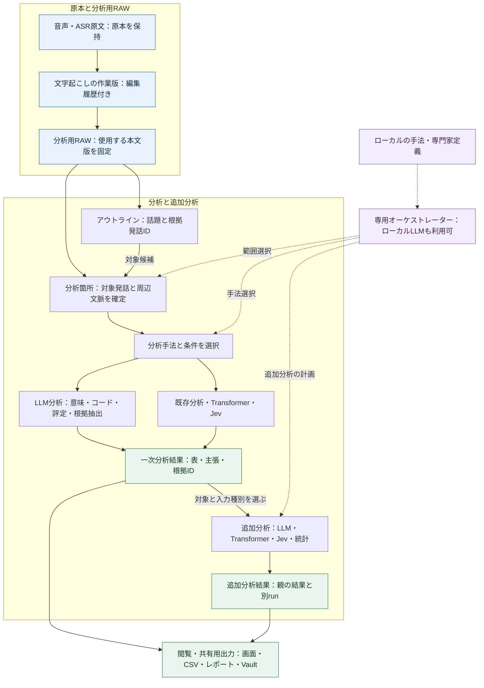

LLM分析はクラウド／ローカルのどちらでも同じ結果契約を使う。図の分岐は選択した分析だけを実行する意味であり、全エンジンの一斉実行ではない。

アウトラインは本文の代用品ではなく、分析箇所へ移動する索引・範囲候補として使う。アウトラインを使わず、発話・時間帯・話者・コードから直接範囲を指定する経路も残す。

| 要素 | 何を固定するか | 関連付けの規則 |
| --- | --- | --- |
| 文字起こしデータ | 会話ID、本文版、発話ID、話者、時刻、原本参照 | 発話IDは会話ID・本文版と組にする。異なる会話の同名IDを混同しない |
| アウトライン | 議題・要点ID、生成元snapshot、根拠発話ID、生成／手動の区別 | 手動の予定議題と、本文から得た実際の話題を区別。根拠のない旧形式から分析箇所を自動確定しない |
| 分析箇所（AnalysisScope） | 対象の発話ID集合、周辺文脈ID、除外ID・理由、分析単位、選択規則と版 | 時刻は表示・範囲指定の補助。実行時にID集合を確定し、周辺文脈を集計母数へ混ぜない |
| 分析手法 | method ID、手法版、適用条件、入力種別、パラメーター | 同じ範囲へ複数手法を適用可能。手法と実行エンジン・モデルは別に選ぶ |
| 分析結果 | run ID、行／主張ID、入力参照、根拠、出力schema、限界 | どの本文版・分析箇所から得た結果かを辿れる形で固定 |

例：アウトラインの「料金」の根拠が発話u12〜u19なら、対象をu12〜u19、文脈をu10〜u11・u20〜u21として保存する。分析者が対象をu14〜u17へ狭めた場合は、その選択を別scopeとして残す。重なるアウトラインを結合する際は発話IDを重複排除し、集計母数と選択理由を記録する。

### 図2：分析結果からTransformer・Jevへつなぐ2経路

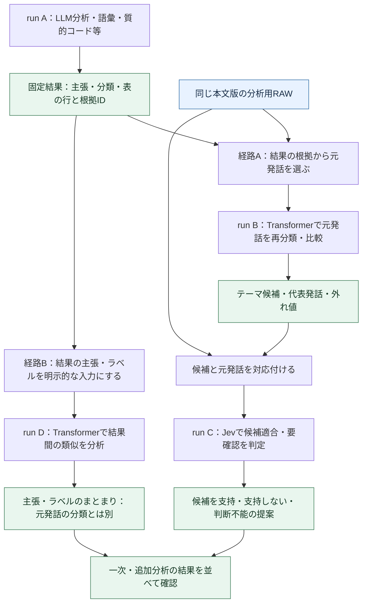

- **経路A：元発話の再分析。** 一次結果は対象選択や候補定義の材料になる。Transformerへ渡す本文は保存時点のRAWから取得する。結果の要約文を元発話の代わりに使わない。
- **経路B：結果そのものの分析。** 入力単位は主張・分類・テーマ・結果行であり、発話ではない。`input_kind=analysis_result`として明示し、親artifactと行／主張IDを保持する。結果間の類似を、人間の発話の一致率・合意率として表示しない。
- LLMも両経路で分析を担当できる。元発話の意味・コード・評定を分析する場合と、既存の主張・分類を比較して根拠付きの整理案を作る場合を分け、入力種別を記録する。LLM出力の任意の文章から無定義に数値を抜かず、統計に使う値は図5のカラム契約に従って生成する。
- Jevによる追加判定は、候補と根拠を組にした専用の質問契約を追加する。現在のASR修正要否の質問を使い回さない。判断不能・根拠不足を保持し、推論結果を研究上の確定事項にしない。
- 追加分析は必要な経路だけを実行できる。A→B→Cを必須の直列処理にせず、A→C、A→B、複数の一次結果→Dも許可した計画で選べる。図のJev工程はクラウド利用が許可された場合だけ実行する。
- 既存Transformerは発話の時刻・話者を前提にする。経路Bではその関数へ架空の時刻・話者を補って渡さず、埋め込み等の純粋な計算を再利用する結果文用adapterを追加する。発話量・時間構造・話者統計は結果文に対して計算しない。

**現行と拡張の境界：** 現在は発話分類が保存済みTransformer結果を併記でき、Jevは原文の修正要否と発話分類を扱う。任意の結果を入力にする追加分析、親子runの依存管理、上記の候補適合判定は新規拡張である。

手法間の接続例（必須の一本道ではない）：

| 前の分析 | 次に渡すもの | 続く分析 |
| --- | --- | --- |
| 語彙頻度・共起 | 語・関連語・根拠発話ID | KWICで文脈確認→コード候補の検討 |
| 質的コード・KWIC | コードが付いた発話と元本文 | Transformerで類似・外れ値を探索 |
| Transformerテーマ | 候補ラベル・代表発話・根拠 | Jevで候補への適合／判断不能を提案 |
| Jev・手動の発話分類 | 出所別の分類値と発話ID | 属性別のクロス集計・結果間の不一致比較 |
| LLMのコード・評定 | 定義済みコードの値、尺度付き評定、根拠、未判定理由 | 型付きカラム→分析単位へ集約→統計エンジン |
| 複数の分析見解 | 主張テキスト・結果行ID・元の根拠 | 結果文用Transformerで主張を整理→根拠へ戻って確認 |

自動分類と手動確定値を同じ列に混ぜず、統計の母数・分析単位・手法の前提を次段でも検証する。

### 分析同士のつながりは、実行依存と意味上の関連を分ける

| 関係 | 例 | 実行・保存上の扱い |
| --- | --- | --- |
| 実データの入力依存 | 親結果の行をTransformerでまとめる | `data_input`。親run・artifact・hash・行IDと子runを結ぶ |
| 根拠・範囲の依存 | 親の外れ値を選び、元発話へJevをかける | `selection_basis`／`evidence_context`。選択元の結果とRAWの両方を入力参照に残す |
| 条件の依存 | 親結果の候補ラベルを次の分類に使う | `parameter_source`。候補の内容と版を固定し、元結果の変更から切り離す |
| 同じ対象の別手法 | 同じscopeの語彙分析と参加バランス | 共通scopeで結ぶ。片方の完了をもう片方の前提にしない |
| 結果間の意味的関連 | 類似、支持、反証候補、不一致 | relationと根拠・判定者・版を持つ派生結果。意味リンクだけでは自動再実行しない |

追加分析の実行依存は循環しない有向グラフ（DAG）とする。親の確定済みartifactを参照し、子は別runで保存する。再評価が必要なら新しい計画版・子runを作り、過去のrunへ逆向きの依存を追加しない。

最小の関連契約は`pipeline_id`、`plan_version`、`step_id`、`input_bindings[]`、`scope_id`、`input_kind`、親run／artifact ID・hash、根拠IDとする。scope・計画・結果入力は既存保存基盤で扱う版付きJSONに置き、全関係を最初から新しいSQLテーブルへ正規化しない。manifest／payloadの版更新と旧形式の読取をセットで実装する。

現在版から見たstaleは、RAW・scope・条件・知識版の変更を依存する子へ伝える。無関係な枝を再実行せず、固定された過去の入力・結果は保持する。親失敗時は依存する子を待機／実行不可にし、独立した枝の結果を捨てない。削除時も参照先を無言で現在版へ差し替えない。

#### 計画案から確定入力への変換（FLOW-1で追加）

`input_refs`は計画時の参照、`input_bindings`は実行直前に解決・検証した固定入力とする。`scope_ref`は版付きscopeのIDとhashを指し、実行時の`scope_id`・`scope_hash`へ対応付ける。計画JSONは`plan_schema_version`、保存manifestは`schema_version`を持ち、計画内容の更新回数`plan_version`とは区別する。

| 計画時の参照 | 実行時の解決 | 拒否する条件 |
| --- | --- | --- |
| 保存済みの`run_id`・`artifact_id`・`sha256` | 台帳から同じ親runの確定済みartifactを読み、hash・kind・schema・単位を検証 | 親の不一致、未確定、参照欠落、hash不一致、未対応の型 |
| 同じ計画の`from_step`・`output_name` | 登録済み出力名を、その段階が確定したrun・artifact・hashへ置換 | 未知の段階・出力名、循環、親失敗、必要出力の欠落 |
| `row_ids`・選択規則 | 親artifact内のIDへ解決し、重複排除・順序規則を含め固定 | 存在しない行、別artifactのID、表示の上位件数を暗黙に全件扱い |

各参照は一意な`binding_id`と関係の役割（`data_input`／`selection_basis`／`evidence_context`／`parameter_source`）を持つ。同一計画内の`from_step`から必要な依存をコードで導出し、提案の`depends_on`と一致しなければ拒否する。既に確定した過去runは入力として照合するが、現在の計画内の実行待ちには含めない。LLMが渡したパス、現在版への差し替え、型の暗黙変換を解決方法にしない。

以下は、既存の主張集合を新しい1段階の分析へ渡す対応例。IDと`<…>`のhashは説明用で、実行可能な要求ではない。結果文用adapterの実装・能力確認が完了するまで、この計画は利用不可とする。

```yaml
plan:
  plan_schema_version: 1
  pipeline_id: example-pipeline
  plan_version: 1
  steps:
    - step_id: group_claims
      method_id: transformer_topics
      task: cluster_result_text
      scope_ref: {id: scope-a, sha256: "<scopeのhash>"}
      input_refs:
        - binding_id: claims
          role: data_input
          source: {run_id: parent-run, artifact_id: parent-claims, sha256: "<親artifactのhash>"}
          row_ids: [claim-1, claim-2]
      depends_on: []
      parameters: {adapter_id: result_text_transformer, adapter_version: 1}
resolved_step:
  step_id: group_claims
  scope_id: scope-a
  scope_hash: "<scopeのhash>"
  input_bindings:
    - binding_id: claims
      role: data_input
      input_kind: analysis_result
      run_id: parent-run
      artifact_id: parent-claims
      sha256: "<親artifactのhash>"
      artifact_schema_version: 1
      unit_kind: claim
      row_ids: [claim-1, claim-2]
manifest_extension:
  pipeline_id: example-pipeline
  plan_version: 1
  plan_hash: "<確定した計画JSONのhash>"
  pipeline_request_id: pipeline-request-a
  step_id: group_claims
  attempt_id: attempt-a
  request_id: step-request-a
  analysis_id: child-run
  parameters_ref: {artifact_id: child-parameters, sha256: "<parameters.jsonのhash>"}
```

`parameters.json`には`resolved_step`、実際のengine・モデル・契約版・知識packetの参照を保存し、manifestからhash付きで辿る。同計画内の親を選ぶ例では`source`を`{from_step: extract_claims, output_name: claims}`、`depends_on`を`[extract_claims]`に替え、親の確定後に同じ`input_bindings`形式へ解決する。計画案は書き換えず、解決済み入力を別の記録として固定する。

#### 再送・再利用・新規実行の識別（FLOW-1で追加）

現行の`AnalysisStore.save`は`ai_finishing`・`ai_insights`以外でfingerprintが一致する完了runを再利用する。provider・model・結果本文は単独ではこの識別に入らない。新しい実行種類をそのまま追加すると別の結果を過去runへまとめるため、拡張時に以下の規則を導入する。構造再編だけでは既存種類の識別を変更しない。

| 操作 | IDと保存の規則 | AI・分析の扱い |
| --- | --- | --- |
| 同じ要求の再送 | 同じ`request_id`と同じ固定入力は同じ試行・run。同じIDを別入力へ使えば競合 | 受付・実行前にも重複を排除し、保存時の重複排除だけに頼らない |
| 保存・Vault公開の再試行 | 同じrunと保存済みパッケージを使う | 追加呼び出しなし |
| 既存結果の利用 | `reuse_run_id`とartifact・hashを明示して参照する。新しく計算した結果として記録しない | 追加呼び出しなし。入力・契約・能力の適合を検証 |
| 明示的な再分析・モデル変更 | 新しい`request_id`・`attempt_id`・run。同じ入力条件でも別実行 | 新しい結果を計算し、内容が同じでも履歴を統合しない |
| 失敗段階の推論再試行 | 新しい試行を作り、元の試行と理由を結ぶ。確定済み親runは保持 | 失敗段階だけ実行。結果の再利用と区別 |

入力の同一性を表すfingerprintと実行の同一性を分ける。拡張のfingerprintにはschema版、scopeのhash、全bindingの役割・親ID／hash・行集合、手法／契約／adapter版、実行engine・要求model／取得可能なrevision、seed等の実効設定、固定した知識packetのhashを含める。canonical化と行集合の順序規則も版付きで定める。応答で初めて判明するmodel・usageは結果来歴であり、受付済み要求の識別を後から変えない。

新しい実行種類には明示的な再利用規則を与え、未知のkindに既存のfingerprint再利用を自動適用しない。旧runのID・hashは再生成せず、新旧の識別方式をmanifest版で区別する。受け入れ条件は、同一要求の重複実行0件、別要求の再分析は別run、モデル・親artifact・契約の違いを識別、保存再試行の推論0件である。

#### 段階実行の状態と再開（FLOW-1〜2で追加）

`analysis_pending_packages`は計算済み結果の保存回復専用とする。計画の実行待ち・推論中・取消をここへ混ぜない。追加分析の受付・状態は既存`library.sqlite3`へ必要な2種類の記録を追加し、既存ジョブを統合する汎用ジョブ基盤にはしない。

| 正本 | 最小の記録 | 所有者 |
| --- | --- | --- |
| `analysis_pipeline_requests`（提案） | 要求ID、pipeline ID・計画版・固定計画JSON／hash、送信方針・予算、状態、取消要求、更新版 | 計画を実行するHandler。計画・設定は受付後に不変 |
| `analysis_step_attempts`（提案） | pipeline要求ID、step ID、試行ID・番号、一意なrequest ID、固定binding／設定、状態、結果run、実試行数・usage・失敗理由 | 段階の実行Handler。`pipeline要求ID＋step ID＋試行番号`も一意 |
| 既存のrun・artifact・保留パッケージ | 確定結果と保存途中の回復情報 | `AnalysisStore`。計画完了まで保存を遅らせない |

FLOW-1は受付・固定入力・重複防止・結果runとの対応まで、FLOW-2は非同期実行・取消・回復まで同じ記録を拡張する。DB追加は版付き拡張の変更で行い、既存テーブル・旧runの意味を変更しない。変更可能な状態はSQLiteに置き、確定済みmanifestを進捗更新のたびに書き換えない。

各試行は`waiting → ready → running → completed / failed / cancelled / interrupted`を基本とする。親が失敗・取消になった子は理由付き`blocked`とし、独立した枝の確定結果は保持する。`completed`は結果runの保存確定後とし、Vault公開失敗、結果のpartial、現在版から見たstaleは別軸で扱う。状態更新は期待状態・更新版を照合する条件付き更新で行い、同じ試行を複数のworkerが取得しない。

- 取消は永続の取消要求とプロセス内eventへ伝え、新しい段階・バッチの開始を止める。既に確定した結果を削除せず、戻ってきた応答を別要求へ適用しない。
- 再起動後の自動推論再開は初期対象外。起動時は残った`running`を`interrupted`として確認し、利用者が再開する場合だけ、親hash・入力・能力・送信方針・残り予算を検証する。設定変更を再開中の要求へ混入させない。
- 結果保存後・試行完了記録前に停止した場合は、試行のrequest IDに対応する完了runへ結び直す。保留パッケージがあれば保存だけを回復する。再計算しない。
- providerへ到達したか不明なタイムアウト、応答取得後・保存前の停止は、その事実を残す。同じ試行を成功と推測したり自動再送したりせず、明示的な再実行で新試行を作る。使用量不明を0として予算をリセットしない。
- 回数・時間・tokensの予算は試行をまたいで計画要求へ集約し、再開・JSON修復・相談にも適用する。固定入力や方針を変える場合は新しい計画要求とする。

検証には二重受付、同一段階の同時取得、親失敗と独立枝、取消と完了の競合、保存確定直後の停止、応答不明、再起動後の明示再開を含める。一時ファイルSQLiteとスタブを使い、プロセス再起動を含む回復は`:memory:`だけで代用しない。

### 図3：専用オーケストレーターの介入とローカルLLM

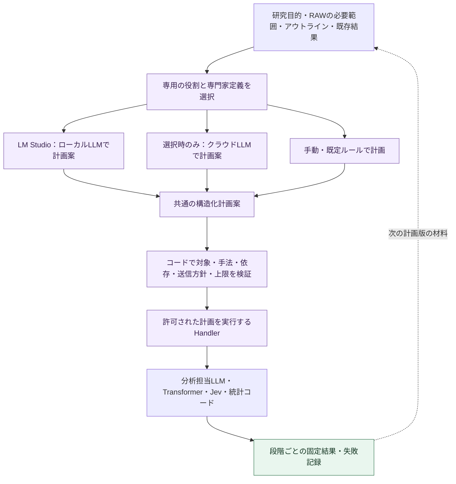

この図の点線は次の計画作成へのフィードバックであり、保存済みrun間の循環依存ではない。

| 専用の役割 | 介入する場所 | 返す案 |
| --- | --- | --- |
| 分析箇所担当 | 文字起こし・アウトライン→scope | 対象ID、必要文脈、除外理由、選択の根拠 |
| 分析手法担当 | scope・研究目的→分析計画 | 手法ID、順序、適用条件、必要能力、出力の種類 |
| LLM分析専用オーケストレーター | 分析目的→手法別契約→LLM／Jevの実行→後続への引渡し | 図6の相談を統括し、質問・尺度・出力型・実行先・試行・再利用条件を固定する |
| 追加分析担当 | 一次結果→次の計画 | 入力にする結果／根拠、Transformer・Jev等の用途、停止理由 |

「専用」は役割別の入力・指示・出力契約を意味する。同じローカルLLMを順番に利用でき、役割数と同数のモデルや常駐エージェントを必須にしない。手法の専門家定義は既存`ExpertCatalog`から読む。現行コードは定義参照のみで、疑似人格の相談は図6で追加する機能である。LLMに渡してよい段階は手法のAI補助制約にも従い、相談を理由に禁止段階を許可へ変えない。

**計画担当LLMと分析担当LLMは別の呼び出しとして扱う。** 前者は対象・順序・手法を提案し、後者は指定されたRAWまたは分析結果から意味・コード・評定・根拠を生成する。同じmodelを共有できるが、プロンプト版・入力・usage・結果・取消状態を混ぜない。統計量とp値は統計コードで計算する。

計画案は`steps[]`に`step_id`、`task`、`method_id`、`input_refs`、`scope_ref`、`depends_on`、`parameters`、必要能力、選択理由を持つ。実行先は利用者の設定と能力検証で解決し、LLMにURL・資格情報・任意の実行コードを決めさせない。計画の品質確認と実行許可はコード・利用者の設定が担う。

ローカルLLMでもクラウドLLMでも同じschemaで検証する。不正な手法、存在しない根拠、循環、過大な入力、送信方針違反は実行前に拒否する。JSON修復は設定した少数回の範囲に限り、解決しなければ手動／既定計画へ戻れるようにする。ローカル失敗を理由にクラウドへ切り替えない。

利用者が指定した対象・許可手法・送信先・回数／時間／追加分析深度の範囲内では、事前に許可された段階を連続実行できる。追加案がその範囲を超える場合だけ新しい計画として提示する。各段階は実行理由を残し、「追加分析不要」「根拠不足」「上限到達」を停止条件にする。結果が返るたびに無制限に再計画しない。

ローカルだけの構成は**ローカルLLMの計画・分析・カラム生成＋既存の分析／統計コード＋ローカルTransformer**で成立する。Jev相当の判定をローカル生成モデルへ実装する場合は別engine・別の質問版・評価結果として記録し、Jevを実行したとは表示しない。Jevは必須依存にしない。

### 図4：分析用RAWと出力データの明確な分離

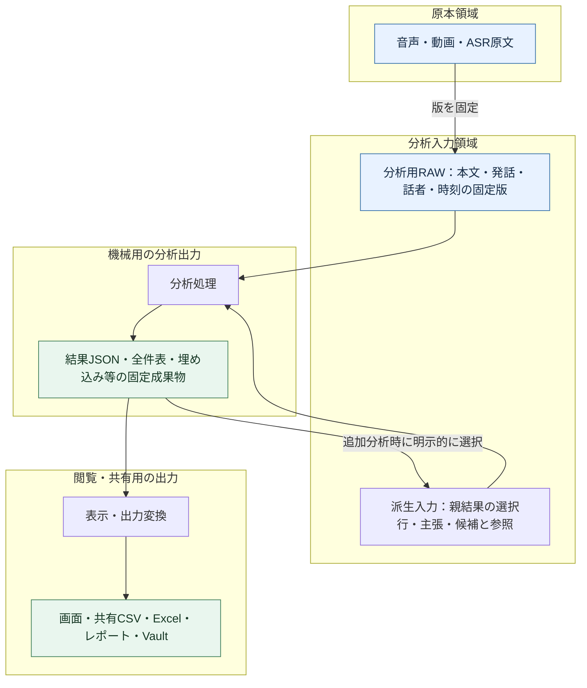

図の結果→派生入力は、新しい子run用の入力作成を示す。元のRAWや親結果へ書き戻す処理ではない。

| 区分 | 内容 | 書込・再利用の境界 |
| --- | --- | --- |
| 原本RAW | 音声・ASR原文・取り込み元 | 保存済み原本を上書きせず、手動編集は別の本文版へ |
| 分析用RAW | 分析する本文版と必要な発話属性。AnalysisScopeはその参照集合 | 「RAW」は分析開始時の固定入力という意味。無加工の音声とは区別し、AIの要約・推測値を混入させない |
| 派生入力 | 再利用する固定分析結果と選択条件、必要なら固定した抜粋 | `input_kind=analysis_result`等で明示。元データと同じ扱いにしない |
| 分析出力 | 結果・主張・統計表・埋め込み・評価と根拠 | 後続分析が参照可能な機械用正本。入力artifactと区別して登録 |
| 閲覧・共有出力 | 表のプレビュー、丸めた値、表示用ラベル、Excel、Markdown等 | 自動で分析入力に戻さない。再取り込みは明示的な新規入力として来歴を付ける |

**物理配置も分ける。** 現行の`analysis_store/inputs/`と`runs/`を利用し、追加分析用入力を導入する段階で`derived_inputs/`を追加する。すべて同じ`AnalysisStore`の管理下に置き、独立した保存基盤は作らない。

現行の`archive_snapshot`は本文だけでなく条件・注釈・準備情報・話者集計も含む。既存JSON全体を無加工のRAWと呼び替えない。新しい入力契約では本文・属性のRAW部分、選択条件、手動注釈、派生値をschemaで分け、旧snapshotからは必要な項目だけを読む互換mapperを設ける。

```text
<data>/analysis_store/
  inputs/<snapshot_id>/input.json          # 既存：分析用RAWの固定snapshot
  derived_inputs/<packet_id>/input.json    # 提案：親結果を参照する追加分析入力
  runs/<run_id>/
    manifest.json                         # artifactの役割・版・依存先
    parameters.json                       # scope・手法・実行条件の参照
    result.json                           # 機械用の分析出力。既存結果の型付き値もここから取得
    tables/*.json                         # 提案：結果JSONに未収録の全件表。型・欠測理由を保持
    tables/*.csv                          # 既存：表計算ソフト向けの全件出力。無損失の読戻しは保証しない
    exports/                              # 提案：保存が必要な閲覧・共有用出力
```

- 新しいmanifestでは`analysis_raw`／`derived_input`／`analysis_result`／`presentation`の役割とschemaを記録する。JSONやCSVという拡張子だけで分類しない。snapshotやartifactはIDとhashで解決し、LLMにファイルパスを探索させない。
- 派生入力は親artifactと行IDの参照を基本にし、巨大な結果やRAWを複製しない。再現に必要な変換・抜粋を実体保存した場合は、それ自体のhashと変換版も持たせる。
- 表示の丸め、並び替え、切り詰めは出力側で行う。追加分析は全件の機械用成果物を読み、画面プレビューやMarkdown表を解析しない。
- 現行の`csv_bytes`は`null`と空文字を同じ空欄にし、`=`・`+`・`-`・`@`で始まる文字列に数式対策の`'`を付ける。`=A`と元から`'=A`の値は同じCSV値になり得る。CSVに全行があることと、型・欠測・元文字列を無損失で復元できることを区別する。
- FLOW-1以降の後続分析は、既存`result.json`の型付き値を優先する。全件がそこにない表だけ、schema版・列の型・安定した行ID・`null`と欠測理由を持つ`tables/*.json`を追加する。既存CSVだけから安全に復元できない値は「復元不可」とし、空欄の意味や先頭の`'`を推測で戻さない。CSVの数式対策は維持する。
- 新しいCSVは型付き正本から作る閲覧・共有出力として役割を記録する。旧CSVの役割・hash・内容は後付け変更せず、旧reader／互換mapperが用途と制約を示す。`null`・空文字・0・数式風文字列・元からの`'`を区別した型付き正本の往復を検証する。
- 現行の`output/`やVault、既存runは移動しない。新しい`exports/`は追加分析の共有用成果物が必要な場合にだけ作る。既存CSVをダウンロードする場合はコピーを作らず、全件の表計算用出力とその読戻し制約を表示する。
- 原文の編集権限、RAW読取、派生結果の作成、共有出力の生成を操作として区別する。出力削除・再生成でRAWや親runを削除しない。共有出力はRAWと異なる公開範囲を持てるが、除外・匿名化は明示した出力変換で行う。
- 追加分析が本文以外の結果を扱う場合、その結果行を既存の`library_items`の発話として保存しない。実装時は[[30-Data/analysis-storage-v1]]を基に版付き拡張を定め、旧manifestと新manifestを読み分ける。旧成果物のhashや意味を後付けで変更しない。

### 図5：LLM・Transformer・Jevのカラム生成から統計分析へ

**現状の結論：カラム化と一部の集計・検定は実装済みだが、任意の生成カラムを型付きデータセットにまとめて統計へ渡す共通経路は未実装。** LLMの分析と変数生成を明示的な工程として追加し、既存の[[40-Design/quantification-statistics-plan]]へ接続する。

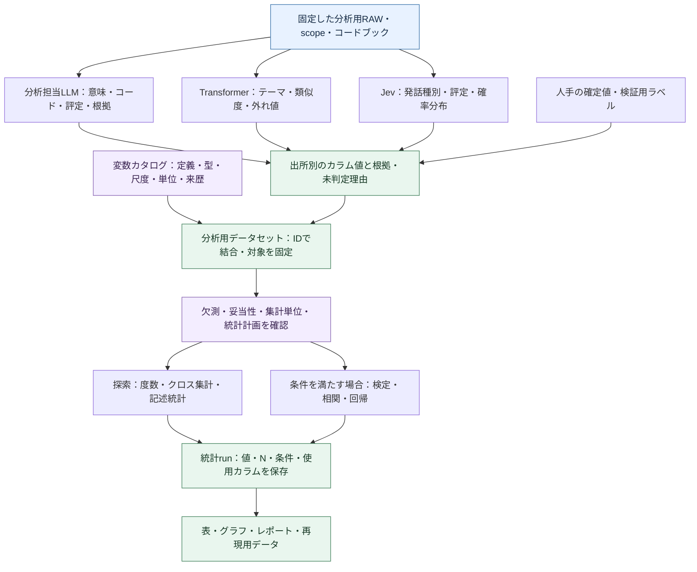

この図は目標設計。Jevは選択時だけ実行し、ローカルLLM・Transformer・手動値だけでもデータセットを作れる。数値計算はコードが行い、統計の再実行や出力のたびにLLMを呼ばない。

#### 現行コードでできること・不足していること

| 機能 | 現状 | 確認した実装 |
| --- | --- | --- |
| 一般のLLMによる分析見解 | 実装済み。根拠発話に基づく主張を生成・検証・保存する。一般のLLMによる任意の変数・評定の生成とは別 | `analysis_insights.create_ai_insights`、`validate_findings`、`app.call_ai_json` |
| Jevの判定をカラム化 | 実装済み。発話種別、テーマ候補、重要度・要確認度・機密らしさ、confidence等 | `segment_classification.classify_with_jev`、`classification_rows` |
| Transformer結果をカラム化 | 実装済み。テーマ、類似度、margin、外れ値などを発話IDに対応付ける | `transformer_analysis`、`segment_classification.transformer_proposals`／`classification_rows` |
| 分類結果の組合せ集計 | 実装済み。Transformer話題×Jev発話種別、手動コード×Jev発話種別、手動／ルールとの分類比較等の件数 | `segment_classification.crosstab_rows`。この関数は件数を数え、p値は計算しない |
| Transformer関連の検定 | 一部実装済み。相づち関連の分布に限定したカイ二乗・CramérのV・期待度数の注記 | `transformer_analysis._backchannel_test`。任意のTransformer列を選ぶ汎用検定ではない |
| 一般の統計処理 | 既存の固定数値変数、手動コード・質問候補・指定語について実装済み。生成列を任意選択する入口はない | `research_analysis._segment_dataset`、`NUMERIC_VARIABLES`、`_statistics_analysis` |
| 生成カラム→任意の検定・相関・回帰 | 未実装。変数カタログ、型付き結合データ、集約・検証状態、汎用列選択の接続が必要 | [[40-Design/quantification-statistics-plan]]の提案範囲。CSVへ出せることとアプリ内で統計へ接続済みであることを区別 |

現在の`segment_classification`の**`llm_*`列はJevが生成した値**である。OpenAI／Google／LM Studioで作った同等の変数が既に入るという意味ではない。既存CSV名は互換維持し、新しい変数カタログで`engine=typesafe`と明示する。一般のLLM列を追加するときに、既存のJev値を上書きしない。

2026-09-20の確認では、分類の値・カラム・クロス集計に関する既存4テストと、Transformer相づちの検定・効果量に関する1テストが成功した。Jevはスタブであり、実モデルの分析精度や未実装の汎用統計接続を検証したものではない。

#### LLMにも分析とデータ作成を担当させる

| 分析担当LLMの仕事 | 出力 | 統計へ渡す条件 |
| --- | --- | --- |
| 意味・論点・立場・理由の分析 | 主張ID、説明、根拠発話ID、引用、限界 | 文章のまま保存する経路を持つ。統計変数として使う場合は定義されたコード・尺度へ対応付ける |
| 定義済みコードの判定 | 発話×コードの有無・未判定、根拠、model・定義版 | 列定義に合う値だけ受け付ける。新しいコード案は検討用に保存し、採用・定義されるまで確定変数にしない |
| 定義済み尺度の評定 | 例：理由の具体性1〜5と根拠・未判定理由 | 各段階の意味・例・尺度水準を先に定義。単に数値であることを理由に連続量として扱わない |
| 結果間の比較・追加分析 | 主張／結果行ごとの支持・相違・根拠不足の提案 | 発話単位の列と分け、主張／結果行を単位にしたデータセットを使う |

分析用モデルは計画担当とは別に選択・固定できる。同じローカルLLMを兼用してもよい。既存の`create_ai_insights`の根拠ID検証、分割、上限付き再試行を再利用し、分析タスクに応じたschemaを追加する。自由形式の文章を後から推測でカラムへ変換する方式を標準にしない。

#### カラムとデータセットの最小契約

| 管理対象 | 必要な情報 |
| --- | --- |
| 行キー | `conversation_id`、本文版、`segment_id`。主張・結果行の場合は`run_id`＋`row_id`と`unit_kind`を使い、発話行と混在させない |
| 変数カタログ | 安定したvariable ID、表示名、意味、型、許容値、尺度、単位、集約規則、欠測規則、定義版 |
| 各値の来歴 | 出所（manual／rule／generative_llm／transformer／jev）、親run・artifact、model、prompt／schema版、入力hash、根拠、検証状態 |
| 未判定 | `null`と理由。未実行、失敗、対象外、根拠不足を0や「なし」へ置換しない |
| 確定データセット | dataset ID・版、採用した列と生成run、行キー、対象・除外・欠測、集約の単位・分母、内容hash |
| 統計run | 使用dataset ID・hash、変数ID、解析計画、使用行、N、計算方法・版、結果と前提注記 |

例（架空のデータ。`jev_*`は新しいカタログでの表示上の出所名）：

| 発話キー | `llm_stance` | `llm_reason_specificity` | `transformer_topic_id` | `jev_dialogue_act` | `jev_review_score` |
| --- | --- | --- | --- | --- | --- |
| 会話A・版3・u12 | 賛成 | 4 | topic_02 | answer | 20 |
| 会話A・版3・u13 | 留保 | 2 | topic_02 | reservation | 65 |
| 会話A・版3・u14 | null（根拠不足） | null | topic_01 | question | 40 |

この表は分析で生成した派生データであり、RAWの本文列へ書き戻さない。同じ発話からLLM・Transformer・Jevが作った列は横に結合できるが、3つの独立した観測として縦に積んで標本数を増やさない。本文版不一致、重複キー、意図しない多対多結合は拒否する。モデル由来のconfidence、類似度、選別スコアは異なる意味の変数として保持する。

#### 統計分析への接続と実行順序

1. 利用者が定義した分析・変数生成を明示実行し、結果を固定する。既存結果を再利用する場合はそのrunを選ぶ。統計ボタンから暗黙にAIで欠損列を埋めない。
2. 既存の分類JSONの型付き値をadapterで変数カタログへ登録し、一般のLLMで作る列も同じ入口から追加する。CSVしかない場合は図4の読戻し制約を検証し、値を推測で復元しない。SQLテーブルに列を動的追加する方式ではなく、版付きの機械用表とカタログを既存成果物基盤に保存する。
3. [[40-Design/quantification-statistics-plan]]の`variable_catalog`、`stat_utterances`、`stat_speakers`、`stat_participants`、`stat_interviews`を共通設計として利用する。統計の変数台帳やエンジンをもう1つ作らない。
4. 手動の検証サンプルとの一致・群ごとの誤り・欠測を確認する。未検証のAI列は確認的な検定へ自動投入せず、探索用の度数・分布と検証状態を先に表示する。
5. 解析計画に沿って発話／話者／会話等の単位を決める。同一話者の多数の発話を無条件に独立標本として扱わず、既存統計計画の集約・反復データの扱いへ接続する。クラスタリングで作ったラベルと同じ特徴量の差を検定して、独立した仮説の裏付けとはしない。
6. データ型・研究デザイン・前提から、コードが実装済みの統計手法を実行する。未実装の手法は理由付きで利用不可とし、LLMに統計量・p値を生成させない。多重比較、効果量、不確実性等の詳細は統計計画を正本とする。
7. 同じ固定datasetから統計を再実行・出力できるようにする。生成model・定義・入力を変えた場合は新しい列版・dataset版を作り、過去の統計結果は保持する。

着手順は、**既存Jev／Transformer列の取込 → カタログ・結合・探索集計 → 一般LLMの分析／カラム生成 → 検証済み列を使う推測統計**。LLMの根拠付き見解は独立した分析として先に利用でき、統計機能の完成待ちにはしない。回帰や高度な検定をこの設計図の追加だけで実装済みと扱わない。

### 図6：LLM分析専用オーケストレーターと、相談で作る手法別の型

**追加する設計。図6の全体は未実装。** O01の計画候補のみ、ローカルTransformerまたは明示選択したLLMで生成して既存の基礎分析計画に添付できる。以下の役割間相談・型の試行・後続分析への接続は未実装。`method_experts.py`の専門家定義参照と、以下の役割別LLM呼び出しを区別する。疑似人格は実在の専門家ではなく、確認の観点と出力契約を持つアプリ内の役割である。

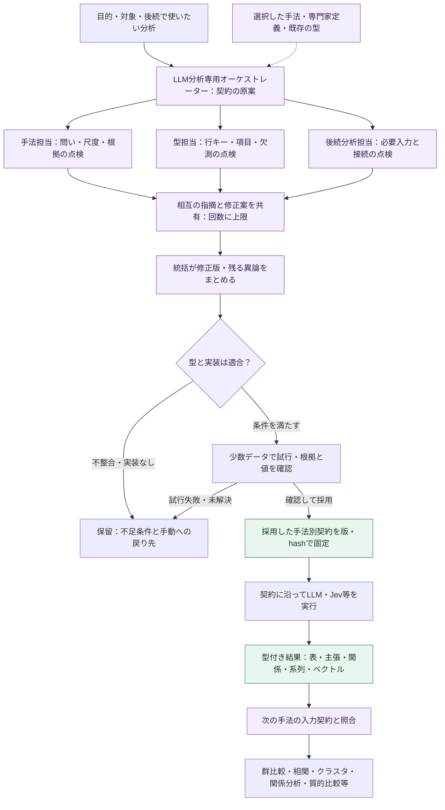

図の試行・本実行は利用者が指定した送信方針と予算の範囲に限る。試行失敗や未解決の必須項目があれば保留し、契約を固定しない。相談のやり直しは新しい案の版として記録し、保存済み分析runの依存グラフには循環を作らない。

#### 相談する役割と、LLM・Jevの使い分け

| 役割 | 確認すること | 返す構造化データ |
| --- | --- | --- |
| LLM分析専用オーケストレーター（統括・提案） | 目的から分析手順を組み、対象、実行先、分割、予算、停止を管理 | 手法別契約案、担当への依頼、採用差分、残る課題、実行計画 |
| 手法担当の疑似人格 | 研究質問、概念・選択肢・尺度、根拠、許可されたAI補助段階 | 適用条件、禁止解釈、修正案、根拠となる定義ID |
| 型担当の疑似人格 | データの単位、キー、型、必須値、欠測、版の互換性 | 入出力schema案、例データ、検証条件、既存型との差分 |
| 後続分析担当の疑似人格 | 次の分析に必要な変数・関係・順序・分母が揃うか | 入力要件、変換・集約案、接続可否、情報損失、代替の手法 |

各役割は同じモデルでも、別のcontext packet・指示・応答・使用量を持つ。相談用入力は目的、型、定義、必要最小限の匿名化した例を中心にする。元発話を読む分析担当への入力は別に選ぶ。全員に原文全文や過去の全議事録を配らない。

LLMは契約案の作成・相談と、確定した契約に沿う意味・根拠抽出を担当する。**Jevは自由な議論役やschema生成役にせず、定義済み選択肢の判定と分布・スコアを担当する。** Jevの質問、選択肢ID、スコア写像、未判定規則は契約の中で固定する。Jevの数値にLLMが後付けした説明を、Jev自身が出した根拠とは表示しない。

共通契約から各engineへの要求は、対応するadapterが作る。生成LLMには対応範囲内の出力schema、JevにはChoice形式を渡し、応答を共通の結果型へ検証付きで写像する。両者に同じJSON schemaをそのまま送る設計にはしない。Jevやローカルモデルが表現できない型は、そのengineでは利用不可とし、勝手に別の実行先へ変えない。

初期の相談は統括＋必要な担当だけで行う。原案→担当の指摘→相互の指摘を踏まえた再確認→統括の修正版を既定とし、修正・再確認は最大2ラウンドの実装上の上限から始める。呼出回数・時間・トークン上限も先に固定し、上限・取消・意見不一致で停止できる。既に採用された同じ契約を使う場合は再相談を省く。

指摘は`issue_id`、対象フィールド、理由、定義／根拠ID、修正案、`blocking`、解決状態を持つ。相互に指摘を参照して回答し、採用しなかった理由も残す。多数決や全員の賛成を、統計的妥当性・独立した査読・実装の存在の証明にしない。重大な異論が残る場合は候補を並べ、既存契約か手動設定へ戻れるようにする。

#### 手法別契約で先に決めること

ここでの「型」はJSONの形だけでなく、**データの意味・単位・根拠・欠測と、次の手法が受け取れる条件**を含む。既存の[[90-Templates/method-registration]]と`analysis_method_registry`の契約を拡張する。新しい独立レジストリや、全手法を包み直すDTOは作らない。

| 契約の部分 | 固定する内容 |
| --- | --- |
| 識別と目的 | `contract_id`・版・hash、既存`method_id`との対応、目的、手法定義・専門家定義の版 |
| 入力 | 許容artifact kind・schema版、単位、必須列、行キー、根拠解決、対象・文脈・除外。実行時にscope・input hashを別のrun bindingで固定 |
| 分析手順 | LLMの指示・出力schema、Jevの質問・選択肢と写像、Transformerの設定、使用可能なengine、分割・再試行・上限 |
| 結果 | 値の意味、型・尺度・許容値、観測単位、主キー・参照キー、未判定理由、根拠、出所、対象と処理済み件数 |
| 次の分析への接続 | 受け側method ID・入力schema、必要な変換・集約・結合、単位・分母、失われる情報、実装能力の要求 |
| 検証 | 構造・値・ID・完全性・手法前提の検証、試行サンプル、期待される失敗、科学的妥当性の確認状態 |

例：発話の立場と理由を取り出す手法の契約案（以下のID・構造は設計例で、実行可能な新APIではない）。

```yaml
contract_id: utterance_stance_reason
contract_version: 1
status: draft
input:
  artifact_kind: analysis_raw
  unit: utterance
  key: [conversation_id, source_revision, segment_id]
output:
  artifact_kind: analysis_result
  shape: observation_table
  key: [conversation_id, source_revision, segment_id]
  fields:
    stance:
      type: string
      scale: nominal
      allowed: [support, oppose, conditional, unclear]
      nullable: true
    reason_specificity:
      type: integer
      scale: ordinal
      range: [1, 5]
      nullable: true
      rubric_ref: reason_specificity_v1
  evidence_required: true
  missing_reason_required_when_null: true
  provenance_required: true
downstream:
  - method_id: descriptive_statistics
    input_shape: observation_table
    column_mapping: [stance, reason_specificity]
    adapter_required: true
```

この案は尺度の定義`reason_specificity_v1`を実際に解決し、入力・出力schema版と全必須項目を埋めるまで採用できない。`unclear`は「有効な材料を読んでも立場が定まらない」という分類値、`null`は未実行・失敗・根拠不足等の欠測として定義を分ける。既存の`descriptive_statistics`がこの任意列をそのまま受け取れるとは限らず、図5のadapterと能力確認が必要である。

#### クロス集計以外へつなぐ結果の形

以下は接続の設計例。既存手法そのものがあっても、生成結果を受け取るadapterまで実装済みとは扱わない。

| 結果の型 | 保存する内容 | 後続分析の候補 | 接続時の確認 |
| --- | --- | --- | --- |
| 観測表 `observation_table` | 発話／話者等のキー、カテゴリ・評定・数値、根拠 | 記述統計、群間比較、相関、条件を満たす回帰 | 尺度・欠測・分析単位・集約と図5の妥当性ゲート |
| 根拠付き主張 `claim_set` | 主張ID、本文、支持・反証の根拠、限界 | 質的比較、反例の整理、結果文の埋め込み・クラスタ | 主張の集合を発話・人数と数え替えない。人の確定コードと区別 |
| 関係表 `relation_graph` | node ID、source／target、関係種別、方向、重み、根拠 | 共起・関係ネットワークの集計、関係の比較 | 関係の意味・重み・重複・自己辺を定義。支持と語の共起を混合しない |
| 順序・時間付きデータ `event_sequence` | 会話ID、順序、時刻、イベント、話者・対象ID | 話者遷移、時間窓別の変化、系列比較 | 時刻・順序・欠区間を維持し、別会話を1系列につながない |
| ベクトル・行列 `embedding_matrix` | 行ID、数値配列、モデル・revision・次元、入力種別 | 類似検索、クラスタリング、次元削減 | 数値は対応するencoder／計算コードが生成。LLMにベクトルを作文させず、異なる空間を混ぜない |

手法によって複数artifactを返してよい。たとえばLLMが主張集合と関係表を作り、Transformerが主張本文を埋め込み、Jevが定義済みの関係候補を判定し、後続が関係ネットワークを集計する。クロス集計を必須の中間成果物にしない。型担当は既存の形を組み合わせることを優先し、必要なものから段階的に増やす。

後続の手法は、kind／schema版だけでなく、単位・意味・キー・必要能力を照合する。変換が必要なら登録済みadapterをDAGの1段階として実行し、親artifact、変換版、入力・出力hash、欠測・件数変化を保存する。自動の文字列→数値変換や、意味の違う同名列の結合はしない。未実装の回帰・系列・グラフ手法は`planned`／`unavailable`とし、型を作っただけで実行可能にはしない。

#### 型の採用・保存・再利用と、増やしすぎない境界

1. **原案を作る：** 既存の型・手法登録票を探し、不足分だけ相談で補う。既存契約と入力要件が一致する場合は、その契約を選ぶ。
2. **コードで検証する：** 宣言的schemaの許可範囲、IDと参照の解決、尺度・根拠・結合、runner／adapterの能力、送信先・予算を検証する。生成したPython・SQL・シェルを実行する仕組みにはしない。
3. **試行する：** 許可された少数データで構造、根拠照合、未判定・部分失敗、後続へ接続できるかを確認する。schemaの検証成功と、科学的妥当性の確認状態は別に保存する。
4. **採用版を固定する：** `draft → schema_valid → pilot_valid → adopted`として契約の状態を管理する。利用者の事前設定内で既存テンプレートのパラメーターを埋める場合は自動採用できる。新しい概念・尺度・コードブック・単位の採用は候補・試行結果を示して研究者が決める。`adopted`は確認的検定への適格性を意味しない。
5. **その版で分析する：** 実行結果から契約・型・知識・モデル・入力の版を辿れるようにする。結果を見て値域・尺度・検定を都合よく変更せず、変更理由を付けた別版・別runにする。
6. **次の分析と再利用する：** 科学的妥当性と受け側の入力条件を別途検証する。再利用の一致条件は契約hash、選択した知識のhash、能力の版。データが変われば適用条件を再確認する。型の必須項目・意味・単位・尺度変更は新しい契約版とし、旧結果を黙って変換しない。

契約案・相談の指摘／応答・試行記録・採用した契約・schemaは既存`AnalysisStore`の版付きartifact／manifestで関連付ける。相談は分析runと分けて識別し、状態・使用量・取消は「段階実行の状態と再開」のSQLite記録を利用する。正本をMarkdownの議事録だけにせず、OrchestratorVaultには既存の生成経路で要約とstable IDを公開する。入力・結果・schemaが未対応の旧readerではその新しい実行種別を利用不可とし、既存runは従来どおり読める互換adapterを維持する。

再利用する役割・手法の定義は既存Software Vaultの登録経路で版管理する。生成案を直接`01-Expert.md`へ上書きしない。PersonaVault（ADR-114）は現状アプリの自動読み書き対象ではない。そこにある人格を使いたい場合は、利用者が選んだ定義だけを登録用候補として取り込み、ID・版・hashを検証する後続機能とする。今回の設計でPersonaVaultの走査・移行・長期記憶の自動更新は追加しない。

表示は図7の分析ワークスペースへ統合し、既存の分析方針／手法別の部品を利用する。「分析を組む」で目的、担当、結果の形式、次に使える分析、相談の異論、試行結果を示す。JSON schemaは詳細表示に留める。既存契約の選択→必要時だけ相談→試行→本実行を辿れ、停止後も既存契約・手動設定へ戻れるようにする。

### 図7：多様な分析を探す・読む・比較するUI

**設計案・未実装。** 2026-09-20に`templates/index.html`、`static/app.js`、`analysis-storage.js`、`interview-comparison.js`（いずれも`src/gurumoji`配下）を読み、既存の[[20-Modules/ui-screens]]と照合した。以下の課題評価はコードの確認に基づき、現行アプリの実データでの操作試験とは区別する。

#### 現行UIの問題と、再利用するもの

| 現状・根拠 | 多様な分析で困ること | 設計変更 |
| --- | --- | --- |
| 主な切替が「自動分析／設定・手動分析／手法別」 | 作業の目的と実装上の分類が混ざり、結果を探す入口が分散する | 「結果を見る／比較する／分析を組む／データ・出力」の4つに整理 |
| 手法別は`methodResultPanels`で全体の描画から対象パネルを抽出 | 1手法を読む入口はあるが、実行版・結果種別を横断して探しにくい。別の結果との関係も分かりにくい | 手法一覧を検索・絞込付きの結果一覧へ拡張し、選んだ実行と成果物を詳細表示 |
| `buildMethodDetail`が説明・専門家情報・複数の結果パネルを縦に並べる | 結果の主表示より説明が先に積み上がる | 結果を中央に置き、条件・担当・限界は見出し付きの詳細へ。重大な問題だけ常時表示 |
| 複数インタビュー比較は1件分析の下部の折りたたみ | 複数会話の比較と、LLM／Jev／Transformerの結果比較を見つけにくい | 「比較する」を主入口にし、結果比較と複数会話比較を区別して選ぶ |
| 保存履歴は別パネル、CSV名など実装上の名称が結果に出る | どの本文版・条件・モデルの結果か、再利用できるかを追いにくい | 結果に実行履歴・版・出所・親結果を結び、列名の日本語表示と意味を付ける |
| `renderAnalysisWorkspace`がPC／モバイル用の内容を両方描画 | 手法が増えるほど表示コストと状態管理が増える | 同じ結果モデルとレスポンシブな表示部品を使い、選択中の結果だけ描画 |

既存の手法別状態API、表・グラフ、根拠リンク、履歴・成果物取得、未保存変更確認は再利用する。手法別UIをもう1系統残して新UIを重ねる方針にはしない。移行中だけ旧表示への戻り口を残し、同等の導線を確認した段階で旧切替を外す。

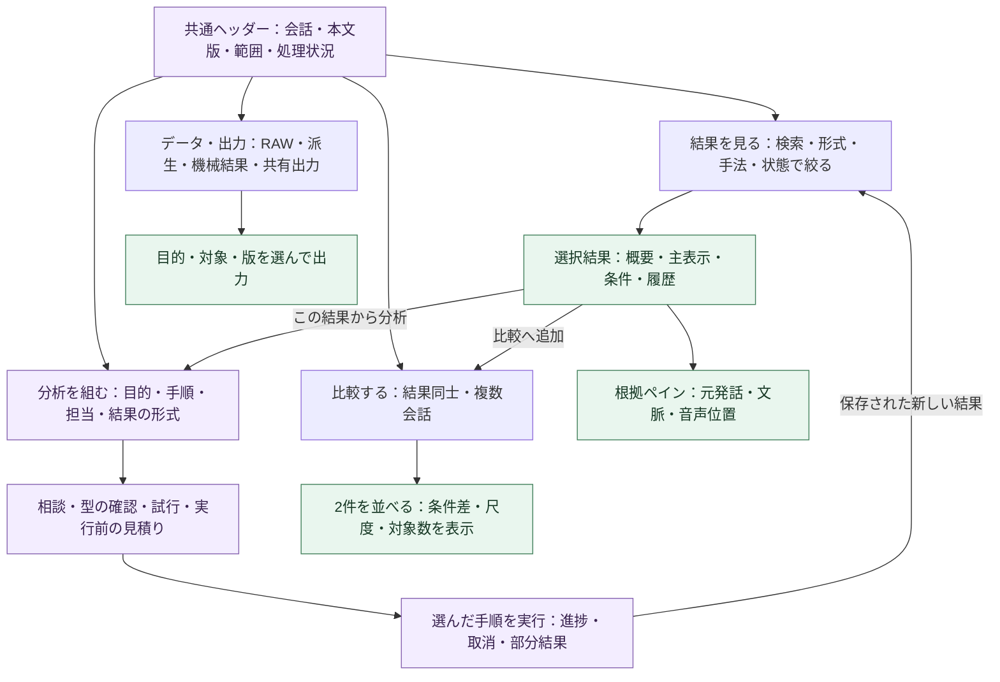

この図は画面遷移であり、分析runの依存グラフではない。画面を開く、検索する、比較へ並べる操作ではAIを実行しない。新しい分析は実行内容を明示した操作で開始する。

#### 画面の骨格と情報の優先順位

上部のアプリ共通ナビと`#/analysis/<id>`の入口を維持し、その中を作業用の4画面へ整理する。対象ヘッダーには会話名、本文版、対象範囲（全体／アウトライン項目／指定発話）、実行中の処理を常時表示する。複数会話では件数と選択内容を示し、単一会話の範囲と混ぜない。

| 領域 | 初期表示 | 操作・詳細 |
| --- | --- | --- |
| 結果一覧 | 名称、手法／実行先、結果形式、対象、更新日時、状態。結果のある項目を優先 | 検索、形式・手法・状態の絞込、実行版の選択、比較へ追加。結果なしの手法は「分析を追加」から探す |
| 結果の詳細 | 何を分析したか、対象件数、主な結果、重大な不足・古い版の表示 | 「結果／条件・履歴」の2面。専門家定義・JSON schemaは詳細内。既定で全手法のグラフを一括描画しない |
| 根拠ペイン | 選択行・主張の根拠発話、前後文脈、本文版、音声位置 | 結果との選択を同期し、閉じても元の行・スクロール位置を保持。編集は既存の文字起こし画面へ移動 |
| 共通の結果操作 | 「比較へ追加」「この結果から分析」「出力」 | 使用runと選択行／全件の違いを明示し、表示の上位件数を分析対象と誤認させない |

PCは「左：結果一覧／中央：選択結果／右：必要時だけ根拠」を基本とする。中幅では根拠を開閉式ペイン、狭い画面では一覧→詳細→根拠の1画面ずつへ切り替える。幅が足りないのに3列を押し込まない。テーブル内の横スクロールは許容するが、画面全体の横スクロールにはしない。表とグラフ、カードと一覧は同じデータを使う。

「実行済み」「一部失敗」「本文変更後」「妥当性未確認」「Vault出力失敗」は別の状態軸で表示する。実行が成功しても分析として確認済みとは表示しない。古い結果は閲覧できるが、次の分析へ使うときは使用版を明示する。フィルターで0件になった状態と、結果がまだない状態を分ける。

#### 結果形式ごとの読み方

| 結果 | 主表示 | 共通操作と個別の補助 |
| --- | --- | --- |
| 観測表・分類・統計 | 意味の分かる列見出し、単位、N、欠測、並べ替え可能な表。適した場合に図 | 列の定義・生成元を開く。検定には効果量・不確実性・前提を併記し、p値だけを強調しない |
| LLMの見解・主張集合 | 主張、根拠件数、反例・限界を並べたカード | 根拠を右に開く。AIの候補と研究者の確定を見た目と状態で分ける |
| 関係・ネットワーク | 関係図と、その元になる関係表 | ノード／関係の選択→根拠。色だけで関係を区別せず、名称・方向・重みを表示 |
| 時系列・遷移 | 時間軸または順序、会話・話者・対象別の帯とイベント表 | 区間選択→元発話。時刻不明・区間欠落を埋めて連続に見せない |
| 埋め込み・クラスタ | クラスタ一覧・代表例・類似候補。必要に応じ2次元図 | モデル・次元削減条件・未割当を表示。2次元上の距離だけで結論を出さず、元の値と根拠を開ける |

型と表示部品の対応は明示し、未知の型はメタデータと機械用ファイルへの入口を表示する。LLMが任意のHTML／JavaScriptを生成して実行する表示基盤は作らない。新しい型は既存の表・カード・図・系列部品で表せるか先に確認する。

#### 分析手法とUIの対応確認（2026-09-20）

**確認結果：分析手法の設計と共通UI案はあるが、手法ごとの設定・検証・結果表示までの対応は不十分だった。以下でセットとして定義する。** 対応表は目標設計の網羅を確認するものであり、全手法の新UIが実装・検証済みという意味ではない。登録21手法は`analysis_method_registry.METHODS`、現行表示は`app.js`、`analysis-content.js`、`interview-comparison.js`と既存画面資料で照合した。

「同じ表を表示できる」だけでは対応済みにしない。たとえば相関と回帰では、入力変数の指定と前提・結果の読み方が異なる。1手法に1画面を新設する必要はなく、**共通ワークスペース＋手法固有の設定・表示部品**で対応する。

##### 現行の登録21手法と、新UIでの受け持ち

各行の設定は「分析を組む」、結果は「結果を見る」、比較は「比較する」、保存・出力は「データ・出力」へ結ぶ。文字起こし編集等は既存画面への往復でよい。下表の「現行」は機能・入口をコードで確認した範囲で、新しい一連の操作の動作保証ではない。

| 手法ID・機能 | 現行の入口・結果 | 必要な設定／操作UI | 結果・根拠のUI | 比較・後続への操作 |
| --- | --- | --- | --- | --- |
| `local_insights` ローカル見解 | 見解パネル | 対象・除外・適用条件の確認 | ルール由来の観察、件数・発話根拠 | 元発話で追加分析、AI見解と出所を分けて比較 |
| `ai_insights` AI見解 | 見解生成・表示 | 研究目的、専門家、実行先・モデル、範囲・上限 | 主張・反例・限界、根拠ペイン、生成候補の状態 | 主張集合を追加分析へ、元発話の再分析と区別 |
| `speaker_characteristics` 話者別特徴語 | 特徴語表示 | 対象話者・比較相手、語の条件 | 特徴語、分母・率差、話者付き文脈検索 | 条件別比較、選択語→KWIC |
| `morphology` 形態素・品詞 | 形態素表・品詞表示 | 解析器・辞書・除外、簡易解析の状態 | 語・品詞・発話位置、本文との対応 | 語彙・共起等へ渡す条件の確認 |
| `syntax` 係り受け | 係り受け表 | 解析器の利用可否、対象文 | 係り元・先・関係、発話本文 | 関係表の選択・出力。一般の主張関係とは分ける |
| `lexical_frequency` 語彙頻度 | 頻度表 | TF／DF、語・品詞・除外条件 | 頻度・分母・条件、語から根拠へ | 選択語の文脈検索・群比較 |
| `cooccurrence` 共起 | 共起図・表 | 単位、語集合、最小件数、重み | 関係図とエッジ表、両語の根拠集合 | 同じ条件の図を比較、選択関係を追加分析へ |
| `transformer_topics` テーマ分析 | Transformer実行・結果 | モデル、テーマ決定法・数、種、除外・未割当条件 | テーマ・代表発話・類似度・外れ値・時間推移・相づち。必要な表示を選択 | テーマ／発話をLLM・Jevへ、条件違いのrun比較 |
| `participation` 参加バランス | 発話量・話者群パネル | 話者・役割・属性群、集計単位・分母 | 量・率・時間帯の図表、対象集合 | 群／会話比較。量を影響力へ読み替えない |
| `conversation_dynamics` 会話構造 | 遷移・無音・重なり表示 | 時間窓、無音・重なり条件、対象話者 | 遷移表・時系列・元音声への参照 | 選択区間で追加分析、条件別比較 |
| `segment_classification` 発話分類 | 手動／ルール／Jev／Transformer比較 | 判定定義、利用するengine、Jev送信方針、人手確認 | 出所別の列・不一致・未判定、根拠 | 変数カタログへ登録、適合する統計へ。既存クロス集計だけに限定しない |
| `descriptive_statistics` 記述統計 | 固定変数の統計表 | 使用列・尺度・分析単位・集約・欠測 | N・欠測・分布・要約値、使用行の確認 | 保存datasetで再計算。生成列選択はFLOW-4で拡張 |
| `group_statistics` 群間比較 | クロス集計・一部の検定 | 結果変数・群・対応有無・単位・計画・補正 | 度数／比較図、検定・効果量・利用可能な不確実性・前提 | 同じ条件の結果比較、利用不可の検定と理由。拡張は統計計画に従う |
| `correlation` 相関 | 固定変数の相関表 | 変数対・尺度・手法・欠測・単位 | 係数表・散布図、N・前提・使用データ | 同じ変数対のrun比較。生成列入力はFLOW-4で拡張 |
| `qualitative_coding` 質的コード | 手動コード・引用・相互作用画面 | コードブック、採用／除外例、付与・修正・保存 | コードと発話、ケース比較表、引用・相互作用・考察 | AI候補の検討、人手確定値の統計・比較への引渡し |
| `audio_emotion` 音声感情推定 | 分布表示、生成は文字起こし側 | 既存生成入口へ移動、モデル・音声範囲・利用可否 | 推定分布・モデル・発話／音声根拠・欠測 | 出所別比較、列を使う条件を確認 |
| `outline` アウトライン | 文字起こし側の作成・編集 | 既存画面で見出し・範囲を確認 | 見出しと発話／時刻参照、計画と実際の対応 | 選択項目→分析scope。新UIで編集画面を複製しない |
| `kwic` 文脈検索 | 自動分析の文脈検索 | 検索語・方式・話者・前後幅 | 全件数・ページ、前後文脈・発話根拠 | 保存検索の再表示、該当発話をscopeへ |
| `ai_finishing` AI仕上げ | 文字起こし側の実行・変更記録 | 既存編集入口へ移動、provider・適用対象を確認 | 変更前後・Jev比較・採用履歴 | 新しい本文版の分析へ。変更案をRAWとして混ぜない |
| `meeting_minutes` 議事録 | 作業画面の議事録 | 既存生成入口、対象会話・生成条件 | 決定・タスク候補・話者活動・根拠 | 独立runの閲覧・出力、主張／元発話の追加分析候補 |
| `interview_comparison` 会話比較 | 下部の複数会話比較 | 会話選択・比較条件の固定 | 会話別の図表・差・制約、各会話と実行へのリンク | 履歴から再表示、複数会話の検定は別の計画へ |

`outline`／`ai_finishing`の編集は別画面、`meeting_minutes`／`interview_comparison`／`segment_classification`は独立runの扱いを維持する。手法別状態一覧だけから対象手法を列挙すると、こうした入口を落とす可能性があるため、全`METHODS`と独立runを合わせて照合する。

##### 新設・拡張する分析と、同時に追加するUI

下表は未実装を含む。IDがあるものは既存の[[40-Design/quantification-statistics-plan]]の提案IDを使い、それ以外は登録時に決める。共通の表／図のモックがあるだけで「手法別UIあり」と数えない。

| 分析・機能 | 設定・実行と同時に必要なUI | 結果・検証と同時に必要なUI | 設計モックの現状／導入先 |
| --- | --- | --- | --- |
| `ai_coding` LLMコード・評定 | コード・尺度の定義、例、対象、モデル、試行／全件の選択 | 候補列と根拠、未判定・人手確認、カタログ登録 | 分類表・根拠の表示例のみ。定義編集と生成は未接続／FLOW-4＋UI-3 |
| `rule_coding` ルール分類 | 辞書・条件・版、試し当て | 一致箇所・適用規則・例外、生成列 | 専用設定は未作成／統計Phase 2＋UI-1・3 |
| `coding_reliability` 妥当性・一致度 | サンプル選択、AIラベルを隠した人手入力、コーダー管理 | 混同行列・一致度・不確実性・群別誤り、ゲートの理由 | 「未検証」表示のみで検証画面は未作成／統計Phase 3と同時 |
| `embedding_classifier` 分類器 | 学習ラベルの選択・版、分割単位、学習／評価の区別、モデル固定 | 評価指標、誤分類・低確信例、学習／検証の出所、確認キュー | クラスタの図は学習UIの代替にならない。専用UI未作成／統計Phase 4 |
| `study_statistics` 複数会話の検定 | 会話集合、目的変数・群・共変量、分析単位・集約、計画固定 | 各群N・欠測・推定・前提、利用不可理由 | 既存の記述的比較から新計画へ接続。専用UI未作成／FLOW-4＋UI-2・3 |
| 回帰・反復／階層データの分析 | 目的変数・説明変数・モデル族、対応／話者／会話の構造、欠測・集約 | 係数・区間・モデル診断・収束状態・使用N。未計算と0を分ける | 変数選択・診断画面は未作成／統計Phase 1b以降。モデル種ごとに実装能力を確認 |
| 主張集合→Transformer／Jevの追加分析 | 結果文か元発話か、親run・選択ID、engineと判定定義 | 群・類似・判定を元の主張と根拠へ対応付ける | 主張・クラスタ表示と計画への移動の例あり。処理は未接続／FLOW-2＋UI-2 |
| 主張関係・ネットワークの追加分析 | 関係の定義・方向・重み・対象、利用可能な指標 | 関係図＋エッジ表・根拠・計算条件 | 関係図の例のみ。一般グラフ分析の設定・計算は未実装／必要なrunner＋UI-4 |
| 系列比較・次元削減などの拡張 | 順序／時間窓、系列境界、モデル・次元・手法条件 | 系列表・比較図／座標と元データ、欠落・変換条件 | 時系列表・架空の配置例のみ。各手法の実行UIは未接続／必要なrunner＋UI-4 |
| `acoustic_features` 音響特徴 | 音声・区間・単位・抽出条件・依存の可否 | 特徴量と時間軸・音声確認、欠測・録音条件 | 専用UI未作成／統計Phase 5＋UI-4 |
| 外部R等による分析 | 入力dataset出力、対象手法・条件、戻り結果の取込・照合 | 入力hash／型の確認、検証済み／未確認、元runへの参照 | 取込画面は未作成／外部adapterとUIを同じ段階で追加 |
| 疑似人格の相談・型の作成（分析を支える機能） | 目的、担当、許可範囲、型の候補、試行・採用・停止 | 指摘と修正・異論・未解決条件、採用版、接続可否 | 相談・型・試行表示の例のみ。FLOW-5とUI-3で同時接続 |

上記の不足UIは導入範囲へ含めるが、すべてを先に作る必要はない。**公開する手法ごとに、処理・保存契約・UI・一連の操作の検証を同じ完了単位にする。** UI-0〜4は共通部品の整備順であり、個別手法のUIを後回しにして手法だけ「利用可能」にする順番ではない。

##### 手法登録にUIの対応を含める

[[90-Templates/method-registration]]に、入口、設定部品、結果表示部品、根拠解決、比較・次の分析、エラーと状態、検証ケースの欄を追加する。手法ID・版、入出力schema版、UIの対応版を結び、旧runの表示可否も確認する。登録票のUI欄は追加設計であり、現行レジストリが既に自動検証するという意味ではない。

LLMが新しい型を提案した場合は、型担当と後続分析担当が、許可された入力部品・表・カード・グラフ等へ対応付ける案も返す。新規HTMLや実行コードは返させない。既存部品で設定・表示・根拠操作を表現できない型は「UI対応待ち」にし、生成したschemaだけで手法を有効化しない。

実装状態は「計算／adapter」「保存・API」「設定・実行UI」「結果・根拠UI」「比較・再利用UI」「一連の操作の検証」で別々に管理する。現行機能・設計済み・モックあり・接続済み・検証済みを混同しない。比較や再利用が適用できない手法は、その理由と利用者が取れる操作を明示すればよい。ファイルを読めるだけの未知の型は「閲覧のみ」として扱う。

**手法を利用可能にする完了条件：** 対象を選ぶ→必要条件を設定→実行（または既存結果の読取／手動登録／外部結果の取込）→失敗・未判定を確認→固定結果を表示→根拠・条件・版を確認→保存済み結果を再表示→出力・適合する次の分析へ渡す、を架空データで通せること。外部送信はスタブで検証し、実モデルの精度検証とは分ける。結果表示だけのモックはこの条件を満たさない。

対応表の機械確認では、現行`METHODS`の全IDが上表に一度ずつ存在すること、統計計画の新設6IDが拡張表にあることを照合する。将来の統合テストでは、手法登録に必須のUI対応がない、未知の表示部品・不適合なschema、実行不可なのに開始できる、表示結果と使用runが違う場合を検出する。無関係な全UIテストの常時実行は要求せず、手法の部品と隣接する操作を対象にする。

今回の機械照合は現行21／21手法、新設6／6 IDで欠落・重複なし。各現行手法に設定・結果／根拠・後続操作の記載があることも確認した。これは設計上の対応確認であり、実アプリの一連の操作や全手法のモック完成を保証するものではない。

#### 比較と追加分析を、その結果から始める

比較は既定2件を並べる。同じ発話のLLM／Jev判定、同じ手法のモデル・条件違い、複数会話の結果を別の比較目的として扱う。各列の上に本文版、対象範囲、単位、尺度、手法・モデル・定義版、N・欠測を表示する。見た目を並べるだけの比較と、同じキーで対応付けた差分計算を区別する。

共通キー・意味・単位が合う場合だけ行対応と差分を表示する。同じ列名だけで減算・統計を実行しない。条件が違う場合も並べて読むことはできるが、差分計算は理由付きで無効化する。追加の集計・検定は「この比較を分析する」から別の計画として作る。複数会話比較は既存の機能と保存runをこの入口へ接続する。

「この結果から分析」は、元発話を再分析する／結果の主張や値を分析する、を意味の分かる言葉で選ぶ。対象が全件か選択行かを表示し、出力型と受け側の必要条件から候補を絞る。利用不可の候補も不足条件を示す。表示用に丸めた値やカード本文を取得せず、固定したartifact・行IDを引き渡す。

#### 分析計画・疑似人格の相談を見せる画面

「分析を組む」は目的を選ぶ／記入する→対象を確認→手法と出力を選ぶ→試行・実行の順。既定は段階のカード一覧で、全体の接続を見たい場合だけフロー図を開く。常に大きなノード編集画面を操作させない。

各カードに「入力」「担当と実行先」「何を出すか」「次の手法」「実行可能性」を示す。相談は結論、変更点、未解決の異論、採用した型を先に表示し、疑似人格の発言履歴は展開式にする。人格チャットを結果の閲覧画面の中心には置かない。利用者が直すのは目的・対象・列の意味などで、通常操作にJSON編集を要求しない。

実行前に段階ごとのローカル／クラウド、対象件数、利用可能なモデル、推定使用量と上限を示す。見積り不能なら不明と表示する。local_onlyではJevの段階を理由付きで無効化する。開始後は固定した計画で進捗・部分失敗・取消を示し、画面移動や別結果の閲覧で計画・対象を変えない。再試行は失敗した段階を選び、既存の親結果を再利用できるか示す。

#### データ・出力と、履歴・戻る操作

データ画面は「分析用RAW」「派生入力」「機械用の分析結果」「閲覧・共有出力」を明確に分け、件数・本文版・出所と関連runを表示する。閲覧・共有出力を次の分析の入力として選択できないようにする。出力は選択結果・比較・計画のどれを出すか選び、表示用の丸めと機械用データの精度を区別する。Vaultへの再公開とAI再実行は別の操作にする。

画面状態は会話／比較対象、画面、run、artifact、選択根拠をIDで復元する。`#/analysis/<id>`に`view`・`run`等を持たせる具体構文はルーター実装時に決め、既存ハッシュと`?item=…&segment=…`の根拠リンクを互換変換する。URLには発話本文や相談内容を入れない。検索・絞込・選択を戻る操作で復元し、未保存の計画と研究者の編集は既存`confirmLeave`相当の保護対象にする。

既存履歴の取得上限を全件数と誤認させず、取得済み範囲を明示する。古い結果まで探すページング・件数はAPIの対応が必要で、画面だけで全履歴検索できるとは扱わない。直接開いたrunが削除・権限不足・未知の型なら理由と一覧への戻り口を示す。

#### UIの導入順序と確認条件

| 段階 | 実装範囲 | 完了条件・依存 |
| --- | --- | --- |
| UI-0：情報構成の整理 | 共通ヘッダー、4つの作業入口、既存手法別・履歴・比較の接続、絞込 | 保存済み結果をAI呼出しなしで開く。対象・版・runを見失わず、旧リンクと未保存確認が動く。構造再編の完了待ちにしない |
| UI-1：結果の詳細と根拠 | 選択結果だけの描画、表／主張カード、根拠ペイン、条件・履歴 | 行→根拠→同じ行に戻れる。PCと狭幅で同じ選択を維持。既存の結果とCSVが一致 |
| UI-2：比較と次の分析 | 2件比較、条件差、適合する追加分析候補、範囲選択 | 単位不一致を差分計算しない。固定runと行IDを次へ渡す。追加分析の実行はFLOW-1／2、生成列の統計はFLOW-4に依存 |
| UI-3：計画と相談 | 型の概要、担当・実行先、試行、相談の結論・異論、進捗・取消 | FLOW-3／5に接続。実装前は利用不可理由を表示。local_only・上限・部分失敗を画面と実行で一致させる |
| UI-4：表示形式を拡充 | 関係図・時系列・クラスタと全件検索・ページング | 各型の実装と必要APIが揃ったものから追加。全形式の完成を前段の公開条件にしない |

画面を作るだけでは不足するAPIは、保存runからの型付き結果読取、ページング、入力契約の適合判定、計画・試行・相談の状態である。既存の手法状態／履歴／成果物APIを拡張し、任意のファイルパス読取や第2の結果保存庫を作らない。旧APIの表示データと保存済みrunのデータを混ぜず、選択したrunの固定結果を表示する。

受け入れシナリオは、①手法名を知らなくても結果形式・目的から結果に到達、②主張の根拠を確認して選択位置へ戻る、③同じ入力の2実行を比較、④異なる尺度の差分計算を拒否、⑤結果から追加分析を作成、⑥クラウド不可の理由を確認、⑦失敗段階のみ再試行、⑧RAWと共有出力の区別、⑨戻る／再読込後の復元と未保存保持。キーボード・フォーカス復帰、色以外の状態表示、320〜390px幅とPC、遅い応答の順序逆転も対象にする。大量結果は一覧と必要範囲のみ取得し、表示切替で全手法の再計算・AI呼出し・二重描画を行わない。

検証の起点は`test_analysis_method_view.py`、`test_ui_defaults.py`、`test_browser_e2e.py`、`test_content_browser.py`と保存・比較の既存テスト。設計モックは検索・形式切替・根拠表示・2件比較・計画への移動・データ区分を架空データで確認するもので、実装の統合試験や実モデルの検証を代替しない。

### 図の実装順序と受け入れ条件

| 段階 | 追加するもの | 完了条件 |
| --- | --- | --- |
| FLOW-0：対象範囲 | アウトライン根拠→AnalysisScope→RAW snapshotの対応 | 対象・文脈・除外・本文版が固定され、同じ発話の重複集計や古い根拠の自動適用がない |
| FLOW-1：結果の接続 | RAW／派生入力／結果／表示出力の役割、型付き正本、参照解決、親子run、版付き依存manifest、段階受付 | 既存runを読める。循環と依存の不一致を拒否。再送・明示再実行・再利用を区別し、親hashと型・欠測を保持 |
| FLOW-2：分析・追加分析 | 一般LLMによる根拠付き分析、経路AのTransformer→Jev、経路Bの結果文分析、段階実行・取消・回復 | 元発話と結果文を区別し、親・根拠・engineを辿れる。部分失敗・応答不明を明示し、再開で確定済み段階を再計算しない |
| FLOW-3：専用オーケストレーター | ローカルLLMを含む共通の計画案schemaとコードによる検証 | 同じ対象・手法制限・予算を守って実行でき、local_onlyではクラウド呼び出しなし。終了条件と手動への戻り先がある |
| FLOW-4：カラムから統計へ | 図5のカラム生成・型付きdataset・妥当性確認を既存の数値化・統計計画へ接続 | 異なる出所の列を区別し、欠測・結合・分析単位を検証。固定データの統計再実行ではAI呼び出し0件 |
| FLOW-5a：専用統括と型の試行 | 図6のLLM分析専用オーケストレーター、既存型からの契約作成・試行・固定 | まず観測表と根拠付き主張で、元発話→分析結果→別の分析の接続を検証。未実装の受け側は利用不可 |
| FLOW-5b：疑似人格の相談 | 統括・手法・型・後続分析担当による上限付き相談 | 相互の指摘、修正、異論、停止を追跡。合意のみで採用せず、同じローカルLLMの役割分担でも動作 |

依存順は`Phase 2＋AI-2 → FLOW-0 → FLOW-1 → FLOW-2 → FLOW-3`を基本とし、FLOW-0のUI・対象選択は先に独立して実装できる。最初は手動で1つの追加分析をつなげて検証し、計画生成の自動化を重ねる。

FLOW-4はFLOW-1の保存・入力境界と統計計画の対応段階に依存する。既存のJev／Transformer列の接続はFLOW-3の自動計画を待たずに進められる。

FLOW-5aはFLOW-1・FLOW-2・AI-2の契約／実行境界を利用する。FLOW-5bはFLOW-5aとFLOW-3の計画検証に接続する。統計列を使う場合だけFLOW-4が必要で、主張集合→Transformer等の追加分析は統計の完成を待たない。まず2種類の結果と1つの接続で確かめ、全種類の型や人格を先に作り込まない。

検証は`test_session_outline.py`、`test_transcript_preparation.py`、`test_analysis_storage.py`、`test_transformer_analysis.py`、`test_segment_classification.py`、`test_jev_review.py`、`test_method_experts.py`を起点にする。新しい境界にはscopeの固定、親子のhash照合、出力をRAWとして拒否する入力検証、DAG循環、部分失敗からの再開、ローカル計画、知識版変更、予算停止を追加する。実Vault・実APIを使わず一時保存先とスタブで確認する。

カラム→統計の境界では、LLM/Jevの出所区別、数値型と尺度の違い、未判定を0にしないこと、異なる本文版の結合拒否、多重ラベルによる行数増加、親列変更時のdataset版更新、統計再実行時のAI未呼び出しを追加検証する。統計量の正しさは既存の統計計画で定めた参照値と照合する。

相談→型→実行の境界では、未知のrunner／adapter、未解決の尺度、単位やschema版の不一致、Jevに非対応の要求、未解決の必須指摘、試行失敗を拒否する。local_onlyで相談・分析・再試行の全段階のクラウド呼出し0件、上限と取消、既存契約の再利用時の相談0件、主張集合と観測表の後続接続、旧契約の読取りをスタブと一時保存先で検証する。相談のテストは相互の指摘が次の応答に渡ることと採用履歴を確認し、モデルが毎回同じ文章を書くことを合否条件にしない。

## 現行システム構成図

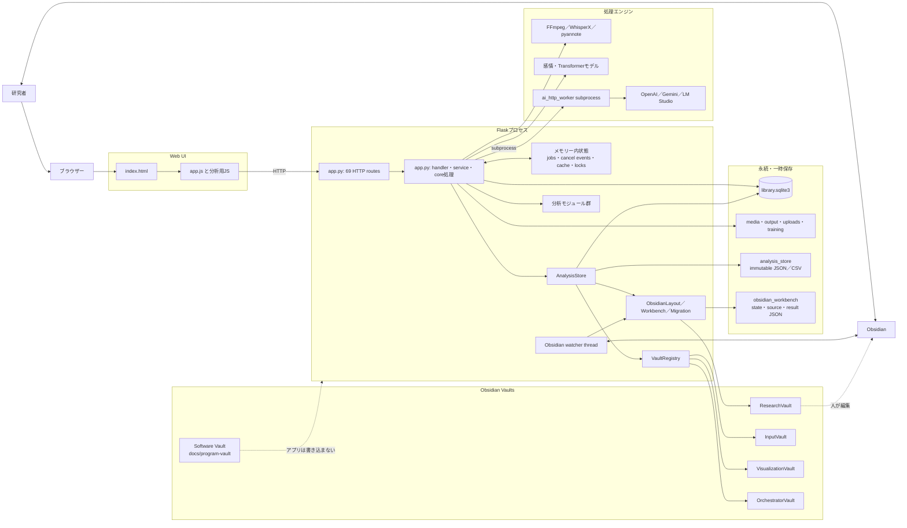

### 現行構成で責務が交差している場所

| 交差 | 現状 | 結果 |
| --- | --- | --- |
| Routingと業務処理 | ルート定義と保存・分析・スレッド起動が同じ`app.py` | HTTPなしのユースケーステストが難しい |
| Coreと保存技術 | `app.py`の処理がSQLite行、ファイルパス、Flask応答を直接扱う | 保存先やUI都合が業務ルールへ入り込む |
| 一時状態 | `jobs`、cancel event、cacheはメモリー、AI要求はSQLite、仕上げは`state.json`、固定保存途中は`analysis_pending_packages` | 「現在の処理状態」を1か所から説明できない |
| 分析の起動 | 分析本体は分割済みだが、集約・状態・保存・API変換は`app.py`に残る | 手法追加時の変更範囲が広い |
| 出力 | 通常出力、固定成果物、ResearchVault、3生成Vault、エクスポートが別経路 | 成功・失敗・再試行状態の集約が難しい |
| 共通処理 | パス検証、原子的書き込み、Markdown処理が`analysis_store`にあり、Obsidian側から上位層を参照する | 関数内importを含む循環依存がある |

## 現行ER図（SQLite）

`library_items`が会話の最新状態をJSON列でまとめて持ち、固定分析は`analysis_runs`を中心に別管理する。図のうち`transcript_versions`、`transcript_preparations`、`transcript_preparation_events`はSQLite外部キーを宣言している。その他の線は、現行コードがIDで維持する論理関係である。図では`TRANSCRIPT_PREPARATION_EVENT`、`OBSIDIAN_NOTES`がそれぞれ実テーブル`transcript_preparation_events`、`obsidian_notes`に対応する。

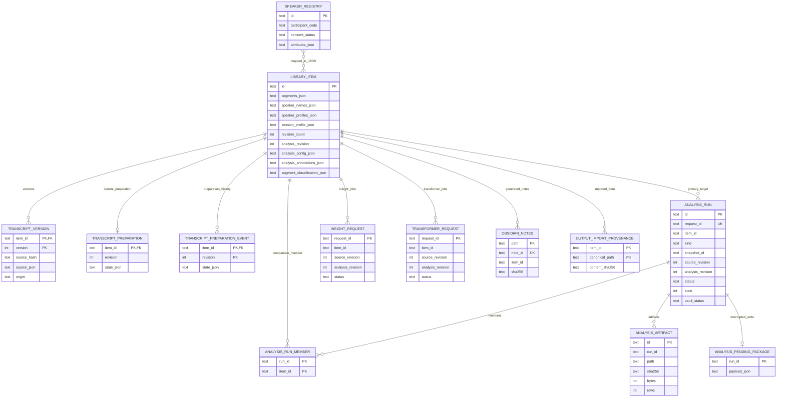

次の補助テーブルは図を読みやすくするため省略した。

- `application_metadata`：話者台帳revision、移行済みフラグなどのkey-value
- `training_events`：編集から作った学習イベント。関連IDを独立列ではなくpayloadに持つ
- `output_import_tombstones`：削除済み取り込み元の再取り込み防止

## 現行ER図（成果物・Obsidianを含む概念関係）

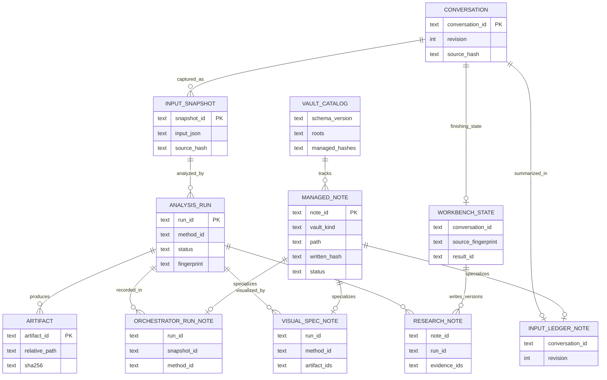

重要な境界は次のとおり。

- Vault間の関係はWikilinkではなく`conversation_id`、`snapshot_id`、`run_id`、`artifact_id`、`note_id`で解決する。
- Input／Visualization／Orchestratorの管理ノートは`vaults.json`のhashと`VaultRegistry`の競合処理を通す。
- ResearchVaultは`AnalysisStore`、`ObsidianLayout`、`ObsidianWorkbench`の既存経路を維持する。
- Software VaultはGit管理であり、実行中のアプリは書き込まない。

## 現行ユースケース図

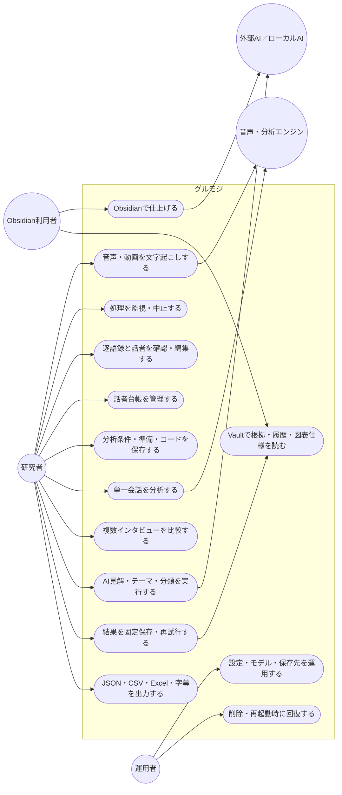

## 改訂案の構成と依存方向

2026-09-21の追加要件は [分析マイルストーン・可視化統合設計](analysis-milestone-visualization-design.md) の第13〜17節にまとめた。分析コアがメインとの応答、実行ハンドラーへの指示、データ不足・エラー対処、結果集約を統括する。コア内部の純粋規則とRuntimeを分離し、既存AnalysisCommands/Queriesは入口として維持する。以下の旧図のCoreは純粋規則を指し、新設計の分析コア全体とは範囲が異なる。役割別オーケストレーターは共通JSON契約で各LLMへ接続し、Obsidianも既存の所有権・保存契約を継承する。これは設計案であり、実装済みを意味しない。

次の図は**移行済みの機能におけるimport依存**を示す。実行時は組み立て側が具象関数をHandlerへ渡す。

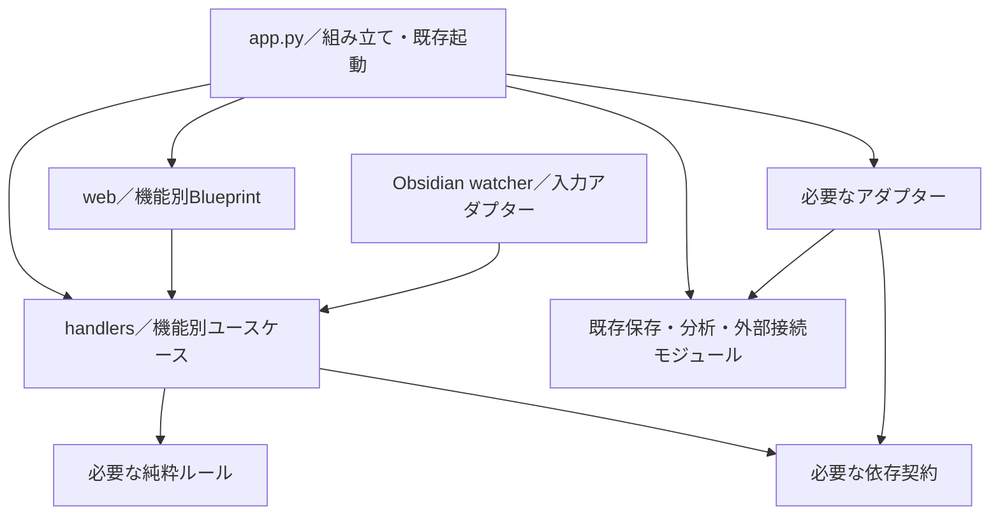

- `web`、`handlers`、`core`から`app.py`への逆importを禁止する。新設モジュールは関数内importでも回避しない。
- HTTPはBlueprintで変換し、watcherはHTTPを経由せず対象Handlerを直接呼ぶ。既存watcherの移行は後半まで行わない。
- Coreは具象adapterをimportしない。初期は関数引数や小さな依存オブジェクトで十分であり、Protocolは差し替えや契約の明示に必要な箇所だけ定義する。
- 既存の循環依存の全解消は開始条件にしない。移行を妨げる場合に限り、`safe_path`／`write_atomic`／`markdown`などの同一実装を下位モジュールへ局所抽出する。意味の異なる原子的書き込み関数は名前だけで統合しない。

### 各境界の最小契約

| 境界 | 責務 | 維持する制約 |
| --- | --- | --- |
| Routing | HTTPの構文検証、認証、入力・応答変換、`send_file`などの配信 | 業務処理を持たない。既存status、JSON、header、ダウンロード名を維持 |
| Handler | 1操作の調整、業務条件の検証、依存の呼び出し | Flaskの`request`／`jsonify`を受け取らない。HTTPの構文検証と業務上のrevision照合を分ける |
| Core | 実際に再利用される純粋な判定・変換 | Flask、SQL、ファイル、環境変数、threadを持たない。既存の純粋関数は移動不要ならそのまま利用 |
| 既存保存・分析・外部接続 | SQLite、ファイル、分析実行、Vault公開 | 実装・保存形式・呼び出し回数を維持。Handlerのために全機能を包み直さない |
| Runtime | ジョブ受付、取消、lock、threadの所有 | 同一状態の所有者は1つ。既存のDB／JSON上の回復データをメモリーへ移さない |

Handlerの戻り値はまず必要なdict・既存結果型を使う。単に包み直すCommand／Queryクラス、全機能共通の`OperationResult`、独自のDIコンテナーは作らない。HTTP固有の`local_path_access_allowed()`や`request.url_root`は入口で評価し、必要な値だけを渡す。

### 初回に必要な構成

```text
src/gurumoji/
  app.py                       # 既存起動・設定・依存の組み立て。未移行処理も残る
  web/
    analysis_routes.py         # 移行対象の分析ルートだけ
  handlers/
    analysis_queries.py        # 手法一覧・履歴・成果物取得
  analysis_method_registry.py  # 既存の手法・保存用結果契約
  analysis_store.py            # 既存の保存・再試行・公開実装
```

`__init__.py`等の必要なパッケージファイルを除き、最初に作る機能ファイルはこの2つを基本とする。実際に必要になった段階で保存Handlerや純粋ルールを追加する。`bootstrap.py`、全Entity・Port、`runtime/*`、`analysis/catalog.py`、入出力adapter群の先行作成は行わない。

## 維持する契約と分けて扱う課題

### 分析プログラム

- `analysis_method_registry.METHODS`、`REGISTRY_VERSION`、`method_results`を正本として継続利用する。現在は21手法。再編だけを理由に契約の版を上げない。
- 手法IDは利用者向け分類であり、実行単位とは限らない。`research_analysis`などの一括計算を手法ごとに分割実行すると、共通計算・モデル読込・保存が重複し得る。実行単位と呼び出し回数を維持する。
- 同期集計、非同期AI／Transformer、保存済み結果、議事録・比較の独立runを無理に同じrunnerへ変換しない。共通化は具体的な重複を確認した時点で検討する。
- `completed / empty / not_run / unavailable / fallback / stale / partial`等の現行結果表現を保持する。これをジョブやVault同期の状態名として流用しない。
- 「手法追加はcatalog・runner・schema・テストだけで完了する」という保証は外す。独自入力や画面が必要ならAPI/UI変更も必要になる。

### 状態と回復

| 状態 | 現行の所有先 | 再編時の扱い |
| --- | --- | --- |
| 文字起こし受付・進捗・取消 | `jobs`、`jobs_lock`、受付ID、JobRecord | 同じメモリー状態と受付制御を共有。プロセス再起動後の自動再実行は追加しない |
| AI見解・Transformer要求 | SQLite要求行＋cancel event／lock | 永続状態とプロセス内イベントを区別し、終了時の解除を維持 |
| Obsidian仕上げ | Workbenchの既存JSON、watcher | 原文・結果・再試行条件を保持。一般ジョブの状態へ置換しない |
| 固定保存途中 | `analysis_pending_packages`、AnalysisStore | 元の入力・結果を使う回復を保持。cacheや一時ファイルとして掃除しない |
| 編集・削除途中 | 既存manifest、staging、隔離・回復処理 | 操作単位の確定順と起動時回復を保持 |
| 分析の古さ・公開状態 | revision／fingerprint／DB trigger、`vault_status`等 | 入力の古さと公開失敗を別軸のまま扱う |

既存機能の構造再編では、統合状態API、新しい永続ジョブ基盤、汎用`ExecutionWorkspace`のcommit／rollbackを導入しない。FLOW-1〜2では、新しい追加分析に必要な受付・試行状態だけを「段階実行の状態と再開」に従って同じSQLiteへ追加する。既存ジョブの状態は移行・統合しない。SQLite、ファイル、Vaultを1つの原子トランザクションとして扱わず、既存の確定・部分失敗・再試行の境界を維持する。

### 出力・Vault

`AnalysisStore`が既に持つ「正本保存を先に確定し、Vault公開は再試行可能にする」責務を、Handler・Repository・ArtifactStoreに分解し直さない。ResearchVaultと生成3Vaultの所有権・公開経路も維持する。

OBS-18（生成Vaultの失敗がAPIへ伝わらない問題）は[[40-Design/known-issues]]／[[40-Design/convergence-plan]]の優先課題として、既存経路で独立して修正する。全面再編や共通Publisherの完成を前提にしない。修正後はその新しい契約を後続の再編の基準に取り込む。新しい部分失敗API・UIの設計は、この挙動維持の計画とは別の変更で扱う。

## AI管理とローカルのオーケストレーター用データ

この節は追加設計であり、以下の「現行」以外は未実装の提案である。ローカルデータは現行コードが参照するSoftware Vaultと設定上の実行データ領域を対象とする。追加のローカルデータは所在・形式・所有者を特定してから接続し、実Vaultの一括読み込み・移動を前提にしない。

### 1. 現行の役割と実行先

| 役割 | 現行の実装・実行先 | 設計上の位置付け |
| --- | --- | --- |
| 文章生成・整形・見解・アウトライン | `call_ai_json`：OpenAI／Googleはクラウド、LM Studioは同一PCのloopback | 生成役。操作ごとのモデル・設定を固定して実行 |
| 修正要否の判定 | `jev_review.py`＋`review_segments_with_jev`：TypeSafeのクラウド | 判定役。原文を書き換えず、生成AIの変更候補との一致・不一致を示す |
| 発話分類の提案 | `segment_classification.py`＋`classify_segments_with_jev` | ルール・Jev・既存Transformer・手動値を別々に保持する |
| 音声認識・埋め込み・統計 | Whisper、Transformer、既存の分析コード | ローカル計算。生成AI providerと同じ選択欄や状態モデルへ押し込まない |
| 手法選択・前提検証・実行順序 | 既存Handler、分析方針、`method_experts.py` | コードが制御する。専門家定義は手順・制約を与える知識であり、常駐する別LLMではない |

既存の`TokenConfig`／`load_token_config`、`ai_effort.py`、`post_json`／`ai_http_worker.py`、モデル設定UIを利用する。Jevは`call_ai_json`の生成用JSON schemaとは異なるChoice形式を使うため、通信・取消などの共通部分を共有しても、その要求・応答契約は分ける。

### 2. クラウド／ローカルを管理する方針

| 研究データの送信方針（提案） | 許可する実行 | 許可しない実行 |
| --- | --- | --- |
| `local_only` | 同一PCのLM Studioとローカル分析 | OpenAI／Google／Jevへの研究データ送信、LAN・外部ホストへの自動切替 |
| `cloud_allowed` | 操作で選ばれ、許可されたprovider・役割・データ範囲 | APIキーがあるだけの未選択provider呼び出し、無関係なデータの送信 |

- **生成AIがローカルでも、Jevを使う操作はクラウド送信を含む。** `jev_compare`と分類の`use_jev`を別の送信判断として扱う。`local_only`とJev有効が両立しない要求は開始前に理由を返し、黙ってクラウド実行したりJev済みと表示したりしない。
- 利用者が操作・保存済み設定で指定した送信方針と役割を実行要求へ固定する。実行の途中で設定ファイルが変わっても、既存要求の送信先・モデルを変えない。既存設定の移行時は現在のprovider／Jev指定を明示して取り込み、同意済み範囲を広げない。許可の再確認をバッチごとには求めない。
- LM Studioは現在のloopback制限を維持する。LAN上のサーバーを使う拡張は同一PCのローカル実行と区別し、接続・送信契約を別途設計する。
- 接続不能、モデル未読込、JSON出力非対応、メモリー不足を開始前に可能な範囲で確認する。失敗時に他のproviderへ自動で送らない。別モデルで再実行する場合は、元の失敗記録を残した別の実行として扱う。
- `local_only`は研究データの送信範囲を表す。モデルの初回ダウンロードや更新まで禁止する完全オフラインとは区別する。オフライン運用時は必要モデルを事前配置し、取得が必要なら理由を示して停止する。

モデルの価格や性能を固定値で選ぶ自動ルーターは初期導入しない。必要能力（生成／Choice判定、構造化出力、入力長、エフォート設定）と利用可能性を確認し、まず利用者の明示選択を優先する。

### 3. Jevの使い道と判断の限界

| 用途 | 扱い | 根拠・成果物 |
| --- | --- | --- |
| ASRの誤り候補を絞る | 現行機能を維持。発話断片と周辺文脈から修正要否を判定 | `jev_review`、確率分布、model、版、発話ID |
| 生成AIの修正との比較 | 現行機能を維持。両方が指摘／生成AIのみ／Jevのみ／両方なしを提示 | `ai_jev_comparison`と元発話。多数決で修正を確定しない |
| 発話種別・テーマ候補・重要度・要確認度・機密らしさ | 現行の分類提案を維持。テーマは与えた候補内で判定 | 手動、ルール、Jev、Transformerの値を混ぜず、`segment_classifications`等へ保存 |
| 人が確認する候補の優先表示 | 将来拡張。既存の不一致・要確認値からコードで並べる | 追加のJev呼び出しを伴わず、並び順の理由と未判定を表示 |

Jevは音声を確認しておらず、ASRの正誤や研究上の妥当性を保証しない。応答の確率・confidenceを校正済みの正解率として扱わず、閾値は対象データで評価する。本文、手動コード、研究者の解釈は自動上書きしない。

機密らしさのJev判定はクラウド送信**後**に得られるため、送信してよいかを決める事前ゲートには使わない。送信可否はローカルの設定・必要範囲・除外処理で先に決める。Jevをオーケストレーター全体の承認者、手法選択の最終判断者、ローカル実行の代替にはしない。

### 4. ローカルデータの所在と正本

`<software>`は現在の`VaultRegistry.SOFTWARE_ROOT`、`<data>`は解決済みの`MOJIOKOSI_DATA_DIR`（未指定時は`runtime/data`）を表す。個人PCの絶対パスを埋め込まない。

| データ | 既存の所在・正本 | オーケストレーターでの利用 |
| --- | --- | --- |
| 共通契約・手法説明 | `<software>/50-Analysis-Methods/`、`08-Common-Knowledge/` | 入力・根拠・解釈の制約を確認。全ノートを毎回読む必要はない |
| 専門家の実行定義 | 同配下`10-Experts/<expert>/01-Expert.md` | `ExpertCatalog`で選択済みの専門家を解析し、適用条件・AI補助可否・許可段階を判定 |
| 専門家の補足知識・文献 | 専門家フォルダーの知識ノート、`20-Literature/` | 既存の参照解決と`knowledge_hash`を利用。全文をモデル入力へ複製しない |
| 調査経緯 | `30-Research-Logs/` | 人が出典の確認範囲を追う補助資料。毎回の実行入力にはしない |
| 対象会話・実行状態 | `<data>/library.sqlite3`、既存Workbench状態 | 会話ID、revision、除外条件、要求状態から必要な入力だけ取得 |
| 固定入力・結果・表 | `<data>/analysis_store/`の既存JSON／CSVと台帳 | `run_id`／`snapshot_id`／`artifact_id`で解決する正本。過去結果を上書きしない |
| 手法カード・実行記録 | `<data>/obsidian/OrchestratorVault/10-Methods/`、`20-Runs/` | 人が確認する出力。正本から生成し、ノートの編集だけで実行を開始しない |
| Vault位置・所有hash | `<data>/obsidian_layout/vaults.json` | `VaultRegistry`で参照・競合判定。別カタログを新設しない |
| provider設定・資格情報 | 現行の`config/tokens.json`と`TokenConfig` | 接続層だけが秘密値を解決。AI入力・Vault・実行manifestへキーを含めない |

**専門家定義はSoftware Vault、OrchestratorVaultは生成された手法カード・実行記録、機械処理の結果はDBと成果物、という現行の役割を維持する。** 同じ定義をOrchestratorVaultへコピーして第2の編集元を作らない。別のローカルデータが後で指定された場合は、所在・所有者・読取形式を確認して必要な参照だけを追加する。

現行の`method_experts.ai_context`は、許可されたAI段階、短いbrief、禁止結論、解決済み文献ID等の構造化した指示を作る。文献・知識ノートの全文を送らない仕様を維持する。「ローカルに知識がある」ことと「その全文をLLMが読んだ」ことを区別して表示する。

### 5. AI呼び出しの実行境界

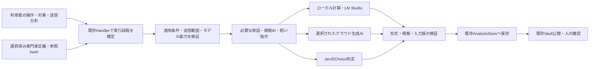

図の実行先は全てを毎回呼ぶ意味ではなく、選択された段階だけを実行する。

1. `method_id`、対象ID／revision、利用者が選んだ役割とproviderから段階を決める。手法・前提の解決は既存レジストリと`method_experts`を使う。AIが自由にモデル呼び出しやファイル書き込みを追加する仕組みは作らない。
2. ローカルで入力範囲、除外対象、専門家定義の妥当性・AI補助可否を確認する。ノート内の自由文を実行命令として扱わず、検証済み実行定義の既知の項目だけを利用する。
3. 現行の段階別プロンプト・分割処理を使い、`source_ids`、revision／hash、発話ID、必要な文脈、短い専門家指示を組み立てる。Vault全体・CSV全件・関係のない研究ログを送らない。全文が必要な処理でも、対象操作の許可範囲内で分割し、欠落や切り詰めを記録する。
4. 最初の送信前に対象の版・知識hashを再確認し、AI-2では固定済みcontext packetと照合する。不一致なら送信せず、再確認した別要求へ戻す。以降のバッチ・再試行は同じpacketを使い、現行の定義を読み直して混ぜない。実行中の原文・知識変更は現在版との差として記録し、保存済み入力に対する結果を現行データへ自動適用しない。取消と時間上限は段階・バッチに伝播する。
5. 出力schema、列挙値、確率の範囲・総和、根拠IDを検証する。失敗した応答は成功扱いにせず、必要な部分結果と失敗段階を保持する。
6. 成功した結果を既存runへ保存し、Vaultは保存済みの結果から公開する。同期・索引更新・知識hashの更新を契機にAIを再実行しない。

### 6. 実行要求・設定・来歴の管理

`JobOptions`や既存要求payloadを拡張する際の論理項目を以下に示す。全機能共通DTOや新しい汎用ジョブDBを先に作る要求ではない。

| 項目 | 設計内容 |
| --- | --- |
| 対象と役割 | request／run／step ID、task、method ID、入力snapshot・revision・fingerprint |
| 接続と能力 | provider、要求model、応答が返す実model（取得できる場合）、実行場所、必要能力、資格情報の参照。秘密値は記録しない |
| 入力の由来 | expert ID、definition version、knowledge hash、参照ID、プロンプト・schemaの版、必要な除外／分割条件 |
| 実行条件 | 選択した送信方針、段階別effort、入力・出力上限、時間上限、許可した試行回数、取消情報 |
| 実行結果 | 成功／失敗段階、経過時間、実試行数、providerが報告したusage、検証結果、保存したartifact ID |

- AI-2では、実際に使う短いcontext packetの固定保存を必須にする。packetは選択済みの専門家ID・定義版・knowledge hash、brief、許可した段階と根拠ID、禁止事項、使用prompt／schema版、入力参照・除外／分割条件を持つ。本文は既存snapshotへのID／hash参照を優先し、必要な変換・抜粋だけを固定する。全文の知識ノートや資格情報は含めない。
- 最初の送信前にpacketを既存`analysis_store`管理の版付き入力artifactとして保存し、canonical bytesの`context_packet_hash`を要求・fingerprint・結果から参照する。全prompt・通信ログの別保存庫を作らない。相談・分析の役割ごとに実際のpacketを区別する。
- 同じ要求の分割処理・形式修正・明示再開では固定packetを使う。後から知識が変わってもpacketを上書きしない。新しい知識で分析する場合は再確認した新要求とし、旧結果と知識変更後の表示を分ける。旧runにpacketがなければ「指示本文は未記録」とし、現在の定義から補完しない。
- 新規項目を永続化する段階ではpayloadの版と旧データの読取方法を決める。旧runの不明なprovider・usage・知識版を推測して埋めず、未記録として表示する。既存run・ID・hashは再生成しない。
- `jev-latest`等の可変名だけでは同一モデルを再現したとは言えない。実modelやrevisionが取得できなければ、その再現性の限界を残す。定義変更は新規実行と表示上の再確認へ反映し、過去成果物は固定する。
- usage未報告を「0トークン／無料」と表示しない。初期は回数・時間・取得できたtokensを管理し、金額を出す拡張には別途版付き料金設定と推定表示を用いる。
- 要求の受付重複とprovider側の実行重複を区別する。タイムアウト後の到達状況が不明な要求を無制限に再送しない。形式修正等の既存再試行は挙動維持の抽出後に整理し、総回数・時間の予算を段階全体で管理する。
- ローカルGPUをWhisper・Transformer・LM Studioが共有する点を考慮し、初期は競合する重い段階の逐次実行を基本とする。LM Studio等の外部プロセスのGPU使用はアプリのlockだけで制御できないため、未読込・メモリー不足を明示し、勝手なモデル停止やクラウド切替は行わない。

### 7. 利用者に見せる管理情報

既存のAI設定・実行開始・進捗・結果画面を拡張する。独立したAI管理ダッシュボードは初期には作らない。

- 開始前：生成用model、Jev利用の有無、段階ごとの送信先、対象データの範囲、選択した専門家と実行できない理由。
- 進捗：実行中の段階、バッチ進捗、実行先、取消可否。内部のadapter名や保存実装は表示しない。
- 結果：生成案・Jev判定・手動確定値、不一致、未実行／失敗、使用モデル、知識版、取得できたusageを区別する。
- 再試行：「保存済み結果のVault再公開」と「AIを再実行」を別の操作として示す。前者では送信も再課金も発生させない。

### 8. AI管理の導入順序

構造再編と動作拡張は別の変更としてレビューするが、どちらも本計画に含める。

| 段階 | 内容・依存 | 完了条件 |
| --- | --- | --- |
| AI-0：接続境界の抽出 | Phase 1の方式を確認後、`call_ai_json`、Jev呼び出し、資格情報解決を必要最小限の接続モジュールへ移す。`ai_http_worker`と現在の形式・取消・再試行を再利用 | 同じ入力で同じ送信先・回数・payload。既存provider／Jevのテストが通り、新モジュールから`app.py`への逆importがない |
| AI-1：送信方針と実行設定 | AI-0後。既存設定・UIに段階別の実行先、`local_only`／`cloud_allowed`、能力確認、実行中に変わらない設定を追加 | local_only時のJevを含む研究データのクラウド送信が0件。キーの有無だけで実行されず、設定変更が進行中要求へ混入しない |
| AI-2：知識と実行来歴 | AI-1とPhase 2の保存境界確認後。既存ExpertCatalogと入力・知識hashを結び、送信前に実際のcontext packetを版付きで固定保存 | 選択した知識だけを使用。旧runを読める。定義変更後も当時の指示を取得でき、バッチへ新旧の指示が混在しない。Vault再公開のAI呼出し0件 |
| AI-3：確認作業の改善 | AI-2後、必要なら既存のJev不一致・分類結果の表示順を改善 | 追加推論なしで確認候補を辿れ、原文・手動値・未判定が保持される |

役割別LLMの相談は利用者の追加要求によりFLOW-5bへ含める。AI-0〜AI-3や構造再編の前提にはしない。初期対象外は、専門家ごとの常駐プロセス、無制限の合議、モデル自動学習、全VaultのベクトルDB化、別のオーケストレーター製品・汎用プラグイン基盤、全モデルの一斉実行。必要な役割だけを上限付きで呼び、採用済み契約では相談を省く。

## 段階的な移行プラン

各段階を単独でレビュー・差し戻しできる変更にする。全ルートを先に移してからHandlerを作る順序をやめ、**対象機能のRouting・Handler・必要な依存を一緒に完成させる**。

### Phase 0：対象と比較基準を固定

1. 作業ツリーには未コミット変更があるため、実装開始時の対象ファイルと差分を確定する。既存変更を再編の差分に混ぜず、対象関数が並行して変わった場合は基準を取り直す。
2. 初回対象を`GET /api/analysis/methods`、`GET /api/library/<item_id>/analysis/runs`、`GET /api/analysis/artifacts/<artifact_id>`の3ルートに限定する。
3. importのみでDB初期化・watcher・AIを開始しない条件で、`app.url_map`のURL、methods（自動HEAD／OPTIONSを含む）、endpointを取得する。静的配信も対象に含める。全ルートの詳細なJSON台帳は作らない。
4. 既存の`test_analysis_storage.py`と関連テストを確認し、対象3ルートの正常系、存在しないID、壊れた成果物、ローカル／リモート公開情報に不足するケースだけ補う。
5. 既存テストの失敗は先に記録・切り分ける。今回の移動に関係する失敗を残したまま進めない。

**完了条件：** 対象ルートの依存、既存テストの結果、変更前のHTTP契約が特定され、初回差分の範囲が明確である。

### Phase 1：読み取り3ルートを縦切りで分離

- Blueprintの登録関数へ必要なHandler／依存を渡す。Blueprint／Handlerは`app.py`をimportしない。
- 履歴取得では現行のfingerprint照合とstale表示を保持する。成果物取得ではID参照、hash検証、404／409、MIME、添付名を維持する。
- 初回は大きなEntityや汎用Repositoryを導入せず、既存の`AnalysisStore`の必要な操作を利用する。
- 互換呼び出しは組み立て側で明示する。`app`モジュール全体、`globals()`、Flaskアプリ全体を新Handlerへ渡す方法は使わない。
- 既存テストが差し替える`DATABASE_FILE`等を登録時に固定しない。移行中は呼び出し時に現在の設定から既存storeを作る等の最小限の橋渡しを置き、必要なpatchが実際に使われることを確認する。
- 認証・共通エラー処理・起動構造はこの段階で再設計しない。

**完了条件：** 対象3ルートが互換であり、履歴取得または成果物取得のHandlerをFlask contextなしで検証できる。新設モジュールに逆importがなく、ルート登録は重複していない。

**実装状態（2026-09-20）：完了。** `web/analysis_routes.py`と`handlers/analysis_queries.py`へ分離し、HTTP契約、stale判定、成果物hashエラー、ローカル情報の公開制御、設定差し替え、FlaskなしのHandler、ルート重複なしをテストで確認した。

**継続判断：** 呼び出し経路と依存が明確になり、HTTPなしの検証ができた場合だけ次へ進む。既存関数を何重にも包むだけなら、抽象化を削ってから再評価する。ここで終了しても有効な改善として残せる。

### Phase 2：固定保存・Vault再試行を同じ境界へ移す

対象は`save_analysis_run`、`retry_analysis_vault`。比較の固定保存はこの縦切りが安定してから別変更で扱う。

- JSONの構文検証・HTTP変換をRoutingに残し、revision照合から保存・再試行までの調整をHandlerへ移す。
- `library_write_lock`と`analysis_store.STORE_LOCK`は、それぞれ既存の共有インスタンスを使い、取得順・解放条件を保持する。別のlockを新設して同じデータを守ったつもりにしない。
- 現行の読み取り→revision照合→計算→確定の保護範囲を維持する。lock外への計算移動や並行化は別の最適化として扱う。
- `request_id`の冪等性、保存途中の保留パッケージ、正本確定後のVault失敗を維持する。DB／ファイル／Vaultをまとめた新しいrollback機構は導入しない。
- **初回の固定保存は現行どおり集計を行う。** 「保存は一切計算しない」とは定義しない。Vault再試行・中断保存の回復は保存済みパッケージを使い、分析やAIを再実行しない。
- fingerprintやstaleの純粋部分を抽出する場合も既存関数を優先し、SQLite triggerが担う無効化を削除・二重実装しない。

**完了条件：** 初回保存、同じ要求の再送、revision競合、中断保存後の原文変更、Vault失敗・再試行が現行と同じ結果になる。`test_analysis_storage.py`の該当ケースと比較・準備変更に隣接するテストが通る。

**実装状態（2026-09-20）：完了。** `handlers/analysis_commands.py`へrevision照合から固定保存・再試行までを移し、RoutingにはJSON検証とHTTP変換を残した。共有lockの取得順、保存途中のパッケージ、stale更新、Vault競合時の人のノート保護を変えず、FlaskなしのHandlerテストと既存の保存・回復テストで確認した。

### Phase 3：効果のある機能だけ同じ手順で拡張

以下は別々の変更とし、対象外の機能は既存位置に残してよい。

AIを使う機能の移行では「AI管理の導入順序」のAI-0〜AI-2と接続する。生成・判定・知識参照の責務をHandlerへ渡し、各ルートにprovider選択や送信方針を重複実装しない。挙動維持の移動と、送信方針・payload版の拡張は同じ変更に混ぜない。

| 順序 | 対象 | 移行前に固定する境界 |
| --- | --- | --- |
| 1 | 比較保存、編集、分析準備・話者変更 | 複数会話のstale伝播、入力版、編集manifest、学習用出力、削除回復 |
| 2 | AI見解・Transformer・分類 | 同期／非同期の違い、要求の冪等性、revision変化、取消、thread開始失敗 |
| 3 | 文字起こし・アップロード | endpoint依存の受付、上限、二重送信、取消不可の確定段階、作業ファイルの所有 |
| 4 | Obsidian watcher、起動・終了 | 二重起動防止、回復順序、watcherの起動・停止、共有設定とlock |

対象機能を移す際に必要なら小さなCore関数、ジョブ所有オブジェクト、依存契約を追加する。機能別Handler内の操作が増えたという理由だけでcommands／queriesを階層化しない。

**完了条件：** 移行した機能について、正常・失敗・取消・再起動の該当経路が維持される。未移行機能の分離はその変更の合否条件にしない。

**実装状態（2026-09-20）：完了。** 順序1のうち比較の固定保存、分析準備の保存、通常の会話編集（話者名・会話内話者プロファイルを含む）を`AnalysisCommands`と共通Blueprintへ移した。比較は表示時の複数入力fingerprint照合、サーバー側の再集計、専用run・member保存、stale伝播、Vault公開を確認した。分析準備は`BEGIN IMMEDIATE`からrevision・本文版更新・stale伝播までの単一トランザクション、commit後の索引更新、InputVaultへ本文を出さない契約を確認した。通常編集は共有lock内の確定、revision競合、編集manifest・回復、学習用差分、索引とInputVaultの更新を既存テストで確認した。グローバル話者台帳のGET／PUTとCSV取込から共用する保存処理も`SpeakerRegistryHandler`と専用Blueprintへ移し、台帳revision競合、削除、保存後の分析索引更新を確認した。AI話者再同定は送信内容・provider規則を変えず、資格情報解決、同期AI実行、実行後revision照合、利用量保存、話者修復とInputVault更新をFlask非依存のユースケースとHandlerへ分離した。

順序2はAI見解、Transformer、発話分類の取得・実行境界を`AnalysisQueries`／`AnalysisCommands`と共通Blueprintへ移した。状態取得は保存済み結果と最新requestをSQLite snapshotから読み、取得操作でAI・Transformer・Jevを再実行しない。AI見解とTransformerの開始・取消はrequest ID再送、同時実行拒否、revision照合、AI見解の専門家ゲート、Transformerの自動／候補／手動条件、thread開始失敗時の後始末、取消eventを既存の共有lockとDB状態のまま保持した。発話分類は同期実行のまま、Jev利用指定、実行前後のrevision照合、手動・ルール・Jev・Transformer値の分離、SQLite確定後の固定履歴作成とVault失敗時の警告を維持した。非同期workerは既存のFlask非依存関数を継続利用する。

順序3は文字起こしジョブの受付、状態取得、取消、完了後編集、ジョブ所有ファイル取得を`JobHandler`と専用Routingへ移した。話者台帳のCSV取込も既存の`SpeakerRegistryHandler`保存処理を使うRoutingへ統合した。`create_job`と`import_speaker_registry`を含むendpoint名は共通security hookと互換入口のため維持し、submission IDの再送、同時受付予約、メディア／CSVのmultipart上限、`after_request`での予約解放を既存hookへ残した。文字起こしフォーム検証から作業・出力ディレクトリ確保、worker開始、開始失敗時のジョブ登録・upload・出力の後始末は1つのFlask非依存コマンドとして維持し、`committing`以降を取消不可とする状態境界も変えていない。

順序4はinstance lock取得からライブラリ初期化、編集回復、取込来歴修復、削除回復、学習成果物修復、孤立upload掃除、既存出力取込までを`ApplicationLifecycle`の明示的な順序へ移した。途中失敗時はlockを解放し、Obsidian watcherは同じLifecycleが単一instanceとして所有して二重起動を避け、停止event・thread join後にinstance lockを解放する。watcher内の作業状態回復、Vault移行、操作ノートpoll、theme同期と例外時の停止条件は変更していない。

### Phase 4：互換入口と不要な橋渡しを整理

- 移行済み機能の一時的な橋渡しだけを削除し、設定・依存を組み立て側で明示する。`src/app.py`による`import app`と`gurumoji.app`の同一モジュール性を保つ。
- 関数をre-exportするだけでは、その関数が参照するglobalや既存patch先は移らない。公開されている互換入口と内部関数へのテスト依存を区別し、テストは実際の依存先を差し替える形へ移す。
- 起動責務の独立が有効になった場合に限り`bootstrap.py`／app factoryを導入する。factory生成とデータ初期化・thread開始を分ける。
- `initialize_application`のinstance lock取得、編集回復、来歴修復、削除回復、学習成果物修復、upload掃除、既存出力取り込みの順序を維持する。`main`終了時のlock解放、watcherの停止も維持する。
- `app.py`を薄くすること自体を完了条件にしない。移行対象の入口から実処理まで追跡でき、不要な二重登録・二重状態・逆importが消えたことを確認する。

**完了条件：** 既存の起動・import・HTTP契約が保たれ、移行済み機能が単一の実装を参照する。全体起動や共通hookに触れた変更では、局所テストに加えて広い回帰確認を行う。

**実装状態（2026-09-20）：完了。** 移行対象の旧ルート実装を削除し、組み立て側から各Handler／Routingへ依存を渡す単一経路にした。`src/app.py`の互換importは`gurumoji.app`と同一モジュールを返し、`create_job`／`import_speaker_registry`のendpoint名は共通security hookとの契約として維持する。一時的な再exportや旧新二重登録はなく、移行済みHTTP操作の一意性と`handlers`／`web`からcomposition moduleへの逆import不在を機械検証する。

### Phase 5：app.py に残った処理の移動（2026-09-25）

**実装状態：完了。** Phase 0〜4 と同じ方針（機能ごとの縦切り、`app.py` への逆import禁止、HTTP・DB・Vault契約の維持）で、残っていた処理を手順0〜11に分けて移した。`app.py` は 8,361 行から 1,895 行になった。移動先・検証・注意点は [[70-Changes/app-py-phase5]]、旧シンボルの移動先は `70-Changes/app-py-phase5.data.json` に記録した。

## 移行時の必須確認

### Blueprint、HTTP、配信

`app.url_map`のURL一致だけでは不十分。Blueprint移行でendpointに接頭辞が付く場合は、旧名→新名の対応を明示し、参照するhook・`url_for`・テンプレート等を同じ変更で更新する。endpoint変更自体を一律禁止せず、その利用先が正しく動くことを検証する。

特に`create_job`／`import_speaker_registry`を移す際は、次を必須とする。

- CSV・メディア・JSONのサイズ上限と413応答。
- 同じsubmission IDの再送と別要求の同時受付、受付中の202／409。
- 失敗時の受付予約・一時ファイル解放とthread開始失敗時の後始末。
- Host、Origin、CSRF、リモート認証、ローカルパス制限、応答の機密パス除去。
- `after_request`の予約解除、cache制御、セキュリティheader。

共通hookは維持し、ルート移動を理由に各Blueprintへ複製しない。static／templateの基準パス、ダウンロードのMIME・filename、メディア配信を移す場合のRange応答も確認する。

### 保存・同時実行・回復

- 書き込み経路は1つに切り替える。旧入口を残す場合も同じ実装へ委譲し、旧新の二重書き込み・影実行は行わない。
- UUID・現在時刻を含む結果全体を無条件にsnapshot比較しない。必要なら時刻・ID生成を固定し、決定的な入力のcanonical bytes／hash、重要なschema・状態・副作用を比較する。
- fixtureは一時ディレクトリ・架空データを使う。複数接続・再起動・ファイル回復の試験には一時ファイルSQLiteを使い、`:memory:`だけで代用しない。
- 既存コードの潜在不具合を現状維持の名目で追加固定しない。発見した不具合は再編と切り分け、意図した契約を決めてから後続の基準へ反映する。

### 差し戻しと中断

構造再編の各変更はDB schema・永続payload・ID生成規則を変えず、前のコードでも成果物を読めることを維持する。AI／FLOWの版付き拡張は別変更とし、新コードが旧runを読めることと、未対応種別の実行・再保存を拒否することを検証する。拡張前にreader／writerの対応版検査と差し戻し先を定め、検査のない旧版で新形式を含むDBを開かない。新形式が読めない差し戻し先しかなければ運用を停止して成果物を保持し、旧形式への破壊的変換はしない。失敗した段階はそのコード変更だけを戻せる大きさにする。実行中ジョブを新旧コード間で引き継ぐ仕組みは追加せず、更新・差し戻しは処理停止後に行う。

差し戻しにデータ移行が必要になった時点で、この再編の範囲を超えているため変更を分割する。既存の未コミット変更に対する一括resetや、Vault・DBを消す復旧は行わない。

## 検証対象と受け入れ条件

既存テストを優先し、移した実装をなぞるだけのテストや全出力の巨大snapshotは増やさない。以下は実装時に使う検証先であり、今回の文書改訂でテストを実行済みという意味ではない。

| 変更範囲 | 既存の主な検証先 | 追加する場合の観点 |
| --- | --- | --- |
| 手法一覧・履歴・成果物、固定保存 | `test_analysis_storage.py`、`test_analysis_method_view.py` | FlaskなしのHandler、404／409、保存回数、AI未呼び出し |
| 入力・認証・ジョブ | `test_backend_safety.py` | endpoint変更後の上限・受付hook、同時送信、予約解放 |
| 編集・入力版・stale | `test_edit_recovery.py`、`test_transcript_preparation.py`、`test_analysis.py` | 元の回復情報と単独／比較runの無効化 |
| AI・Transformer・分類 | `test_content_analysis.py`、`test_transformer_analysis.py`、`test_segment_classification.py` | 取消・thread失敗・入力変更・呼び出し回数 |
| AI接続・設定・Jev | `test_ai_model_settings.py`、`test_ai_http_worker.py`、`test_jev_review.py`、`test_segment_classification.py` | ローカルとクラウドの境界、local_only時のJev拒否、実行中の設定固定、無制限再送なし、確率検証・手動値の保持 |
| オーケストレーターの知識・来歴 | `test_method_experts.py`、`test_analysis_storage.py`、`test_four_vaults.py` | 選択した定義だけの読取、AI補助不可・文献欠落、knowledge hash更新、本文・秘密値の除外、旧run読取 |
| Vault・watcher | `test_analysis_storage.py`、`test_obsidian_finishing.py`、`test_obsidian_layout.py`、`test_four_vaults.py` | 保存済みパッケージの再利用、所有権、起動・停止 |
| 起動・UI全体 | `test_launcher.py`、`test_browser_e2e.py`、`test_content_browser.py` | 互換import、静的配信、代表操作、二重初期化なし |

局所移動では該当テストと隣接境界を実行する。共通hook・起動・状態共有を変えた段階で検証範囲を広げ、全体に及ぶ変更では既存の全体テストも行う。重いモデルや外部AIはスタブ化し、再編検証のために実データや実Vaultを使わない。

挙動を維持する構造再編の共通受け入れ条件（AI管理・分析フローの動作拡張はAI-1〜AI-3とFLOW-0〜FLOW-5bの条件を別途適用）：

- 変更対象の公開URL、method、HTTP status、JSON、必要なheaderと配信仕様が互換。
- DB schema、保存配置、stable ID、hash、分析契約の版、Vault所有権ルールを維持。
- Vault再試行・中断保存の回復が保存済み入力と結果を使用し、AI・分析の追加実行がない。初回保存の既存集計は維持。
- 会話編集、話者台帳・分析準備変更のstale伝播と既存triggerが維持される。
- Runtime状態、cancel event、lockの所有者が重複せず、失敗時に解放される。
- 新設したRouting／Handler／Coreが`app.py`へ逆依存しない。
- 少なくとも移行対象の実用的なHandlerをFlaskなしで検証できる。
- 実Vaultを変更せず、対象に必要な既存テストと追加検証が通る。

## 採用判断

| 選択肢 | 判断 | 理由 |
| --- | --- | --- |
| 全面書き換え・7層の先行構築 | 不採用 | 保存・回復の危険と実装量が大きく、利益を確認するまでが長い |
| 全ルートを先にBlueprintへ移動 | 不採用 | endpoint・hook・循環依存の影響が広い一方、業務処理の検証容易性がまだ得られない |
| 機能別の小さな縦切り | 採用 | HTTP互換と独立検証の効果を早く確認でき、段階ごとに止められる |
| 完成した縦切りでいったん停止 | 許容 | 再編自体を目的化せず、優先課題や実装上の効果に合わせて継続を判断できる |

## 実装根拠

パスは特記のないものを`src/gurumoji/`配下として読む。行番号は移動で変わるため、識別子を基準にする。

| 論点 | 確認した現行実装 |
| --- | --- |
| endpoint依存の保護と受付 | `app.py`：`enforce_request_security`、`disable_development_cache` |
| 互換importと差し替え | `src/app.py`：`sys.modules`へのalias、`tests/test_analysis_storage.py`／`tests/test_analysis.py`の`app`差し替え |
| 初回の分離対象 | `app.py`：`get_analysis_methods`、`get_analysis_runs`、`get_analysis_artifact` |
| 固定保存・再試行 | `app.py`：`save_analysis_run`、`retry_analysis_vault`、`archive_group_analysis` |
| 起動・回復・終了 | `app.py`：`initialize_application`、`main`、`_run_initialized_application`、`start_obsidian_watcher` |
| 既存の結果契約 | `analysis_method_registry.py`：`METHODS`、`REGISTRY_VERSION`、`method_results` |
| AI設定・実行場所・通信 | `app.py`：`TokenConfig`、`lmstudio_base_url`、`call_ai_json`、`post_json`、`ai_http_worker.py`、`ai_effort.py` |
| Jevの役割と既存成果物 | `jev_review.py`、`segment_classification.py`、`app.py`：`review_segments_with_jev`、`classify_segments_with_jev`、`archive_ai_finishing` |
| ローカルの知識と実行記録 | `method_experts.py`：`ExpertCatalog`、`review_for_analysis`、`ai_context`、`vault_registry.py`：`publish_analysis` |
| 保存順・冪等性・回復 | `analysis_store.py`：`AnalysisStore.save`／`retry`、`initialize_store` |
| 外部キー・準備変更の無効化 | `transcript_preparation.py`：`initialize` |
| 循環依存の局所抽出候補 | `analysis_store.py`の`safe_path`／`write_atomic`／`markdown`、`obsidian_layout.py`等からの参照 |
| 再編と分ける優先不具合 | [[40-Design/known-issues]]：OBS-18、[[40-Design/convergence-plan]] |

関連：[[10-Architecture/system-map]]、[[20-Modules/module-map]]、[[20-Modules/obsidian-integration]]、[[30-Data/analysis-storage-v1]]、[[30-Data/four-vaults-v1]]、[[40-Design/convergence-plan]]。

AI管理の関連：[[50-Analysis-Methods/00-Orchestrator-Common-Contract]]、[[50-Analysis-Methods/10-Experts/00-Index]]、[[50-Analysis-Methods/08-Common-Knowledge/00-Index]]、[[50-Analysis-Methods/20-Literature/00-Index]]。
