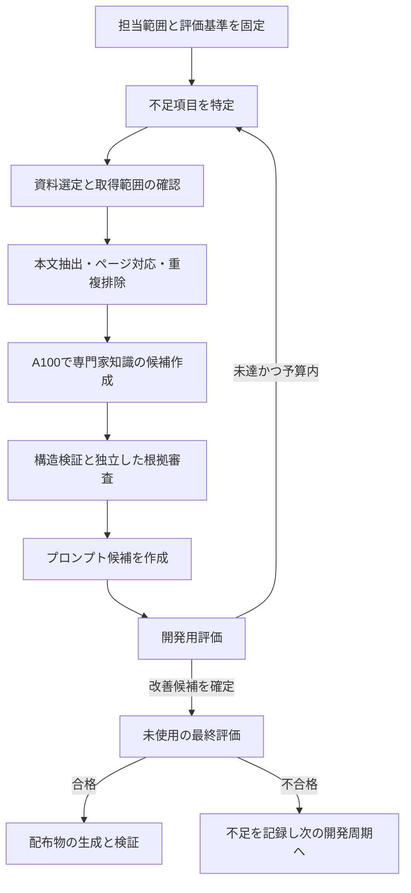

# 配布用専門家の知識・プロンプト制作計画

この文書は最終方針と実装順を定める。既存の専門家参照とローカル知識の上書き、Colab接続・GPU計算確認に加え、制作・審査・配布パイプラインの契約、候補Pack reader/builder、評価gate、Colab送受信adapterまで実装中である。実文献の作成バッチ、実回答を採点するrunner、既存分析への接続、Local Papers版、配布承認は未完了。

最新の工程別結果・AI担当範囲・使用量の記録は[[expert-knowledge-production-execution-report]]を参照。

## 1. 目標と完成条件

**利用者が受け取って使える、17種類の分析専門家の知識・プロンプト・出典・評価結果を作る。各専門家は、担当範囲内で根拠を示し、条件を満たさない場合には判断を保留できるものとする。**

成果物を次の2種類にする。

| 配布物 | 利用者ができること | 含めるもの |
| --- | --- | --- |
| Base版 | 収録済み知識を使い、専門家の説明・確認・許可された分析補助を実行する | 承認済み知識、プロンプト、出典一覧、出力schema、公開サンプル、対応モデル別の評価結果 |
| Local Papers版 | Base版に加え、指定した端末内の論文を検索して該当ページを確認する | Base版、論文取込・検索機能、追加プロンプト、設定ひな形。利用者のPDFや個人索引は同梱しない |

Local Papers版の個別知識は、利用者の端末で作成する追加層とする。配布用Base版の品質と、特定利用者の論文を加えた状態の品質を別々に評価する。

完成の判定は次の全項目による。

1. 既存17専門家すべてに、ID・担当範囲・適用条件・禁止事項・知識・プロンプト・出典・評価結果が揃う。
2. 各専門家が第6節の基準を満たす。失敗した専門家を平均点で合格にしない。合格済みだけの先行版は可能だが、17専門家版の完成とは区別する。
3. 配布ZIPをクリーンな環境で読み込み、既存の専門家IDと手法IDで利用できる。ObsidianやCodexへの加入を配布物の読取条件にしない。
4. Local Papers版は、指定フォルダー内のPDFを取り込み、ページ付き根拠を返し、論文がない場合は不足を示す。Baseの内容を黙って変えない。
5. 制作処理の中断・再開で成果物の重複採用や途中ファイルの採用が起きない。
6. 制作時のモデル・知識・プロンプト・評価データの版を追跡でき、前の配布版へ戻せる。
7. 文献処理・通常評価・監視の通常経路ではCodexを呼ばない。Codex利用量とA100稼働時間を記録し、費用の未取得値を0扱いしない。

ここでの「学習」は、文献を読んで知識レコードと指示を更新し、その効果を評価すること。モデルの重みの追加学習はv1の完成条件に含めない。追加学習を行う場合は、知識検索とプロンプト改善で残る失敗を確認した後の別工程とする。

## 2. 現状と再利用する実装

2026-09-27に対象コード・ノートを確認した。

| 既存資産 | 確認できたこと | 今回の利用方法 |
| --- | --- | --- |
| `src/gurumoji/method_experts.py` | `ExpertCatalog`、17専門家、YAML実行定義、定義検証、知識hash、AI補助の許可判定 | 専門家の識別・適用条件・現行互換性を維持する |
| `50-Analysis-Methods/10-Experts/` | 専門家ごとの7ノート | 人が編集する専門家定義の正本として継続する |
| `50-Analysis-Methods/20-Literature/` | 文献ID、確認範囲、査読・訂正状態 | 出典台帳を拡張する。要旨・書誌確認を本文確認へ格上げしない |
| `<data>/local_knowledge/` | ADR-120のローカル追加・同一相対パスの上書き | 利用者ごとの承認済み追加知識に使用する |
| `src/gurumoji/ai_http_worker.py` | ローカルのLM Studio等へのJSON通信と送信先制約 | 通信・エラー処理を再利用できる範囲で共通化する |
| `services/analysis_jobs.py`、`AnalysisStore` | 取消、状態、使用量、固定成果物の既存パターン | 設計と小さな共通処理を再利用する。文献制作を会話分析runに偽装しない |
| `notebooks/Gurumoji_Colab.ipynb` | 既存の文字起こし・分析用起動経路 | 依存設定を参照し、制作専用の小さなノートブックを追加する |

**現行の`ai_context()`がモデルへ渡すのは短いbrief・許可段階・禁止事項等で、補足ノート本文ではない。** ノートを増やしただけでは新しい知識が回答に反映されない。承認済みの知識から必要な根拠を選んで渡す処理を明示的に実装する。

文献索引には76件、そのうち本文確認13件と記載されている。この件数は既存索引の記載であり、今回全文を再確認した数ではない。P0で実ファイルから再集計する。

今回の実測ではColabに`NVIDIA A100-SXM4-80GB`が割り当てられ、PyTorchで512×512のGPU行列積が成功した。毎回同じGPUが割り当てられる保証とはしない。

ローカルはRTX 5070、VRAMは12,227 MiB。確認時の空きは約2,000 MiBで、他の処理との資源調整が必要。LM Studioのモデル一覧には`qwen/qwen3-8b`等があり、一覧取得は推論成功やロード済みの確認とは区別する。

## 3. 役割と実行場所

専門家は既存の**17定義**を継続する。制作を支える役割は下記の**6種類を全専門家で共有**する。合計23種類の論理的役割であり、23モデルを常駐させる設計ではない。通常はローカルLLMの1要求と、A100側の1推論ジョブを上限にする。

| 役割 | 仕事と出力 | 主な実行先 |
| --- | --- | --- |
| 専門家17種類 | 指定資料から、担当する手順・条件・反例・限界と出典対応を作る | A100 |
| 学習管理役 | 知識の不足と失敗分類から、次に読む資料・改善する項目を決める | ローカルLLM、難しい比較はA100 |
| 資料選定役 | 検索候補の関連性、原典、確認可能範囲、重複を判断する | ローカルで候補作成、内容審査はA100 |
| 構造・根拠審査役 | 知識の分類、矛盾、重複、主張と出典の対応を審査する | 構造検証はコード、意味の審査はA100 |
| 知識充足・適用審査役 | 固定評価で知識・適用判断・判断保留の不足を判定する | コード＋A100の審査モデル |
| プロンプト改善役 | 開発用評価の失敗に基づき、短い指示と例を改善する | A100 |
| 運用監視役 | ログを説明し、許可された復旧案を提案する | ローカルLLM。例外・停滞時だけ起動 |

時間計測、ジョブ状態、再試行回数、予算、採用処理は**ローカルのPython管理プログラム**が担当する。LLMの出力は許可済み操作のJSONに限定し、任意のコマンドを実行させない。ローカルLLMが停止しても監視とチェックポイントの管理は継続する。

開発担当は上記の制作役とは別枠とする。

| 担当 | 依頼する範囲 | 呼ぶタイミング |
| --- | --- | --- |
| Codex Luna (`gpt-6-luna`) | 小さな実装、関連テスト、失敗修正、引継ぎ | 実装チケットごと |
| Codex Sol (`gpt-6-sol`) | 契約・評価・公開境界の監修、解決できない不具合 | 第9節の4つの節目と明示した例外 |

通常モデルはユーザー指定どおりLunaとする。Solは監修用の短い別コンテキストを使う。公式資料でも役割ごとのモデル指定が可能とされている。[OpenAI Docs：Subagents](https://learn.chatgpt.com/docs/agent-configuration/subagents)

## 4. 制作の流れ



1. 各専門家の担当範囲を項目表にする。理論、用語、前提、手順、適用不可、反例、出力、限界を分け、必須項目を先に固定する。
2. 資料は原典論文・書籍・公式資料を優先し、解説記事は補助として扱う。書誌のみ、要旨、本文の区別と読めたページを残す。
3. ローカルで取得・抽出・重複判定を行う。A100への送信は送信可能と確認した資料のみとする。ローカル限定資料は端末内で処理する。
4. 専門家役は与えられた資料から候補を作る。モデルの記憶だけの主張は確認候補に置き、出典を補ってから採用する。
5. 審査は原文の該当箇所まで戻る。要約を別モデルが再要約しただけで二重確認済みにしない。
6. 失敗を「資料不足／抽出不良／検索不良／指示不良／モデル能力／評価の不備」に分類する。すべてを資料追加で解決しようとしない。
7. 合格した候補はまず内部候補Packとして固定する。P7で全評価・P4復旧gateを確認した不変の`ReleaseApproval`をPack rootへ紐付けるまで、配布用承認領域・ZIP・runtime readerで利用可能にしない。

資料候補の入口は、既存文献ID、利用者が指定したURL/DOI、ローカルの資料台帳とする。追加検索は設定された検索API・学術メタデータ取得器を通常のコードで呼び、LLMは検索語と採否を判断する。検索手段が未設定なら候補受付までで動作し、LLM単体がインターネットを検索したとは扱わない。

資料1件ごとに最低限、`source_id`、既存`LIT/RES` IDとの対応、DOIまたはURL、確認日、確認範囲、抽出方式、原本hash、配布可否、送信可能先を記録する。PDFは物理ページ番号と印刷ページ番号を区別し、Webは節・段落・取得版を記録する。

スキャンPDFはOCRの結果と原画像を照合できるようにし、欠落・図表・数式の抽出失敗を記録する。読めなかった箇所を本文確認済みにしない。訂正・撤回・後続の反証は既存の訂正状態と関連レコードで残す。

## 5. 配布形式と知識の正本

採用形式は**Markdown＋JSON/JSONL＋manifestをまとめた版付きZIP**とする。Obsidianは閲覧・編集に使える。制作台帳と検索索引はSQLiteで持ち、配布時に必須のサーバーや特定ノートアプリを増やさない。

```text
gurumoji-experts-<version>/
  manifest.json                   # 版、対応アプリ、対応モデル、ファイルhash
  README.md                       # 利用方法と評価範囲
  LICENSES/                       # 自作物・許諾済み素材・依存物の情報
  adapter/                        # 両版共通の読取・packet構築、CLI利用例
  common/                         # 共通指示と根拠の扱い
  experts/<expert_id>/
    definition.json               # 01-Expert.mdから生成した実行定義
    knowledge.jsonl               # 審査済み主張と根拠ID
    system-prompt.md               # 生成した短い基本指示
    task-template.md              # タスク入力・根拠挿入のひな形
    output.schema.json            # 回答・根拠・不足・限界の出力契約
    examples.jsonl                # 公開用の正例・判断保留例
    evaluation.json               # 評価条件、件数、実測値、限界
    notes/                        # 人向けの7ノート
  sources.jsonl                   # 配布可能な出典メタデータ
  samples/                        # 再現用の公開確認ケース
  local-papers/                    # Local Papers版だけ
    config.example.json
    adapter/                       # 論文取込・検索の実装
    retrieval-prompt.md
```

配布物はLLMのモデル重みを含めない。実行には利用者が設定した対応LLMを使う。モデルごとに合格を確認し、未評価モデルを「同じ品質」と表示しない。

正本と生成物の関係は次のように固定する。

- 専門家の手順・適用条件：既存の`01-Expert.md`内YAMLが正本。既存の1500文字以内の`ai_assist.brief`制約を維持する。
- 人向けの詳説：既存7ノート。根拠付きの機械処理用主張には、新設する専門家ごとの`07-Evidence.jsonl`を正本として使い、ノートから主張IDで参照する。
- 採用済みの指示例：必要な専門家だけに`08-Prompt-Examples.jsonl`を追加する。開発用・公開用を識別し、最終評価の問題や答えを混ぜない。
- 配布用のJSON・プロンプト：上記の正本、共通テンプレート、compilerの版から生成する。配布生成物を別の編集元にしない。
- 制作中の候補：`<data>/knowledge_builder/`内の候補領域。生成結果でSoftware Vaultや利用者ノートを直接上書きしない。
- ローカル論文からの承認済み知識：既存の`<data>/local_knowledge/50-Analysis-Methods/...`に置く。原本・抽出データは制作領域のprivate部分で管理する。

新しいJSONL、共通prompt、compiler/schemaの版も知識・プロンプトのhash対象に追加する。現行の`KNOWLEDGE_NOTES`は7ノートに固定されているため、ファイルを追加するだけで変更検知できるとは扱わない。

知識レコードの最低項目は、`claim_id`、`expert_id`、主張、適用範囲、例外、主張の種類（文献／整理／実装判断）、根拠ID、原本の版とhash、選択箇所（ページ／段落／引用範囲）、抽出テキストhashと変換履歴、矛盾・代替説、審査状態、審査者・日時・審査時の対象hash、来歴、送信・配布区分とする。引用箇所と派生成果物は元資料の利用・共有・送信区分を継承し、送信先ごとにコードが許可を判定する。claimは根拠の異なる別レコードを誤って同一視しない名前空間を持つ。

Local Papers版の検索は、文献ID・見出し・語の一致による絞り込みから開始する。日本語の分かち書きは既存前処理との整合を確認する。埋め込み検索は検索評価で必要性を確認して追加し、モデルID・版・索引hashを記録する。索引は再作成可能な派生物にする。

実行時は選択した専門家のbriefと、質問に対応する承認済み主張・抜粋だけでcontext packetを作る。既存`ai_context()`に互換な薄いアダプターを加え、版付きの追加packetを使う。旧モードは従来の入力を維持する。

配布物とアプリが共通に使う経路を、次の順に固定する。P1で関数の入出力とschemaを決め、P3では実際にこの経路で評価する。

1. `load_expert_pack(path, flavor)`相当の入口でmanifest・対応版・全ファイルhash・正規化したBase root hashを検査する。Base版のrootは選択した配布版に固定し、通常の`local_root`探索を行わない。
2. 専門家の適用条件とAI補助の許可を確認した後、`build_expert_packet(expert_id, query, ...)`相当で、承認済みかつ当該専門家・用途に適合するclaimだけを選ぶ。
3. packetにclaim/source/原本hash、選択理由、根拠位置、prompt版、送信可能先を固定する。上限はモデル別設定とし、落とした情報を記録する。必要な根拠を収められなければ処理を分割するか保留する。
4. 既存の`review_for_analysis`相当の適用条件・AI補助可否・文献解決と`ai_context`相当の知識hash再照合を同じpinned rootに対して通す。旧Catalogへ暗黙に戻る経路や、gateを通さずclaimを追加する経路を設けない。`render_agent_request()`相当でbrief・共通指示・選択根拠・タスクを組み立てる。送信直前に版と送信区分を再照合し、モデル入力に根拠を実際に含める。
5. 回答の根拠IDをそのpacketの許可集合と照合する。Gurumojiの`analysis_insights.py`では既存の発話ID・段階ID・文献IDの検証を維持し、claim根拠を版付きで追加する。packetと回答の来歴は同じrunに結び付ける。

P3/P7の受入条件には、配布ZIPを読み、選択claimがモデル入力へ入り、回答が有効な根拠IDを返す一連の確認を含める。資料をモデル入力から除いた比較も行い、単にモデルが既に知っていたために答えられた結果と区別する。配布対象のローカルモデルでも同じ経路を確認し、A100上の生成モデルの成績だけで合格にしない。

Local Papers版では、`search_papers(query, expert_id)`と`read_evidence(source_id, page_or_section)`相当の制限付き機能を用意する。検索結果が原文と対応しているか確認してから回答し、検索不足なら不足を返す。指定外フォルダーへは広げない。

新しいLocal Papers版は、版を固定したBaseに承認済みの追加claimを重ねる。論文取込だけで`01-Expert.md`を置換しない。既存の同名ローカルノートや利用者編集と衝突した場合は候補を別保存し、差分を示して「既存を継続／確認した候補を採用」を選べるようにする。採用した追加層にはIDと版を付けて再評価する。従来の通常分析におけるADR-120の上書き動作は保持し、Baseのみの評価・配布でその上書きを使わない。

Local Papers版の`approved`は、根拠位置・利用区分を検証し、別の確認過程が対象claim hashに対して採用記録を作った状態を指す。追加claimは`local:<installation_id>:<claim_id>`の名前空間で追記し、Baseのclaimや`01-Expert.md`の適用条件・AI許可を置換しない。取消・出典訂正・root変更があれば承認を失効させて再審査する。現行の`local_root`による同じ相対パスの全文shadowは、このclaim overlayの承認とはみなさない。

回答の出典は次を区別する。

| 根拠 | 用途 |
| --- | --- |
| 文献ID・ページ・主張ID | 分析方法や解釈の規則を説明する根拠 |
| 発話ID・対象データの版 | 実際の会話について述べる根拠 |
| 集計run・対象集合・結果表の行 | 数値に関する根拠 |

方法論の論文を引用しただけで、実際の会話についての主張を裏付けたことにはしない。既存のAI補助不可・適用不可のゲートは、検索結果や改善プロンプトで解除しない。

## 6. 評価と改善終了の条件

以下の数値は**このプロジェクトで採用する初期の合格基準**であり、論文が保証する閾値ではない。P1で固定し、結果を見て都合よく下げない。変更時は理由と評価版を更新する。

| 指標 | 計算・確認の対象 | 合格基準 |
| --- | --- | --- |
| 知識の範囲 | 事前に決めた項目のうち、根拠と限界が揃う割合 | 90%以上、必須項目100% |
| 根拠の支持 | 審査対象の主張を、指定箇所が実際に支持する割合 | 95%以上、重大な不支持0件 |
| 知識の整理 | 分類、重複、矛盾の明示、版の区別のrubric | 95点以上、構文・ID参照は全件合格 |
| 内容理解 | 定義・前提・手順・限界に関する固定問題 | 90%以上 |
| 適用判断 | 事例ごとの手法・段階・必要条件・禁止結論の判断 | 90%以上、重大な誤適用0件 |
| 判断保留 | 資料不足・範囲外・根拠矛盾で必要な保留を行う割合 | 95%以上 |

全指標の個別合格に加え、schema違反、存在しない根拠、機密混入、禁止されたAI段階の実行、旧版読取破壊を配布停止条件にする。これらを他の点数で相殺しない。

初期の評価規模は専門家ごとに開発用60問・最終評価40問、合計100問を目安にする。最終評価には内容理解15問・適用判断15問・判断保留10問を含め、各カテゴリで上記基準を満たす。判断保留10問では実質10/10が必要であり、少数例の合格を母集団の95%保証と表現しない。

根拠支持の審査は重大な主張を全件、その他は専門家ごとに層別抽出60件以上（60件未満なら全件）を対象にする。件数・合格数・抽出方法を評価結果に残す。公開資料を用いた問題と、ローカル限定資料を用いた問題は別に保持する。

評価の独立性は次のように確保する。

1. 正答・採点基準を原典から作り、プロンプト候補の生成前に固定する。重要ケースを人またはSolが抜き取り確認する。機械採点できる項目はコードで採点する。
2. 知識生成役と審査役は会話履歴を共有しない。可能なら異なるモデル系列を順次A100へ載せ替える。同じモデルの場合は独立性の限界を表示する。
3. 最終評価の問題と正答は改善役へ渡さない。最終評価を繰り返し見ながら最適化しない。失敗例を開発用へ移す場合は、次回用の未使用最終評価を補充する。
4. 基準版・候補版を同一条件で比較する。順序を入れ替えた匿名比較を使い、文章量の増加を品質向上と判定しない。
5. 最終候補は固定設定で2回評価し、各回が合格することを確認する。モデル・量子化・context上限を変えた場合は別の評価対象とする。
6. Base版はローカル資料を使わずに合格させる。Local Papers版は資料なし・一致資料あり・矛盾資料あり・読取失敗・古い索引のケースを追加する。

P1では最終評価の保管先とアクセス主体も固定する。問題は評価実行時だけ被評価モデルへ渡し、正答は採点処理だけが読む。生成・検索・prompt改善の要求manifestに最終評価ファイルを含めず、役割ごとの読取許可と入力検査で隔離する。評価項目・正答はevaluator専用のローカル領域に封印し、そのhash・Pack root・モデル・prompt版を各評価結果へ記録する。Driveの所有者が同じか、Colabに問題文が載ったかを、正答が隔離されている証拠とはみなさない。Colab一時状態やDriveのブラウザーセッションを恒久的な出典・成果物の正本にしない。

LLM審査には位置・長さ・自己評価などの偏りが報告されているため、単一LLMの自己採点を完成条件にしない。[Zheng et al., 2023](https://arxiv.org/abs/2306.05685)

改善は初期設定で専門家あたり最大5周期、1周期あたり追加資料最大5件・prompt候補最大3個とする。開発用評価で2周期連続して改善が見られない、資料が入手できない、予算を消費した場合は`needs_review`で停止する。「合格するまで無制限に資料をためる」運用にしない。

知識の充実度とプロンプトの効果を区別するため、代表ケースで「旧知識＋旧prompt」「新知識＋旧prompt」「新知識＋新prompt」を比較する。学習管理役はこの結果から次の改善対象を選ぶ。

## 7. ローカル管理とColabの接続

v1は既存のGoogle Driveフォルダーを受け渡しに使う。フォルダーIDは設定値に置き、共有コードへ個人用IDを埋め込まない。実行するのは利用者が開始した有限のノートブック・バッチとする。

```text
ローカルPC
  Python管理プログラム ─ 状態・予算・取消・再開・採用
  LM Studio            ─ 異常の説明・不足の分類
  ローカルSQLite       ─ ジョブと制作履歴の正本
             │
             │ 確定した要求・成果物・完了記録を受け渡す
             ▼
Google Drive
  requests / events / artifacts / commits
             ▲
             │ 選択されたバッチだけ実行
Colab A100
  取得済み資料 → 知識候補 → 審査 → prompt候補 → 評価
```

Driveはファイル輸送として使い、SQLiteを同時共有して開かない。ローカル管理プロセス1つを状態の書き手にする。アプリ用のDrive API認証はP0で準備し、今回使えたCodexのDriveコネクター認証をプログラムがそのまま使えるとは仮定しない。

各要求には、`job_id`、`attempt_id`、単調増加する実行世代、入力hash、専門家・prompt・モデルの版、出力上限、期限、再試行上限、送信区分を含める。workerが受け取った要求は途中で差し替えない。

成果物は実行世代ごとの新しいファイルとして保存する。最後にファイルID・サイズ・hashを列挙した完了記録を発行し、ローカル側は全件検証後に採用する。Drive上の名前だけで同一性を判断せず、アップロード途中のファイルや古い実行世代の結果は採用しない。

監視の初期設定は次を基準に調整する。

| 管理対象 | 初期設定・動作 |
| --- | --- |
| 生存通知 | 60秒ごと。LLMを呼ばずworkerの状態を記録する |
| 通知が来ない場合 | 3分で`unknown`。通信遅延と計算停止を区別し、直ちに二重実行しない |
| 進捗 | 生存通知と別に完了項目数・最終保存位置を記録する |
| 再試行 | 一時通信障害等の分類済み失敗だけ最大2回。内容の不合格は再試行でなく改善周期へ戻す |
| 時間上限 | 操作別に設定。worker側も期限を確認し、期限前に新しい単位の開始を止める |
| 保存 | 論文・候補・評価バッチの区切りごと。長い処理は途中位置を保存する |
| ローカルGPU競合 | 空きVRAMを確認し、他の処理が使用中ならLLM監視を待機させる。Python監視は継続する |
| PCのスリープ・再起動 | 経過を復元してworkerと再照合する。古い生存通知だけで稼働中としない |

Colabが応答しない場合、ローカルから計算を停止できたと表示しない。期限・取消はworkerが到達できる境界でも確認する。再実行は古い試行の失効と新しい実行世代を記録して行い、遅れて到着した結果は隔離する。

ランタイム切断時は`waiting_for_runtime`として処理位置を残す。利用者が再接続し、環境・入力・モデルを照合した後に再開する。ブラウザーの座標クリックを本番運用の通信方式にせず、今回の画面操作は接続確認に限る。接続維持のための擬似操作を前提にしない。

Colabの最大稼働時間・アイドル時間・GPU割当は変動するので、固定時刻まで必ず使える計画は立てない。[Google Colab FAQ](https://research.google.com/colaboratory/faq.html)

### A100の実作業スケジュールとDrive照合

- A100は権利確認済み文献のClaim候補生成を優先する。現行workerは固定版Qwen3-32B-AWQで、Base専門家1人と抜粋1件から未承認候補を最大1件作る。文献選定、意味審査、prompt改善、評価のA100自動実行はまだ対応していない。
- 現行Notebookは5分ごとにJob ZIPを確認し、1件ずつ実行する。60分ごとにRuntime/GPUとキューを記録し、JobがないときA100なら256x256 FP16の軽量健全性確認を記録する。監視セルは利用者が起動する有限処理であり、キューが空でも新しい知識は生成しない。
- 現行Notebookの80分監査は、Colab内で追跡中のDriveファイルについてfile ID・名前・フォルダー・size・SHA-256を照合し、異常を監視eventへ記録する。ローカル台帳、schema、job/generationとの照合と、監査異常時の後続Job自動停止は未実装。ローカル側は結果受理時にJob世代・schema・hashを検査し、監査異常が見つかったキューの追加投入は人が止める。後続Jobを自動停止するfail-closed制御を継続運用前の実装条件にする。
- 監視セルは最大24時間で終了する有限処理とする。Colab Pro+は十分な計算単位残高がある場合、最大24時間の連続コード実行を案内しているが、他プラン・資源枠・バックエンドの都合で早期終了する可能性がある。接続維持は保証されない。常時稼働が必須なら、Googleが案内する専用VM/Colab Enterprise等へ移す。[Google Colab FAQ](https://research.google.com/colaboratory/faq.html)

### A100へ適切な指示を渡す実行計画

指示の単位は**1 Job ZIP = 1 Base専門家 × 1承認済みSourceの1抜粋 × 1実行世代**とする。ローカル管理プログラムがJobを作成し、Colabは渡された入力だけを処理する。個人のローカル論文・private由来の抜粋はDriveへ送らない。現行の自動監視だけではJobは生成されない。

| 順番 | 担当と指示 | 開始・完了の証拠 |
| --- | --- | --- |
| 1. 対象決定 | ローカル管理役が17専門家の開発用評価失敗・不足項目から、影響の大きい専門家と承認済み資料を選ぶ。最初は1専門家・1抜粋だけにする | expert ID、改善対象、Source ID、選択理由、開発用評価版をローカル台帳に記録 |
| 2. 送信前確認 | 出典と選択箇所を開き、版・anchor・訂正状態・route権を照合する。原本ファイルを取得できる場合は原本SHA-256を固定する。ブラウザ表示だけ取得できる場合は選択箇所の保持スナップショットをhash-boundにし、hashが原本バイト列ではないことと取得方法を記録する。どちらも確認できない主張は送信しない | 審査済みSource JSON、保持スナップショットに結び付いたexcerpt JSON、独立したapproved Source registry。最終評価の正答・秘密値・private派生内容を含めない |
| 3. Job発行 | LunaまたはローカルPythonが`prepare_colab_claim_job.py`で固定Base定義を読み、Job・世代・モデル/prompt/worker版・期限・入力hashを確定する。Job ZIPと独立したapproved Source registryのローカルコピーを別保存する | CLIが`ready_for_user_started_colab`とjob/generation、bundle SHA-256、deadlineを返す。CLIの`--output`は任意名を許すため、発行者が必ず`Gurumoji_Job_<job_id>_g<generation>.zip`を指定する |
| 4. A100投入 | Job ZIPを共有DriveのNotebookと同じフォルダーへ、ColabでDrive認可したGoogleアカウント自身で作成・最終更新する。利用者が[Colab Notebook](https://drive.google.com/file/d/1sN8Qwgt9uZ6liRB_tIc-aWEBydY1x16S/view)を開き、A100 High RAMを確認して初回は`Run all`し、Drive認可を完了する | Runtime monitor JSONにA100割当、job開始・終了、失敗理由を記録。キュー確認は5分ごと、状態確認は60分ごと、Drive照合は80分ごと（遅延あり） |
| 5. 結果受理 | `Gurumoji_Result_<job_id>_g<generation>.zip`をDriveから取得し、ローカルに保存したregistryを使って`accept_colab_claim_job.py`で検査・一度だけ受理する | job/generation、入力・成果物hash、Source/anchor、期限、schemaが一致したCommit。返却Claimは`candidate`であり承認済み知識ではない |
| 6. 審査と改善 | 根拠箇所への意味的支持、適用条件・例外、重複・矛盾・権利を独立に審査する。不足なら失敗を分類し、別の抜粋またはprompt改善へ戻す | Claim採否の根拠、開発用評価差分、A100時間・token実測または`未計測`、次のJob判断を台帳に残す |

現在の`--ttl-minutes`は**Jobをローカルで発行した時刻から最大55分**であり、Colabでの実行時間だけを数える値ではない。初回モデル取得・Drive手動アップロードがこの時間内に収まらなければ期限切れになる。発行はNotebook起動・Drive認可・モデル準備の見込み確認後に行い、期限切れJobを編集・再アップロードして使わない。継続運用の前に、ローカルqueueからの安全な発行・Drive転送、workerの開始lease、モデル準備時間と推論時間の分離を実装する。現行の最大55分はJobごとの上限であり、途中checkpointを持つ長時間バッチではない。

本番指示を出す前の最小実行順は、P0合成roundtripの結果ZIPをDriveから取得して`accept_p0_colab_roundtrip.py`で一度受理すること、次にColab送信可で原本・抜粋・registryが揃った公開資料1件で実Jobを作ること、最後にその候補を独立に審査することとする。DriveにNotebookとP0 bundleだけがある状態では知識生成は始まらない。公開資料でも原本本文を未取得なら、要旨を本文確認済みとしてJob化しない。

ローカル管理役は各Jobの前に、`expert_id`、不足項目、`source_id`、`anchor_id`、抽出・権利審査版、期待する成果物、拒否条件、評価版、予定A100時間を短い作業チケットに固定する。A100へ渡す本文はこのチケットで指定された抜粋だけとし、別の論文を任意に探索・追加しない。返却後は次のように振り分ける。

| 発見した問題 | 次の指示 |
| --- | --- |
| 根拠の支持不足・Source訂正 | 候補を採用せず、原典・anchorを再確認する。別抜粋が必要なら新Job |
| 抽出失敗・古いhash・権利不明 | ローカル側で抽出・権利記録を修正するまでA100へ送らない |
| 適用判断の失敗 | 同じ資料の無条件な再生成を避け、開発用評価で知識欠落かprompt欠陥かを分ける |
| timeout・Drive障害 | 旧世代の結果を採用せず、入力と状態を照合して新しい実行世代を作る |

P6の大量展開では、Job優先度を「配布停止につながる誤り > 必須知識の欠落 > 開発用評価での頻出失敗 > 重複整理」の順にする。各専門家の開発用評価版・未達項目・既存Claim hashを固定し、同じ入力hashの再生成を避ける。Job完了後にローカル管理役が次の1件を選び、期限切れ・通信障害は同一世代の二重採用を避けて新しい世代で再開する。1専門家あたり最大5改善周期・1周期あたり追加資料最大5件という第6節の上限を守る。

後続のA100指示型は`claim_generation`、`evidence_review`、`prompt_proposal`、`development_evaluation`を別契約で実装する。審査役には生成履歴を渡さず、最終評価の正答をDriveの生成Jobへ含めない。各型に入力schema、出力schema、モデル/prompt版、採用gate、失敗時の処理を定め、単独で実行・検証できるまで「A100審査済み」「17専門家評価済み」と報告しない。

## 8. モデルとCodexトークンの使い方

初期のローカル候補は、今回LM Studioで一覧確認できた`qwen/qwen3-8b`とする。日本語ログの分類、JSON出力、待ち時間、VRAMをP0で確認してから採用する。既存の他モデルの読み込みや解除を勝手に変更しない。[LM Studio公式API](https://lmstudio.ai/docs/developer/openai-compat)

A100の現行workerは`Qwen/Qwen3-32B-AWQ`を固定している。次の主候補はQwen公式の`Qwen3-Next-80B-A3B-Instruct-GGUF`のQ4_K_M版とする。公式掲載の配布ファイルは約48.4 GBで、Apache-2.0、総パラメータ80B・稼働パラメータ約3BのMoEである。48.4 GBはファイル容量であり、A100 80 GBでのVRAM使用量・長文context・同時実行可能数を保証しない。[Qwen公式80Bモデルカード](https://huggingface.co/Qwen/Qwen3-Next-80B-A3B-Instruct-GGUF)。モデルID・commit・量子化ファイルhash・ライセンス・runtime版を固定して小さいJobから実測する。

| A100候補 | 役割 | 採用前に確認すること |
| --- | --- | --- |
| Qwen3-Next-80B-A3B-Instruct Q4_K_M | 公開資料のClaim生成・prompt候補作成の第一試行候補 | 単一GPUへの全層搭載、8Kから開始する入力長、1並列時のVRAM余裕、JSON適合、根拠支持、Job全所要時間 |
| Qwen3-Next-80B-A3B-Thinking Q4_K_M | 難しい適用判断の比較候補 | thinkingの出力上限と期限、審査独立性の不足。公式掲載ファイルは約48.4 GB [公式Thinkingモデルカード](https://huggingface.co/Qwen/Qwen3-Next-80B-A3B-Thinking-GGUF) |
| 現行Qwen3-32B-AWQ | 動作基準・80Bが載らない場合の候補 | 同じ開発用問題・同じ根拠・同じ上限で80Bと比較する |

80Bは大きい重みを持つがMoEの稼働パラメータは約3Bであり、32B dense相当以上の品質をこの数値だけから推定しない。まずA100割当とGPU空き容量、ホストRAM、モデル取得先の空き容量を確認し、単一Job・8K入力・短い出力でロード、CUDA実行、peak VRAM、速度、出力schemaを記録する。次に16K/32Kへ段階的に増やす。CPU/disk offloadが必要、残VRAMが不足、期限内にモデル取得と推論を終えられない場合は80B Jobを投入せず、32B profileへ戻す。実文献の代表ケースで根拠支持・重大誤り・JSON適合・処理件数/分・GPU時間を比較し、第6節の合格基準を下げずに採用する専門家とJob種類を決める。

現行のJob ZIPは32Bのmodel IDとworker source hashを固定している。80Bを使うには別のmodel profile・prompt compiler・worker source版・Job契約を追加し、既存ZIPのモデル名だけを書き換えない。80Bの初回ダウンロードやロードは現行の発行時から55分の期限に含まれるため、事前準備とworker開始leaseを分離してから本番queueに加える。これらが未実装の間、80Bは検証候補であり、現行Notebookの5分pollが処理するモデルは32B-AWQのままである。

### ローカルLLMをA100でも動かす追加経路

RTX 5070のLM Studioで使う`qwen/qwen3-8b`の実体を調べ、同一のQwen3-8B GGUF量子化ファイルをColab A100でも動かす選択肢を追加する。LM Studioのモデル表示名だけで同一と判断せず、GGUFファイルのSHA-256、配布元commit、量子化、chat template、推論実装の版、thinking設定、context長、sampling設定を記録する。A100側の候補実装はCUDA対応の`llama.cpp`で、同じGGUFを指定する。[LM Studio CommunityのGGUFモデルカード](https://huggingface.co/lmstudio-community/Qwen3-8B-GGUF)、[llama.cppのCUDAビルド手順](https://github.com/ggml-org/llama.cpp/blob/master/docs/build.md)。Hugging Faceの非GGUF `Qwen/Qwen3-8B`を使う案は別の実行profileとして扱い、同じ品質・出力と推定しない。[Qwen公式モデルカード](https://huggingface.co/Qwen/Qwen3-8B)

| 実行場所・モデル | 優先する作業 | データ境界 |
| --- | --- | --- |
| RTX 5070・既存LM Studio 8B | 時間・失敗の監視説明、private資料の候補作成、A100切断時の局所作業 | private原本・抽出物をローカルに保持。期限・採用・再試行の決定はPython |
| Colab A100・同一GGUF 8B（追加予定） | Colab送信許可のある小型Jobの大量処理、ローカル8Bとの品質・速度比較、開発用評価の候補推論 | Driveへ送信可能と審査された入力だけ。Colab側にモデル重みを取得して実行することはローカル限定資料の送信許可にはならない |
| Colab A100・80B Q4候補／現行固定32B-AWQ | 根拠付きClaim候補の生成。80Bが実測の品質・時間gateを通れば優先し、現行32Bは比較基準とする | 現行Jobは32B専用。80B用profileを別実装し、承認済みSourceだけを使用 |

実装は、(1) LM Studioが実際に使用したGGUFのID・ファイルhash・設定を棚卸し、(2) A100で同一GGUFを取得してhash照合し、CUDAで読み込む有限worker profileを追加、(3) 架空入力でRTXとA100のschema適合率、token量、待ち時間、GPU時間、VRAMを測定、(4) Colab送信可のJobだけをローカル管理役が8B/32B/80Bへ割り振る、の順に進める。80Bの適合検証と本番Job profileをA100 8Bの大量運用より優先する。GGUFを手作業でColabへ置いたことだけではJob処理可能とはしない。worker source・モデル・prompt版をJobへ固定し、結果を既存のgeneration/Commit検証へ接続する。モデル再取得時間を含む総所要時間で割当を判断し、A100が空いていても小さい単発Jobのために毎回モデルを読み直す運用は採用しない。

8Bを両GPUで使っても独立した審査役にはならない。同じ入力・同じモデル由来の誤りが相関し得るため、根拠支持と最終評価の合格判定は独立のrubric・原典照合・必要に応じた別モデルまたはSol/人の確認へ渡す。A100を使う場合もColabのGPU割当とランタイム寿命は変動する。[Google Colab FAQ](https://research.google.com/colaboratory/faq.html)

審査モデルは別設定にし、P0で生成候補との誤りの相関も確認する。独立した審査を通せない場合は合格扱いせず、該当する部分だけSolまたは人の確認へ回す。

コスト削減は次のルールで実現する。

- 文献抽出・索引・hash・schema・タイマーは通常のコード。文献要約・整理・評価の大量処理はA100、例外分類はローカルLLMを使う。
- Codexに全文PDF、全ログ、全専門家を一括で渡さない。実装チケットは対象ファイル・入出力・受入条件だけに絞る。
- Solには目的、差分、契約、失敗する具体例、必要な根拠、検証結果を渡す。入力は概ね4,000〜8,000 tokens、回答は1,500 tokens以内を目安にし、必要な追加読取は理由付きで行う。
- Luna/Solへの引継ぎにも送信区分を適用する。ローカル限定の本文・派生知識を自動送信せず、実装の再現には架空資料と構造化した失敗情報を優先する。
- サブエージェントへ長い会話履歴を丸ごと複製しない。既知の資料を再検索せず、版付きの短い引継ぎを使う。
- 同じ資料・抽出器・prompt・モデル設定の結果はhashで再利用する。更新した専門家と依存部分だけ再処理する。
- Lunaが同じ問題を2回修正しても受入条件を満たさない、保存・機密・評価の契約が変わる、重大な判断が食い違う場合にSolへ上げる。タイムアウトだけでSolを呼ばない。
- Codexの利用量が取得できる場合は入力・キャッシュ入力・出力を別に記録する。A100時間、ローカル時間、監修回数も記録し、API料金とCodex契約枠を同一扱いしない。

削減率は未計測なので約束しない。「通常制作1ジョブあたりCodex呼出し0回」と「同じ範囲・合格基準の成果物1件を作るための実測Codex使用量」で効果を確認する。プロンプトを評価して改善する考え方はDSPy・GEPAの研究を参考にするが、v1で新しい大型フレームワークの採用を必須にしない。[DSPy](https://arxiv.org/abs/2310.03714)、[GEPA](https://arxiv.org/abs/2507.19457)

## 9. 実装順と監修の節目

Lunaは1チケットずつ実装する。各段階の受入条件を満たしてから次へ進み、Solは監修時に変更を書き広げず、指摘と修正条件を返す。

| 段階 | Lunaの実装内容 | 受入条件 | Sol監修 |
| --- | --- | --- | --- |
| P0 接続・基準記録 | 専門家・文献の再集計、LM Studio推論、モデル選定、Driveアプリ認証方式の選定、原本ルート設定、利用量記録 | 架空の1要求をローカル＋Colabで受け渡し、入力・結果hashを照合。要求と完了記録にjob/generationを付け、ローカルで一回だけ受理。成果物は接続確認用だけに保存 | 通常は不要 |
| P1 契約 | source/claim/job/evaluation/packageのschema、送信区分、Base固定rootからモデル入力までの経路、追加層の衝突処理、凍結評価のアクセス主体、最小輸送契約 | 架空データで両版の成果物構造・停止条件と、実行世代＋完了hash＋単一採用を実装・確認 | **1回目：契約と評価設計** |
| P2 文献と知識 | 取得・抽出・出典位置・重複・候補生成・構造検証・承認済み知識の管理 | 公開資料とローカル限定資料が混ざらず、主張から原文へ戻れる。生成物はP4まで試作領域に留める | 重大な契約変更時だけ |
| P3 3専門家の試作 | テーマ分析・フレームワーク法・記述統計の知識、prompt、評価を一巡 | 配布時と同じ呼出経路で知識の入力・回答への反映、基準版比較、評価隔離を確認。Packは明示的な内部候補としてP4まで試作領域に保存し、配布readerは拒否 | **2回目：評価結果と実行への反映** |
| P4 中断と再開 | Drive輸送、完了記録、実行世代、生存通知、期限、再試行、ローカル監視 | 模擬切断・遅延・重複・再起動から復旧し、旧結果を採用しない | 解決不能な境界不具合だけ |
| P5 Local Papers版 | PDF取込・検索・ページ読取、private追加層、同名ノートの差分選択、古い索引・資料不足への対応 | 指定資料が検索でき、利用者編集を保持し、private由来の内容がBase配布へ入らない | **3回目：ローカル資料・配布境界** |
| P6 17専門家へ展開 | 残り14専門家の不足を埋め、専門家別の改善周期を実行 | 各専門家が合格、または具体的な未達理由で停止。大量処理はA100で実施 | 異議のある根拠だけ |
| P7 配布 | 両版のZIP、manifest、説明、ライセンス情報、公開サンプル、互換読取 | 全専門家の基準合格とP4復旧gateを確認し、immutable `ReleaseApproval`をPack rootへ紐付けた後にのみ、クリーン環境の読取・根拠照合・旧版へ戻す手順・混入検査を通したZIPを配布可能とする | **4回目：配布候補の総合確認** |

最初の3専門家は、質的分析、表による整理、数値の定義の違いを確認するために選ぶ。難しい手法を避けて完了とする意味ではない。KJ法等のAI補助が許可されていない専門家には、説明と確認の範囲に合う評価・プロンプトを作る。

P0/P1でJobとCommitの最小世代契約を使い、P2/P3も同じものを使う。P4で中断・遅延・再起動まで拡張する。受理操作は`(job_id, generation)`を比較交換し、単一writerが`accepted_generation`を一度だけ単調更新する。受理前に全ArtifactのDrive file ID・size・SHA-256・schemaを再検証し、完了manifest hashを確認する。部分アップロード、古いattempt、遅れて届いた結果、再送の重複を拒否する。Packは受理済みCommitだけを参照する。P3の合格は試作評価の合格とし、P4の復旧・単一採用確認が通るまで配布用の承認済み領域に昇格させない。

実装箇所の予定は以下とし、各チケットの開始時に既存責務を再確認する。

| 箇所 | 変更・追加の責務 |
| --- | --- |
| `src/gurumoji/method_experts.py` | Baseのみの解決、追加知識assetのhash、従来定義との互換、packet接続 |
| `src/gurumoji/expert_knowledge_context.py`（新規）、`analysis_insights.py` | 配布物の読取・claim選択・packet固定・prompt組立て・根拠検証。共通アダプターを配布時にも使用する |
| `src/gurumoji/knowledge_builder/`（新規） | 文献制作に必要なstore、sources、pipeline、evaluation、packaging、transportの小さなモジュール |
| `<data>/knowledge_builder/state.sqlite3`（新規） | 制作ジョブと来歴。単一writerのローカルDB。会話データのDBと責務が異なり、クラウドと同時共有しない |
| `scripts/manage_expert_knowledge.py`（新規） | `inventory/ingest/run/status/resume/evaluate/build/verify`のCLI入口 |
| `notebooks/Gurumoji_Expert_Knowledge.ipynb`（新規） | 版を固定した制作workerを起動し、選択バッチを実行する薄い入口 |
| 専門家フォルダーと文献ノート | 審査済みの内容、追加asset、定義版、未達事項 |
| `.codex/agents/sol-reviewer.toml`（必要時） | 監修モデルと指示を固定。導入時のCodex版に対応する設定形式を確認する |

原本は既定で移動せず、設定されたルートから読んでID・hashを付ける。作業用コピー・抽出物・候補・評価は`<data>`配下にまとめ、Git管理するものを許可リストで限定する。

配布ビルドは新設する明示的な`base_only`解決を使う。現行の`ExpertCatalog`はローカルを優先するため、既定のままビルドしてはいけない。private資料から派生した要約・例・索引もprivateを継承し、派生元をたどる混入検査で止める。

アーカイブの取込ではパスの範囲、ID重複、schema、hash、互換版を検査し、ノート内の命令や実行コードを起動しない。ローカル上書きがある場合は差分を提示し、既存の利用者内容を保持する。新しいreaderを有効化する前の版を残し、失敗時は元のreaderと配布版へ戻す。

## 10. 必要な検証

実装段階では、既存の`tests/test_method_experts.py`、`tests/test_method_expert_samples.py`、`tests/test_ai_http_worker.py`の関連範囲を起点にする。テスト対象は一時ディレクトリと架空資料にする。

- 追加知識assetがない場合の旧読取、ある場合のhash変化、未選択専門家を読まないこと。
- AI補助不可、根拠欠落、定義変更、private送信不可をpromptが回避できないこと。
- PDFのページ、段落、出典hash、検索結果、回答中の根拠IDが対応すること。
- 同一資料の再取込、原本更新、OCR失敗、空の索引、資料削除を正しく扱うこと。
- 生成役に最終評価の問題・正答を渡さないこと。評価モデルの自己申告点をそのまま集計しないこと。
- 完了記録欠落、途中アップロード、古い実行世代、同名ファイル、重複完了、PC再起動で二重採用しないこと。
- runtime・APIの使用量が取れない場合は不明とし、予算・状態を偽って成功にしないこと。
- Baseビルドにローカル論文、抽出本文、個人パス、秘密値、private派生知識が入らないこと。
- 配布ZIPのクリーン環境での読取と、以前の配布版への切替。

最終のA100実測は小さな代表バッチから行い、性能測定と内容の品質検証を混同しない。今回の512×512行列積の成功は接続確認であり、専門知識の品質確認ではない。

## 11. Lunaへの開始指示

次の指示とこのファイルのパスを渡して実装を始める。進行に必要なのは本計画・現在のチケット・対象コードだけとし、過去の会話全文を渡さない。

```text
この計画に従い、配布用17専門家の知識とプロンプトの制作機能を実装する。
計画: docs/program-vault/40-Design/expert-knowledge-production-plan.md
あなたの担当モデルはgpt-6-luna。P0から、受入条件を満たした段階を順に進める。
既存の専門家ID、適用条件、AI補助ゲート、利用者のローカル知識を保持する。
文献の大量処理・候補生成・通常評価はColab A100、例外分類はローカルLLMへ渡す。
Codexを常駐監視や文献全文の読解ループに入れない。
P1/P3/P5/P7ではgpt-6-solの監修エージェントを1つ呼び、必要な差分と根拠だけを渡す。
Solは重大な欠陥、修正条件、検証不足を簡潔に返す。修正実装はLunaが担当する。
同じ問題の修正が2回失敗した場合や保存・評価・機密の契約が変わる場合もSolへ相談する。
単に点数を上げるために評価基準を変更しない。未達なら理由と再開条件を記録する。
通常の可逆的な実装は継続し、必要な入力が不足する作業だけ保留して独立した作業を進める。
未完了チケット、変更、検証、必要な判断、使用量を短い引継ぎに残す。
```

P0で決める利用者固有の設定は、ローカル論文のルート、Colabと共有可能な資料の区分、1バッチのA100時間・費用上限。未設定でも架空資料による契約と実装を先に進められる。

関連：[[40-Design/method-rules]]、[[40-Design/decisions]]のADR-115・ADR-120、[[50-Analysis-Methods/10-Experts/00-Index]]、[[40-Design/core-handler-routing-reorganization-plan]]のAI入力・来歴契約。変更を実装するときに、影響する既存の契約資料を更新する。

## 12. 実行記録（2026-09-27）

以下は当日の時系列記録であり、途中の「未実装」「現在」はその記録時点を指す。現行の実装・未実行状況は末尾の「計画表の工程番号に対する実状態」と「07:28 UTC Colab A100 定期監視・本番worker更新」を優先して読む。

### 完了した基盤作業

- P0 inventory: 専門家定義17件、文献ノート76件、未解決参照0件を確認。出力は集計値に限定し、ノート本文や個人パスを出さない。
- P0 local preflight: RTX 5070の総VRAM 12,227 MiB・空き1,977 MiB、loopback LM Studio APIと5モデルを検出。`qwen/qwen3-8b`へ合成timeout状態だけを渡すJSON-schema分類を実行し、70 input + 26 output = 96 tokens、2.615秒で正しい`retryable`判定を得た。`json_object`応答形式はLM Studioで400となり、JSON schema指定へ変更。96 token上限ではthinkingに消費して空出力だったため256へ変更した。個人データは未送信。
- P0再計測: `inventory`で専門家17、文献ノート76、参照108、未解決0。metadata-only `source-audit --all-experts`で権利経路未確認100、status/correction status欠落0。LM Studio preflightはloopback API到達、RTX 5070空き1,574 MiB、モデル5件を確認し、モデルのload/inferenceは行わない。
- P0ローカル例外分類probe: 合成した5ケースをQwen3-8Bへ1回で渡し、既定rubricと4/5一致した。送信前にDNS解決が失敗したケースを`manual_review`とし、明示的に安全な再試行を保留する保守的な誤分類が1件あった。336 input + 136 output = 472 tokens、13.1秒。自動retryにモデル判定を使わず、Pythonが期限・状態・重複採用を決定する方針を維持する。実ログや個人データは送信していない。
- P0 Colab: 既存の接続確認Notebookの保存済み実行結果でA100、CUDA利用、512x512計算成功を確認。Drive APIからColabの実行ランタイムを直接操作する接続はない。
- P0合成roundtrip準備: `scripts/prepare_p0_colab_roundtrip.py`で世代1・7日期限の合成Job、承認Source registry、worker source bundle、A100確認Notebookを作成。合成データ以外を含まないbundle（27,358 bytes、SHA-256 `ad4041cee5600623ac5e9ca5a6855b3b9653266266e6de429d8626773c7c0415`）とNotebook（45,804 bytes、SHA-256 `1d2c0071285b9109458564a6bb97857d6dea1da3eb301a1e110d65d8a1dcc327`）を共有Driveへ新規アップロードし、Driveからの再取得hashとsize一致を確認。workerのローカル隔離preflight結果は複製state上で2 Artifactを一度受理し、同一ZIP再送が同じCommitへ冪等で戻ることを確認。実Jobのaccepted_generationは0のまま保護した。実A100実行・Drive保存Notebook出力・戻りZIP受理は未完了。Notebookは小さなCUDA演算でA100割当を確認し、workerは決定論的fixtureを使うため、このP0確認自体はLLM推論ではない。
- P0定期監視Notebook更新（06:06 UTC時点）: `scripts/add_p0_colab_runtime_scheduler.py`で60分ごとのRuntime/GPU・ジョブ候補確認、A100割当時の軽量な256x256 FP16健全性確認、80分ごとのbundle/resultのID・size・SHA-256照合、同じjob/generation用監視JSONの更新を行う。この版では本番model adapterは未実装だった。Colabの実行継続は保証されない。06:06 UTCにDrive上の同じfile IDへ更新し、Notebookは65,711 bytes、SHA-256 `5ef9b866381f1859035e148c81f0e2e6a6904cc1680c8c9b1319d935a1bb1ecb`。raw readbackは全byte一致。06:14 UTCの再接続後確認ではフォルダーにはNotebook、入力bundle、接続確認Notebookの3件だけで、結果ZIP・監視JSONは未作成。Run all後のA100実行は未確認。
- P1契約・台帳コア: `src/gurumoji/knowledge_builder/contracts.py` と `job_store.py` を追加。source/claim/job/commit/evaluation/packの閉じたschema、UTC deadline、generation・attempt・directive照合、SHA-256・canonical JSON・schema・パス検証、同一Commit再送の再検証、単一採用、accepted Commit参照、PackのClaim/Source照合と専門家ID照合を実装。Pack参照中のJobは再generationできない。Local Papers Packと任意runtime/documentation/licenseファイルは未実装の間fail closed。
- Sol最終レビュー: P1で指摘された再送、成果物照合、専門家ID、Job/Pack世代安定性のブロッカーは修正済みと確認。

### P2 文献権利監査の先行部分

- `source-audit`は既定の試行3専門家を維持しつつ、`--all-experts`と複数指定できる`--expert-id`で対象を選べる。Base-only Catalogの17専門家・108参照をmetadata-onlyで再監査し、定義エラー0、未解決参照0、status/correction status欠落0を確認。専門家ごとの参照・未解決・欠落・権利状態を集計する。
- LLM routeを許可するにはlicense IDとHTTPS license URL、明示的LLM処理許可、送信先allowlist、承認状態・審査者・日時・根拠を要求し、route別に判定する。許可文言の自己申告だけなら`review_pending`。OA表示・`full_text`・CC表記だけでは許可しない。
- 文献ノートはfrontmatterの閉じ・YAML解析・`note_type`・`literature_id`を照合し、欠落/不正/不一致を別状態で記録する。CLI出力は本文・絶対パスを含めず、locatorをDOIまたはHTTPS URLに制限し、各ノートのSHA-256でmetadataの版を識別する。
- DOI形式を検査して制御文字・バックスラッシュを拒否し、HTTPS locatorのquery/fragmentは出力しない。
- Sol再監修で、route別権利、参照frontmatter照合、locator出力制限の3指摘が解消し、確認範囲でブロッカーなし。
- `LIT-gale-2013-framework`は出版社の権利表示と[CC BY 2.0](https://creativecommons.org/licenses/by/2.0/)をSolがread-only確認。本文・図表を配布せず、出典付きの言い換えClaimに限定する条件で`local`・指定Colab・`export`を許可、一般`remote_llm`はプロジェクト方針で拒否する審査記録をノートに追加。
- `LIT-gilardi-2023-llm-annotation`はPNASの著作権表示でCC BY 4.0を確認し、同じroute制限・帰属・変更表示条件で許可metadataを追加。公式ページは第三者コンテンツの別権利を含み得るため、別許諾の図表・補足資料を除外し、本文アクセス範囲は従来のabstract記録のままにした。
- 検証: `python -m unittest discover -s tests -p test_manage_expert_knowledge.py -v` 9件成功。17専門家fixture、未知/不正/重複expert IDを確認し、`py_compile`と`git diff --check`成功。CLI全17件の結果は17専門家・108参照・未解決0・status/correction欠落0。metadata audit直後は権利未確認または審査pending 106だった。既定3件は13参照・未解決0・権利未確認または審査pending 12。監査はメタデータ照合であり、権利許可を推定・付与しない。
- `LIT-byrne-2022-reflexive-ta`はSpringer Nature公式記事ページのRights and permissions欄でCC BY 4.0を確認。知識ノートはabstract-scopeのまま、local・指定Colab・出典付き言い換えClaimのexportのみを許可し、remote_llmと本文・図表の再配布を除外。本文主張の審査やpeer-review状態の更新はしていない。
- 最新metadataの再集計は17専門家・108参照・未解決0・status/correction欠落0・権利未確認または審査pending 95。CC BY論文6件が専門家ごとの記録13件に現れる。
- `LIT-hermann-2024-fg-interaction-coding`はSAGE公式記事ページのRights and permissions欄でCC BY 4.0を確認。要旨のみを知識抽出対象とし、local・指定Colab・export routeを許可、remote_llmと本文・図表の再配布はプロジェクト方針で除外。Source noteにライセンスURL、確認者・日時・根拠を追記した。
- `LIT-delacre-2017-welch`は掲載誌IRSPの公式記事ページでCC BY 4.0を確認し、local・指定Colab・出典付き言い換えClaimのexportを許可。出版社が訂正記事DOI `10.5334/irsp.661`を案内しているため、権利承認とは別に、訂正内容の照合が終わるまでその資料に依存するClaimを承認しない。
- `LIT-mayring-2000-qca`はFQS公式記事ページにCC BY 4.0の表示があることを確認し、同じ3 routeを許可。`correction_status: not_checked`は維持し、権利承認と内容の正確性・訂正履歴の確認を分離した。

### P3 Base Pack候補ビルダーの中核

- `src/gurumoji/knowledge_builder/pack_builder.py`を追加。公開APIは正式Software Vaultの`SOFTWARE_ROOT`をBase-only `ExpertCatalog`で読む。17件全ての`01-Expert.md`原本hashと、既存validatorを通った実行定義hashからBase rootを作り、明示release pinと一致しなければstaging前に停止する。
- Packは受理済みCommitだけから作り、approved Claim、Source整合性、expert ID、distribution rights、private/local Source除外を再検証。Job ID・Source・Claim・定義出力を正規順序にし、再生成時のrootを決定的にする。
- manifestに`stage: internal_candidate`を追加し、root hashに含める。`register_pack/get_pack`成功は候補の記録であり、公開承認・ZIP配布ではない。P7でPack rootに結びつく別のimmutable ReleaseApprovalを導入し、17人の評価とP4復旧gateを通った場合のみ配布する。
- 通常の書込例外では作成済みstagingをrollback。プロセス強制終了では部分stagingが残り得るため、同Pack IDをfail-closedし、将来孤立stagingの運用清掃を加える。
- 検証: `tests/test_knowledge_builder_pack_builder.py` 7件、`tests/test_knowledge_builder_contracts.py` 15件、`tests/test_method_experts.py` 28件、`tests/test_method_expert_samples.py` 8件成功。対象3モジュールの`py_compile`と`git diff --check`成功。Sol read-only再監修でP3 builder / candidate-stageにブロッカーなし。
- 実文献のClaim・Colab実行・release pin承認は未実施。権利許可が確認できた文献は1件のみで、実Pack生成はまだ架空fixtureの境界検証のみ。

### P3 Base Pack候補のruntime reader

- `src/gurumoji/knowledge_builder/expert_knowledge_context.py`を追加。Directory/ZIPから候補PackをDB非依存で読み、外部root pin・manifest・全file hash・Source/Claim schema・専門家定義hash・ID照合を再検証する。候補Packは明示opt-inかつlocal route以外で拒否する。
- ZIPは展開せず、traversal、symlink、重複member、件数・単体/合計byte上限を検証する。Directoryにも件数・byte上限とread前のstat検査を適用する。
- 承認済みClaimをID順にpacket化し、Sourceとの根拠ID/hash/routeを検証する。最大256 Claims・512 KiBを超えるpacketはfail-closed。現在は関連度retrievalをせず全件を渡す仕様で、将来query-aware retrievalを別途実装する。
- Sourceにoptionalな`authors`、`publication_year`、`adaptation_notice`を追加し、著者・年・題名・DOI/URL・license・改変表示をpacketとpromptへ保持。未記録の著者や年は推測しない。Gale fixtureでPackからpromptまで保持されることを検証する。
- 検証: context 8件、contracts/JobStore 16件、Pack builder 7件成功。対象moduleの`py_compile`と`git diff --check`成功。Sol再監修でreaderの容量上限、Source ID/Claim一意性、候補限定のブロッカーなし。
- 候補Packはまだ一般配布不可。公開配布には別のReleaseApprovalとP7 gateが必要。原典の意味的groundingを評価するspan snapshotも未整備。

### P4 評価記録と決定的な受入gate

- `src/gurumoji/knowledge_builder/evaluation.py`を追加。Evaluationはexpert・Pack root・suite/rubric・model config・prompt template・renderer・rendered requestのhash、repeat index、opaque case/item ID、category別passed/total、critical/blocking violationを束ね、各expert・各repeatで個別判定する。repeatは1/2のみとし、全体平均で不合格を救済するAPIは作らない。
- gateは計画の最終40問（内容理解15・適用判断15・判断保留10）を固定し、知識checklist item IDをhashと通過IDに結びつける。根拠支持は重大Claim全件と一般Claimから`min(60, population)`件を分けて記録し、母数hash・審査ID・不支持IDを照合する。適用は14/15以上かつ重大誤適用0、保留10/10、根拠支持95%以上かつ重大不支持0、知識範囲90%以上・必須項目100%、整理95%以上、引用・構造・プライバシーは40/40を要求。critical/blocking違反は点数で相殺しない。
- `validate_repeat_pair()`は同一expert・Pack・suite・rubric・model config・prompt/renderer・要求集合でrepeat 1/2の両方がpassし、run/evaluation IDが異なることを確認する。結果は平均化しない。
- Suite本文、回答、promptや解答キーはEvaluation/JobStoreに記録しない。case/item IDと計測値のみを保持する。モデル設定はrevision・量子化・context・sampling設定を正規化してhash化する。
- Sourceにはstructured HTTPS `license_url`を保持。export routeでは著者、paper年、license URL、明示的改変注記をSource側で検査し、不足時にfail-closed。promptは記録された注記のみを使い、欠損から翻案事実を生成しない。
- 検証: Evaluation 8件、contracts/JobStore 17件、context 8件、Pack builder 7件成功。対象moduleの`py_compile`と`git diff --check`成功。Sol read-only再監修で、重大/一般Claim母集団、item checklist、40件の全件指標、2 repeat gateに算術上のブロッカーなし。sealed suite/実応答を評価器自体が照合しない制限は明記済み。
- これは評価結果の形式・件数・hashと閾値/2 repeat組の検査であり、実際のPack・sealed suite・モデル出力を実行して採点するrunnerではない。意味的な原典支持も自動採点しない。原文spanを隔離した審査suite、実問40件/専門家、独立した意味審査、2 repeat実走は未実施。

### P4中断・再開基盤の実装記録: Colab要求ZIPと結果取込adapter

- `src/gurumoji/knowledge_builder/transport.py`を追加。ローカルJobStoreを正本に保ち、Colabへ送るSource抜粋要求ZIPと返却結果ZIPをcanonical JSON・閉じたmember集合・サイズ・SHA-256・schemaで検証する。DBをDrive上で共有しない。
- export/importの両方で`approved_sources`を要求し、要求内Sourceと全フィールド一致させる。これは呼出API境界での照合であり、信頼は渡し元に依存する。実運用呼出側は要求作成者が編集できない独立したローカル承認台帳からSourceを取得する。ZIP内hashだけではDrive書込者・送り手の真正性を証明しない。
- 抜粋anchor・source版・本文hash・task prompt hashを束ね、private Source、Colab route不許可、answer key/secret、要求外Claimを拒否する。Colabは`candidate` Claimのみ返せ、承認操作はできない。
- Windows/POSIXのプロセス間generation lock、job/generation stageの一時tree、空stageへの一度限りのadopt、stage内容一致による受理前クラッシュ回復、完全一致Commit再送のみの冪等受理を実装。旧generation・期限切れ・部分ZIP・改変結果を拒否する。
- 検証: 専門のknowledge builder一式とinventoryのfocused tests 58件成功。`py_compile`、`git diff --check`成功。Sol read-only再監修で前回指摘の並行import/staging競合、新generation拒否、権利自己申告、approved Claim許可は解消し、新たなブロッカーなし。
- この段階ではZIP transportのみであり、Drive APIアップロード/ダウンロード、Colab上でのモデル推論、独立台帳を使う本番caller、署名付き成果物は未実装だった。後続でColab側のDrive Job pollとモデルadapterを追加したが、ローカル側の自動Drive転送・本番caller・署名は引き続き未実装。

### P4中断・再開基盤の実装記録: 有限Colab workerのオフライン試作

- `src/gurumoji/knowledge_builder/colab_worker.py`に、Colab request ZIPを検証してgenerator関数へ`task`と明示された`excerpts`だけを渡し、候補Claim・台帳由来Source・Commitを含む結果ZIPを返す入口を追加した。workerは状態の採用権限を持たず、最終取込は引き続きローカルtransport adapterが行う。
- Job/generation/deadline/input hash、closed ZIP envelope、Source excerpt/hash/anchor、独立台帳とSource全フィールド一致、Colab route権利、Claim expert/evidence/statusを検査。answer key等の入力・生成出力を拒否する。ClaimからSourceを生成せず、承認台帳のレコードをそのまま成果物にする。
- この段階の`generate(task, excerpts)`は注入可能なcallableで、モデル・依存パッケージ・Drive・ネットワークに接続しなかった。後続で固定Qwen3のprompt compilerとColab側Drive pollを追加した。署名、ローカル側のDrive自動転送、実ランタイムでの中断・再開実証は引き続き未完了。
- ZIP member名はIDから決定的なSHA-256表現で生成し、ID自体はartifact JSONに保つ。契約上有効なコロン入りSource/Claim IDでもworkerからローカル取込まで通る。
- 検証: worker、transport、contracts、Pack builder/reader、inventory一式のfocused tests 63件成功。worker/transportの`py_compile`、`git diff --check`成功。valid mock worker結果をローカル取込するroundtripと、不正ZIP、期限切れ、route権利、secret、承認Claim、excerpt外根拠、台帳Source不一致を検査。
- 既存専門家定義・架空サンプルの回帰テスト36件も`PYTHONPATH=src;src/gurumoji;tests`で成功。後続のDrive確認では共有folder内の接続確認Notebook 1件を確認し、保存済み実行出力はA100 80GBと512x512 CUDA計算成功を示した。最終保存は2026-09-26 20:11 UTCであり、再接続後のlive runtime状態、A100 worker推論、P4 Drive transportは未確認。Colabランタイムの直接操作APIもない。

### 計画表の工程番号に対する実状態

- P0: 部分完了。17専門家・76文献ノート・108参照の棚卸し、RTX 5070上のLM Studio JSON分類smoke、合成JobのDrive往路hash照合まで確認済み。分類5ケースは4/5一致で、自動監視判断には未承認。A100監視Notebookは毎時のGPU健全性確認と80分ごとのDrive照合を実装・Driveへ反映済みだが、ColabでのRun all、実A100結果のDrive保存、返却ZIPの一度だけの受理は未確認。Driveアプリ認証経路とローカル分類器の独立評価も残る。
- P1: 基本schemaとJob/Commit/Pack契約は実装・監修済み。Local Papers overlay契約と評価suiteアクセス隔離の運用統合は未完了。
- P2: 一部完了。116参照をmetadata-onlyで監査し、全件の参照解決とstatus/correction metadataの存在を確認した。24件は処理経路rightsを明示的に審査済み、92件は未確認または審査pending。Knight et al. (2024) のCC BY 4.0記事はlocal/指定Colab/exportでの出典付き言い換えを許可し、一般`remote_llm`は許可リスト外。同論文§2.2、3.2、3.4、4の選択箇所を確認し候補生成したが、他文献のrights審査、本文取得、引用範囲確認、Claimの選別・承認は未完了。
- P3: 不完了。builder/reader/evaluationの基盤はあるが、指定3専門家の知識・promptを同一呼出経路で生成して基準版比較・実評価したend-to-end試作はない。
- P4: 部分完了。ZIP送受信、generation lock、offline worker、Colab側Drive pollと固定Qwen3モデルadapterを実装し、CLI管理A100上で固定Qwen3の専門知識Jobを実行・受理した。ローカル側のDrive自動転送・fail-closedな監査停止、Colab実ランタイムによる遅延・切断・再起動試験は未実施。
- P5: 未完了。`source_ingestion.py`には審査済みSoftware Vault文献noteとhashを照合するPDF/TXT取込に加え、利用者指定のprivate PDF/TXT取込・検索・根拠読取の試作を追加した。private overlay builderの静的境界はあるが、実論文の取込実績、OCR、採用審査、既存分析readerへの統合・評価は未完了。公開資料をColabへ渡す経路とprivate資料をローカルに閉じる経路は別に審査する。
- P6: 進行中。17専門家すべてに出典付き候補Claimがあり、primary JobStoreに105 accepted Commit（104 Claim、105 Source）が保存されている。読み取り専用監査はSQLite integrity `ok`、17/17領域、artifact/hash/evidenceエラー0、Knowledge Pack 0。Byrne（2022）の2バッチでは計7件を生成し、5件を未承認候補Commitとして取り込んだ。初回の誤った著者名と意味ずれの出力は保留のまま、修正版2件を別Jobで受理した。日本語テキスト前処理は5 Claimとなり、GiNZA v5.2.0公式READMEに基づく候補を追加した。重複・不足の体系的な整理、prompt整備、17専門家全員の反復開発評価は未完了。
- P7: 未着手。承認済みBase版／Local Papers版のZIPは存在しない。

### 検証結果

- `tests/test_knowledge_builder_contracts.py`: 15件成功。
- `tests/test_manage_expert_knowledge.py`: 5件成功。
- 対象モジュールの`py_compile`成功。
- `git diff --check`成功。
- `tests/test_method_experts.py`は`PYTHONPATH=src`を設定して`python -m unittest discover -s tests -p test_method_experts.py -v`で実行し、28件成功。以前のcollection失敗はテスト起動時のimport path不足だった。

### 未完了の実装境界

上記は最終配布物の完成ではない。Colab側のJob処理・固定Qwen3 workerとローカルZIP受理は追加済みだが、ローカルからDriveへの自動転送、監査異常時の自動停止、実ランタイムでの往復確認、正式pinの承認・出所証明、Local Papersの実行時統合、回答を作って採点する隔離評価runnerと意味審査suite、17専門家への知識・評価展開、ReleaseApprovalは後続工程で実装する。P1契約コアのhashは改ざん検知用であり、それ単独では配布物の署名や出所証明にならない。

### Local Papers overlay contract実装境界（2026-09-27）

- 公開 `ExpertKnowledgeContext.load()` / `load_expert_pack()` はBase Packのみを受け付ける。Local Papers overlayは実PackのBase rootとinstallation IDを検証した後、`load_local_papers_pack()` でのみ合成する。
- Local PapersのSource/Claim IDは `local:<installation_id>:source:<id>` / `local:<installation_id>:claim:<id>` に分け、Base Packでは `local:` namespaceとprivate/local-only Sourceを拒否する。overlayはlocal routeに限る。
- overlay内の各Claimには独立した採用記録を1件要求する。記録はClaim全体のcanonical hash、installation ID、Base Pack root、引用Sourceごとのversion・原文SHA-256・Source record全体のcanonical SHA-256に束縛する。出典の書誌・権利・locator等が訂正された場合も再採用が必要。
- 採用記録の `revoked` 状態は新しいPackの作成・読込を拒否する。一方、旧overlayのrootを実行側が引き続き指定している場合に自動失効させるactive-root registryは未実装である。取消時は旧rootを利用対象から外す運用・統合が必要。
- モデル要求を作る前に、query・Claim・Source metadata・evidenceを含む全文字列を再帰的に検査し、file URI、Windows/POSIX/UNC/home-relative pathを含む文字列全体を伏せる。`local_uri` locatorのvalueは常に伏せる。
- これはBase/overlayの検証境界である。後続でprivate PDF/TXT取込・簡易検索・根拠読取の試作を追加したが、OCR、利用者別overlayの有効root管理、既存分析への組込、実資料を使う評価と配布承認は別工程で残る。

### A100定期実行とColab停止境界（2026-09-27）

- 実行中は60分ごとにRuntime/GPU/job queueの状態を確認し、80分ごとにDrive成果物のfile ID・size・SHA-256を照合して監視JSONへ履歴を保存する。ジョブがない場合も毎時の状態確認を続ける。
- 実際の専門家知識ジョブは、権利routeがColabを許可する場合に、P0 Notebookの固定revision Qwen3 workerからA100へ投入する。適格JobがDrive queueに存在しない場合は生成処理を始めず、毎時のRuntime/GPU確認と256x256 FP16の軽量health probeを記録する。
- 監視セルは1回あたり最大24時間で終了する。Colab側のidle timeout、VM寿命、GPU割当、利用枠は動的であり、実行継続を保証できない。Colab Pro+の連続実行も十分なcompute unitsがある場合に最大24時間である。停止後はDriveのmonitor JSONから履歴を引き継ぎ、Notebookを再実行する。[Google Colab FAQ](https://research.google.com/colaboratory/faq.html)

### 2026-09-27 07:28 UTC Colab A100 定期監視・本番worker更新

- Colab用Notebookとworker bundleを更新し、既存Drive file IDを維持したまま上書きした。Notebookは118,858 bytes、SHA-256 `eefa76fcef97c84766350962bf85432a0e9018841e4d5be1ab07263d57b233c0`。bundleは37,005 bytes、SHA-256 `7140aa4636c0bb1a680ca3d4b9e7b1e6b0f4aa7231c81192802f3c5ca8a62a7d`。両ファイルをDriveからraw取得し、全byte sizeとSHA-256の一致を確認した。
- Notebookは5分ごとにJob ZIPを確認してA100上で1件ずつ処理し、60分ごとにRuntime/GPU状態を記録する。キューが空でもA100割当中は毎時256x256 FP16 health probeを行う。80分ごとにDrive成果物のID・folder・size・SHA-256を別workerで監査する。長時間のDrive操作で監査が次の周期までに終わらない場合は遅延を記録するため、各間隔はbest-effortである。
- 本番workerはQwen3-32B-AWQのrevisionを固定し、Base専門家定義と1つの承認済み抜粋からdraft candidateを生成する。各Jobは発行時刻から最大55分、worker sourceのSHA-256とDrive上のJob file revision/作成者/最終更新者を検証する。承認Sourceの独立した正本はローカルに保持し、Job実行に必要な照合用レコードはZIPへ同梱する。Colabの返却結果は配布承認ではない。
- 24時間は監視loopの上限であり、実行中threadの強制終了ではない。model download/deserializationやDrive API呼出しは期限・周期を超える可能性がある。ColabのVM寿命・idle timeout・GPU割当も変動するため、接続維持は保証できない。[Google Colab FAQ](https://research.google.com/colaboratory/faq.html)
- 2026-09-27 07:40 UTCにDriveを再確認した。フォルダー内はNotebook、bundle、接続確認Notebookの3件のみで、監視JSON・P0結果ZIP・専門家知識Jobは見つからない。NotebookとbundleのDrive更新時刻はそれぞれ07:27:27 UTC、07:27:17 UTC。再接続後のRun allとA100処理は確認できていない。実A100時間・A100 token量・処理件数は0と断定せず「未計測」とする。
- 作業AIはCodex Lunaが実装と生成を担当し、SolがP4経路を読み取り専用で3回再監査した。ローカルLLM・A100推論は本更新では実行していない。Solを含む各モデルのtoken使用量は利用ツールから取得できないため数値を記録しない。確認はsyntax compileと`git diff --check`までで、テストは実行していない。

### 2026-09-27 13:24 UTC A100 80B単発実測の準備

- `scripts/prepare_a100_80b_probe.py`で架空入力専用の[80B実測Notebook](https://drive.google.com/file/d/1jkiDmNr9ywE34M1dpTbljpagmQp6YV_K/view)を作成し、共有Driveへアップロードした。Driveで確認したファイルは15,877 bytes、同じfile IDで更新済み。ローカル版SHA-256は`c42e9f73a88eb21a7c161fbd806551af27a59ada9edd211aa7eebf62ec320e46`。Driveのsize/場所/更新時刻を再読したが、raw bytes hashの再取得照合は行っていない。
- Notebookは利用者がColabでA100 High RAMを選んで`Run all`し、Drive認可した後に実行される。A100と空きGPU/ディスクを確認し、commit固定のCUDA llama.cppをビルドし、Qwen公式80B Q4_K_Mファイル48,410,988,384 bytesを固定revisionから取得してSHA-256 `d103b2733ec1012a52d01edda66b7e5c24ae50508c9f99f5297ea459ef3c061a`を検証する。8K context、1並列、架空入力1件でJSON/evidence ID、時間、GPU使用量を測り、結果JSONを`/content`と共有Driveへ保存する。計算部分は最大55分を目安に止めるが、対話的Drive認可と終了後のDriveアップロードはその計測外である。
- 13:24 UTCのフォルダー再確認では新Notebookと従来3ファイルの計4件だけで、80B実測結果JSON・A100モデルロード・推論の証跡はまだない。Colabランタイムをこの接続から直接起動するAPIはない。Solの読み取り専用静的監査では、Drive投入を止める確定的な重大バグは見つからなかった。

### 2026-09-27 14:26 UTC A100 80B合成probe実測

- 最初の実行は80GB向けの空きVRAM条件（70,000 MiB）で40GB A100をpreflight時に停止した。再実行では40GB対応としてGPU 30層・context 4,096に下げたprofileを使い、Qwen3-Next-80B Q4_K_MのrevisionとSHA-256を検証して、短い架空入力からJSONとevidence IDを返した。
- 実測は全体2,126.06秒、CUDA build 936.08秒、モデルdownload 781.54秒、model load 141.08秒、推論4.53秒。usage 119 tokens、peak VRAM 28,956 / 40,960 MiB、推論後の空き11,486 MiB。全体wall timeにはbuild/downloadが大半を占め、GPU推論時間の代用にはしない。
- 合格範囲はモデルload・部分GPU offload・4K設定での短い合成schema確認まで。計画に書いていた8K contextは未実施で、実文献・根拠品質・本番worker適合性も未評価。[結果JSON](https://drive.google.com/file/d/1Tb3W0TGWWIvChN30qTqd_6R53IcRGOst/view)

### 2026-09-28 01:37 UTC A100 context拡大probe準備

- `scripts/prepare_a100_80b_context_probe.py`で8K/16K段階probeを作成し、[Notebook](https://drive.google.com/file/d/11anbU7pIFYN3pvosIlwbyfrIl0KsPvAu/view)を共有Driveへ追加した。実際のchat templateを適用後、固定model tokenizerで入力token数を測って各contextの75%を埋める。8Kが通った場合のみ16Kへ進み、最大64出力tokensでschema/evidence ID、VRAM、load・推論時間を記録する。入力は架空反復のみで、実文献は送らない。
- NotebookはDrive metadataで21,725 bytesと保存先を確認済み。まだ未実行。Colab runtime操作APIはないため次は利用者がNotebookを開いて`Run all`し、返却されたJSONをDriveへ置く必要がある。80Bは引き続き実測候補で、既存production workerの32B-AWQ profileは変更していない。

### 2026-09-28 11:00 UTC A100 FreeTxt追加分析

- 固定Qwen3-32B-AWQでFreeTxt §§3.2、3.4、4から3回生成し、英語モデルページの約95%と著者らのウェールズ語実験約73%を別根拠として記すClaim、および要約機能が調査回答より長文文書に向いていたというClaimの2件を未承認候補として受理した。最初の要約Claimは比較方向を逆転したため受理せず、方向を明記した抜粋で再生成した。
- 3生成合計は2,608 input tokens、354 output tokens、64.301秒。A100 High-RAM事前確認でGPUとTransformers 4.51.3 / Tokenizers 0.21.4 / Hub 0.30.2を検証。Colab残高差は0.53 CU、停止後の残高87.88 CU。選択節のSource SHA-256は編集済み根拠テキストを指し、PDF原本のhashではない。
- primary JobStoreは82 accepted Commit（81 Claim、82 Source）、17/17領域、整合性エラー0、Pack 0。P6は進行中のまま。体系的な重複・不足整理、全専門家の反復評価、配布承認は未完了。

### 2026-09-28 11:22 UTC A100 会話重複率・分母分析

- Levinson & Torreira (2015) §5.2.1–5.2.2から、NXT-Switchboard 348会話（約38時間）における全floor transfer中30.1%のbetween-overlap、および無音を除いた発話信号の95.3%が単一話者だったという2 ClaimをA100で生成して根拠照合した。異なる分母を個別に保持し、未承認候補として受理。
- 固定Qwen3-32B-AWQ、A100-SXM4-80GB High-RAMで2推論を実行。合計1,548 input tokens、251 output tokens、45.844秒。残高差0.33 CU、停止後残高87.55 CU。
- primary JobStoreは86 accepted Commit（85 Claim、86 Source）、全17領域、整合性エラー0、Pack 0。P6の体系整理・反復評価は引き続き未完了。

### 2026-09-28 11:33 UTC A100 記述統計API追加

- SciPy v1.18.0の公式`stats.describe`資料から、既定の集計軸と`axis=None`の配列全体集計、歪度・尖度に対する`bias=False`補正の2 Claimを生成・照合し、未承認候補として受理した。
- 2生成合計は1,463 input tokens、215 output tokens、40.702秒。A100-SXM4-80GBと依存バージョン固定を事前確認。残高差0.22 CU、停止後87.33 CU。
- primary JobStoreは86 accepted Commit（85 Claim、86 Source）、17/17領域、整合性エラー0、Pack 0。P6の体系整理、反復評価、配布承認は未完了。
