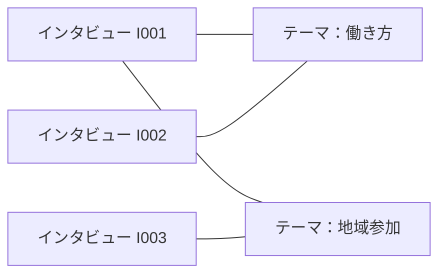

# Obsidianの全体・インタビュー別表示の再設計

研究用Vaultを1つに保ち、「研究全体」「インタビュー1件」「関連する研究」の表示を切り替える。標準機能による構成を実装し、2026-09-13に63ノートをバックアップ付きで移行した。保存済み3件の入口とグラフをObsidian 1.13.7で確認済み。以下は設計時の方針であり、実際の操作と保存仕様は [グラフの使い方](../../OBSIDIAN_GRAPH.md) を参照。コミュニティプラグインは未導入。

## 現状と改善点

調査対象は `runtime/data/obsidian/ResearchVault`。2026-09-13時点でMarkdownは63件、用途別のトップレベルフォルダーは14個。手法定義19件、テンプレート8件、索引フォルダー5件なども同じVaultにある。確認できた `.obsidian` の設定ファイルは `app.json` のみで、グラフ・ブックマーク・ワークスペースの設定ファイルはまだない。実際のObsidian画面は未確認。

仕上げ・会話の入口・引用原文・分析結果が別フォルダーに分散し、生成版のIDがファイル名や階層に現れる。今後、過去版や手法別結果が増えるほど、読む対象を選びにくくなる構成と考えられる。

グラフの点はノート、線は内部リンクである。フォルダーをまとめてもリンク関係は自動では整理されない。保存階層の整理と、表示対象・リンクの設計を一緒に行う。[公式：Graph view](https://help.obsidian.md/plugins/graph)

## 1. 日常の入口を3つにする

| 表示 | 主に表示するもの | 開き方 |
| --- | --- | --- |
| 研究全体 | インタビューの概要、確定したテーマ、必要な研究プロジェクト | 絞り込み済みの全体グラフをブックマーク |
| インタビュー別 | 選んだ1件の概要、全文、アウトライン、分析まとめ、メモ、関連テーマ | そのインタビュー用の絞り込みグラフをブックマーク |
| 関連を探索 | 今開いているノートの周辺。別のインタビューとの関係も含む | ローカルグラフ、深度1を基本・必要時に2 |

ここでいう「全体」は研究用Vault全体。プログラム資料用の `docs/program-vault` は引き続き別Vaultとし、研究用グラフに混在させない。

インタビューごとにVaultを複製すると、共通テーマを通した横断閲覧と設定管理が分散するため、今回の目的では同じVault内で表示を分ける。

全体グラフはブックマークできるが、ローカルグラフは直接ブックマークできない。インタビュー別の固定表示には、フィルターを設定した全体グラフを使う。ローカルグラフは深度を上げると共通テーマ経由で別インタビューまで広がるため、1件限定の表示と区別する。[公式：Bookmarks](https://help.obsidian.md/plugins/bookmarks)

## 2. 保存階層をインタビュー中心にする

```text
ResearchVault/
  00-ホーム.md
  10-インタビュー/
    I001-働き方の聞き取り/
      I001-概要.md
      I001-全文.md
      I001-アウトライン.md
      I001-分析まとめ.md
      I001-研究メモ.md
      I001-操作.md
      I001-状態.md
      I001-保存原文.md
      履歴/                     過去の仕上げ版・分析実行結果
    I002-地域活動の聞き取り/
      ...
  20-テーマ/                    インタビューを横断する概念・コード
  30-人物/                      確認済みの話者プロフィール
  40-研究/                      研究目的・横断比較・研究メモ
  80-添付/
  90-運用/                      手法説明・テンプレート・保存ガイド
```

上記は表示例。`I001` は読みやすい表示用IDとし、既存の会話ID・note_id・発話IDは変更しない。グラフ上でも識別できるよう、ファイル名にインタビューIDと用途を入れる。同名の「会話」「状態」や長い実行IDだけが並ぶ状態を避ける。

本文は録音1件の全文を1ノートに保存する。各発話はブロックIDで参照し、発話ごとのノートは作らない。全文・アウトラインなど現在読むノートは浅い位置に置き、履歴の深い階層は普段閉じて使う。

概要ノートには「全文」「アウトライン」「分析まとめ」「研究メモ」「仕上げ操作」へのリンクと関連テーマを置く。原文・状態・過去版も概要から開けるが、通常のグラフでは補助資料として除外する。

「全文」の手動編集を保護し、AIの生成結果は別の候補版として保存する。候補の確認とアプリへの反映後に、最新版への参照と履歴の表示区分を更新する。過去の本文・根拠を最新版で置き換えない。

## 3. グラフ用の分類とリンクをそろえる

既存の `note_id`、`note_type`、`conversation_id` を保持し、表示用の情報を追加する。

| 情報 | 例 | 役割 |
| --- | --- | --- |
| tags | `graph/overview` | 全体グラフに出す概要・テーマ・研究 |
| tags | `graph/detail` | インタビュー別に出す全文・アウトライン・分析・メモ |
| tags | `graph/support` | 操作・状態・保存原文・運用資料 |
| tags | `graph/history` | 過去版 |
| tags | `interview/i001` | 当該インタビューと関連するノート |
| graph_kind | `interview` / `theme` / `analysis` / `memo` など | 種類別の色分け |

`interview/i001` はその会話のノートに付け、関連する共通テーマにも付ける。複数インタビューに関係するテーマには複数の所属タグを持たせる。タグの所属は、確定したリンクに基づいて更新し、ユーザー独自のタグを保持する。

グラフ用のタグはノートの分類に使い、グラフ内でタグ自体を点として表示する設定は通常オフにする。テーマは独立したノートとして表現する。

全体表示の検索条件案：

```text
tag:#graph/overview -tag:#graph/history -tag:#graph/support
```

インタビューI001限定の検索条件案：

```text
tag:#interview/i001 (tag:#graph/overview OR tag:#graph/detail) -tag:#graph/history -tag:#graph/support
```

検索式の基本仕様は公式のタグ検索・AND/OR条件に基づく。実装時にはObsidianで検索結果とグラフ表示を照合して確定する。[公式：Search](https://help.obsidian.md/plugins/search)

表示設定は、添付ファイルと未作成ノートを非表示、孤立ノートは表示を初期案とする。未整理のインタビューも一覧から消えないようにする。概要を青、テーマを緑、分析を橙、メモを紫、本文を灰色にする。全体グラフでは特に操作ノート・履歴・手法定義を除外し、ホームへの案内リンクが全ノートをつなぐ巨大な中心点にならないようにする。

関係の例：



線は参照・関連を意味し、意見の一致や因果関係を意味しない。テーマノートには、関連する概要へのリンクと、根拠となる全文の発話ブロックへのリンクを残す。意味の同一性を確認したテーマのみを共通化する。頻出語すべてを自動でテーマノートにしない。

グラフに必要な関係はMarkdown本文またはプロパティの実際の内部リンクとして保存する。画面上だけの検索結果やDataview一覧に、グラフの線の生成を依存させない。本文中の発言を書き換えてリンクを埋め込まず、概要・テーマ・根拠欄にリンクを置く。

標準グラフはノート単位であり、全文内の発話やアウトラインの見出しをそれぞれ独立した点にはしない。議題を点にしたい場合は、研究対象として選んだテーマだけを独立ノートにする。

## 4. 画面構成

- 「研究全体」：左にインタビュー一覧、中央に全体グラフ、右に選んだ概要・テーマ。
- 「インタビュー作業」：左に概要、中央に全文とアウトライン、右にローカルグラフまたは対象限定グラフ。
- ブックマークを「研究全体」「インタビュー別」「履歴・運用」にまとめる。普段はファイル一覧よりブックマークと概要ノートを入口にする。

この2つの画面配置はWorkspacesで保存する。対象インタビューは概要・ブックマークから選ぶ。Workspacesがインタビューの所属フィルターを自動生成するとは扱わず、表示対象の生成はアプリ側の役割とする。[公式：Workspaces](https://help.obsidian.md/plugins/workspaces)

インタビュー一覧にはBasesで日付・タイトル・仕上げ状態・テーマを表示する。これは一覧・絞り込み用であり、グラフの代替ではない。使用中のObsidianの対応状況を確認し、利用できない場合は静的なリンク一覧で同じ入口を用意する。[公式：Bases](https://help.obsidian.md/bases)

## 5. 必要なプラグイン

初期実装に必須のコミュニティプラグインは0個。次の標準機能で全体・インタビュー別の表示を構成する。

| 機能 | 採用 | 用途 |
| --- | --- | --- |
| Graph view | 必須・標準 | 全体グラフ、対象限定グラフ、ローカルグラフ |
| Bookmarks | 必須・標準 | 絞り込み済みグラフと概要を呼び出す |
| Workspaces | 推奨・標準 | 全体を見る配置と作業する配置の切り替え |
| Bases | 推奨・標準 | インタビューの一覧・並べ替え・絞り込み |
| Backlinks / Properties view | 推奨・標準 | 参照元と所属情報の確認 |
| Canvas | 任意・標準 | 位置を固定した比較図、議題や引用カードの整理 |

位置を固定して図を読む用途はCanvasが適している。グラフの自動配置とは別の表示として使う。[公式：Canvas](https://help.obsidian.md/plugins/canvas)

さらに「上下・横の関係を整理したナビゲーション」が必要なら、次の組み合わせを第二段階で試す。

| コミュニティプラグイン | 用途・依存関係 |
| --- | --- |
| [ExcaliBrain](https://github.com/zsviczian/excalibrain) | 親・子・関連ノートを配置した関係図。今回の追加候補 |
| [Excalidraw](https://github.com/zsviczian/obsidian-excalidraw-plugin) | ExcaliBrainの描画に必須。手書き図にも利用可能 |
| [Dataview](https://github.com/blacksmithgu/obsidian-dataview) | ExcaliBrainに必須。条件に応じた集計にも利用可能 |

ExcaliBrainの開発元はExcalidrawとDataviewの両方の導入・有効化を必須としている。親子関係の自動推定を研究上の意味と混同しないよう、必要な場合は概要→分析、分析→根拠などの関係を明示的に設定する。標準グラフで読みやすくなるか確認してから追加する。

記事にあるText Generator、ChatGPT MDなどのAIプラグインは、今回のグラフ表示には不要。AI仕上げは既存のGurumoji連携で実行する。Templater・QuickAddも、概要やタグの生成をアプリ側で行う初期構成には必須ではない。

## 6. 実装の順序

1. **表示だけを試作する。** 既存の保存先を維持したまま、インタビューの概要とグラフ分類を追加する。全体・対象限定グラフの検索式、色分け、ブックマーク、画面配置を確認する。
2. **2〜3件で関係を確認する。** 共通テーマを持つインタビューと、共通テーマのない1件を使う。実データに無理にテーマを付けず、足りないケースは試験用Vaultで確認する。
3. **書き出し先を統一する。** `obsidian_finishing.py` と `analysis_store.py` が、同じインタビューID・概要・保存先規則を使うようにする。新規録音は提案の階層へ保存する。
4. **既存データを移行する。** DB・作業状態・Vault・分析成果物を一組でバックアップし、旧→新パスの対応表を作る。実行中の処理がない状態で移行する。元ファイルをすぐ削除せず、リンクと再試行動作を検証してから整理する。
5. **案内とグラフ設定を仕上げる。** 読みやすいファイル名、ホーム、インタビュー一覧、フィルター済みグラフのブックマークと作業画面を用意する。Obsidian画面から保存した設定形式を検証して利用する。
6. **必要に応じてExcaliBrainを比較する。** 同じノート・リンクで比較し、日常の閲覧で改善する場合に採用する。

移行ではVault内のリンクだけでなく、SQLiteの `obsidian_notes` のパス・書き込みhash、仕上げのstateと候補結果の参照先、再書き出し先をそろえる。既存の分析保存は移動や変更を競合として検出するため、ファイルの移動だけで済ませない。原文・固定成果物・発話IDを維持し、反映待ち候補の検証が維持できない場合は「再確認が必要」と表示する。移行でAIを自動再実行しない。

## 7. 完了条件

- 研究全体のグラフから、操作・手法説明・テンプレート・過去版が除かれ、インタビューとテーマの関係が読める。
- I001用のグラフにはI002の本文・分析結果・概要が出ない。共有テーマは表示できる。
- 共通テーマのないインタビューも、全体グラフと一覧から開ける。
- グラフと概要から全文・アウトライン・分析・研究メモへ移動できる。根拠リンクが正しい版の発話へ到達する。
- 新しい録音の保存とAI仕上げ・結果反映が継続し、元のフォルダー構成を再生成しない。
- 人の編集、原文、過去版、IDが保持され、移行の中断・再実行で重複やリンク切れを起こさない。
- グラフ閲覧、一覧更新、フォルダー移行だけではAIを呼ばない。
- AI仕上げは録音1件の本文・前後の文脈・その録音の全体アウトラインを入力にする。グラフ用ノート数やVault全体の大きさに応じて入力トークンを増やさない。

## 参考記事から取り入れる点

| ご提示の資料 | 計画への反映 |
| --- | --- |
| [metamaru：グラフビュー解説](https://zenn.dev/metamaru8/articles/e7a969da230cff) | 全体・ローカルの使い分け、フィルター、色分け、浅い深度を採用。具体的な設定方法は公式ヘルプで照合 |
| [note：ObsidianとChatGPTの連携](https://note.com/fire_house_free/n/n986016f956ca) | AI連携の選択肢を確認。今回のグラフ改善では既存のGurumoji連携を利用 |
| [Qiita：Vault自動整理](https://qiita.com/masa_ClaudeCodeLab/items/aad3985a17586bc8a32e) | 保存規則とリンク付けの規約を明文化し、本文や研究上の意味を不用意に変更しない方針を採用 |
| [adalocamp：AI知識管理](https://zenn.dev/adalocamp/articles/obsidian-ai-knowledge-management) | メタデータと関連情報を整理する発想を参考にする。全ノートの組み合わせをAIに送る方式は、この計画では採用しない |

提示されたBing検索ページは取得エラーとなったため、具体的な機能の判断には上記記事とObsidian公式・プラグイン開発元の資料を使用した。記事にある旧バージョン向け手順やコードはそのまま適用しない。
