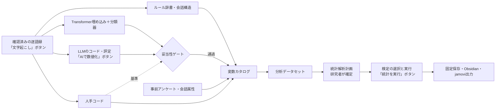

# 発話の数値化とjamovi型統計の自動実行計画（第2版）

逐語録をルール・Transformer・LLM・人手で変数にし、jamoviで実行できるt検定やクロス集計のカイ二乗検定などを自動で実行するための計画。

- **位置づけ：** 提案。アプリのコードは未変更。確認版はブランチ`agent/expand-analysis-ai-workflows`のHEAD`967799a`と、2026-09-15の未コミット作業ツリー。
- **第2版で変えたこと：** 利用者の決定（2026-09-15）と、8人格のパネルによる議論を反映した。パネルと議事録はPersonaVault（`<data>/obsidian/PersonaVault`）の`PNL-quantification-statistics`と`DLB-20260915-quantification-statistics`。Vault間はリンクせず、IDで参照する（ADR-007）。決定は[[40-Design/decisions]]のADR-110〜114に記録した。
- **収束計画との関係：** ADR-106（追加より統合）に合わせ、既存の重複を統合しながら進める。[[40-Design/convergence-plan]]の課題とは、ファイルが重ならない範囲で並行する。
- **根拠：** [[40-Design/method-rules]]、[[50-Analysis-Methods/00-Orchestrator-Common-Contract]]、[[50-Analysis-Methods/03-Statistics/00-Index]]。
- **2026-09-20の接続設計：** [[40-Design/core-handler-routing-reorganization-plan]]の図5で、LLM・Transformer・Jevによるカラム生成から本計画の変数カタログ・データセット・統計実行への接続を明示した。既存のJev／Transformer列とクロス集計は再利用する。任意の生成列を選ぶ共通の統計経路と、一般LLMによる定義済みコード・評定の生成は未実装。既存の分類CSVの`llm_*`列はJevの値であり、一般LLMの生成列と混同しない。

## 0. 決定事項

| 項目 | 決定 | 決めた人 | ADR |
| --- | --- | --- | --- |
| 着手の順序 | 進行中の作業の確定 → Phase 0 → OBS-18 → Phase 1a → 1b → 2 → 3 → 4 → 5 | 人格パネル（利用者が委任） | ADR-110 |
| クラウドLLMへの送信 | 許可する。AI数値化は専用のボタンからだけ実行し、文字起こし・統計の実行とボタンを分ける | 利用者（ボタンの詳細はパネル） | ADR-111 |
| statsmodels | 0.15系を依存に追加する | 利用者 | ADR-112 |
| 配布条件 | 本体はMITライセンス。第三者ライセンス一覧を付け、GPL・AGPLのライブラリはプロセス内に取り込まない | パネル（利用者の方針「使っているライブラリに即す」） | ADR-113 |
| 議論用の人格 | 人格の定義と記憶をPersonaVaultに置き、OrchestratorVault（手法カード・実行記録）と用途を分ける | 利用者の指示に基づきパネル | ADR-114 |
| 検定の計算の置き場所 | 新しいモジュール`statistical_tests.py`にまとめる | パネル | ADR-110 |
| 複数会話の検定 | `interview_comparison`を拡張せず、別の実行種別`study_statistics`にする。画面は既存の比較パネルから始める | パネル | ADR-110 |

## 1. 要点

1. 自動化するのは「数値化 → 変数カタログ → 分析用データセット → 統計解析計画 → 検定の選択と実行 → 固定保存とjamovi再現ファイル」の流れ。この統計処理の中ではLLMを変数生成に使い、検定の選択、統計量、報告文の数値はコードが決定的に作る。別の分析タスクとして行うLLMの根拠付き見解・意味分析・計画提案は、再編計画の分析担当／計画担当の契約で扱う。
2. 数値化は、ルール辞書と会話構造、Transformer埋め込みと軽量分類器、LLM、人手コードを組み合わせる。LLMが出した帰納的なコード案は、研究者がコードブックに採用するまで変数にしない。
3. AI由来の変数は、人手の検証サンプルで一致度のゲートを通るまで、確認的な検定に使わない。
4. 群比較の既定は、話者単位へ集約した表で行う。発話単位の分析には、話者でクラスター化したGEEやクラスター頑健標準誤差を付ける。
5. 本計画で追加するAIによる変数生成は「AIで数値化」から明示的に実行する。文字起こしや統計の実行に数値化を混ぜず、固定データの統計はAIを呼ばず何度でも再実行できる。既存のAI仕上げ・見解生成や、別タスクのLLM分析まで禁止する意味ではない。
6. 最初に作るのは、AIを使わない統計エンジン（Phase 1a）。発話時間、手動コード、質問候補、感情ラベル、相づち、事前アンケートといった既存の変数だけで使える。

## 2. 現状

| 項目 | 現状 | 根拠 |
| --- | --- | --- |
| 検定 | 発話単位で、一元配置分散分析（等分散を仮定）、Kruskal–Wallis、Pearsonのカイ二乗、Pearson／Spearman相関。t検定、Welch補正、事後検定、Fisherの正確検定、多重比較の補正はない | `research_analysis._statistics_analysis` |
| 数値変数 | 発話時間、文字数、形態素数、内容語数、語彙多様性、発話速度（文字/分）の6つ | `research_analysis.NUMERIC_VARIABLES` |
| 統計の比較軸 | 話者または役割だけ。参加バランスの比較軸は、事前アンケート項目（`attribute:<項目>`）まで選べる | `statistics_group_by`（`research_analysis`）、`group_by`（`app.normalize_analysis_group_by`、`group_analysis_for_row`） |
| 重複 | カイ二乗検定が2か所にある。事前アンケートの相関はブラウザー側で別に計算している | `transformer_analysis._backchannel_test`、`static/app.js:speakerSurveyCorrelation` |
| 複数会話 | 2〜8件のインタビューを記述的に比較する。発話を独立標本として検定しない方針をdocstringに明記 | `app.build_interview_comparison` |
| 新規作成フォーム | `finish_in_obsidian`、`ai_provider`（アプリ内AI仕上げ）、`emotion_analysis`がある。文字起こしジョブの中にAIの経路がある（ADR-010） | `templates/index.html` |
| LLM | OpenAI、Gemini、LM Studio（ColabではOllama）へ、JSON Schemaの厳格な出力を要求する。実行中だけの参照番号（`E0001`）、根拠IDの`enum`、検証失敗時の1回の再試行がある。既存のAI見解は話者名（`speaker_name`）も送る | `app.call_ai_json`、`analysis_insights.create_ai_insights`、`ai_http_worker.py` |
| Transformer | `intfloat/multilingual-e5-small`（384次元）の埋め込みとK-means。ベクトルを結果に保存する | `transformer_analysis.encode_texts`、`_pack_vectors` |
| 人手コード | コードブック（定義・含める例・除外する例）。1発話に複数コード。AI候補と確定コードを区別する規約がある | [[40-Design/method-rules]]の`qualitative_coding` |
| 分析方針の表 | `analysis_plan`（section、item、status、value、role、data_sufficiency、reason、limitation） | `app.build_focus_group_analysis_plan` |
| 開発環境 | `.venv`にSciPy 1.18.1、scikit-learn 1.9.1、pandas 3.0.3、torch 2.8（CUDA 12.8）、transformers 4.57.6。statsmodels、R、jamovi本体は未導入 | 2026-09-15に確認 |

SciPy 1.18.1だけで使える関数：`ttest_ind(equal_var=False)`（Welch）、`f_oneway(equal_var=False)`（Welchの分散分析）、`tukey_hsd(equal_var=False)`（Games–Howell）、`mannwhitneyu`、`ttest_rel`、`wilcoxon`、`friedmanchisquare`、`chi2_contingency(method=…)`（並べ替え・モンテカルロ）、`fisher_exact`（2×2。それ以外は`method`を指定）、`binomtest`、`chisquare`、`kendalltau`、`contingency.odds_ratio`、`false_discovery_control`（Benjamini–Hochberg）、`permutation_test`、`bootstrap`。

## 3. 設計原則

1. **判断の分担**
   - 研究者：研究質問、確認的か探索的か、分析単位、変数の定義（コードブック・評定基準）、検証サンプルの判定、解釈。
   - コード：データセットの生成、選択表による検定の決定、前提の確認、効果量、補正、報告文の数値、jamovi出力。
   - AI：発話へのラベルと評定の候補。任意で分析計画の下書き。検定の選択、p値、報告文の数値は作らせない。
2. **測定と推論を分ける。** 変数ごとに出所・版・尺度・妥当性の状態を持つ。`validated`でない変数は確認的な計画に選べず、探索的な分析では状態を表示する。
3. **分析単位を明示する。** 発話／会話内の話者／会話をまたぐ参加者／インタビューのどれで検定したかを、結果の行に残す。
4. **既存の契約に載せる。** fingerprint、`stale`、`not_run`・`empty`・`unavailable`・`fallback`・`partial`、根拠発話ID、固定保存、Vault出力（[[50-Analysis-Methods/00-Orchestrator-Common-Contract]]）。計算できない値を0やp=1で埋めない。
5. **追加より統合（ADR-106）。** 新しいファイルは、既存の重複を置き換える場合に限り、理由をADRに書く。
6. **送る情報を最小にする。** クラウドLLMへの送信は許可するが、判定に必要な本文・話者ID・役割・文脈だけを送り、同意の状態を確認する（ADR-111）。
7. **トークンを使う操作を分ける。** 送信は、利用者が「AIで数値化」を押し、送信先・件数・推定トークンを確認したときだけ行う。
8. **配布条件に合う依存だけを使う。** プロセス内でimportする依存は、12章の方針に合うものに限る（ADR-113）。

## 4. 全体の流れ

## 5. 数値化の手段

| 手段 | 変数の例 | 強み | 注意 | 位置づけ |
| --- | --- | --- | --- | --- |
| ルール辞書（KH Coderのコーディングルール型） | 語・品詞・否定の組合せによる「あり／なし」、ヘッジ（「かもしれない」「と思う」）、否定、一人称（「私」「私たち」）、丁寧語、フィラー、疑問形 | 決定的、無料、規則を読めば判定理由が分かる。GiNZAの形態素を使える | 言い換え・文脈・皮肉に弱い | Phase 2。比較の基準線 |
| 会話構造・時間 | 発話数、発話時間の割合、平均ターン長、応答までの間、重なり、相づちの応答率、司会の質問への応答数 | 実装済みの集計を話者別の変数にするだけ | 話者分離・時刻の誤りに影響される | Phase 1a〜2。話者単位の主な変数 |
| 発話速度（モーラ/秒） | Sudachiの読み（カタカナ）からモーラを数え（小書きのャ・ュ・ョ等は前の文字と合わせて1モーラ）、発話時間で割る | 漢字の割合に左右される「文字/分」より話す速さに近い | 時刻の精度、重なり、発話内の無音 | Phase 2 |
| 心理語彙辞書（J-LIWC2015）など | 感情語・社会語・認知語の割合 | 査読済みの日本語版があり、他研究と比べやすい | 利用条件の確認。書き言葉も含む語彙を話し言葉に使う妥当性 | 任意 |
| Transformer埋め込み＋軽量分類器 | E5ベクトルとロジスティック回帰によるコードの確率、テーマの所属 | ローカル、高速、同じ入力なら同じ結果。多数の会話へ広げやすい。scikit-learnは導入済み | 学習用のラベル（人手、またはゲートを通過したLLMラベル）が必要 | Phase 4。LLMと人手のラベルを全会話へ広げる |
| ゼロショット（コード定義・例文との類似度、NLI） | コードの候補 | ラベルが要らない | 日本語会話での精度が未知で、閾値に強く依存する | 候補の提示だけ。検定の変数にしない |
| LLMのコード・評定 | 意見表明、理由付け、立場、質問への回答の適合、具体性（1〜5） | 定義文と例だけで複雑な構成概念を扱える | 費用、時間、モデル更新による変動、送信先、群と相関する誤り | Phase 3。必ずゲートを通す |
| 音声感情（実装済み）・音響特徴 | AISTモデルの感情ラベル、F0の平均と幅、強度、ポーズの割合 | 文字にならない声の情報 | 録音条件・話者差・重なりの影響が大きい。依存の追加とライセンス（Parselmouth経由のPraatはGPL） | 感情ラベルはPhase 1aで変数化。音響特徴はPhase 5 |
| 人手コード（実装済み）＋2人目のコーダー | 確定したコード | 研究上の定義そのもので、ゲートの基準になる | 時間がかかる | 全Phase |
| 事前アンケート（実装済み）・会話属性 | 群、共変量、尺度の得点 | 参加者単位の情報 | 回答の整形、欠測 | Phase 1aから群・共変量に使う |
| TF-IDF＋線形分類器 | コードの確率 | GPUが要らない。Transformer分類器の比較基準になる | 語の一致に依存する | Phase 4の比較対象 |
| 構造的トピックモデル（STM、R） | 属性によるトピック出現率の差 | 共変量の効果を不確実性付きで推定できる | Rに依存する。トピック数の判断が要る | Phase 5の外部手法 |

推奨する組み合わせ：

1. ルール辞書と会話構造で、AIを使わない変数を先に作る。
2. 研究者がコードブックを定め、検証サンプルを人手でコードする。
3. 定義が複雑なコードだけ、LLMで全発話の候補を作る。
4. ゲートを通過したラベルでE5＋ロジスティック回帰を学習し、全会話へ適用する。LLMの費用を抑え、再計算しても結果が変わらない。
5. 分類器の確信度が低い発話と、LLMと分類器の判定が食い違う発話だけを、人かLLMへ回す（能動学習）。

LLMが出す帰納的なコード案（新しいテーマやコードの提案）は、研究者のメモとして示すだけにする。研究者がコードブックに採用し、定義と例を書いた時点で初めて変数になる。

## 6. LLMによるコード・評定

既存の`call_ai_json`、実行中だけの参照番号、`enum`による根拠IDの制約、1回の修正再試行を共通化して使う。

| 項目 | 設計 |
| --- | --- |
| 実行の入口 | 分析画面の「AIで数値化」ボタンだけ。①試行（検証サンプル、または利用者が選んだ少数の発話）②全件、の2段階で実行する。文字起こしジョブ、統計の実行、保存、Vault出力からは呼ばない |
| 送信前の確認 | 送信先（事業者・モデル）、対象の発話数、推定トークン、1回の上限、話者台帳と会話話者の同意の状態を表示する |
| 同意の扱い | 同意しなかった話者の発話は送らず、除外した件数を結果に記録する。同意が未確認の話者を含む場合は警告し、利用者の確認を記録する |
| 送る情報 | 発話本文、話者ID、役割、判定に必要な文脈。話者の氏名・仮名・所属は送らない |
| 入力 | コードブック（ID・定義・含める例・除外する例）、評定基準（1〜5の各段階の説明と例）、対象発話と文脈（直前の質問、同じ話者の前後）。文脈は判定の対象外であることを、プロンプトとschemaで区別する |
| 出力 | 発話ごと・コードごとに`ref`、`code_id`、`present`（有／無）、`evidence_quote`、`confidence`。評定は`score`（1〜5、判定できない場合は`null`） |
| サーバーでの検証 | `ref`と`code_id`は`enum`。`evidence_quote`は対象発話本文の部分文字列と完全に一致すること（文脈からの引用は拒否）。応答にない発話は「未判定」とし、「なし」や0にしない |
| キャッシュと再開 | 発話本文のhash、コードブック版、プロンプト版、モデルが同じ判定は再利用し、送り直さない。上限トークンに達する前に止める。失敗したバッチだけ再実行する |
| 安定性 | 検証サンプルと、無作為に選んだ安定性確認用の部分（抽出確率を記録）だけ3回実行し、それ以外は1回。実行間のαがしきい値未満のコードは、全件を3回にするか、コードブックを直す |
| 保存 | AIのラベルは`annotation.codes`に書かず、別のデータセット（案：`ai_code_labels`）に保存する。provider、model、プロンプト版のhash、schemaのhash、コードブック版のhash、エフォート、実行番号、日時を記録する。人のコードへの採用は研究者の明示操作だけにし、採用の記録を残す |
| 送信の記録 | 件数、hash、事業者、モデル、日時、トークンだけを残し、本文はログに残さない。OpenAIへの要求は既存どおり`store: false` |
| 使用量 | `app.extract_ai_token_usage`で記録し、キャンセルと進捗は既存のAI要求台帳の方式に合わせる。新しいschema名は`ai_effort.SCHEMA_STAGES`の既存段階へ対応付ける |
| させないこと | 検定の選択、統計量やp値の計算、報告文の数値、コードブックの自動変更 |

## 7. 妥当性ゲート

AIの変数を検定に使う前の条件。ルール辞書の変数は規則そのものを定義として報告し（例：「『かもしれない』を含む発話の割合」）、構成概念の代わり（例：不確実性）として解釈する場合だけ同じゲートを使う。

1. **検証サンプル：** 会話・話者・AI判定の有無で層別して無作為に抽出し、抽出確率を保存する（Phase 5の補正に使う）。研究者はAIのラベルを見ない状態で、キーボードで操作できる画面からコードする。件数の既定値はPhase 0で、αの信頼区間の幅から決める。
2. **指標：** 名義はKrippendorffのα、Cohenのκ、適合率・再現率・F1、混同行列。順序評定は順序尺度のαまたはICC。LLMの実行間の一致もαで出す。αは点推定とブートストラップ95%信頼区間を出し（Hayes & Krippendorff 2007）、下限がしきい値を下回る場合は検証件数の追加を促す。
3. **判定の既定案：** Krippendorff（2004）の推奨に合わせ、α≧.800を`validated`、.667≦α<.800を`tentative`（探索的な分析だけ）、α<.667を`failed`（検定に使わない）とする。研究者が変える場合は理由を記録する。
4. **群ごとの誤り：** 群ごとに適合率・再現率を出す。群によって誤りの傾向が違う場合、その群比較は`tentative`以下に下げる。群と相関する誤分類は、実際にはない差を作り得る（TeBlunthuis et al. 2024）。
5. **コードブックの見直し：** 不一致の発話を研究者が読み、定義を直した場合は、コードブックの版を上げて検証をやり直す。
6. **報告：** 検定結果の行に、変数の出所、ゲートの判定、検証の件数を付ける。
7. **発展（Phase 5）：** 検証サンプルを使うDesign-based Supervised Learning（Egami et al. 2023）やPrediction-powered Inference（Angelopoulos et al. 2023）で、AIラベルに基づく割合や差の信頼区間を補正する。

## 8. 分析単位とデータセット

| データセット（案） | 1行の単位 | 主な列 | 主な用途 |
| --- | --- | --- | --- |
| `stat_utterances` | 発話 | 発話ID、会話ID、話者、参加者コード、役割、時刻、数値変数、コード（人手・ルール・AIを別の列に分ける）、テーマ、感情ラベル | 記述統計、GEE・混合モデル、探索的なクロス集計 |
| `stat_speakers` | 会話×話者 | 発話数、発話時間の割合、コードごとの発話率とその分母、評定の平均、事前アンケート項目 | 群比較の既定（t検定など） |
| `stat_participants` | 参加者（会話をまたぐ） | 条件ごとの値（例：事前／事後のセッション） | 対応のある検定 |
| `stat_interviews` | インタビュー | 会話属性、集計値 | 会話間の比較。件数が少なければ記述だけ |
| `variable_catalog` | 変数 | ASCIIの列名、日本語の表示名、尺度（名義・順序・連続・ID）、出所、手法IDと版、単位、集約の規則、欠測の規則、妥当性の状態 | jamoviでの型設定、報告 |
| `validation_samples` | 検証対象の発話×コード | 層、抽出確率、人手のラベル、AIのラベル、コーダー、日時、コードブック版 | 一致度、ゲートの判定、Phase 5の補正 |

- 率には分母の列を必ず添える。発話が少ない話者の率は不安定なので、最小発話数を計画で決める。
- 「未判定」「対象外」「同意による除外」を0にしない。欠測として数え、理由を残す。
- 会話をまたいで参加者を同一とみなすのは、話者台帳の参加者コードで結び付いている場合だけにする。

アプリ内のデータセットの正本は型・尺度・行キー・欠測理由を持つJSON等とし、CSVはそこから生成する交換・表計算用出力とする。既存のJev／Transformer列は固定`result.json`の型付き値から取り込む。現行CSVは`null`と空文字、数式対策の`'`と元の文字列を一意に復元できないため、CSVしかない列の意味を推測で埋めない。必要な値を復元できない場合は理由付きで利用不可にする。詳細は[[40-Design/core-handler-routing-reorganization-plan]]の図4に従い、既存CSVの数式対策とhashを維持する。

## 9. 統計解析計画と検定の自動選択

### 9.1 計画

`app.build_focus_group_analysis_plan`が作る`analysis_plan`を拡張し、研究者が確定する。

- 研究質問のID、確認的か探索的か、分析単位、目的変数、群または説明変数、対応の有無、有意水準、補正の族、除外規則、最小N。
- 確定した日時とfingerprintを保存する。結果を見た後に変えた計画は、自動的に探索的として扱う。
- 実行した検定の総数を結果に記録し、画面に出していない検定を隠さない。

### 9.2 選択表（jamoviとの対応）

jmvの関数名と引数は、2026-09-15にCRANのjmvリファレンスで確認した。

| 目的変数とデザイン | 既定の検定 | 併記する検定 | 効果量 | jamovi（jmv） | 実装 | 現状 |
| --- | --- | --- | --- | --- | --- | --- |
| 連続・独立2群 | Welchのt検定 | Mann–Whitney U、Studentのt検定 | Cohenのd（CI）、順位双列相関 | Independent Samples T-Test（`ttestIS`：`welchs`、`mann`、`norm`、`eqv`） | SciPy（1a） | 未実装 |
| 連続・対応2条件 | 対応のあるt検定 | Wilcoxonの符号付順位検定 | d_z（CI） | Paired Samples T-Test（`ttestPS`） | SciPy（1a） | 未実装 |
| 連続・基準値との比較 | 1標本t検定 | Wilcoxonの符号付順位検定 | d（CI） | One Sample T-Test（`ttestOneS`） | SciPy（1a） | 未実装 |
| 連続・独立3群以上 | Welchの一元配置分散分析＋Games–Howell | Kruskal–Wallis＋DSCF対比較 | ω²・η²、ε² | One-Way ANOVA（`anovaOneW`：`welchs`、`phMethod`）、非パラメトリック（`anovaNP`：`pairs`） | SciPy（1a。DSCFは自前） | 発話単位の分散分析（等分散）とKruskal–Wallisだけ |
| 連続・反復3条件以上 | 反復測定分散分析（球面性の補正） | Friedman | 偏η² | `anovaRM`、`anovaRMNP` | statsmodels（1b）、SciPy | 未実装 |
| 連続・2要因または共変量 | 要因分散分析、共分散分析 | — | 偏η² | `ANOVA`、`ancova` | statsmodels（1b） | 未実装 |
| 名義×名義・独立 | Pearsonのカイ二乗 | Fisherの正確検定（2×2）、R×Cのモンテカルロ正確検定、調整済み標準化残差 | Cramér's V、φ、オッズ比（2×2、CI） | Contingency Tables（`contTables`：`chiSq`、`fisher`、`odds`、`phiCra`、`exp`） | SciPy（1a） | 発話単位のカイ二乗とCramér's Vだけ |
| 2値・対応2条件 | McNemar検定 | 正確検定（不一致ペアの二項検定） | 不一致ペアの比 | Paired Samples Contingency Tables（`contTablesPaired`：`chiSq`、`exact`） | SciPy＋自前（1a） | 未実装 |
| 名義・期待比率との比較 | カイ二乗適合度検定、二項検定 | — | — | `propTestN`、`propTest2` | SciPy（1a） | 未実装 |
| 連続・順序どうし | Pearson（連続）、Spearman・Kendallのτb（順序） | 残りの係数 | 係数（CI） | Correlation Matrix（`corrMatrix`：`pearson`、`spearman`、`kendall`、`ci`）、`corrPart` | SciPy（1a） | 発話単位のPearson・Spearman（CIなし） |
| 連続・2値・順序と複数の説明変数 | 線形・二項ロジスティック・順序ロジスティック回帰 | — | 係数（CI） | `linReg`、`logRegBin`、`logRegOrd` | statsmodels（1b） | 未実装 |
| 尺度の項目（事前アンケート） | 信頼性（α） | ω（因子分析が必要） | — | Reliability Analysis（`reliability`） | 自前（1a） | 未実装 |
| 話者・会話に入れ子の発話 | 話者でクラスター化したGEE（二値・計数）、クラスター頑健標準誤差、線形混合モデル | 話者単位への集約、話者単位の並べ替え検定 | — | 基本機能にはない（GAMLjなどの追加モジュール） | statsmodels（1b。一般化線形混合モデルはPhase 5） | 未実装 |

### 9.3 選択と実行の規則

- **前提の検定で使う検定を切り替えない。** Shapiro–WilkやLeveneの結果で、t検定と非パラメトリック検定を自動で入れ替えない。平均の比較の既定はWelch型とし、非パラメトリック検定を感度分析として並べる（Rasch et al. 2011、Delacre et al. 2017）。前提の確認は、jamoviの出力と照合できるよう表示だけ行う。
- **期待度数：** 期待度数5未満のセルが20%を超えるか、1未満のセルがある場合は、カイ二乗のp値を採用せず、Fisherの正確検定（2×2）またはモンテカルロ正確検定に切り替える（Cochran 1954の目安を既定案とする）。切り替えた理由を行に残す。
- **最小N：** 群のNが計画の最小Nに届かない場合は`not_computable`とし、理由を残す。
- **多重比較：** 補正の族は研究質問ごとに計画で決める。確認的な検定はHolm、多数のコード×群をふるい分ける探索的な検定はBenjamini–Hochberg。補正前と補正後のp値を両方保存する。
- **分析単位の既定：** 群比較は`stat_speakers`で行う。発話単位の検定は「探索的・非独立」の警告を付け、話者でクラスター化したGEEまたはクラスター頑健標準誤差を併記する（Aarts et al. 2014、Jaeger 2008）。
- **効果量の定義：** jamoviと同じ定義（dの分母など）を、golden値との照合で確定する。定義を変えたら手法の版を上げる。
- **画面：** 推奨の検定を主に表示し、併記する検定は折りたたむ。jamoviのメニュー名を併記する。
- **AIを呼ばない：** 統計の実行、保存、Vault出力はLLMを呼ばない。テストで確かめる。
- **報告：** 検定名、統計量、自由度、補正前後のp値、効果量と95%CI、群ごとのNと平均または中央値、前提の注記、変数の出所と妥当性の状態。結果の文章は、コードが数値を埋める日本語テンプレートで作り、LLMで生成しない。

### 9.4 jamoviとRでの再現

| 出力 | 内容 |
| --- | --- |
| `jamovi_<単位>.csv` | UTF-8、ASCIIの列名。名義変数は文字のラベルにし、jamoviが名義として読み込めるようにする |
| `variable_catalog.csv` | 日本語の表示名、尺度、出所、妥当性の状態 |
| `jmv_syntax.R` | 例：`jmv::ttestIS(data = speakers, vars = "code_c01_rate", group = "gender", welchs = TRUE, mann = TRUE, norm = TRUE, eqv = TRUE)`。効果量などの引数は実装時にjmvリファレンスで確認する |
| `jamovi_steps.md` | メニューの手順と設定。1〜5の評定は読み込み後に「Ordinal」へ変更する、などの注意 |

- jamoviの`.omv`は自前で書き出さない。公開された仕様に基づかず、形式の変更に弱いため。
- jamovi本体、R、jmvは利用者が別に導入するソフトとして扱い、アプリに同梱もimportもしない。
- **一致テスト：** 架空データをjamovi（またはR＋jmv）で一度計算し、統計量・自由度・p値・効果量をgolden値としてテストに保存する。自動テストはRなしで照合する。
- CSVをjamoviで開いたときの文字化けと型の推定は、実機で確認する。

## 10. 既存モジュールへの統合

| 役割 | 統合先 | 変更の要点 | 解消する重複 |
| --- | --- | --- | --- |
| 検定の計算 | 新しいモジュール`statistical_tests.py`（ADR-110） | SciPyとstatsmodelsの計算をまとめ、`research_analysis`、`transformer_analysis`、`app`（事前アンケート、`study_statistics`）から呼ぶ。SciPyとstatsmodelsは関数内でimportする。結果の行は現行の`statistical_tests`の列を拡張する | カイ二乗の2実装、ブラウザー側の相関計算 |
| 変数とデータセット | `research_analysis._segment_dataset`、`RESEARCH_CSV_FIELDS` | 列の追加、話者・参加者・インタビュー単位への集約、`variable_catalog`、`validation_samples` | — |
| 比較軸 | `statistics_group_by` | `attribute:<項目>`、会話属性、参加者コードを追加し、`group_by`と選択肢の語彙を揃える | 統計と参加バランスで選べる比較軸が違う |
| ルール辞書 | `research_analysis`（形態素・正規形） | コーディングルールを宣言的なJSONで定義する。ファイル内のコードは実行しない | `transformer_analysis`の相づち辞書と話者リザルトの正規表現を、移行候補として棚卸しする |
| LLMのコード・評定 | `analysis_insights.create_ai_insights`の参照番号と検証再試行（`checked_call`）を共通化する | 引用の一致検証、試行と全件、キャッシュ、上限トークン、同意の判定、未判定の扱い | 検証再試行の複製を作らない |
| 画面のボタン | 新規作成（文字起こし）、「分析・可視化」の統計パネル | 「文字起こし」「AIで数値化」「統計を実行」を別のボタンにする。AI数値化は既存のAI要求台帳とキャンセルの方式で実行する。新しい画面は作らない | 文字起こしジョブの中でのAI数値化 |
| 埋め込み分類器 | `transformer_analysis`（`encode_texts`、保存したベクトル） | ロジスティック回帰、層化交差検証、確率の出力 | — |
| 複数会話の検定 | 別の実行種別`study_statistics`（`SEPARATE_RUN_METHODS`） | 比較パネルから始める。会話数や群のNが最小Nに届かない場合は記述だけにする | `interview_comparison`の記述的な契約を変えない |
| 事前アンケート | `static/app.js`の集計 | 相関とクロス集計をサーバーの同じ検定関数で計算し、画面は結果を表示する | ブラウザー側の独自計算 |
| 手法の登録 | `analysis_method_registry.METHODS`、`METHOD_GROUPS`、`method_results` | 下の手法IDを追加し、既存の統計3手法は版を上げる | — |
| 保存・Vault | `AnalysisStore`、`VaultRegistry.publish_analysis` | 既存の固定保存、Orchestratorの実行記録、Visualizationの図表仕様を使う。人のノートには書かない（ADR-109） | — |
| 依存とライセンス | `config/requirements.txt`、`LICENSE`、`THIRD_PARTY_NOTICES.md`、README | statsmodelsの追加と、12章の一覧の維持 | — |

手法ID（案）：

| `method_id` | `execution_kind` | 内容 |
| --- | --- | --- |
| `descriptive_statistics`、`group_statistics`、`correlation` | builtin（既存） | 版を上げ、計画に基づく検定・補正・効果量のCIへ拡張する |
| `rule_coding` | builtin | ルール辞書によるコード |
| `ai_coding` | builtin | LLMによるコード・評定の候補 |
| `embedding_classifier` | builtin | E5埋め込み＋分類器 |
| `coding_reliability` | builtin | 人手・AI・実行間の一致度とゲートの判定 |
| `study_statistics` | builtin（独立した実行） | 複数会話の計画に基づく検定 |
| `acoustic_features` | builtin（任意の依存） | F0、強度、ポーズ |
| 外部R（jmv、STM） | external | 入力hashに結び付かない結果は`unverified` |

## 11. 実装の順序

各段階を単独でレビューし、関係する回帰テスト、手法ノート、[[20-Modules/feature-inventory]]、[[40-Design/decisions]]を同じ変更で更新する。

### 着手の条件

別の作業による未コミットの変更（セットアップ、VisualizationVaultの起動スクリプト、Obsidian安全化で`analysis_store.py`・`obsidian_layout.py`・`obsidian_finishing.py`などを変更中）が確定するまで、同じファイルに触れる実装を始めない。[[40-Design/convergence-plan]]の他の課題（UX-33など）は、ファイルが重ならなければ並行してよい。

### Phase 0：決定の実装と契約

- **範囲：**
  - `config/requirements.txt`にstatsmodels 0.15系を追加し、セットアップのテストとREADMEの依存の記載を更新する。
  - `LICENSE`（MIT。著作権者名は利用者が確認）と`THIRD_PARTY_NOTICES.md`を作る。
  - 保存契約（変数カタログ、分析用データセット、統計解析計画、検証サンプル）を`30-Data`に定義する。抽出確率と検証の状態の列を最初から入れる。
  - 一致テスト用の架空データとgolden値を作る。jamoviかR＋jmvは、このときだけ用意する。
  - 13章の既定値を決める。
- **完了条件：** statsmodelsを入れた環境で既存のテストが通る。ライセンスの一覧が12章と一致する。

### OBS-18：生成Vaultの書き出し失敗を保存APIに集約する

- **理由：** 新しい統計とAI数値化の実行記録も、OrchestratorVaultとVisualizationVaultへ出力する。失敗が見えない状態で手法を増やさない。
- **範囲と完了条件：** [[40-Design/known-issues]]のOBS-18の受け入れ条件どおり。1レビュー単位を超える場合は、Phase 1aとの並行を再判断する。

### Phase 1a：SciPyの検定・集約・jamovi出力（AIなし）

- **範囲：** `statistical_tests.py`、9.2のうちSciPyで実装する検定、効果量のCI、Holm・BH補正、話者・参加者・インタビュー単位への集約、比較軸の拡張、計画→選択→実行→テンプレート報告、jamovi用CSV・変数カタログ・jmv構文・手順書、「統計を実行」ボタン。既存の感情ラベル、手動コード、相づち、事前アンケートを変数カタログへ登録する。
- **統合：** 既存の分散分析・Kruskal–Wallis・カイ二乗・相関、相づちのカイ二乗、ブラウザー側の相関を`statistical_tests.py`へ移す。
- **完了条件：**
  - golden値と許容誤差内で一致する。
  - `statistical_tests`・`correlations`の列の互換を保つか、版を上げて移行を説明する。
  - 空データ、1群、欠測、全て同じ値、期待度数の不足、最小N未満で`not_computable`と理由を返す。
  - 計画、比較軸、集約の規則をfingerprintに含め、変更すると`stale`になる。
  - 統計の実行・保存・Vault出力がAIを呼ばない。
- **テスト：** `tests/test_research_analysis.py`、`test_analysis_storage.py`、`test_interview_comparison.py`、`test_browser_e2e.py`（計画→結果→保存）。

### Phase 1b：statsmodelsによる分析

- **範囲：** 発話単位の探索的な分析への、話者でクラスター化したGEE（二値・計数）とクラスター頑健標準誤差。線形混合モデル。線形・二項ロジスティック・順序ロジスティック回帰。反復測定・要因の分散分析、共分散分析。
- **完了条件：** golden値と一致する。モデルが収束しない場合を`not_computable`と理由で返す。GEEと混合モデルの入力表を、Phase 5の補正でも使える形で保存する。statsmodelsのimportがWebの起動を遅らせない。

### Phase 2：決定的な数値化（ルール辞書・会話構造）

- **範囲：** 宣言的なコーディングルール、言語マーカーの辞書、モーラ/秒の発話速度、話者別の会話構造変数。利用条件を確認できた場合だけ、J-LIWC2015などの辞書を任意で使う。
- **完了条件：** ルールの版と辞書のhashがfingerprintに入る。ルールごとに該当発話へ戻れる。人手コードと比べられる形で保存する。

### Phase 3：LLMのコード・評定と妥当性ゲート（同時に出す）

- **範囲：** 6章と7章。「AIで数値化」ボタン、試行と全件の2段階、送信前のダイアログ、同意の扱い、キャッシュと上限トークン、失敗したバッチだけの再実行、AIのラベルを隠した検証画面、一致度（信頼区間付き）と群ごとの誤り、ゲートの状態の変数カタログへの反映。
- **完了条件：** モックAIで、schema、引用の一致、未判定、再試行、3回の実行の集約、キャンセル、見積もり、上限での停止、キャッシュの再利用、同意しなかった話者の除外を検証する。ゲート未通過の変数を確認的な計画に選べない。AIのラベルが人のコードに自動で入らない。
- **限界：** 実際のLLMの精度は、研究データごとに検証サンプルで測る。アプリのテストでは保証しない。

### Phase 4：Transformer分類器と能動学習

- **範囲：** E5ベクトル＋ロジスティック回帰（層化交差検証、確率の校正の確認）、低確信の発話とLLM不一致の発話の検証キューへの送付、学習ラベルの出所の記録、TF-IDF＋線形分類器との比較。ゼロショットの類似度は候補の提示だけに使う。
- **完了条件：** seed、分割、モデルのrevision、学習ラベル集合のhashを保存する。交差検証とゲートを通過した分類器だけを変数にする。全会話へ再適用しても同じ結果になる。

### Phase 5：発展（誤分類の補正・音響・外部R）

- **範囲：** 一般化線形混合モデル、話者単位の並べ替え検定、AIラベルの変数へのDSL・PPI型の補正、音響特徴（librosaのpYINなど。ライセンスを確認）、R＋jmvの外部実行、STM。
- **完了条件：** 手法ノート、査読文献、限界を登録してから有効にする。

## 12. 配布条件（ライセンス）

2026-09-15に、`.venv`のパッケージのメタデータとライセンスファイル、PyPIの情報、FFmpegのビルド構成（`-version`）で確認した。

| 区分 | 対象 | ライセンス | 義務・扱い |
| --- | --- | --- | --- |
| 本体 | このリポジトリのコード | MIT（Phase 0で`LICENSE`を追加） | 著作権表示とライセンス文 |
| 直接の依存 | Flask、psutil、NumPy、SciPy、scikit-learn、pandas、torch、torchaudio | BSD系 | 表示の保持 |
| 直接の依存 | openai-whisper、faster-whisper、CTranslate2、PyYAML、openpyxl、GiNZA、ja-ginza、spaCy | MIT | 表示の保持 |
| 直接の依存 | WhisperX、imageio-ffmpeg（ラッパー部分） | BSD-2-Clause | 表示の保持 |
| 直接の依存 | transformers、SudachiPy、SudachiDict-core | Apache-2.0 | 表示とNOTICEの保持 |
| 追加する依存 | statsmodels（BSD-3-Clause）、patsy（BSD-2-Clause）、formulaic（MIT）、interface-meta（MIT） | 許容型 | 表示の保持 |
| 間接の依存 | pyannote.audio（MIT）、torchcodec（BSD-3-Clause）、certifi（MPL-2.0）、tqdm（MPL-2.0とMIT） | 許容型、ファイル単位のコピーレフト | MPL-2.0の部分は改変しなければ表示だけ |
| 同梱バイナリ | imageio-ffmpegのWindows wheelに入るFFmpeg 7.1（gyan.dev essentialsビルド、`--enable-gpl --enable-version3`） | GPLv3 | 別プロセスとして実行する。`.venv`やインストーラーを配布する場合は、GPLv3の文と対応するソースの入手方法を付ける。ソース（Git）の配布には含まれない |
| 環境にあるが依存ではない | PySide6、shiboken6 | LGPL-3.0／GPL | どのパッケージにも必要とされず、コードでも使っていない。配布物に含めない |
| モデルの重み | Whisper、pyannote、E5、AISTの感情モデルなど | 各配布元の規約（Hugging Faceで同意が必要なものを含む） | リポジトリに含めない。利用者が各規約に同意して取得する |
| 利用者が別に導入するソフト | jamovi、R、jmv | 各ソフトの規約 | 同梱もimportもしない。アプリが出力するのはデータとR構文だけ |

依存の方針：

- プロセス内でimportする依存は、MIT・BSD・Apache-2.0などの許容型、改変しないMPL-2.0、動的リンクのLGPLに限る。
- GPL・AGPLのライブラリ（pingouin、Parselmouth、jmvReadWriteなど）はimportしない。必要なら、利用者が別に導入する外部プログラムとして呼ぶ。
- 参加者データとモデルの重みは、どの配布物にも含めない。
- 依存を追加・更新するときは、この表と`THIRD_PARTY_NOTICES.md`を同じ変更で更新する。

## 13. Phase 0で決める既定値

1. 検証サンプルの件数と層の設計（αの信頼区間の幅から決める）。
2. 最小N、補正の族、有意水準の既定値。
3. AI数値化の1回の上限トークンと、試行の件数。
4. 会話をまたいで参加者を同一とみなす条件（話者台帳の参加者コードの確認状態）。
5. `LICENSE`の著作権者名。
6. 既存のAI見解が話者名を送っている点を、ADR-111に揃えるか。

## 14. 採用しない案

- LLMに検定の選択、実行、p値の記述まで任せる。数値の誤生成、再現性の欠如、結果を見てからの分析の選び直しを防げない。
- 文字起こしジョブの中や、統計の実行・保存のたびにLLMを呼ぶ。利用者が意図しないトークンを使う。
- 話者の氏名・仮名・所属をLLMへ送る。
- 発話を独立標本とした検定を、群比較の既定にする。
- 正規性・等分散性の検定結果で、使う検定を自動的に切り替える。
- AIのラベルを人のコードの列へ自動で書き込む。
- 検証していないAIの変数で、確認的な結論を出す。
- GPL・AGPLのライブラリをimportする。
- jamoviの`.omv`を自前で書き出す。
- `interview_comparison`に多数の会話の推測統計を詰め込む。
- 統計用の画面を別に新設する。
- 人格パネルの議論をそのまま決定とする。決定はADRに記録し、利用者の決定を覆さない。

## 15. 文献

2026-09-15にCrossref、出版社、学会の論文ページで書誌情報を確認した。実装時に採用した文献は[[50-Analysis-Methods/99-Peer-Reviewed-References]]へ移す。既存の一覧にあるGilardi et al. 2023（LLMによる注釈）とReimers & Gurevych 2019（文埋め込み）も使う。

### 検定の選択・補正・入れ子

- **[Delacre, Lakens & Leys 2017](https://doi.org/10.5334/irsp.82)**. *Why Psychologists Should by Default Use Welch's t-test Instead of Student's t-test*. International Review of Social Psychology, 30(1), 92–101.
- **[Rasch, Kubinger & Moder 2011](https://doi.org/10.1007/s00362-009-0224-x)**. *The two-sample t test: pre-testing its assumptions does not pay off*. Statistical Papers, 52(1), 219–231.
- **[Games & Howell 1976](https://doi.org/10.3102/10769986001002113)**. *Pairwise Multiple Comparison Procedures with Unequal N's and/or Variances: A Monte Carlo Study*. Journal of Educational Statistics, 1(2), 113–125.
- **[Cochran 1954](https://doi.org/10.2307/3001616)**. *Some Methods for Strengthening the Common χ² Tests*. Biometrics, 10(4), 417–451.
- **[Holm 1979](https://www.jstor.org/stable/4615733)**. *A Simple Sequentially Rejective Multiple Test Procedure*. Scandinavian Journal of Statistics, 6(2), 65–70.
- **[Benjamini & Hochberg 1995](https://doi.org/10.1111/j.2517-6161.1995.tb02031.x)**. *Controlling the False Discovery Rate: A Practical and Powerful Approach to Multiple Testing*. Journal of the Royal Statistical Society Series B, 57(1), 289–300.
- **[Aarts et al. 2014](https://doi.org/10.1038/nn.3648)**. *A solution to dependency: using multilevel analysis to accommodate nested data*. Nature Neuroscience, 17(4), 491–496.
- **[Jaeger 2008](https://doi.org/10.1016/j.jml.2007.11.007)**. *Categorical data analysis: Away from ANOVAs (transformation or not) and towards logit mixed models*. Journal of Memory and Language, 59(4), 434–446.

### コーディングの信頼性・自動測定の妥当性

- **[Krippendorff 2004](https://doi.org/10.1111/j.1468-2958.2004.tb00738.x)**. *Reliability in Content Analysis: Some Common Misconceptions and Recommendations*. Human Communication Research, 30(3), 411–433.
- **[Hayes & Krippendorff 2007](https://doi.org/10.1080/19312450709336664)**. *Answering the Call for a Standard Reliability Measure for Coding Data*. Communication Methods and Measures, 1(1), 77–89.
- **[Grimmer & Stewart 2013](https://doi.org/10.1093/pan/mps028)**. *Text as Data: The Promise and Pitfalls of Automatic Content Analysis Methods for Political Texts*. Political Analysis, 21(3), 267–297.
- **[Ziems et al. 2024](https://doi.org/10.1162/coli_a_00502)**. *Can Large Language Models Transform Computational Social Science?* Computational Linguistics, 50(1), 237–291.
- **[TeBlunthuis, Hase & Chan 2024](https://doi.org/10.1080/19312458.2023.2293713)**. *Misclassification in Automated Content Analysis Causes Bias in Regression. Can We Fix It? Yes We Can!* Communication Methods and Measures, 18(3), 278–299.
- **[Egami et al. 2023](https://proceedings.neurips.cc/paper_files/paper/2023/hash/d862f7f5445255090de13b825b880d59-Abstract-Conference.html)**. *Using Imperfect Surrogates for Downstream Inference: Design-based Supervised Learning for Social Science Applications of Large Language Models*. Advances in Neural Information Processing Systems 36 (NeurIPS 2023).
- **[Angelopoulos et al. 2023](https://doi.org/10.1126/science.adi6000)**. *Prediction-powered inference*. Science, 382(6671), 669–674.

### LLM・Transformer以外の数値化

- **[Igarashi, Okuda & Sasahara 2022](https://doi.org/10.3389/fpsyg.2022.841534)**. *Development of the Japanese Version of the Linguistic Inquiry and Word Count Dictionary 2015*. Frontiers in Psychology, 13, 841534.
- **[Roberts et al. 2014](https://doi.org/10.1111/ajps.12103)**. *Structural Topic Models for Open-Ended Survey Responses*. American Journal of Political Science, 58(4), 1064–1082.
- **[Eyben et al. 2016](https://doi.org/10.1109/TAFFC.2015.2457417)**. *The Geneva Minimalistic Acoustic Parameter Set (GeMAPS) for Voice Research and Affective Computing*. IEEE Transactions on Affective Computing, 7(2), 190–202.
- **[Jadoul, Thompson & de Boer 2018](https://doi.org/10.1016/j.wocn.2018.07.001)**. *Introducing Parselmouth: A Python interface to Praat*. Journal of Phonetics, 71, 1–15.

実装確認用（査読文献ではない）：[jmv（CRAN）](https://cran.r-project.org/web/packages/jmv/)、[statsmodels（PyPI）](https://pypi.org/project/statsmodels/)、[SciPyの統計関数](https://docs.scipy.org/doc/scipy/reference/stats.html)。

> 注意：文献が方法の妥当性を示しても、Gurumojiのデータ、話者分離、文字起こし、設定、研究デザインで結果が妥当であることは保証しない。

関連：[[40-Design/method-rules]]、[[50-Analysis-Methods/00-Orchestrator-Common-Contract]]、[[50-Analysis-Methods/03-Statistics/00-Index]]、[[40-Design/ai-development-rules]]、[[40-Design/convergence-plan]]。
