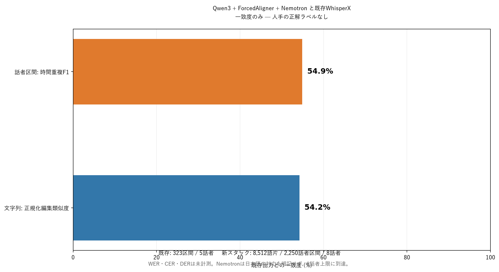
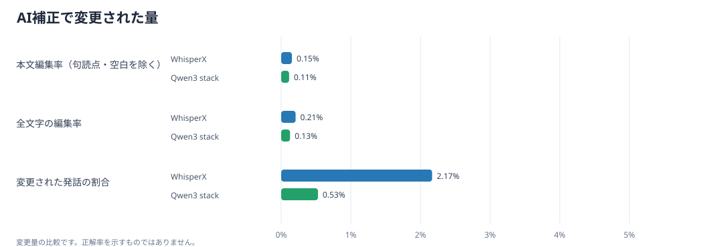

# 音声認識・話者分離の比較結果

## 要約

この動画について、**どちらが高精度かは判定できません**。人手で修正された正解文字起こしと話者ラベルがなく、既存のWhisperX出力も未修正の初回取込だからです。したがってWER・CER・DERは算出していません。

既存出力との一致度は次のとおりです。これらは**正解率ではなく、2つの出力がどれだけ一致するか**を示します。

- 文字列の正規化編集類似度: **54.24%**
- 話者区間の時間F1（話者名を最適対応付け後）: **54.91%**
- 話者区間の適合率／再現率: **61.58% / 49.55%**

## 判定・スコア表

以下の数値は、**既存WhisperX出力を基準にした一致スコア**です。WhisperX側の100点は基準自身との比較なので、精度100%という意味ではありません。Qwen側の値も正解率ではなく、保存済みWhisperX出力との一致度です。

| 評価項目 | 既存WhisperX（基準） | Qwen3スタック | 判定 |
|---|---:|---:|---|
| 文字列一致度（正規化Levenshtein） | 100.00%（自己基準） | 54.24% | 出力がかなり異なる。正誤は判定不可 |
| 話者区間の時間F1（話者対応付け後） | 100.00%（自己基準） | 54.91% | 話者と時間の切り方に差がある |
| 発話区間の時間F1 | 100.00%（自己基準） | 73.49% | 発話のある時間は比較的重なる |
| 3指標の単純平均（参考一致度） | 100.00%（自己基準） | 60.88% | 3項目を同じ重みで平均。正解率ではない |
| 人手正解に対するWER / CER / DER | 未測定 | 未測定 | 正解データがないため採点不可 |

| 実用面の確認 | 既存WhisperX | Qwen3-ASR + ForcedAligner + Nemotron |
|---|---|---|
| 日本語ASR・アライメント | WhisperX公式例で日本語の実行例あり | ASRとForcedAlignerの公式対応言語に日本語あり |
| 話者分離の日本語適合根拠 | 今回の保存済みモデル名・版は不明 | Nemotron資料で日本語は明示されず、今回8話者上限に到達 |
| 今回の出力 | 5話者・323区間 | 8話者・2,250区間 |

**今回の動画で今使うものは既存WhisperXと判断します（暫定）。** QwenスタックはWhisperXより高精度だと確認できず、特に話者分離は日本語での根拠が弱く、出力も8話者上限に達しています。Qwenの文字起こしは別案として差分確認に使うのが妥当です。この判断は現行作業を継続するための運用判断であり、絶対精度の勝者を証明したものではありません。

日本語対応の根拠: [WhisperX公式の日本語例](https://github.com/m-bain/whisperX/blob/main/EXAMPLES.md)、[Qwen3 ASR / ForcedAligner公式対応言語](https://huggingface.co/docs/transformers/main/model_doc/qwen3_asr)、[Nemotron 3 Diarizationモデルカード](https://huggingface.co/nvidia/Nemotron-3-Diarization)。

## 時刻付き差分の確認

既存WhisperXの323発話区間ごとにQwenの時刻付き語片を並べた[HTML差分ビュー](transcript-differences.html)と[CSV一覧](transcript-differences.csv)を作成しました。既存区間に重ならないQwen語片も261グループで別表示します（隣り合う語片の間隔5秒以内で集約）。時刻・語句で検索したり、局所一致度の低い順に並べ替えられます。

## 比較条件

| 項目 | 既存出力 | 今回の処理 |
|---|---:|---:|
| 動画 | GMT20260709-041850_Recording_640x360.mp4 | 同じ動画（SHA-256一致） |
| 言語 | ja | 日本語指定 |
| 文字起こし区間 | 323 | ASR 153チャンク、アライメント後8,512語片 |
| 話者数 | 5 | Nemotron出力8 |
| 話者区間 | 323 | 2,250 |

- 既存出力: revision 0, status initial_import。この保存済み出力にはモデルの正確な版情報がありません。
- 新スタック: Qwen3-ASR 1.7B → Qwen3 ForcedAligner 0.6B → Nemotron 3 Diarization。
- Qwenは28秒の有効区間と前後1秒の文脈で全編を処理し、ForcedAlignerの時刻で重複文脈を除きました。
- Nemotronは低遅延ストリーミングで5,921チャンク、426,279フレームを処理しました。

## 指標の読み方

- **文字列類似度**: NFKC正規化後、空白・句読点を除いた文字列どうしの正規化Levenshtein類似度です。Qwen側はアライメント済み区間を使っています。
- **話者時間F1**: 話者ごとの区間を統合し、Hungarian割当で話者ラベルを最適対応付けした時間重複のF1です。境界の許容幅は加えていません。DERとは異なります。
- **精度指標**: 正解ラベルがないのでWER/CER/DERは未計測です。既存WhisperX出力との一致を正確さに読み替えないでください。

## 制約

1. 既存文字起こしは未修正の初回取込（revision 0）で、正解データではありません。
2. 保存済みWhisperX出力にはモデル名・版が記録されていません。
3. Nemotronのモデルカードは日本語を対応言語として明記していません。今回の話者区間は日本語音声では実験的な結果です。
4. Nemotronは**8話者**を出力し、仕様上限の8に達しています。実際の話者数が8人だとは断定できません。

## 公式資料

- [Qwen3 ASRとForcedAligner](https://huggingface.co/docs/transformers/main/model_doc/qwen3_asr)
- [Nemotron 3 Diarizationモデルカード](https://huggingface.co/nvidia/Nemotron-3-Diarization)
- [TransformersのNemotron統合](https://github.com/huggingface/transformers/blob/main/docs/source/en/model_doc/nemotron3_diarization.md)

作成日: 2026-09-26 05:14 東京 (標準時)

## AI補正量の比較

両方の書き起こしに、同じローカルモデル **openai/gpt-oss-20b**、同一プロンプト、同じ前後2発話の参照範囲、同じバッチ上限を適用しました。AIが変更候補だけを返す方式で、変更しない発話は原文のままです。音声を聞き直していないテキストのみの補正です。

| 指標 | WhisperX | Qwen3 + ForcedAligner |
|---|---:|---:|
| 対象区間数 | 323 | 568 |
| 変更された区間 | 7（2.17%） | 3（0.53%） |
| 本文の編集量（句読点・空白を除外） | 17字相当（0.15%） | 17字相当（0.11%） |
| 句読点・空白を含む編集量 | 25字相当（0.21%） | 19字相当（0.13%） |
| 補正後の文字数差 | -10 | +6 |
| AIが返した変更候補 | 18 | 3 |
| 過剰な変更として棄却した候補 | 2 | 0 |
| ローカルモデルの入力拒否で原文を維持した区間 | 0 | 5 |

候補のうち発話を極端に膨らませる／短くするものは採用せず、原文を維持しました。Qwen側はローカルモデルが5区間の入力を受け付けず、そこも原文のままです。

[変更箇所を補正前後で見る](ai-correction/correction-differences.html) ・ [変更一覧CSV](ai-correction/correction-differences.csv) ・ [集計JSON](ai-correction/correction-summary.json)

**読み方:** この表はAIがどれだけ文字を変更したかの比較です。変更量が大きいほど正確とは限らず、正解率を判定するには正解の文字起こしが必要です。Qwen側は既存のForcedAligner出力を再構成したテキストを入力にしており、未整列の語は含みません。
